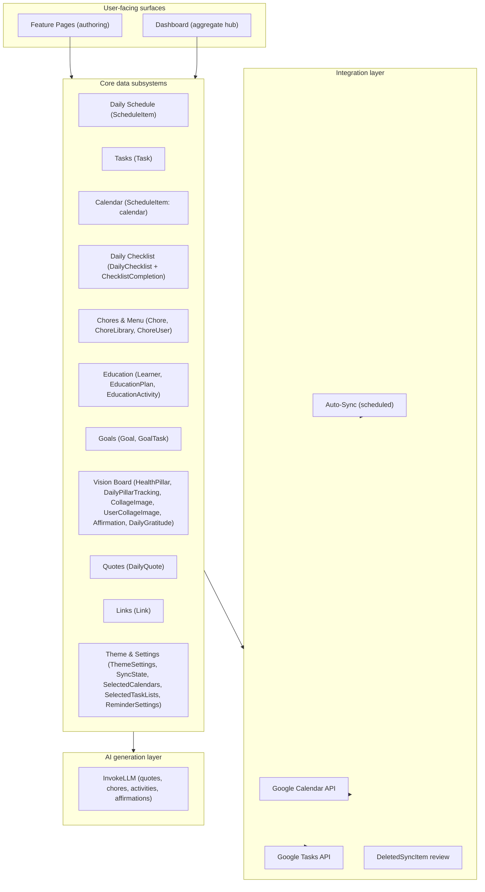
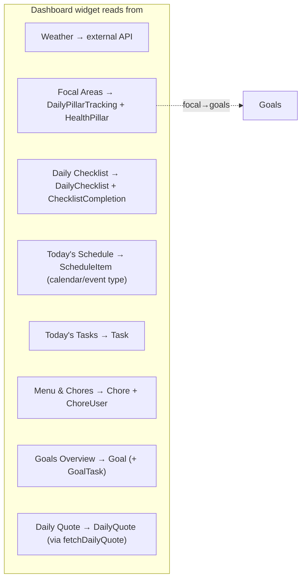
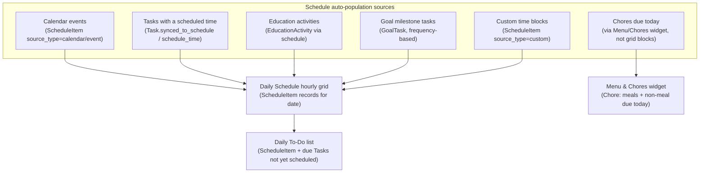
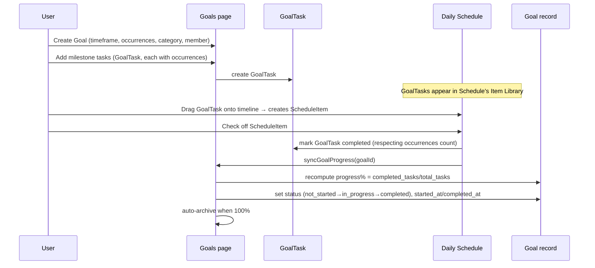
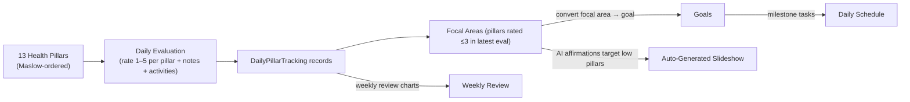
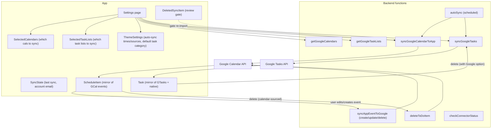
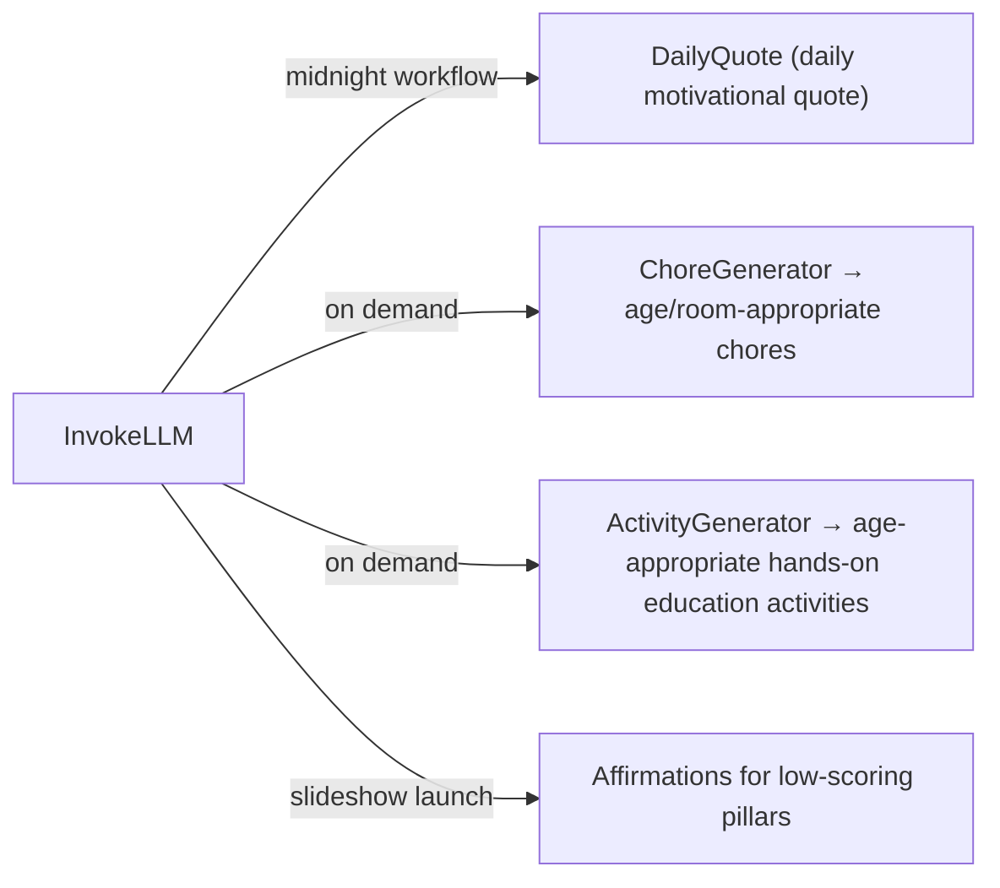
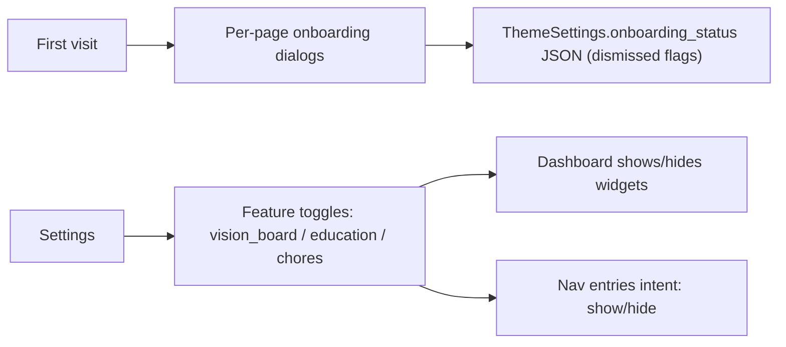

# System Architecture — How the App's Subsystems Interact

> This documents the **app system** — how features relate to and feed each other — *not* the Base44 codebase architecture. The reimplementation (RN + Supabase) should preserve these interactions as behavioral requirements.

---

## 1. High-level system architecture

The app is a **single-user account** that models an entire life-management system. At the center is the **Dashboard**, which aggregates read-only views from every other subsystem; around it sit the **authoring/editing subsystems**; and underneath runs the **integration/sync layer** that connects to Google.

---

## 2. The Dashboard as aggregation hub

The Dashboard is **read-mostly**: it pulls from nearly every subsystem and presents compact widgets. It writes only a few things (checklist toggles, task completion, goal completion, widget order, theme).

Key cross-subsystem behaviors on the Dashboard:

- **Focal Areas widget** reads the most recent `DailyPillarTracking` evaluation, finds pillars rated ≤3, and surfaces them. A target button jumps to the Vision Board's Daily Evaluation. Low pillars can be **converted into Goals**.
- **Today's Tasks** widget header shows **Chores** and **Education** due/overdue counts (color-coded badges) that deep-link to those pages filtered to "due."
- **Vision button** launches the slideshow (auto-generated AI affirmations for low pillars, or custom).

---

## 3. The Daily Schedule as the unifying "day view"

The Daily Schedule is the **time-grid** that auto-populates from multiple sources for the selected date. It is the single place where every actionable thing converges into a timeline.

Important interaction rules (intent):

- The **hourly grid** renders only `ScheduleItem` records for the selected date. Chores are *not* grid blocks by default — they appear in the **Menu & Chores widget** alongside meals.
- Completing a grid item whose source is a **Task** syncs completion back to the `Task` entity and (for recurring tasks) spawns the next occurrence.
- The **Item Library** side-panel lists unscheduled Tasks, Goal milestone tasks, and recent custom blocks; tapping one drops it onto the timeline at a chosen start time/duration, creating a `ScheduleItem` linked to the source.
- Items can be **hidden from the grid** or **hidden from the to-do** independently without deleting them.

---

## 4. Goal → Schedule → Task completion chain

This is the most important cross-subsystem flow in the product and must be preserved.

**Progress auto-calculation:** a Goal's `progress` (0–100) and `status` are derived from its GoalTasks, not set by hand. Completing all tasks → 100% → `completed` + `archived`. Crossing 0% → `in_progress` (sets `started_at`). Reaching 100% → `completed_at`.

---

## 5. Vision Board → Goals → Schedule chain (wellness loop)

The wellness subsystem is deliberately wired into the goals subsystem so reflection produces action.

- A low-scoring pillar can be **converted into a Goal** (from the Vision Board or the Dashboard Focal Areas widget).
- The **auto-generated slideshow** asks the LLM to produce affirmations *specifically for pillars rated ≤3* in the most recent evaluation (round-robin interleaved so every weak area is represented).
- The **Weekly Review** visualizes `DailyPillarTracking` over time (this week / 3 months / all time).

---

## 6. Google integration architecture (two-way-ish)

The app maintains **local mirror entities** of Google data and syncs them on demand and on a schedule.

Two-way specifics:

- **Calendar:** Google → App is a full **reconcile** (creates, updates, and deletes local mirror items whose Google event disappeared within the sync window). App → Google is **push** on create/edit/delete of an app-created (custom) event. Calendar-sourced events are **read-only in the app** (edits must happen in Google).
- **Tasks:** Google → App is an **upsert by `google_task_id`**. App → Google on delete (optional: "delete from Google too"). A **default sync category/color** is applied to incoming Google tasks. Completion status syncs both directions.
- **Deleted-sync-item review:** when an item is deleted from the app side, a `DeletedSyncItem` record can gate whether it's allowed to re-import on the next sync (pending_review / allowed / denied), preventing "deleted" items from bouncing back.
- **Auto-sync:** a scheduled workflow runs `autoSync` at user-chosen times, syncing whichever sources are enabled (calendar and/or tasks).

---

## 7. AI generation touchpoints

AI (via `InvokeLLM`) is used in four authoring flows to reduce setup friction — never silently in the background:

- **Daily quote:** a scheduled workflow generates one quote per day per user at midnight.
- **Chores & Activities:** user-driven generation with review/select/assign UX; optionally save results to a library for reuse.
- **Affirmations:** generated at slideshow-launch time for the auto-generated mode, targeting the user's weakest pillars.

---

## 8. Onboarding & feature-gating

- Each feature page has its own onboarding dialog, dismissed state persisted in `ThemeSettings.onboarding_status` (a JSON map) plus a localStorage fast-path.
- Feature toggles in Settings enable/disable Vision Board, Education, Chores — controlling dashboard widget visibility and (by intent) navigation presence.

---

## 9. Cross-cutting concerns

### Theming
`ThemeSettings` is a single record per user driving: primary/accent colors, dark mode, heading/body fonts, font size, background image + randomized background library, widget opacity & border radius, dashboard header name, widget order (JSON), feature toggles, auto-sync times/sources, default Google-task category, onboarding status. Applied app-wide via CSS variables on load.

### Print / Email export
Most list-based features support printing and emailing via a shared `PrintLayout` / per-feature `PrintFormat*` components, often with a date-range selector (`PrintRangeDialog`). Email is sent to the user's own email via `SendEmail`. This is a first-class product capability (households print chore charts, education schedules, etc.).

### Realtime updates
Base44 entity subscriptions drive live UI updates (e.g., checking a task on the dashboard instantly reflects on the Tasks page). The reimplementation should treat list data as reactive (e.g., Supabase realtime subscriptions).

### Row-level isolation
All user data is isolated per account (Base44 RLS by `created_by`). The reimplementation must enforce per-user isolation in Supabase (RLS policies on `auth.uid()`).

### Soft delete / trash
Tasks go to a `TrashBin` (restorable for 24h). Synced calendar/task items can be deleted from the app (and optionally from Google). Deleted-sync items can be reviewed to control re-import. Account/data deletion is available in Settings.

---

## 10. Data ownership & boundary summary

| Subsystem | Owns its own data? | Mirrors external data? | Pushed to external? |
|---|---|---|---|
| Daily Schedule | Custom blocks | Calendar events | Custom events → Google Calendar |
| Tasks | Native tasks | Google Tasks | Deletes optionally to Google |
| Calendar | — | Google Calendar events | (read-only mirror) |
| Checklist, Chores, Menu, Education, Goals, Vision Board, Quotes, Links, Theme | Yes | No | No |
| Sync state, Selected Calendars/Task Lists | Config only | — | — |

This boundary is critical for the Supabase reimplementation: **native entities are source-of-truth; mirrored entities must reconcile with Google on sync and never be treated as canonical.**