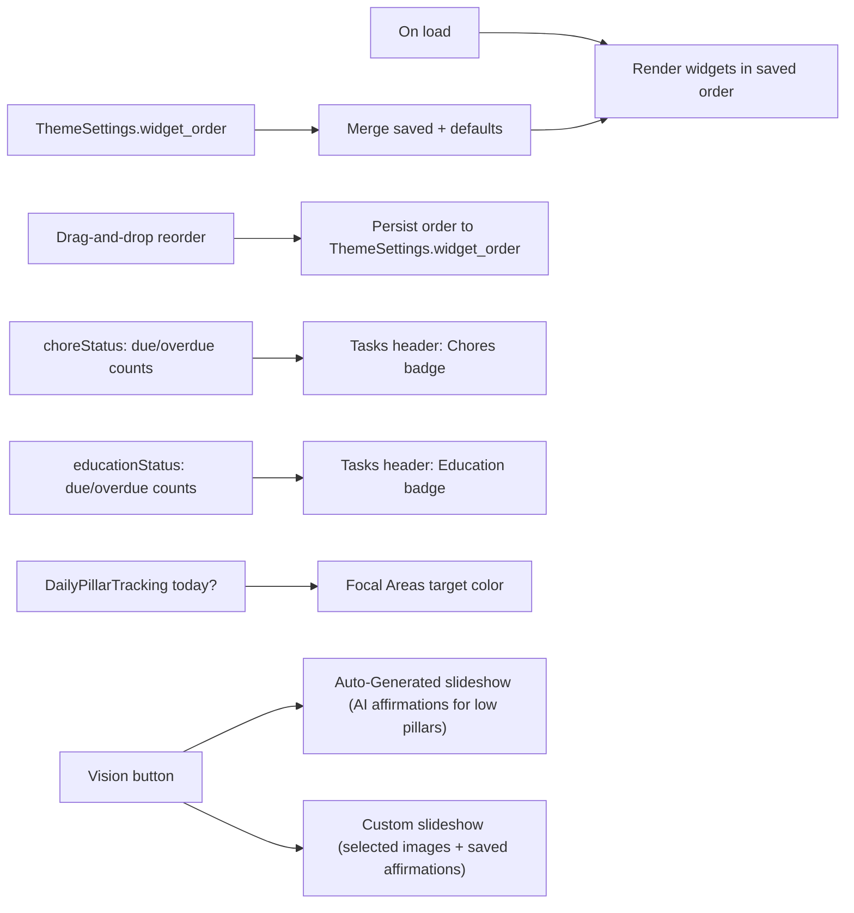

# Dashboard — The Daily Hub

> **Route:** `/dashboard` · **Source:** `src/pages/Dashboard.jsx` + `src/components/dashboard/*`

## Purpose

The Dashboard is the **home base** of the app — a single, scannable view that aggregates the most important signals from every subsystem so the user can start their day oriented and act without navigating. It is *read-mostly* (pulls from all subsystems) with a few inline write actions (check off a checklist item, complete a task, complete a goal, reorder widgets, launch the slideshow).

## What the user gains

- A **one-glance orientation**: today's schedule, due tasks, due chores, meals, daily checklist progress, active goals, weather, and a motivational quote — all visible without scrolling much.
- **Customizable layout**: drag widgets into a preferred order; layout persists across devices.
- **Cross-subsystem navigation shortcuts**: badges on the Tasks widget deep-link to Chores/Education filtered to "due"; the Focal Areas target button jumps to the daily wellness evaluation.
- **Inspiration on demand**: launch the Vision slideshow (AI-generated affirmations for weak pillars, or a custom selection).

## Widgets (default order)

| Widget | Source | Behavior |
|---|---|---|
| **Weather** | external weather API | Current conditions + short forecast; requires browser location. |
| **Focal Areas** | `DailyPillarTracking` + `HealthPillar` | Shows lowest-scoring pillars from the latest evaluation; target icon (blue when no eval done today) jumps to Vision Board Daily Evaluation. |
| **Daily Checklist** | `DailyChecklist` + `ChecklistCompletion` | Active items for today grouped by time-of-day; check off inline; weekly X/7 counters. |
| **Today's Schedule** | `ScheduleItem` (calendar/event type) | Chronological list of today's calendar events (not full grid). Print/email with date range. |
| **Today's Tasks** | `Task` | Pending/in-progress tasks due today, color-coded by priority; check off inline. Header has **Chores** and **Education** badges (due/overdue counts, color-coded) that deep-link to those pages filtered to "due". |
| **Menu & Chores** | `Chore` + `ChoreUser` | Today's meals (Breakfast/Lunch/Dinner/Snack) + non-meal chores due today, grouped by assignee and room. |
| **Goals Overview** | `Goal` (+ `GoalTask`) | Active goals with progress bars grouped by timeframe; check off due-today goals inline. |
| **Daily Quote** | `DailyQuote` (via `fetchDailyQuote`) | Today's AI-generated quote + reflection; "New Quote" to regenerate. |

## Behavior & business logic

- **Widget order:** stored as a JSON array in `ThemeSettings.widget_order`; on load, saved order is merged with any new default widgets so new features appear automatically.
- **Reorder mode:** toggled by the ⇅ button; while active, widgets are draggable via `@hello-pangea/dnd`; "Save Default" persists the arrangement.
- **Status badges:** on mount, the dashboard computes due/overdue counts for chores (non-meal) and education activities, coloring the Tasks widget header badges (blue=due, red=overdue, purple=both) and showing counts; tapping navigates to `/chores?filter=due` or `/education?filter=due`.
- **Greeting:** time-of-day greeting ("Good Morning/Afternoon/Evening") using `ThemeSettings.dashboard_header` or the user's first name.
- **Feature toggles:** if Vision Board / Education / Chores are disabled in Settings, their dashboard widgets should not render (intent; wired via feature flags).

## Vision slideshow (from Dashboard)

Two launch modes via the **Vision** dropdown:

1. **Auto-Generated** — `DashboardSlideshow` mode `auto`:
   - Loads all non-hidden `CollageImage`s + private `UserCollageImage`s (with signed URLs).
   - Loads the most recent `DailyPillarTracking` date; finds pillars rated ≤3.
   - If low pillars exist → asks `InvokeLLM` to generate **3 affirmations per low pillar** (uplifting/healing framing); round-robin interleaves them so every weak area is represented.
   - If no assessment or no low pillars → generates for all pillars.
2. **Custom** — user-selected images + saved `Affirmation`s.

The slideshow itself: Ken Burns zoom, adjustable speed (3–30s), affirmation overlay toggle, ambient audio presets (rain/ocean/music…), manual nav, double-tap to hide controls.

## Onboarding

First visit shows a 4-step onboarding dialog (daily hub, arrange widgets, vision slideshow, real-time tracking). Dismissal stored in `ThemeSettings.onboarding_status` (key `dashboard_onboarded`) + localStorage fast-path.

## Data model touched

- `ThemeSettings` (widget_order, onboarding_status, dashboard_header, feature toggles)
- `DailyPillarTracking`, `HealthPillar` (focal areas, eval-done-today)
- `Chore`, `EducationActivity` (status badges)
- `Task`, `Goal`, `DailyChecklist`, `ChecklistCompletion`, `DailyQuote`, `ScheduleItem` (widget reads)
- `CollageImage`, `UserCollageImage`, `Affirmation` (slideshow)

## Interactions with other features

- → **Vision Board** (focal areas, slideshow, daily evaluation link)
- → **Tasks** (inline complete; badge deep-links)
- → **Chores / Education** (badge deep-links)
- → **Daily Checklist** (inline complete)
- → **Goals** (inline complete due-today goals)
- → **Quotes** (regenerate)
- → **Theme** (widget order persistence)