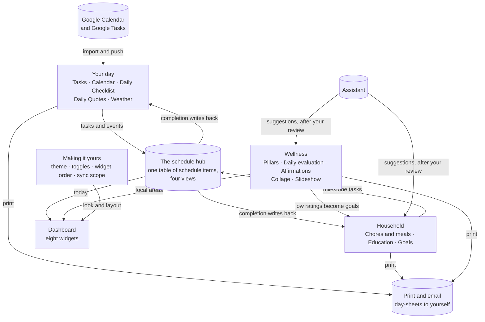
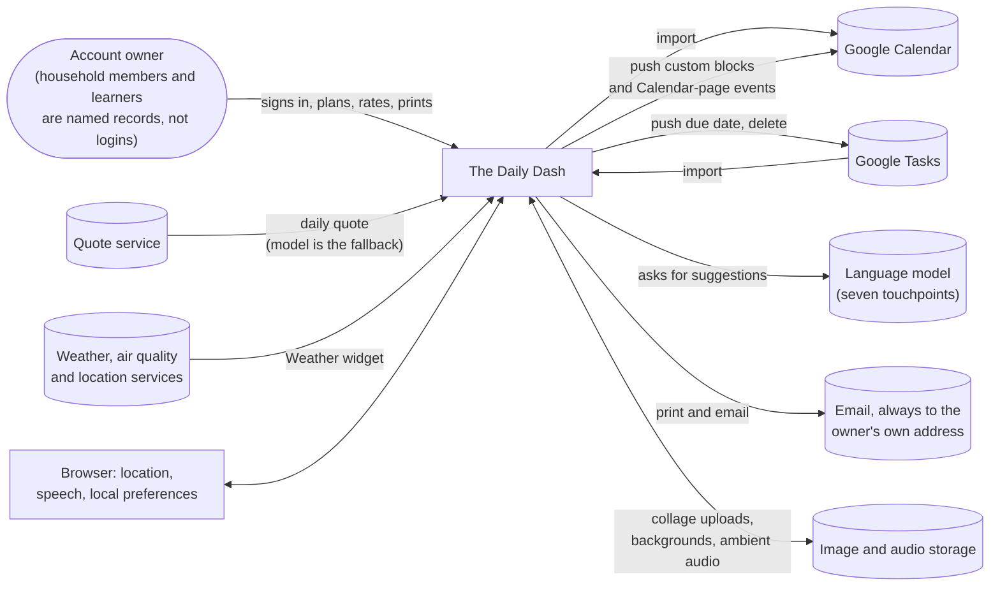
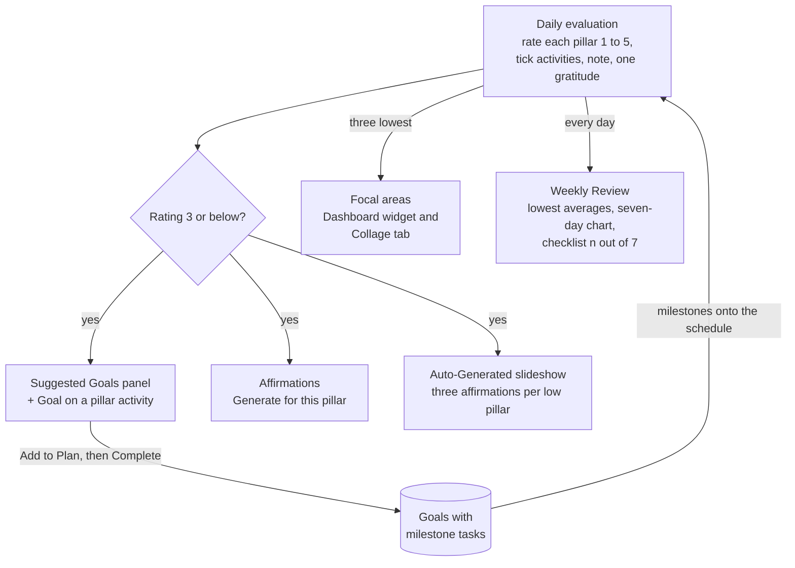
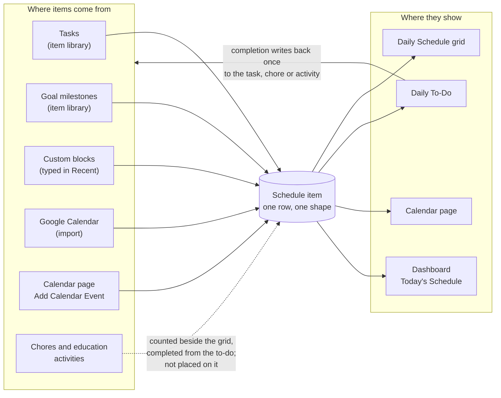

# The Daily Dash — Creator Vision

*A plain-language digest of The Daily Dash — in-app name **"Dash it, Dash it ALL!"** — written for the creator of the idea to review and approve: what it is, who it is for, what every feature does for the person using it, and where the story and the prototype still differ.*

*Prepared 20 September 2026. The full [Creator Vision Reference](creator-vision-ref.md) (120 pages) and the [specification corpus](specs/README.md) hold the detail behind every line here; this document is the version you can read in one sitting.*

**Contents**

- [The pitch](#the-pitch) — one sentence, thirty seconds, and what makes it different
- [What it is and who it is for](#what-it-is-and-who-it-is-for) — the product and the six people it serves
- [The principles](#the-principles) — fifteen rules the prototype lives by
- [A day with The Daily Dash](#a-day-with-the-daily-dash) — morning to week, in the owner's shoes
- [How the pieces fit](#how-the-pieces-fit) — two diagrams: inside the app and around it
- [Features at a glance](#features-at-a-glance) — every feature on one row with its status
- [Your day](#your-day) — Dashboard, Daily Schedule, Daily To-Do, Calendar, Tasks, Daily Checklist, Weather
- [The household](#the-household) — Chores, Meal planning, Education, Goals
- [Wellness and reflection](#wellness-and-reflection) — the loop from evaluation to slideshow
- [The schedule hub](#the-schedule-hub) — one table, four views, dismissal is not deletion
- [Making it yours and under the hood](#making-it-yours-and-under-the-hood) — personalisation, accounts, Google, assistance, paper
- [Where the story and the prototype differ](#where-the-story-and-the-prototype-differ) — eight promises and the disagreements that shape the product
- [Decisions we need from you](#decisions-we-need-from-you) — the questions only the creator can answer
- [Glossary](#glossary) — thirty terms

**Legend**

- ✅ built in the prototype and working as described. Anything without a marker is ✅.
- 🟡 partly built: the screen or setting exists, but the behaviour behind it is incomplete.
- 📝 described only: promised by the manual, the walkthroughs or the landing page, and not built.

Each section marks its own 🟡 and 📝 items where they arise; the ones that shape the product are gathered in [Where the story and the prototype differ](#where-the-story-and-the-prototype-differ), and the questions only you can answer in [Decisions we need from you](#decisions-we-need-from-you).

## The pitch

**In one sentence.** The Daily Dash is a free personal command center that brings your schedule, tasks, chores, homeschool plans, goals, daily routines and wellness reflections into one place, on screen and on paper, with optional Google Calendar and Google Tasks sync.

**In thirty seconds.** Most of us run our lives across a calendar, a task app, a chore chart on the fridge, a homeschool binder and a journal, and none of them talk to each other. The Daily Dash puts them in one account. Tasks, goal milestones, calendar events and hand-made time blocks all land on a single daily schedule; chores and meals are planned per household member; lessons are planned per learner; and every morning starts with a fresh checklist, a quote and the weather. An evening self-assessment across thirteen wellness pillars turns low scores into suggested goals, affirmations and a personal slideshow. Every planning surface prints or emails itself as a day-sheet. It is free, and Google is optional.

**What makes it different**

- **One connected hub, not five lists.** Everything time-boxed lands on one schedule, and ticking it once writes the completion back to where it came from (see [The schedule hub](#the-schedule-hub)).
- **A wellness loop built in.** Rate thirteen pillars each evening; the low ones become focal areas that steer your goals, affirmations and slideshow (see [Wellness and reflection](#wellness-and-reflection)).
- **Built for a household, with homeschool inside.** Chores and meals are planned per household member, lessons per learner, all inside one account (see [The household](#the-household)).
- **Paper is first class.** Twelve surfaces print or email a day-sheet to your own inbox, the same document either way.
- **Google is optional, and it is free.** Calendar and Tasks flow in and your own blocks flow back, but nothing needs Google; there are no plans, tiers or payments anywhere.

## What it is and who it is for

The landing page introduces the product in three lines, quoted as written:

> "Your personal command center"
>
> "Organize your day." / "Master your life."
>
> "The Daily Dash brings your schedule, tasks, goals, and reflections into one beautiful, distraction-free space."

The Daily Dash is a personal productivity dashboard; the manual promises to "keep your whole life organized in one place". In practice it is fourteen sections behind one sidebar — Dashboard, Daily Checklist, Tasks, Calendar, Daily Schedule, Chores with Menu, Education, Goals, Vision Board, Daily Quotes, Link Library, Theme Editor, Settings and User Manual — sitting on one schedule hub, one wellness loop, a Google connection in both directions, and print and email from every planning surface. The hero button reads "Get Started — It's Free", and no plan, tier or payment exists anywhere in the prototype.

The prototype carries no user research; the person below is who its screens, defaults and copy assume. One login owns everything. Household members and learners are named records inside that account — assignees and filing labels, never logins — and print and email always go to the owner's own address. The landing page's eight feature cards (Smart Scheduling, Task Management, Chore Manager, AI Meal Planning, Vision Board, Google Integration, Daily Reflection, Private & Secure) are built as promised in six cases; Google Integration and Private & Secure are 🟡 (see [Where the story and the prototype differ](#where-the-story-and-the-prototype-differ)).

| Who | What they get |
|---|---|
| **The account owner** | One private space entered with email and password; a Dashboard that opens the day; every record readable and writable only by them. |
| **Someone who runs a household** | Household members as named, colour-coded records; chores with rooms and frequencies; a weekly menu; chore and meal sheets that print per person and per weekday for the fridge. |
| **A parent with homeschool learners** | Learners with a grade level; one plan per subject with assignments and activities; AI-suggested lessons by age group; a printable weekly education sheet. |
| **Someone with a wellness focus** | Thirteen pillars seeded on day one; a nightly rating with one gratitude; low ratings that turn into goals, affirmations and a slideshow; a weekly review. |
| **With or without Google** | Sign-up offers "Connect Google Account" or "Use Independently"; Google can be connected later in Settings; nothing in the product needs it. |
| **Someone who reads on paper** | Every planning surface prints or emails; print and email produce the same document and it goes only to the owner's inbox. |

## The principles

Fifteen principles the prototype embodies, each recorded only where at least two independent parts of the product honour it.

| # | Principle | What it means for the user | |
|---|---|---|---|
| 1 | **One account is one household** | Everything belongs to one signed-in owner; household members and learners are records used to assign and file work, not logins. | ✅ |
| 2 | **Everything in one place** | Work from every source converges on one schedule table and one Dashboard, so you never visit each feature to learn what today holds. | 🟡 chores and lessons are counted, not placed |
| 3 | **Dismissal is not deletion** | Removing something from a view keeps the record; deletion is a separate, named choice, usually with a recovery path. | ✅ |
| 4 | **External deletions are proposals** | Something vanishing from Google never silently deletes here; deleting here never reaches Google unless you pick the Google option. | 🟡 the review panel has no feed |
| 5 | **The assistant suggests; you approve** | No suggestion is saved without an explicit selection step; a failed call saves nothing and says so. | ✅ |
| 6 | **Self-assessment steers inspiration** | Your own daily ratings decide what the product suggests: goals, affirmations, focal areas and the slideshow follow the low ratings. | ✅ |
| 7 | **Paper and email are first class** | Every planning surface prints or emails to you, and both produce the same document. | ✅ |
| 8 | **Personalisation follows the account** | Look, layout, feature choice and sync scope appear on every device; a small tail of conveniences stays on the device that made them. | 🟡 a few settings are stored but not read |
| 9 | **You own your content** | The product stores and shows your content only to provide the service, isolates it from other accounts, and offers ways to take it out and delete it. | 🟡 wipes and deletion cover different sets |
| 10 | **The assistant is optional** | The product works without Google and without a language model; when an external call fails, nothing is lost. | ✅ |
| 11 | **Today is the unit of work** | Routines are recorded per date, so each day starts clean without a reset action and every surface opens on today. | ✅ |
| 12 | **Completion writes through, once** | Ticking something in one place marks its source and its schedule rows; you never update two places. | ✅ |
| 13 | **Every page introduces itself once** | A short numbered walkthrough on first visit, remembered as dismissed, with a Guide button to bring it back. | ✅ |
| 14 | **Colour carries meaning** | Colour encodes source, priority, urgency, member, meal slot, pillar or air quality, and the mapping is fixed. | ✅ |
| 15 | **Nothing destructive without a confirmation** | Deleting a record, disconnecting Google, wiping data or deleting the account asks first and names the scope. | 🟡 a few small deletes go through unasked |

## A day with The Daily Dash

**Morning.** The Dashboard greets you by the hour of the day. The Weather card shows conditions, today's high and low, air quality and six days ahead. Focal Areas lists the three lowest-rated pillars from your last evaluation and, if you wrote one, today's gratitude; its target button glows until today's evaluation exists. The Daily Checklist widget shows only what you have not ticked today, grouped Morning, Afternoon, Evening and Anytime, each with its count out of seven this week. A quote was written for you overnight; Today's Schedule and Today's Tasks list what is coming, the Chores and Education badges count what is due, and Menu & Chores shows the week's meals and today's chores by person and room.

**During the day.** On the Daily Schedule you drop tasks and goal milestones from the item library onto the hour grid with a start time and a duration, or type a title into Recent to make a custom block, which is pushed to Google Calendar if connected. The TO DO card beside it lists the day; ticking a row marks the task, chore or lesson complete at its source and lifts the block off the grid. On the Tasks page ticking a recurring task creates its next occurrence; on Chores ticking a chore stamps today and sets its next due date; on Education ticking a repeating activity moves its due date forward. Lists refresh themselves when something changes.

**Evening.** From the Dashboard's target button you rate each pillar one to five, tick the activities you used and add a note. A rating of three or below opens Suggested Goals; "+ Goal" on an activity takes a count and a frequency, and Complete writes the ratings, one gratitude and a goal with its milestones for each queued activity. On the Quotes page you write a reflection under today's quote. "Vision" on the Dashboard opens the full-screen slideshow: Auto-Generated writes three affirmations per low pillar; Custom plays your own affirmations over your chosen images, with ambient audio and, if you like, a spoken voice. At midnight nothing is reset; the checklist, chores and quotes simply read the new date.

**The week.** The Vision Board's Weekly Review shows the Sunday-to-Saturday week: the lowest-averaging pillars over this week, three months or all time; a seven-day chart with pillar filter chips; and a daily breakdown with your notes, plus each checklist item's days out of seven. On Goals, ticking milestone tasks earns each goal's progress; completing the last one archives the goal, and Restore brings it back. Paper follows: the chore sheet prints one section per member with tick boxes, the meal sheet by weekday, the education sheet per learner, and the Tasks page, Calendar, Daily Schedule, Goals and Weekly Review each print or email as shown (see [Making it yours and under the hood](#making-it-yours-and-under-the-hood)).

**Household admin and leaving.** Household members are added on the Chores or Goals page with a name and colour; learners on the Education page with a grade level; and Settings switches the Vision Board, Education and Chores on or off, which removes their sidebar entries at once. A task deleted from its row goes to a trash that keeps it for 24 hours; "Delete All App Data" clears twenty-five kinds of record and leaves you signed in; "Delete Account" revokes Google, removes sixteen kinds of record and the login. 🟡 There is no sign-out control; account deletion and session expiry are the only exits.

## How the pieces fit

Read it from the middle. The schedule hub is the one table that time-boxed work lands on: tasks and goal milestones arrive through the item library, Google events arrive by import, and custom blocks are pushed back out. Ticking a schedule item writes the completion back to the task, chore or lesson it came from, once.

The household part plans work per person. The wellness part rates the day and feeds low scores into goals, affirmations and the Dashboard. The assistant offers suggestions to both, never saving without your review.

Personalisation shapes the Dashboard, and everything you plan can be printed or emailed. The five feature groups are described from [Your day](#your-day) onward; the hub itself is drawn in [The schedule hub](#the-schedule-hub).

The app is one account: one person signs in, and everyone else in the household exists as a named record inside it. Around it sit two Google services in both directions, a language model for suggestions, an email service that only ever addresses the owner, and quote, weather and file services.

The browser contributes location for the weather, speech for spoken affirmations and a small store of device-local preferences. The landing page also names Google Drive as a sync target; no Drive behaviour exists in the prototype (📝).

**What the system deliberately does not do.** It does not place chores or lessons on the schedule grid on its own, does not send reminders, does not hide Dashboard widgets when a feature is switched off, does not mirror Google Tasks in full, does not read or write Google Drive, has no sign-out control, and never generates images: collage imagery is uploaded or seeded, never generated.

## Features at a glance

Every feature on one row. Status is ✅ unless marked, with the reason in a few words.

| Feature | What it does for you | Status |
|---|---|---|
| **Your day** | | |
| Dashboard | Opens the day: weather, focal areas, checklist, schedule, tasks, menu and chores, goals, a quote, in your order. | ✅ |
| Daily Schedule | An hour grid for one day; drag tasks and goal milestones on, type custom blocks in. | 🟡 chores and lessons not auto-placed |
| Daily To-Do | One flat list of the day; tick once and the source is marked too. | ✅ |
| Calendar | Month and week views of your own and Google events; add, search, edit, sync. | 🟡 deleted-item review has no feed |
| Tasks | One backlog of one-time and repeating to-dos with priority, label and seven frequencies. | ✅ |
| Daily Checklist | Routines by time of day, fresh each morning, with a days-this-week count. | ✅ |
| Weather | Current conditions, high and low, air quality and six days ahead, no setup. | ✅ |
| **Household** | | |
| Household members | Named people with a colour who are given chores, meals and goals; not logins. | ✅ |
| Chores | Every chore has a person, a room and a rhythm; opens on what is due today; prints for the fridge. | ✅ |
| Chore library | Reusable templates assigned to many people in one step; saved from any chore or the generator. | ✅ |
| Meal planning | A weekly menu by weekday and cook, with AI meal ideas by age group. | 🟡 meals cannot be edited |
| Education | Learners, one plan per subject, assignments and activities, with Due, Past and Next views. | 🟡 Add to Schedule described only |
| Activity library | Reusable lessons saved per learner, added to any plan or turned into a goal in one tap. | ✅ |
| Goals | Goals with a timeframe whose progress is earned step by step from milestone tasks. | ✅ |
| **Wellness** | | |
| Vision Board | One page, four tabs: pillars, daily evaluation, weekly review, collage. | ✅ |
| Health pillars | Thirteen areas of life, each with activities, ready to rate on day one. | ✅ |
| Daily evaluation | Rate each pillar 1 to 5, queue goals for the low ones, name one gratitude. | ✅ |
| Weekly review | The week's pattern: lowest averages, a seven-day chart, checklist days out of seven. | ✅ |
| Affirmations | Your own encouragements, typed or AI-drafted, ready for the slideshow. | 🟡 chosen subset not honoured |
| Collage | A shared starter set plus private photos only you can see. | 🟡 no control adds shared images |
| Slideshow | Full-screen images and affirmations, spoken, translated, with ambient sound. | ✅ |
| Reminders | A nudge to do today's evaluation. | 🟡 only the Dashboard highlight |
| Daily Quotes | One quote a day with your reflection beneath it, kept as a journal. | ✅ |
| **Making it yours** | | |
| Theme editor | Colours, fonts, dark mode, opacity, corners and backgrounds, saved to your account. | 🟡 text size not reapplied at launch |
| Link library | Bookmarks as cards with icons and colours; import a browser export in one step. | ✅ |
| Settings | Account, greeting name, Google connections, trash and data wipes. | 🟡 sync times stored, not used |
| Feature toggles | Switch Vision Board, Education and Chores off; they leave the sidebar at once. | 🟡 Dashboard widgets stay |
| Onboarding | Every page introduces itself once; a Guide button brings it back. | ✅ |
| User manual | The reference inside the app, searchable, with a support address. | ✅ |
| App shell | Sidebar, header clock, swipe navigation, the landing page and legal pages. | 🟡 no sign-out control |
| **Under the hood** | | |
| Accounts and privacy | One private space per account; every record is yours alone. | 🟡 deletion leaves some records |
| Google Calendar sync | Selected calendars flow in; your blocks and events flow back, with edits and deletes. | ✅ |
| Google Tasks sync | Every Google task list flows in under one label. | 🟡 import plus due-date push, not a mirror |
| Google Drive | Named on the landing page as a sync target. | 📝 nothing behind it |
| Smart assistance | Seven places draft ideas; you approve each before anything is saved. | ✅ |
| Automations | Quote, collage seed and Google import are ready before you wake. | 🟡 daily sync runs as one identity |
| Print and email | Twelve surfaces print or email to your own inbox, the same document either way. | ✅ |
| Trash bin | A deleted task can be restored with every field intact. | 🟡 tasks only, 24 hours |
| Housekeeping | Seeding, wipes and account deletion, plus admin clean-ups. | 🟡 four admin jobs have no screen |

## Your day

These are the surfaces the account owner lives in every day. Everything time-boxed on them converges on the one table described in [The schedule hub](#the-schedule-hub).

**Dashboard.** The Dashboard is the landing page after sign-in: a greeting by name and time of day, then eight widgets in one column — Weather, Focal Areas, Daily Checklist, Today's Schedule, Today's Tasks, Menu & Chores, Goals Overview and Daily Quote. Reorder mode lets you drag the widgets into any order, and each drop is saved to the account so the layout follows you. Two badges count chores and lessons due today or overdue and jump to those pages, the Focal Areas button glows until today's evaluation is done, and the Vision button launches the slideshow. The rule worth knowing: every widget belongs to its source feature and refreshes on its own terms. 📝 The manual says feature toggles hide their widgets; in the prototype all eight stay.

**Daily Schedule.** An hour grid for one date over your active hours (5 AM to 10 PM by default), colour-coded by source, with a red line at the current minute. Beside it the item library offers Recent custom-block titles, unscheduled tasks grouped by label, and one entry per goal — its next milestone; place any of them with a start time and a duration. Overlapping blocks sit side by side, a block that runs past midnight reappears the next morning as a carry-over, and a block whose time has passed offers Move to now. Custom blocks are pushed to Google Calendar when it is connected. 📝 The manual says chores and lessons due today appear on the grid on their own, and that a block is ticked on the grid; in the prototype nothing places them there and completion is done from the to-do.

**Daily To-Do.** The TO DO card on the Daily Schedule page lists the selected date's schedule items plus a row for every task due that day, sorted by start time. Ticking a row completes the task, chore or lesson at its source and lifts the block off the grid; unticking restores both. Swiping reveals Remove, which asks what you mean: Keep in Calendar, Send to Item Library, Hide from Schedule Grid, Delete from App or Delete from Google (see [The schedule hub](#the-schedule-hub)). It prints and emails as a "To Do" table on its own or beneath the hourly schedule.

**Calendar.** Month and week views of your events, imported from Google and created here, with a day panel that lists, searches, adds, edits and deletes them. A new event pushes to Google by default; editing a linked event pushes the change; deleting one asks "Delete here only" or "Delete from Google too", and here-only keeps a hidden record so the next import leaves it gone. One Sync button imports from Calendar and Tasks by the sources chosen in Settings. 🟡 A banner for reviewing items that vanished from Google exists, but nothing fills it yet. 📝 The manual describes Google events as read-only here; the prototype edits and pushes them.

**Tasks.** One backlog of to-dos with priority, label, due date and time, reference links and notes, sliced by Active, Due Today, Overdue, Pending, Unscheduled or Completed and grouped by priority, frequency or label. Seven frequencies — One-time, Daily, Weekly, Biweekly, Monthly, Specific Days and X Times Total — and completing a recurring task creates its next occurrence while an occurrence task reads "2/3 done". Placing a task on the Daily Schedule stamps its date and time; deleting one from its row snapshots it to the trash first. The page prints or emails the current view, and the Dashboard widget lists overdue and due-today tasks by time of day. 📝 The manual's In Progress status, keyword search and 30-day trash are described only.

**Daily Checklist.** Repeating routines in four time-of-day buckets — Morning, Afternoon, Evening and Anytime — each with an optional time and label. Ticks belong to a date, so the list starts unticked every day without a reset, and every item shows "n/7", the days it was ticked this Sunday-to-Saturday week. Drag to reorder or to move an item between buckets, step through views by bucket or label, and watch the Today's Progress bar. The Dashboard widget shows only what is still unticked, and the Daily Schedule carries a condensed copy that ticks for the selected date.

**Weather.** The first Dashboard card: current temperature and conditions for where you are, today's high and low, feels-like, humidity, wind, air quality with a colour band from green to dark red, and a six-day strip. Nothing to configure: it uses the browser's location and reuses the last reading for 30 minutes. Units are fixed at °F and mph. 📝 The manual promises one location prompt on first load; the prototype asks whenever the cached reading has expired.

## The household

One account, many people, none of whom sign in. Where the assistant suggests chores, meals or lessons, nothing is saved until the owner reviews the list and approves what stays.

| Who | Kept where | What they can be given | Where they show up |
|---|---|---|---|
| Household member (name, colour) | Chores page; also Goals page | chores, meals, goals | Chores board, Menu, chore library, Dashboard "Menu & Chores", Goals |
| Learner (name, grade level) | Education page | subject plans, activities, library entries, goals | Education cards and exports, Goals (by name) |
| The account owner | signs in | goals by default | everywhere |

**Chores.** The Chores page is the household chore board: add household members, create chores with a title, room, frequency, time estimate and notes, assign each to one or more people, and tick them off. It opens on Due Today; other views group the same chores by person, room or frequency, and bulk mode reassigns or deletes many at once. Ticking a chore records today and sets its next due date from its frequency (daily, weekly, bi-weekly, monthly, quarterly, yearly; once and as-needed do not roll forward), and completed chores return to pending at midnight. A chore library keeps reusable templates that can be assigned to many people in one step. The wand opens the AI generator — who, an age group from 3–5 to Adult, a type, a room, how many — and you review, pick, assign and set frequencies before anything is added. The sheet prints as a "Weekly Chore Schedule" per member with tick boxes and an optional note. 📝 "Overdue chores are highlighted" is described only.

**Meal planning.** Plainly put, meal planning is a weekly menu made of chores: a chore whose type is Breakfast, Lunch, Dinner, Snack or Meal is a meal, leaves the chore list and appears on the Menu tab under the weekdays it is planned for. The AI generator's meal mode takes a meal slot, an age group and a quantity; you review each idea, set its days and its cook, then add it, save it to the library, or both. The Menu tab shows Monday to Sunday with today expanded; ticking a meal completes it and a double tap opens its directions. The Dashboard's Menu & Chores widget previews the rest of the week's meals beside today's chores, and the menu prints as a "Weekly Meal Schedule". 🟡 Meals cannot be edited once created, and the meal email exists without a button.

**Education.** The Education page is a homeschool and tutoring planner: keep learners with a grade level, give each learner one plan per subject (ten defaults plus your own), and fill each plan with assignments and activities that happen once or repeat. Five views — Due, Past, Next, Done, All — sort the household's learning into today, overdue, the coming week, finished and everything, narrowed by learner and subject. Ticking a repeating activity moves its due date forward; a one-off moves to Done. The wand opens the AI generator — age group, subject, assignment or activity, how many — and you choose which learners and plans receive the results, optionally creating a goal per activity, before pressing Assign. A per-learner activity library keeps reusable lessons, and the visible week prints or emails as a "Weekly Education Schedule". 📝 "Add to Schedule", a plan status workflow and a colour per learner are described only.

**Goals.** The Goals page holds objectives for you and for household members: a title, a timeframe (Daily, Weekly, Monthly, Annual, 3 Year, 5 Year or Occurrences), a target date or a count, a person, a label and a list of milestone tasks. Progress is never edited by hand; it is the share of milestone tasks done, and the goal starts on the first tick, completes and archives on the last, and returns to In Progress if a milestone is unticked. Goals also arrive from the Vision Board (a pillar activity with a frequency and count) and from Education, and each goal's next milestone waits in the Daily Schedule's item library to be placed on the day. The Dashboard's Goals Overview lists open goals with a progress bar and a tick that completes a goal directly, and each timeframe card prints or emails as shown. 📝 The manual's progress slider, On Hold status and repeating milestone tasks are described only.

## Wellness and reflection

The loop begins each evening with the daily evaluation. Every pillar rated three or below becomes a focal area: it opens Suggested Goals, offers an affirmation draft, and steers the Auto-Generated slideshow. The goals created here are ordinary goals whose milestones land on the Daily Schedule like any other, which closes the loop.

**Vision Board.** One page with four tabs — Pillars, Daily Eval, Weekly Review and Collage — reached from the sidebar, from the Dashboard's Focal Areas button (which opens the evaluation directly) and, for the slideshow, from the Dashboard's Vision button. The first visit seeds thirteen pillars with five activities each so rating can begin without setup. Switching the Vision Board off in Settings removes it from the sidebar; 📝 the manual says the Dashboard widget goes too, and in the prototype it stays.

**Health pillars.** The thirteen pillars follow Maslow's hierarchy: Nutrition, Rest, Fitness, Financial, Home/Environment, Relationships, Self-esteem, Career, Education, Mindset, Destress, Play and Spirituality. Each is a colour-coded card with a description and activities you can add to, delete, or ask the assistant to suggest five more of; pillars can be renamed, recoloured and hidden, never added or deleted. Tick activities across any cards and press "Create N Goals" to turn them into goals with a frequency and a count. A pillar rated three or below is a focal area, though the Dashboard widget and the Weekly Review rank the three lowest instead (see [Decisions we need from you](#decisions-we-need-from-you)).

**Daily evaluation.** A step-by-step wizard, one step per visible pillar and a final gratitude step: rate the pillar 1 to 5, tick the activities you used, add a note, and queue any activity as a goal with a count and frequency. Nothing is saved until Complete on the last step, which writes the ratings, one gratitude and the queued goals in one go. One evaluation per date; returning to a date shows a summary with Edit and Delete, and any past day can be evaluated from the calendar.

**Weekly review.** The Sunday-to-Saturday week as a picture: the three lowest-averaging pillars over This Week, 3 Months or All Time; a seven-day bar chart with pillar filter chips; the pillars bucketed by their weekly average from 5 down to 1; every checklist item's days out of seven; and a daily breakdown with notes. Step back through any earlier week. The card prints or emails exactly as shown.

**Affirmations.** A personal list of short first-person statements, each optionally tagged with a pillar, that the Custom slideshow reads. Type several at once, or press Generate for a pillar — or a "Generate for {pillar}" shortcut for today's low pillars — to receive three drafts in the compose box to edit before saving. Star favourites to keep them on top. 🟡 "Apply N to Slideshow" marks a subset, but the Custom slideshow plays every saved affirmation.

**Collage.** The images the slideshow is made of: shared images seeded into every new account from a default set, and private photos uploaded from your device and shown through short-lived links only your account can use. Either kind can be hidden from or included in the slideshow, and "▶ Custom" opens a picker to assemble a show from any selection. 🟡 The manual describes adding shared images by file or address; the card offers no control for it.

**Slideshow.** A full-screen player: collage images drift and zoom while an affirmation is overlaid, ambient sound plays underneath, and affirmations can be read aloud in a chosen voice — a non-English voice translates each one as it appears. Auto-Generated writes three affirmations per low pillar of your most recent evaluation and saves nothing; Custom plays your saved affirmations over your chosen images. Slides run 3 to 30 seconds each in a shuffled order, and nothing repeats until the whole set has played.

**Reminders.** 🟡 The manual promises daily reminders to review the vision board, set from a bell icon, and the account can hold reminder times. In the prototype no screen sets them and nothing is sent; the only reminder is the Dashboard's Focal Areas highlight, which waits until today's evaluation exists.

**Daily Quotes.** One quote a day with its author, a reflection box beneath it, and a history of the last fifty days with their reflections and favourites. The quote is prepared overnight for every account, drawn first from a public quote collection and written by the assistant only when nothing new can be found; "New Quote" swaps it. Today's or any past quote prints or emails with its reflection. 📝 The landing page and manual call the quote AI-generated; in the prototype the assistant is the fallback.

## The schedule hub

Every time-boxed thing becomes a schedule item of the same shape, whatever it came from, and four views read that one table with different filters: the grid shows blocks for the date, the to-do lists the date's items plus tasks due that day, the Calendar page shows calendar events, and the Dashboard widget shows today's events. Ticking an item on the to-do writes through once, to the source, and lifts the block off the grid. Chores and lessons are the 🟡 corner: counted beside the grid and completable from the to-do, but nothing places them on the grid on its own.

**Dismissal is not deletion.** A schedule item can be dismissed three ways, and each is a flag on the same record; none of the three deletes anything and none touches Google. Deleting is a separate, named choice, and the trash is different again (see [Glossary](#glossary)).

| What you choose | What leaves | What stays | Way back |
|---|---|---|---|
| Hide from Schedule Grid | the block on the hour grid | the to-do row, the Calendar page | "Restore to grid" in the Hidden items panel |
| Keep in Calendar | the to-do row | the grid block, the Calendar page | "Re-add to To Do" or "Unhide" |
| Remove from app (Delete here only) | the Google event, locally | the event in Google; the next import leaves it gone | none needed; Google is untouched |
| Send to Item Library | the block | the task, back in the library to reschedule | place it again |
| Delete from App / Delete from Google | the block and its source, here or in Google too | nothing | a Tasks-page delete goes to the trash first |
| Trash | a task deleted from the Tasks page | a snapshot for 24 hours | "Restore" in Settings |

## Making it yours and under the hood

**Six pieces shape the app to its owner.** The **Theme editor** tunes primary and accent colours, dark or light mode, five fonts and three text sizes, widget opacity and corner radius, and a full-screen background from a library of up to twenty that can randomise on every launch; "Save Theme" writes it to the account so every device looks the same. The **Link library** is a bookmark board of cards with icon-and-colour categories, opened in a new tab, with a one-step import of a browser's bookmarks file. **Settings** is the control room: account and password, a custom greeting name, the three feature toggles for Vision Board, Education and Chores, the Google connectors and sync choices, the trash bin, and the two data wipes. **Onboarding** gives eleven pages a short numbered walkthrough on first visit and a Guide button to bring it back, after a first run that asks "Connect Google Account" or "Use Independently" and a terms gate. The **User manual** is fourteen searchable sections inside the app with a support address. The **App shell** is the frame: a sidebar of fourteen entries, a header with the page title and a live clock, swipe navigation between sections, dark mode and a background painted before anything else loads, and the public landing page in front of it all.

**Accounts and privacy.** The Daily Dash is a single-tenant product: one account, one person, one private set of records, entered with email and password after a verification code and a terms gate. Every record you create is readable and writable only by your account, Google tokens never reach the browser, and disconnecting revokes access without touching anything in Google. 🟡 There is no sign-out control, and account deletion removes sixteen kinds of record while leaving the vision-board records, collage images, trash and libraries in place.

**Google sync.** Four directions exist: calendar import brings the calendars you ticked in (by the Sync button or once a day), calendar push sends your custom blocks and Calendar-page events to your primary calendar and follows them with edits and deletes, tasks import brings every Google task list in under one label, and tasks push is deliberately narrow — a due-date change and "Delete from Google". Deletions from Google's side are proposals: the manual import removes a local event only under strict guards, Google Tasks deletions never propagate, and the review panel that would let you keep or restore a vanished event exists but nothing yet fills it (🟡). 📝 The manual calls Google Tasks sync bidirectional and names sync on app load; neither exists.

**Smart assistance.** Seven places ask a language model for help, always to suggest and never to decide; nothing is saved until you review and pick, and a failed request saves nothing and says so. There is no image generation anywhere.

| Where | What you get | What happens next |
|---|---|---|
| Chores wand | chore or meal ideas with description, minutes and priority, by age group, type and room | tick the ones you want, set people and frequency, then Add or Save to Library |
| Education wand | activities with duration and materials, by age group and subject | pick learners and plans, optionally create goals, then Assign |
| Health pillars "AI Goals" | five activities for that pillar, steered by your latest rating and an optional focus | untick any, then Add to the pillar's activities |
| Affirmations Generate | three first-person drafts for a pillar | they land in the compose box to edit; Add Affirmation saves them |
| Slideshow Auto-Generated | three affirmations per low pillar of your last evaluation | played in the slideshow, interleaved; never stored |
| Slideshow with a non-English voice | a translation of each affirmation as it appears | shown beside the English and read aloud; never stored |
| Daily quote | one quote with an author, only when the public collection has nothing new | saved as today's quote without review |

**Automations.** Three jobs run on a clock so every account has something waiting: the daily quote at 07:00 UTC, collage seeding for new accounts at 10:00 UTC, and the Google import at 12:00 UTC; three more fire whenever a custom block is created, changed or removed, mirroring it to Google Calendar at once. 🟡 The daily import runs once for everyone rather than at each account's chosen times, and nothing syncs on app load.

**Print and email.** Print opens the formatted view and calls the print dialog; email sends the same view to your own address and confirms "Sent to your email!"; there is no other recipient and no file download. Printouts are black on white with a tick box beside every item, so a sheet can be ticked by hand.

| Surface | What comes out |
|---|---|
| Tasks page | the active filter, grouped by priority or label, completed tasks dimmed at the end |
| Calendar page | events over a date range, defaulting to the visible month, week or day |
| Dashboard Today's Schedule and Today's Tasks widgets | events or pending tasks over a date range, default today |
| Daily Schedule | the "Hourly Schedule" table, optionally with the "To Do" table beneath it |
| Daily To-Do | the day's to-do list on its own |
| Chores tab | "Weekly Chore Schedule" per member with an optional note; the email groups by weekday |
| Menu tab | "Weekly Meal Schedule" by weekday (print only 🟡) |
| Education page | "Weekly Education Schedule": plans, then daily, weekly and one-time activities |
| Goals | one timeframe card at a time, as shown |
| Daily Quotes | today's or any past quote with its reflection |
| Weekly Review | the card as shown for the selected week |

**Housekeeping.** Behind the product sit the owner's two wipes and account deletion, the automatic seeding of a new account's collage, and four admin operations — marking and backfilling seed images, cleaning the chore library, de-duplicating a doubled calendar — that 🟡 have no screen. No wipe or deletion sends anything to Google, and the trash, both libraries and private uploads survive all of them.

**What follows you across devices and what stays on the device.** The theme, background library, greeting name, feature toggles, widget order, sync sources and the dismissals of five walkthroughs are account preferences: sign in elsewhere and they are there. Link categories, label history, custom chore rooms and education subjects, the Daily Schedule's recent items and active hours, the chore print note, hidden collage images, slideshow audio and voice choices, hide-completed switches, the weather cache and the other six walkthrough dismissals stay in the browser that made them. 📝 The manual promises that preferences follow you everywhere; that holds for look and layout, not for these lists.

## Where the story and the prototype differ

The landing page makes eight promises. Six are built as promised; two are partly built.

| Promise | What the prototype does | Status |
|---|---|---|
| Smart Scheduling | Google Calendar import, month and week grids, an hour grid for one day, and an item library that drops tasks and milestones onto it, all reading one table. | ✅ |
| Task Management | Priority, due date and time, label, recurrence or occurrence count; the next occurrence on completion; deleted tasks go to the trash. | ✅ |
| Chore Manager | One chore per assigned member, eight frequencies, next due from completion, a library, and an AI generator. Overdue highlighting is described only. | ✅ |
| AI Meal Planning | Breakfast, Lunch, Dinner and Snack ideas by age group; meals land on the Menu tab by weekday and on the Dashboard widget. | ✅ |
| Vision Board | Thirteen seeded pillars, the evaluation wizard, the weekly review, affirmations, a collage with private uploads, and two slideshows. Reminders have no editor. | ✅ reminders 🟡 |
| Google Integration | Calendar import and push are built. Google Tasks is import plus a due-date push and delete. Google Drive has nothing behind it. | 🟡 |
| Daily Reflection | One quote per date with reflection, favourites and history; affirmations; a slideshow with an affirmation overlay. The "AI-generated" quote is the fallback. | ✅ |
| Private & Secure | Every record isolated per account; private uploads served by time-limited links; Google tokens never reach the browser. "Encrypted storage" has no counterpart. | 🟡 |

Beneath the headlines, the manual, the walkthroughs and the screens disagree in places the account owner would notice. The specs record both sides without choosing; these are the ones about product intent rather than internals, and the ids point to the evidence.

| Topic | One side | Other side | id |
|---|---|---|---|
| Google Drive | Landing page: sync Calendar, Tasks and Drive. | No Drive behaviour exists. | D-1000 |
| Encrypted storage | Landing page: "encrypted storage". | Nothing in the prototype configures or claims encryption; the legal text promises "appropriate measures". | D-1001 |
| Google Tasks direction | Manual: tasks sync bidirectionally. | Built: import, a due-date push and delete; completion, creation and title changes are not pushed. | D-215 |
| Auto-sync schedule and scope | Settings lets you choose sync times, calendars and task lists to auto-sync. | The scheduled run happens once a day at noon UTC and reads every task list. | D-204 |
| Import window | Manual and walkthrough: events "for the past 30 days and forward". | Manual import reads 90 days back and 60 forward; the scheduled run reads 30 days back with no forward limit. | D-201 |
| Chores and lessons on the schedule | Manual: the Daily Schedule "automatically pulls in" chores and lessons due that day. | Nothing creates those items; the grid shows counts and quick links. | D-206 |
| Trash retention | Manual: trashed tasks can be restored "within 30 days". | Settings shows and says 24 hours; nothing removes older rows. | D-486 |
| What counts as a focal area | Manual, affirmations, slideshow: a pillar rated 3 or below. | Dashboard widget: the three lowest ratings; Weekly Review: the three lowest averages. | D-703 |
| Evaluation reminders | Manual: set daily reminders from a bell icon; push notifications. | No bell, no editor and no sending; only the Dashboard highlight. | D-704 |
| Feature toggles and the Dashboard | Manual: turning a feature off hides its widget. | Every widget stays; toggles hide sidebar entries and quick links. | D-120 |
| Task status | Manual: a status circle cycles Pending → In Progress → Completed. | Tasks toggle between pending and completed only. | D-453 |
| Goal progress | Manual: a slider to set progress by hand. | Progress is derived from milestone tasks; there is no slider. | D-609 |
| Milestone task frequency | Manual: milestone tasks have their own frequency and reset on their day. | Every milestone task is a one-off step and nothing resets it. | D-611 |
| Deleting a Google event | Manual: an event that came from Google "will also be deleted there". | The dialog offers "Delete here only" and "Delete from Google too". | D-501 |
| Editing a Google event | Manual: Google events "cannot be fully edited — edit them in Google Calendar directly". | The Calendar edits any event and pushes the change when it is linked. | D-502 |
| The daily quote | Landing page and manual: the quote is AI-generated. | A public quote collection is tried first; the assistant is the fallback. | D-304 |
| Custom slideshow contents | Affirmations card and manual: pick which affirmations go into the Custom slideshow. | Custom plays every saved affirmation; from the Dashboard there is no picker at all. | D-750 |
| Account deletion scope | Deletion dialog: removes "all your data". | Sixteen record kinds go; pillars, ratings, gratitude, affirmations, collage images, libraries and the trash stay. | D-333 |
| "Delete Synced Data" | Settings copy: removes synced Google events and tasks. | Every schedule item is deleted, including events and custom blocks made in the app. | D-853 |
| Preferences across devices | Manual: layout and preferences are saved across all devices. | Theme, toggles and layout follow the account; rooms, subjects, link categories and label history stay on the device. | D-801 |
| Saving the theme | Manual: theme changes are saved automatically. | Changes apply live on screen but reach the account only on "Save Theme". | D-921 |
| Which day is "today" | Most screens use the device's local date. | Chores, Education and next-due calculations use the UTC date, so late evenings can differ. | D-100 |
| Completing a chore from the to-do | Chores page: completion stamps the date and advances the next due date. | The daily to-do marks the chore completed and nothing else. | D-003 |
| The "+" on the Daily Schedule | Manual: adds a custom time block with title, times, colour and notes. | Opens a Quick Task popover that creates a task from a title alone. | D-401 |
| The product's name | Landing page and terms gate: "The Daily Dash". | Sidebar and manual: "Dash it, Dash it ALL!"; the browser tab and platform use two more names. | D-952 |

## Decisions we need from you

These questions shape the product as a whole; the single-feature ones live in the full reference. Each carries the id of its evidence in the specification corpus, and the first in each group is the one that matters most.

**Household and people**

- Are household members and learners meant to stay as names inside one account, or is a shared household with separate sign-ins a direction you want? This decides the whole account model. (Q-1001)
- When a chore is ticked from the daily to-do, is it meant to advance to its next due date the way the Chores page does? Today only the Chores page advances it. (Q-402)

**Time and today**

- Do you want one definition of "today" — the device's local date — everywhere? Chores, Education and next-due calculations use the UTC date, so a late-evening tick can land on tomorrow. (D-100)
- Is the trash window 24 hours or 30 days, and are older entries meant to be removed rather than merely hidden? (Q-462)
- Is "midnight" for the new daily quote meant to be the owner's local midnight, or a fixed morning hour? (D-116)

**The schedule**

- Which flow is meant to put chores and lessons onto the Daily Schedule: the manual's automatic placement, an "Add to Schedule" button, or both? Nothing creates those items today, though the to-do already knows how to complete them. (Q-203)
- When a goal has no milestone tasks left, the goal itself can be placed on the grid, but its to-do row has no checkbox. Is scheduling the goal itself intended? (Q-404)
- Is a task meant to be steppable through "in progress", as the manual describes, or is pending and completed the model? (Q-453)

**Google**

- Google Drive is named on the landing page. Is Drive part of the product, and if so for what? (D-1000)
- Are the per-account sync times and the "calendars to auto-sync" choice meant to drive the scheduled import, which today runs once a day at noon UTC over the calendars marked selected? (Q-202)
- Is the daily sync meant to run for every account, or as one owner-scoped run? The scheduled job syncs the identity it runs as. (Q-205)
- Which sync run is meant to write tombstones for review, and for which sources? The review screen exists; nothing feeds it. (Q-201)
- Is the tasks-to-calendar push (every open task becomes a calendar event) a live feature awaiting a button, or superseded? (Q-207)

**Wellness**

- Where is the owner meant to set evaluation reminders, and what is a reminder meant to do beyond highlighting the Dashboard widget: a notification, an email, nothing more? (Q-702)
- Which reading of "focal area" is the product's: rated 3 or below, the three lowest, or the lowest weekly averages? Five surfaces answer differently today. (D-703)
- Custom slideshow: does the owner pick affirmations and images, as the manual says, or does Custom play everything saved? (D-750)
- Whose images form the seed set that every new account starts with? The prototype copies every image marked as seed from any account. (Q-004)

**Goals**

- Is goal progress meant to be derived from milestone tasks only, or also adjustable by hand as the manual's slider suggests? (D-609)
- Are milestone tasks meant to carry their own frequency and reset on their day? (D-611)
- Which Goals export is the product's: the per-timeframe card, the unbound whole-page builder, or both? (Q-311)

**Paper and email**

- Is print and email meant to be on every Dashboard widget, or only on the surfaces that carry it today? The generic card has the handlers and no buttons. (Q-310)
- Is emailing ever meant to reach someone other than the signed-in owner? The Quotes walkthrough says "to yourself or others"; every email goes to the owner. (Q-901)

**AI**

- Is "AI-generated quote" meant to describe the product, or is the public quote source the intended first choice with the model as fallback? (Q-300)

**Privacy and the account**

- What does "encrypted storage" refer to: platform-level storage encryption, transport encryption, or a commitment still to be backed? (D-1001, Q-1000)
- Is account deletion meant to cover every record the account owns? Today it covers sixteen record kinds and leaves pillars, ratings, gratitude, affirmations, collage images, libraries and the trash. (Q-333, Q-211)
- Is a visible sign-out intended? A sign-out function exists and no control calls it. (Q-331)
- Which contact address goes on the legal pages? They carry a placeholder while the manual publishes a personal address. (Q-970)

**Identity and first run**

- Which of the product's names is the product's, for the browser tab, the installed app and the sidebar? (Q-952)
- Is the Dashboard walkthrough meant to follow the account, like Tasks, or the device, like Calendar? (Q-960)
- Do chore rooms, custom subjects, link categories and label history belong to the account, so they follow you to a second device, or is device-only their intended home? (D-801)

The full [Creator Vision Reference](creator-vision-ref.md) holds each feature's own "To confirm" questions as well, with the same ids.

## Glossary

Thirty terms, in the words the specification corpus uses.

- **account owner** — The single signed-in person who owns all the data in an account. One account, one owner.
- **affirmation** — A short first- or second-person motivational statement, optionally tied to a pillar, with a favourite flag.
- **chore library** — Reusable, unassigned chore templates saved from the chore dialogs or the generator.
- **collage** — The set of vision-board images: shared images plus private images.
- **custom block** — A schedule item typed straight into the item library's Recent tab with a start time and duration.
- **daily evaluation** — The wizard that rates every visible pillar 1 to 5, ticks activities, and records gratitude for a date.
- **daily to-do** — The list on the Daily Schedule page made of the selected date's schedule items plus tasks due that date.
- **Dash it, Dash it ALL!** — The product's in-app name, shown in the sidebar and the manual.
- **day-sheet** — A printed or emailed planning view built for the fridge: chores per member, meals by weekday, the education sheet, the day's schedule and to-do.
- **dismiss** — Hide a schedule item from one view without deleting it: from the grid, from the to-do, or (for Google events) from the app.
- **feature toggle** — The three Settings switches that hide Chores, Education or the Vision Board from the sidebar.
- **focal area** — A pillar needing attention: rated 3 or below on most surfaces; the three lowest on the Dashboard widget and the Weekly Review.
- **guided introduction** — The first-visit walkthrough that introduces a page, reopened with the "Guide" button.
- **household member** — A named person with a colour that chores are assigned to and goals are filed under. A record, not a sign-in.
- **import** — Sync from Google into the app.
- **item library** — The Daily Schedule side panel offering unscheduled tasks, the next milestone task per goal, recent custom entries, and the Chores and Edu quick links.
- **label** — A free-text, colour-coded tag on a task, checklist item or goal, with a shared recent-labels history.
- **learner** — A named person with a grade level that education is planned for. A record, not a sign-in.
- **milestone task** — A step under a goal, optionally with an occurrence count; a goal's progress is the share of them done.
- **pillar** — One of the thirteen wellness areas the account owner rates in a daily evaluation.
- **push** — Sync from the app out to Google.
- **recurrence pattern** — How a task repeats: daily, weekly, biweekly, monthly, specific days of the week, or a number of occurrences.
- **remove from app** — Mark a Google-sourced schedule item as gone locally while the Google event survives.
- **schedule item** — Any time-boxed block on a date, with a source type; "block" is the drawn shape on the grid.
- **slideshow** — The full-screen image and affirmation player, in Auto-Generated or Custom mode.
- **The Daily Dash** — The product's name on the landing page and the terms gate.
- **time-of-day bucket** — The checklist grouping: morning, afternoon, evening, anytime.
- **tombstone** — A record of something that disappeared from Google, waiting for the account owner to allow or deny it.
- **trash** — Where a task deleted from the Tasks page waits for restore, for 24 hours.
- **weekly review** — The Vision Board tab that reads the week's ratings and checklist ticks: lowest averages, a seven-day chart, a daily breakdown.
