# The Daily Dash — Creator Vision Reference

*A plain-language picture of the app — what it is, who it serves, what every feature does, and how the pieces work as one system — distilled from the as-is specifications for the idea's creator to review and approve.*

Prepared 20 September 2026 · Companion to the specification corpus in [docs/specs](specs/README.md) · In-app name: **"Dash it, Dash it ALL!"**

## Contents

- [How to read this document](#how-to-read-this-document)
- [Elevator pitch](#elevator-pitch)
- [The vision](#the-vision) — [What The Daily Dash is](#what-the-daily-dash-is) · [Who it is for](#who-it-is-for) · [The problem and the promise](#the-problem-and-the-promise)
- [Guiding principles](#guiding-principles)
- [A day with The Daily Dash](#a-day-with-the-daily-dash) — [The first run](#the-first-run) · [A weekday from morning to night](#a-weekday-from-morning-to-night) · [The week](#the-week) · [Running the household week to week](#running-the-household-week-to-week) · [Living with Google](#living-with-google) · [Leaving](#leaving)
- [The system at a glance](#the-system-at-a-glance) — [The world around the app](#the-world-around-the-app) · [How the pieces fit](#how-the-pieces-fit) · [The schedule hub](#the-schedule-hub) · [The wellness loop](#the-wellness-loop) · [Google in both directions](#google-in-both-directions) · [What happens on its own](#what-happens-on-its-own)
- [Your day at a glance](#your-day-at-a-glance) — [Dashboard](#dashboard) · [Daily Schedule](#daily-schedule) · [Daily To-Do](#daily-to-do) · [Calendar](#calendar) · [Tasks](#tasks) · [Daily Checklist](#daily-checklist) · [Weather](#weather)
- [Running the household](#running-the-household) — [Chores](#chores) · [Meal planning](#meal-planning) · [Education](#education) · [Goals](#goals)
- [Wellness and reflection](#wellness-and-reflection) — [Vision Board](#vision-board) · [Health pillars](#health-pillars) · [Daily evaluation](#daily-evaluation) · [Weekly review](#weekly-review) · [Affirmations](#affirmations) · [Collage](#collage) · [Slideshow](#slideshow) · [Reminders](#reminders) · [Daily Quotes](#daily-quotes)
- [Making it yours](#making-it-yours) — [Theme editor](#theme-editor) · [Link library](#link-library) · [Settings](#settings) · [Onboarding](#onboarding) · [User manual](#user-manual) · [App shell](#app-shell)
- [Under the hood](#under-the-hood) — [Accounts and privacy](#accounts-and-privacy) · [Google sync](#google-sync) · [Smart assistance](#smart-assistance) · [Automations](#automations) · [Print and email](#print-and-email) · [Housekeeping](#housekeeping)
- [What the app remembers](#what-the-app-remembers)
- [Where the story and the prototype differ](#where-the-story-and-the-prototype-differ)
- [Decisions we need from you](#decisions-we-need-from-you)
- [Deeper reading](#deeper-reading)
- [Glossary](#glossary)

## How to read this document

This document is for you, the creator of The Daily Dash. It is our understanding of the prototype, distilled from the specification corpus, written so that you can review it and tell us where our understanding matches your intent and where it does not. It is deliberately high level: every feature, every idea and every user benefit is here, but none of the mechanics.

Three markers appear throughout:

- ✅ — built in the prototype and working as described.
- 🟡 — partly built: the screen or setting exists, but the behaviour behind it is incomplete.
- 📝 — described only: promised by the manual, the onboarding walkthroughs or the landing page, and not built.

Anything without a marker is ✅.

Each feature section ends with a short **To confirm** block. Those are the questions we need you to answer; each carries an id in parentheses so we can trace your answer back to the corpus. All of them are gathered again in [Decisions we need from you](#decisions-we-need-from-you).

The words we use are defined in the [Glossary](#glossary) at the end. Where the prototype's own screens use a different word, we say so. Hyperlinks jump within this document; the *Deeper reading* lines point into the specification corpus for anyone who wants the detail.

## Elevator pitch

**In one sentence.** The Daily Dash is a free personal command center that brings your schedule, tasks, chores, homeschool plans, goals, daily routines and wellness reflections into one place, on screen and on paper, with optional Google Calendar and Google Tasks sync.

**The 30-second pitch.** Most of us run our lives across a calendar, a task app, a chore chart on the fridge, a homeschool binder and a journal, and none of them talk to each other. The Daily Dash puts them in one account. Tasks, goal milestones, calendar events and hand-made time blocks all land on a single daily schedule; chores and meals are planned per household member; lessons are planned per learner; and every morning starts with a fresh checklist, a quote and the weather. An evening self-assessment across thirteen wellness pillars turns low scores into suggested goals, affirmations and a personal slideshow. Every planning surface prints or emails itself as a day-sheet. It is free, and Google is optional.

**The two-minute pitch.**

The problem is fragmentation. The landing page says it plainly: the product exists to bring "your schedule, tasks, goals, and reflections into one beautiful, distraction-free space", and the manual promises to "keep your whole life organized in one place". Today those things live in separate apps, on separate pieces of paper, and in your head. The cost is not only lost time; it is the sense that the day is happening to you rather than being run by you.

The Daily Dash is a single account that holds all of it. A Dashboard opens the day with the weather, your focal areas, the daily checklist, today's schedule and tasks, the week's menu and chores, your goals and a quote. A Daily Schedule lets you drag tasks and goal milestones onto an hour grid, next to your Google Calendar events, and tick them off from one to-do list that writes the completion back to wherever the item came from. Tasks, Chores, Education and Goals each have a full page of their own, with recurrence, frequencies, learners, milestones and libraries of reusable templates.

What makes it different is that the parts are connected. The schedule is one hub, not five lists. The wellness loop is built in: a daily evaluation of thirteen pillars, a weekly review, and low ratings that steer your goals, your affirmations and your slideshow. It is built for a household, not only an individual: chores and meals are planned per household member, lessons per learner, and the chore sheet, meal sheet and homeschool sheet print for the fridge. Suggestions on tap come from an assistant that proposes chores, meals, lessons, pillar activities and affirmations, and you approve every one before it is saved. Google Calendar and Google Tasks flow in, and your own blocks flow back out, but the app works fully without Google.

It is for one account owner who runs a home and wants a wellness practice inside the same tool that runs the day. It is free: there are no plans, tiers or payments anywhere in the product.

## The vision

### What The Daily Dash is

The Daily Dash is a personal productivity dashboard. The product is called **The Daily Dash** on the landing page, the terms gate and the manual's support block, and **Dash it, Dash it ALL!** inside the app, in the sidebar and the manual. Both names refer to the same product.

The landing page introduces it in three lines (marketing copy, quoted verbatim):

> "Your personal command center"
>
> "Organize your day." / "Master your life."
>
> "The Daily Dash brings your schedule, tasks, goals, and reflections into one beautiful, distraction-free space."

The manual's own statement of what the product is (quoted verbatim):

> **Dash it, Dash it ALL!** is a personal productivity dashboard designed to keep your whole life organized in one place. It brings together your schedule, tasks, chores, education plans, goals, daily checklist, motivational quotes, and saved links — all with optional Google Calendar and Google Tasks sync.

In practice the prototype is fourteen sections behind one sidebar: [Dashboard](#dashboard), [Daily Schedule](#daily-schedule), [Calendar](#calendar), [Tasks](#tasks), [Daily Checklist](#daily-checklist), [Chores](#chores) with [Meal planning](#meal-planning), [Education](#education), [Goals](#goals), the [Vision Board](#vision-board), [Daily Quotes](#daily-quotes), the [Link Library](#link-library), the [Theme Editor](#theme-editor), [Settings](#settings) and the [User Manual](#user-manual). Underneath them sits one schedule hub, one wellness loop, a Google connection in both directions, and print and email from every planning surface.

The landing page's eight feature cards promise Smart Scheduling, Task Management, Chore Manager, AI Meal Planning, Vision Board, Google Integration, Daily Reflection, and Private & Secure. Six of the eight are built as promised. Google Integration is 🟡: Calendar and Tasks sync are built; Google Drive, named on the card, has no behaviour behind it (📝). Private & Secure is 🟡: every record is isolated to its account and private images are served by signed links, but "encrypted storage" has no counterpart we can point to (📝). Both are raised in [Where the story and the prototype differ](#where-the-story-and-the-prototype-differ).

The product is free. The hero call to action reads "Get Started — It's Free", and no plan, tier, subscription or payment exists anywhere in the prototype.

### Who it is for

The prototype does not carry user research; the persona below is what its screens, defaults and copy assume.

- **A single account owner.** One login owns everything. The terms gate calls it "a personal productivity application". Print and email always go to the account owner's own address; there is no other recipient.
- **…who runs a household.** Household members are named records with a colour, created on the Chores page ("Household Members") or the Goals page ("Manage Family Members"). They are assignees and filing labels, not logins. Chores carry rooms and frequencies, meals sit on a weekly menu, and both print per member and per weekday for the fridge.
- **…possibly with homeschool learners.** Learners are named records with a grade level. Each learner gets one plan per subject with assignments and activities. The manual frames the feature as "homeschool, tutoring, or extracurricular learning for multiple learners", and the age groups the assistant plans for run from preschool to adult.
- **…with a wellness focus.** A fresh account is seeded with thirteen pillars, ordered by Maslow's hierarchy, each with five activities. A daily evaluation rates them, records one gratitude, and turns low ratings into goals. The landing page calls this "Build your wellness vision".
- **…who may or may not use Google.** Sign-up asks "How would you like to get started?" and offers "Connect Google Account" or "Use Independently". The manual calls Google sync "optional". Nothing in the product needs Google to work.
- **…and who reads on paper.** Fifteen surfaces print or email. Print and email always produce the same document, and it goes to the owner's own inbox.

### The problem and the promise

**The problem, in the product's own words.** Fragmentation ("into one beautiful, distraction-free space"; "keep your whole life organized in one place"), habit-building ("start building better daily habits"), and household coordination ("keeping everyone accountable", from the Chores walkthrough).

**How the prototype answers it.**

- **One hub for every time-boxed thing.** Google events, Calendar-page events, tasks, goal milestones and custom blocks all become schedule items on one table, read by four views (see [The schedule hub](#the-schedule-hub)).
- **One landing page for the day.** The Dashboard mounts eight widgets in an order you choose, and each widget keeps itself fresh (see [Dashboard](#dashboard)).
- **Routines keyed to the date.** Checklist ticks, chore completions, evaluations, gratitude and quotes are stored per date, so each morning starts clean without a reset button.
- **Suggestions on tap, decisions by hand.** Seven assistant touchpoints exist, and none of them saves anything until you review and pick (see [Smart assistance](#smart-assistance)).
- **Paper is first class.** Every planning surface prints and emails (see [Print and email](#print-and-email)).
- **Free, and Google-optional.**

**The promise.** Open one app in the morning and know what the day holds; run the household from the same place; close the day by rating how you actually feel; and let those ratings quietly shape what the app suggests tomorrow.

## Guiding principles

These are the fifteen principles the prototype embodies. Each was recorded only where at least two independent parts of the prototype honour it. Where the prototype honours a principle only partly, the row says so.

| # | Principle | What it means for you |
|---|---|---|
| 1 | **One account is one household** | Everything belongs to a single signed-in owner. Household members and learners are records inside that account used to assign and file work; they are not logins. |
| 2 | **Everything in one place** | Work from every source converges on one schedule table and one Dashboard, so you do not visit each feature to learn what today holds. 🟡 Chores and education activities are counted beside the schedule and completed from the to-do, but no path places them on the grid on their own. |
| 3 | **Dismissal is not deletion** | Removing something from a view keeps the record. Deletion is a separate, named choice, and where it is offered a recovery path usually is too. |
| 4 | **External deletions are proposals, not commands** | Something disappearing from Google does not silently delete it here; you review. Deleting here never reaches Google unless you pick the Google option. 🟡 The review panel exists, but nothing yet feeds it. |
| 5 | **The assistant suggests; you approve and assign** | No suggestion is saved without an explicit selection step. A failed call saves nothing and says so. (The daily quote is the one exception: it is stored without review.) |
| 6 | **Self-assessment steers inspiration** | Your own daily ratings decide what the product suggests: goals, affirmations, focal areas and the slideshow all follow the low ratings. |
| 7 | **Paper and email day-sheets are first class** | Every planning surface can be printed or emailed to you, and print and email produce the same document. |
| 8 | **Personalisation follows the account, with a device-local tail** | Look, layout, feature choice and sync scope live on the account and appear on every device; a set of conveniences and typed lists (rooms, subjects, link categories, recent items) stays on the device that made them. 🟡 Partial as a whole: a few settings are stored on the account but not yet read, and one walkthrough dismissal is remembered per device. |
| 9 | **You own your content** | Content belongs to the person who created it; the product stores and shows it only to provide the service, isolates it from other accounts, and offers ways to take it out and delete it. 🟡 The two data wipes and account deletion each cover a different set of records, so some wellness and library records outlive account deletion. |
| 10 | **The assistant is optional and degrades gracefully** | The product works without Google and without a language model; when an external call fails, the screen shows a plain message or a fallback and nothing is lost. |
| 11 | **Today is the unit of work** | Routines are recorded per date, so each day starts clean without a reset action, and every surface opens on today. |
| 12 | **Completion writes through, once** | Ticking something in one place marks its source and its schedule rows; you never update two places. |
| 13 | **Every page introduces itself once, then stays out of the way** | A page shows a short numbered walkthrough on first visit, remembers that you dismissed it, and offers a "Guide" button to bring it back. |
| 14 | **Colour carries meaning** | Where colour is used it encodes source, priority, urgency, member, meal slot, pillar or air quality, and the mapping is fixed. |
| 15 | **Nothing destructive without a confirmation** | Deleting a record, disconnecting Google, wiping data or deleting the account asks first, and the dialog names the scope. 🟡 A handful of small deletes (milestone tasks, education activities, links, pillar activities) go through without the shared confirmation. |

**To confirm**

- Are household members and learners meant to stay as labels inside one account, or is a shared household with separate logins a direction you want? (Q-1001)
- Which flow is intended to place chores and education activities on the Daily Schedule grid: the manual's "auto-population", an "Add to Schedule" button, or both? (Q-203)

## A day with The Daily Dash

Six short stories, told the way the prototype actually behaves. "You" is the account owner.

### The first run

You open the landing page and see "The Daily Dash", "Your personal command center" and "Organize your day. Master your life." above eight feature cards. Every button leads to the same sign-in screen, where you switch to "Create your account" and give a full name, an email and a password.

Before the account exists the app asks "How would you like to get started?": "Connect Google Account" or "Use Independently", with a note that Google can always be connected later in Settings. The Connect option promises sync "automatically on app load"; in the prototype nothing syncs at launch (📝), and syncing is a button in [Settings](#settings) or on the [Calendar](#calendar). Either way you receive a verification code, and an accepted code signs you in. If you chose Google, the Calendar authorisation window opens, then the Tasks one.

You land on "Welcome to The Daily Dash", read two scrollable summaries, tick "I agree to the Privacy Policy" and "I agree to the Terms of Use", and press "Continue to Dashboard". Accepting seeds your collage with the default images (see [Collage](#collage)) and takes you to the Dashboard. The first paint is dark with a built-in background; your saved theme applies once you are signed in (see [App shell](#app-shell)).

"Welcome to Dashboard" opens with four steps and one button, "Got it — Don't Remind Me Again". Behind it the empty Dashboard greets you as "Good Morning, {first name}" and each widget shows its own empty state: "Complete a daily evaluation to see focal areas.", "All done for today!", "No items scheduled for today.", "No pending tasks for today", "No meals planned this week", "No goals", and a quote already fetched for the day (see [Dashboard](#dashboard)).

Your first visit to the Vision Board seeds thirteen pillars in Maslow order with five activities each and opens "Welcome to Your Vision Board" on the Pillars tab (see [Health pillars](#health-pillars)). Every other page introduces itself the same way, once, and keeps a "Guide" button for later (see [Onboarding](#onboarding)).

### A weekday from morning to night

**Morning.** The Dashboard greets you by the hour of the day. The Weather widget shows current conditions, today's high and low, air quality and a six-day strip for where you are (see [Weather](#weather)). Focal Areas lists the three lowest-rated pillars from your last evaluation and, if you wrote one, today's gratitude; its target button glows blue until today's evaluation exists. The Daily Checklist widget shows only what you have not ticked today, grouped Morning, Afternoon, Evening and Anytime, each with its weekly count out of seven (see [Daily Checklist](#daily-checklist)). The quote was written for you at seven in the morning UTC; "New Quote" swaps it and "Favorite" keeps it (see [Daily Quotes](#daily-quotes)). Today's Schedule lists your calendar events by start time; Today's Tasks lists overdue first, then due today; the Chores and Education badges count what is due and jump to those pages; Menu & Chores shows the rest of the week's meals and today's chores by member and room.

**Time-blocking.** On the Daily Schedule you see an hour grid for today over your active hours (five to ten at night by default). The item library beside it offers Recent entries, unscheduled Tasks grouped by label with an urgency badge, and one Goals entry per goal: its oldest unscheduled milestone. Drop one onto the grid with a start time and duration and it becomes a schedule item; a task also learns its due date and time. Type a title in Recent and it becomes a custom block, which is pushed to your Google Calendar if Google is connected (see [Daily Schedule](#daily-schedule), [Google sync](#google-sync)). The manual also promises that chores and education activities due today appear on the grid on their own (📝).

**The to-do.** The TO DO card lists the day's schedule items plus a row for every task due today. Ticking one marks the task, chore or education activity complete at its source, marks the schedule item complete and lifts it off the grid; unticking restores both (see [Daily To-Do](#daily-to-do)). Swiping reveals "Remove", and the dialog offers "Send to Item Library", "Keep in Calendar", "Hide from Schedule Grid", "Delete from App" or "Delete from Google" depending on where the item came from. A block whose time has passed offers "Move to now"; hidden blocks wait in a panel with "Restore to grid".

**During the day.** The Tasks page opens on Active tasks grouped by priority; ticking a recurring task creates its next occurrence (see [Tasks](#tasks)). Chores opens on "Due Today"; ticking a chore stamps today and sets the next due date from its frequency (see [Chores](#chores)). The Menu tab expands today's row; ticking a meal completes it, and a double tap opens its directions (see [Meal planning](#meal-planning)). Education opens on "Due" with one subject card per learner; ticking a repeating activity moves its due date forward (see [Education](#education)). Lists refresh themselves when something changes.

**Evening.** From the Dashboard's target button or the Vision Board's "Daily Eval" tab you rate each pillar one to five, tick the activities you used and add notes. A rating of three or below opens "Suggested Goals"; "+ Goal" on an activity takes a count and a frequency and "Add to Plan" queues it. The last step asks "What is one thing you are grateful for today?" and lists "Goals to be created on completion"; Complete writes the ratings, the gratitude and one goal with its milestones per queued activity (see [Daily evaluation](#daily-evaluation), [Goals](#goals)). On the Quotes page you write a reflection under today's quote. "Vision" on the Dashboard opens the full-screen slideshow: Auto-Generated asks the assistant for three affirmations per low-rated pillar; Custom plays your own affirmations over your chosen images, with ambient audio and optional spoken affirmations (see [Slideshow](#slideshow)).

**Midnight.** Nothing is reset. The checklist reads the new date's ticks, chores flip back to pending while the Chores page is open, the Quotes page rolls over, and the next quote is written at seven in the morning UTC.

### The week

On the Vision Board's "Weekly Review" tab you see the Sunday-to-Saturday week: "Focal Areas (Lowest Averages)" over this week, three months or all time; a seven-day chart with pillar filter chips; your average ratings bucketed five down to one; and a daily breakdown with your notes (see [Weekly review](#weekly-review)). Beneath it, each active checklist item shows how many of the seven days it was ticked, colour-banded by count; the same count appears on the checklist page and widget and reloads at Sunday midnight.

On the Goals page, ticking milestone tasks derives each goal's progress and status; completing the last milestone archives the goal, and "Restore" brings it back to In Progress (see [Goals](#goals)). The Dashboard's Goals Overview lists open goals with a "✓" that completes the goal directly. The manual's progress slider and "On Hold" status are not present (📝).

Paper follows. "Print chores" asks for a note to print under the heading, remembers it on the device, and prints "Weekly Chore Schedule": one section per member, sub-grouped Daily, Weekly, Bi-Weekly and Monthly, with checkboxes. "Print meal schedule" prints "Weekly Meal Schedule" by weekday. "Print education schedule" and "Email education schedule" produce "Weekly Education Schedule" with plans, daily, weekly, one-time and other activities, each with a checkbox, honouring the current status view and subject filter. 
The Tasks page prints the active filter grouped by priority or label; the Calendar and Dashboard widgets ask for a date range; the Daily Schedule asks whether to include the to-do; Goals print per timeframe card; the Weekly Review prints as rendered (see [Print and email](#print-and-email)). Every email goes to your own address and ends with "Sent to your email!".

### Running the household week to week

On the Chores page, "Manage household members" opens "Household Members": "Add Person" with a name and default colour, click to edit name or colour, and delete through the shared confirmation. The Goals page's "Manage Family Members" lists and creates the same records by name. A chore cannot be created until one member exists.

On the Education page, "Manage Learners" takes a name and grade level; deleting a learner deletes that learner's plans and activities. "Edu Plan" creates one plan per selected subject, from ten defaults plus any custom subjects you have typed, and each subject card takes assignments and activities with a frequency, days, due date, notes and resource links (see [Education](#education)).

The "Chore Library" merges saved templates with your own chores, takes default assignees with per-entry overrides, and "Assign n Chore(s)" creates one pending chore per entry and assignee. Templates are saved from the add and edit dialogs and from the generator (see [Chores](#chores)).

The wand button on Chores opens "Generate Chores with AI": assignees, an age group from 3-5 to Adult, a type (Cleaning, Organizing, Maintenance, Meal, Other), a room or meal type, and a quantity from one to fifty. You review the results, pick, assign, set frequency and days, and press "Add n Item(s)" or "Save to Library". The wand on Education opens "Add Activities" in AI mode: age group, subject, type, quantity one to ten; you pick learners and activities, then plans, and can create weekly goals at the same time (see [Smart assistance](#smart-assistance)).

The Link Library's "Manage Links & Categories" creates categories with one of 42 icons and 10 colours, adds links with an image or icon thumbnail, or imports a browser bookmarks file (see [Link library](#link-library)). The Theme Editor applies colours, dark mode, fonts, size, opacity, corner radius and background live; "Save Theme" writes them to the account; a background library of up to twenty images can randomise on every load (see [Theme editor](#theme-editor)). In Settings you switch the Vision Board, Education and Chores on or off, which removes their sidebar entries at once, and set a "Custom Display Name" for the greeting. The manual says the toggles also hide the Dashboard widgets; in the prototype the widgets stay (📝). Reorder mode on the Dashboard lets you drag the eight widgets, and each drop is saved to the account.

### Living with Google

In Settings, Integrations shows "Connect" for Google Calendar and for Google Tasks separately; either can be held without the other. Pressing Connect opens the authorisation window and, on success, tells you where to choose what to sync. "Fetch Calendars" lists your Google calendars with only the primary ticked; each tick is saved immediately. "Load Lists" records your Google task lists; their tick boxes are stored but every list is imported regardless (🟡). The sync dialog's "Google Calendar Events" and "Google Tasks" boxes decide which sources both the manual and the scheduled sync use. "Scheduled sync times" are stored, and the daily sync runs once at noon UTC regardless (🟡).

"Sync Selected" imports your selected calendars, roughly three months back and two months ahead, and every task list; the Calendar page's sync button does the same. Google events become calendar items on the Calendar page, the grid, the to-do and the Dashboard; Google tasks become tasks under the default sync label, "Google Tasks" when unset. The manual's "past 30 days" describes the scheduled sync's window rather than the manual one (see [Google sync](#google-sync)).

Going the other way: a custom block placed on the Daily Schedule is pushed to your primary Google calendar, and later edits and removals follow. "Add Calendar Event" pushes on create when "Sync to Google Calendar" is ticked, which it is by default; edits from the schedule or to-do push when "Apply permanent changes to Google Calendar" is ticked. For a task, the Edit Task dialog's "Apply permanent changes to Google Tasks" sends the new due date and time to Google; nothing else about a task is pushed.

Deleting is always a choice. On the Calendar page a linked event asks "Delete here only" or "Delete from Google too", and "here only" keeps a hidden record so the next import recognises it rather than re-creating it. On the to-do, "Delete from Google" removes the Google task or event.

A Google-side deletion reaches the app only through the manual import, only inside its window, and only for events it has full ids for; Google Tasks deletions never propagate.

The Calendar page's "Items Deleted from Google Calendar" panel offers "Keep deleted" and "Restore to calendar" per item, but nothing yet fills that panel (🟡).

"Connected" opens "Disconnect Google Calendar?" with the reassurance "Your Google data will not be affected."; only the connection is removed. "Delete Synced Data" removes every schedule item, the calendar selections, the sync state and every task that came from Google, sends nothing to Google, then disconnects (see [Housekeeping](#housekeeping)).

### Leaving

A task deleted from its row on the Tasks page is snapshotted first. Settings → Trash Bin lists snapshots from the last 24 hours ("Items in trash can be restored for 24 hours") with "Restore", which creates a new task from every saved field, and a discard button. Only tasks, and only single-row deletes, enter the trash; the manual says "within 30 days" (see [Housekeeping](#housekeeping)).

"Delete All App Data" → "Delete Everything" walks twenty-five kinds of record — tasks, schedule, chores, members, goals, checklist, education, quotes, links, pillars, ratings, affirmations, gratitude, theme, collage, sync state — disconnects Google, and leaves you signed in with the trash, the chore library, the activity library, your private uploads and every device-local preference intact.

"Delete Account" asks "Delete Account?" — "This will permanently delete your account and all your data including tasks, schedules, goals, chores, and education plans. This action cannot be undone." It revokes the Google connections, deletes sixteen kinds of record and the account itself, signs you out and returns you to the sign-in screen. Pillar ratings, gratitude, affirmations, collage records, the trash and both libraries are outside that list (🟡; see [Accounts and privacy](#accounts-and-privacy)).

There is no sign-out button anywhere in the sidebar, header or Settings; account deletion and session expiry are the only exits (🟡). "Change Password" in Settings changes it inline, and "Forgot password?" on the sign-in screen emails a reset link.

**To confirm**

- Is a visible sign-out intended? (Q-331)
- Is the trash meant to keep tasks for 24 hours, as built, or 30 days, as the manual says? (Q-462)

## The system at a glance

### The world around the app

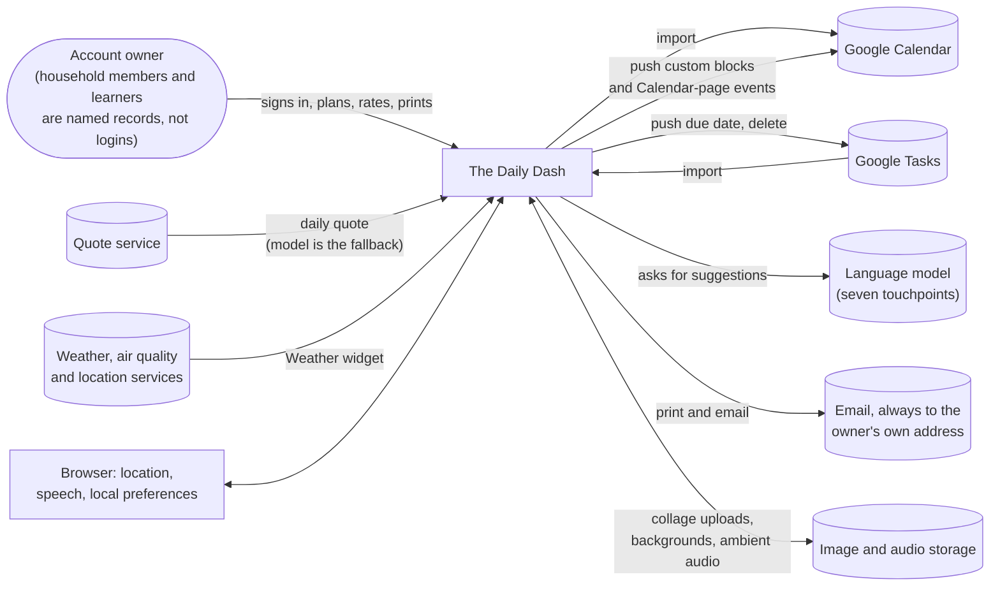

One person signs in; everyone else in the household exists as a named record inside that account. The app talks to two Google services in both directions, to a language model for suggestions, to an email service that only ever addresses the owner, and to quote, weather and file services. The browser contributes location for the weather, speech for spoken affirmations, and a small store of device-local preferences. The landing page also names Google Drive as a sync target; no Drive behaviour exists in the prototype (📝).

### How the pieces fit

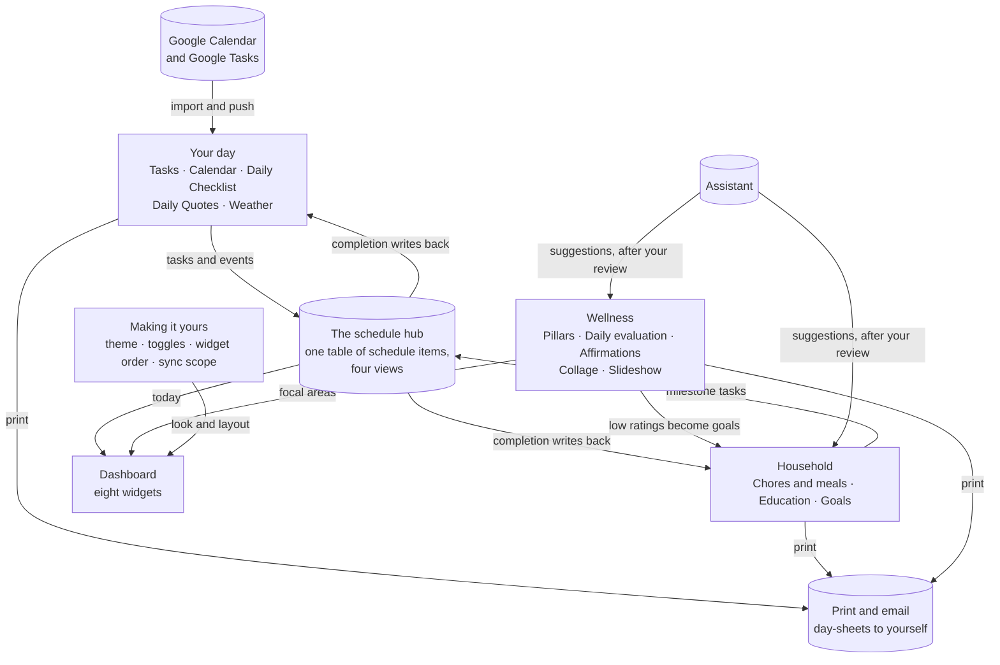

Read it from the middle. The schedule hub is the one table that time-boxed work lands on: tasks and goal milestones arrive through the item library, Google events arrive by import, and custom blocks are pushed back out. Ticking a schedule item writes the completion back to the task, chore or activity it came from. The household part plans work per person; the wellness part rates the day and feeds low scores into goals, affirmations and the Dashboard. The assistant offers suggestions to the household and wellness parts, never saving without your review. Everything you plan can be printed or emailed. The detailed connections are in the five feature parts that follow, starting with [Your day at a glance](#your-day-at-a-glance).

### The schedule hub

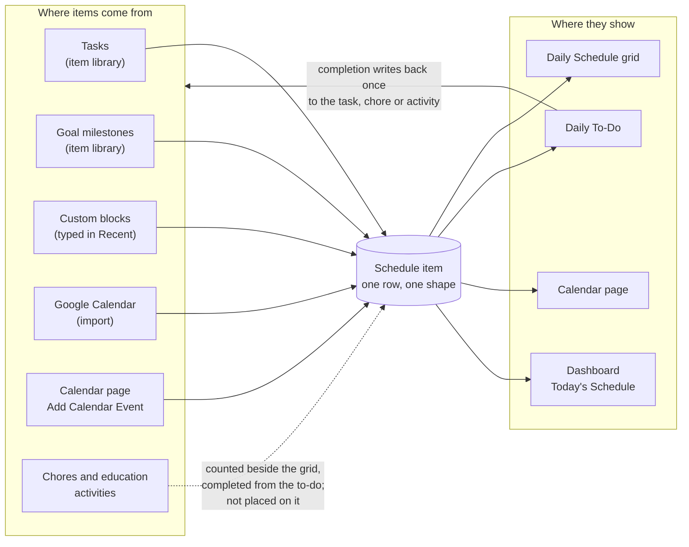

Every time-boxed thing becomes a schedule item of the same shape, whatever it came from, and four views read that one table with different filters: the grid shows blocks for the date, the to-do lists the date's items plus tasks due that day, the Calendar page shows calendar events, and the Dashboard widget shows today's events. Ticking an item on the to-do writes through once, to the source, and lifts the block off the grid. Chores and education activities are the 🟡 corner: they are counted beside the grid and can be completed from the to-do, but no path places them on the grid on its own, even though the manual says they appear there.

**Dismissal is not deletion.** A schedule item can be dismissed three ways, and each is a flag on the same record: *hide from the grid* (the block leaves the hour grid but stays on the to-do; "Restore to grid" brings it back), *hide from the to-do* ("Keep in Calendar": it leaves the to-do but stays on the Calendar page; "Re-add to To Do" brings it back), and *remove from app* (a Google event stays gone locally while the Google event survives, and the next import recognises it rather than re-creating it). None of the three deletes anything and none touches Google. 

"Delete from App" and "Delete from Google" are separate, named choices; "Send to Item Library" puts a task back in the library so you can reschedule it. The trash is different again: it is a snapshot of a task deleted from the Tasks page, kept for 24 hours for "Restore" (see [Housekeeping](#housekeeping)).

### The wellness loop

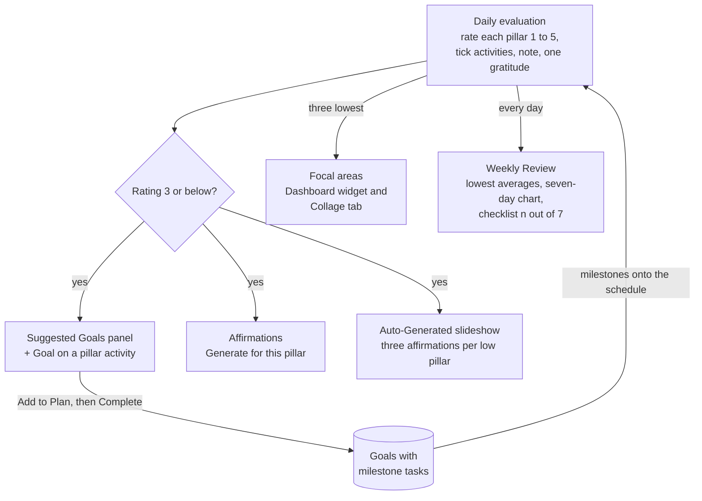

The loop begins each evening with the daily evaluation. Every pillar you rate three or below becomes a focal area: the evaluation opens Suggested Goals for that pillar so you can queue one of its activities as a goal with a count and frequency; the Affirmations card offers "Generate for {pillar}"; and the Auto-Generated slideshow writes three affirmations per low pillar and plays them over your collage. The Dashboard's Focal Areas widget shows the three lowest ratings of your latest evaluation, and the Weekly Review shows the lowest averages over the week, three months or all time. The goals created here are ordinary goals: their milestones land in the item library and on the Daily Schedule like any other. The surfaces differ slightly in which evaluation they read and whether they apply the "three or below" threshold or simply take the three lowest; that is raised in [Health pillars](#health-pillars). Reminders for the evaluation are 🟡: the Dashboard button highlights until today's evaluation exists, but no screen lets you set reminder times and nothing is sent (see [Reminders](#reminders)).

### Google in both directions

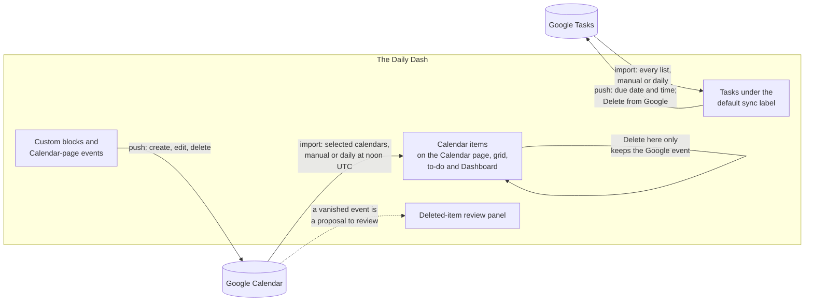

Four directions exist. **Calendar import** brings the calendars you ticked into the app, by the "Sync Selected" button or once a day. **Calendar push** sends your own custom blocks and Calendar-page events to your primary Google calendar, and follows them with edits and deletions; imported events are never echoed back, so an import can never trigger a push. **Tasks import** brings every Google task list in under the default sync label. **Tasks push** is deliberately narrow: a due-date change from the Edit Task dialog, and "Delete from Google" from the to-do; it is not a full two-way mirror, although the manual says "bidirectionally". Deleting on this side is always a choice between "here only" and "from Google too". Deleting on Google's side is a proposal: the manual import removes a local event only under strict guards, Google Tasks deletions never propagate, and the review panel that would let you keep or restore a vanished event exists but nothing yet fills it (🟡). Detail in [Google sync](#google-sync).

**To confirm**

- What is intended to fill the "Items Deleted from Google Calendar" review panel? (Q-500)
- Are the per-account "Scheduled sync times" and auto-sync calendar choices meant to drive the daily sync, which today runs once at noon UTC against the ticked calendars? (Q-202)

### What happens on its own

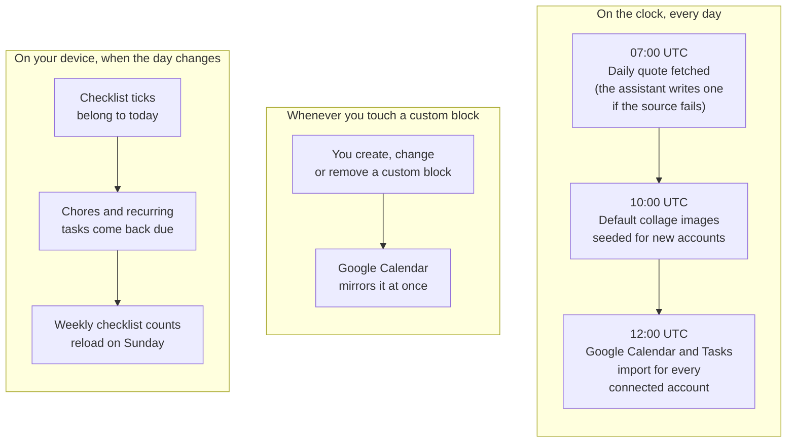

Three jobs run on a clock: the daily quote at 07:00 UTC ("midnight Pacific" in the workflow's own words), collage seeding at 10:00 UTC, and the Google import at 12:00 UTC. Three more fire whenever a custom block is created, changed or removed, keeping it mirrored on Google Calendar. On the device, nothing is ever reset at midnight: the checklist, chores and quotes simply read the new date, and the weekly checklist counts reload at Sunday midnight. Nothing syncs on app load, although the sign-up copy says so (📝). Detail in [Automations](#automations).

**What the system deliberately does not do.** It does not place chores or education activities on the schedule grid on its own, and it does not yet fill the deleted-item review panel. It does not send reminders; the only reminder behaviour is the Dashboard highlight. The feature toggles remove sidebar entries and Daily Schedule quick links but do not hide Dashboard widgets. Google Tasks sync is an import plus a due-date push and a delete, not a mirror. There is no Google Drive read or write. There is no sign-out control. And there is no image generation: collage imagery is uploaded or seeded, never generated.

## Your day at a glance

These are the surfaces the account owner lives in every day.

The **Dashboard** is the front door: one scrolling column of widgets that summarise today. The **Daily Schedule** is the hour-by-hour plan for one date, and the **Daily To-Do** beside it is the flat list of everything due that day. The **Calendar** is the month or week view of events, both created in the app and imported from Google.

**Tasks** and the **Daily Checklist** are the sources most of that content comes from: tasks are the backlog of one-time and repeating to-dos, the checklist is the set of routines done every day. **Weather** is the glance out of the window before any of it starts.

Everything time-boxed converges on one shared table of schedule items, described in [The schedule hub](#the-schedule-hub). The sections below describe what each surface shows and what the account owner can do there.

One thing to hold in mind while reading: "due today" and "overdue" are judged a little differently on each surface. The table sums it up; each section states its own rule in plain words.

| Surface | Due today means | Overdue means |
|---|---|---|
| Tasks page | an unfinished task dated today | an unfinished task dated before today |
| TODAY'S TASKS widget | dated today, or a daily / weekly / monthly task that falls on today | dated before today |
| Daily Schedule library | dated the selected day (finished or not) | dated earlier, or the selected day with a time already passed |
| Daily To-Do | dated the selected day (finished or not) | not judged; rows are simply listed |
| Dashboard badges | a chore or activity dated today, daily, or weekly on today's weekday | dated before today |
| Calendar, Daily Checklist | not judged | not judged |

### Dashboard

*Everything happening today, on one page, in the order you choose.*

**What it is.** The Dashboard is the landing page after sign-in and the page the app opens on whenever it is launched fresh in a new tab or window. It greets the account owner by name and time of day ("Good Morning, Jenova") and stacks eight widgets in a single column, each a live window onto another feature. The page itself owns the greeting, the widget order, the reorder mode, the Vision slideshow launcher, the Guide button and two count badges. Every widget's content belongs to its source feature and is described there.

**What you can do**
- See eight widgets, in this default order:

  | Widget | What it shows | Described under |
  |---|---|---|
  | Weather | today's conditions and a six-day outlook | [Weather](#weather) |
  | Focal Areas | the pillars that most need attention | [Health pillars](#health-pillars) |
  | Daily Checklist | today's still-unticked routines | [Daily Checklist](#daily-checklist) |
  | Today's Schedule | today's calendar events in time order | [Daily Schedule](#daily-schedule) |
  | TODAY'S TASKS | overdue and due-today tasks by time of day | [Tasks](#tasks) |
  | Menu & Chores | the week's meals and due chores | [Chores](#chores), [Meal planning](#meal-planning) |
  | Goals Overview | active goals and their progress | [Goals](#goals) |
  | Daily Quote | today's quote | [Daily quotes](#daily-quotes) |

- Enter **reorder mode** with the ⇅ button and drag whole widgets into any order.
- Every drop is saved to the account at once, so the same layout appears on every device. A **Save Default** button in reorder mode saves the order again explicitly and confirms with a message.
- A widget added to the app after an order was saved appears at the end of the saved order rather than disappearing.
- Be greeted as "Good Morning", "Good Afternoon" (from noon) or "Good Evening" (from 5 pm), followed by the **Custom Display Name** set in Settings, or the first word of the account's full name when no custom name is set.
- Press **Vision** to launch the full-screen slideshow without opening the Vision Board, in either mode (see [Slideshow](#slideshow)):
  - **Auto-Generated** — images and affirmations chosen for the lowest-rated pillars.
  - **Custom Slideshow** — the account owner's chosen images and saved affirmations.
- See two badges in the TODAY'S TASKS header, **Chores** and **Education**, each showing how many items are due today or overdue.
- Read the badge colour: blue means due today only, red means overdue only, purple means both, dimmed means nothing pending. Pressing a badge jumps straight to that page's due list.
- See the **Focal Areas** header button glow blue until today's daily evaluation has been done; pressing it opens the evaluation directly (see [Daily evaluation](#daily-evaluation)).
- Reopen the four-step walkthrough at any time with the **Guide** button.
- Badge counts and the greeting are computed when the page opens; each widget refreshes on its own terms.
- Land here automatically whenever the app is opened fresh; a plain reload returns to the page that was open.
- 📝 The manual says "your layout and preferences are saved automatically across all devices". The widget order is; the walkthrough's "don't remind me" is remembered on the account but only the device's own memory decides whether to show it.
- 📝 The manual says turning a feature toggle off (Chores, Education, Vision Board) hides its dashboard widget. In the prototype all eight widgets are shown regardless of the toggles.
- 🟡 A long-form date ("Saturday, September 20, 2026") is prepared for the page but not shown anywhere on it.

**How it connects**
- Every widget is mounted from its own feature; the Dashboard adds no data of its own beyond the greeting and the badge counts.
- Out to [Chores](#chores) and [Education](#education) through the badges, and to the [Daily evaluation](#daily-evaluation) through the Focal Areas button — each a deep link that lands on the filtered view.
- Out to the [Slideshow](#slideshow) through the Vision menu; the Auto-Generated mode is one of the app's AI touchpoints (see [Smart assistance](#smart-assistance)).
- In from [Settings](#settings): the Custom Display Name, and the widget order saved as an account preference.
- Print and email: none on the page itself. The Today's Schedule and TODAY'S TASKS widgets carry their own print and email controls, described under those features (see [Print and email](#print-and-email)).

**Guided introduction** — A four-step "Welcome to Dashboard" walkthrough on first visit: the page as a daily hub, arranging widgets, launching the Vision slideshow, and watching progress update through the day.

**To confirm**
- Are feature toggles meant to hide their dashboard widgets, as the manual says, or is showing all eight regardless the intent? (D-120)
- Where is the greeting name meant to be set: in Settings under "Custom Display Name" (as built) or in the Theme Editor (as the manual says)? (D-800)
- A long-form date is prepared for the Dashboard and never displayed; where was it meant to appear? (Q-802)

*Deeper reading:* [specs/20-features/dashboard/spec.md](specs/20-features/dashboard/spec.md)

### Daily Schedule

*One day, laid out hour by hour, with everything unscheduled waiting at the side to be placed.*

**What it is.** The Daily Schedule is a time grid for a single date: blocks colour-coded by where they came from, a red line at the current minute, and a side panel — the **item library** — of tasks and goal milestone tasks that have not yet been given a time. The walkthrough states the intent in the product's own words: "a planner, not a task manager". Beside the grid sit the day's [Daily To-Do](#daily-to-do), a condensed [Daily Checklist](#daily-checklist) and the Menu & Chores summary, so the plan, the list and the routines share one screen.

**What you can do**

*The grid*
- Step between days with arrows or pick any date; the grid and everything beside it reload for that date.
- Set **active hours** (default 5 AM to 10 PM) with the clock button. The grid shows one row per hour in that range and remembers the choice on the device.
- Read each block's colour: calendar events blue, tasks green, education purple, chores amber, custom blocks neutral.
- For tasks and custom blocks a priority overrides the source colour: urgent red, high orange, medium yellow, low green.
- Blocks that overlap are packed side by side in columns so nothing is hidden.
- A block that runs past midnight is drawn to the bottom of the day with " → next day" and reappears at the top of the following day as a **carry-over item**, marked "↑" and "ends 7".
- On today only, the **now line** moves every minute, past hours are dimmed and blocks whose time has passed are faded.
- Click a block for a detail popup: its time, source, notes and a "✓ Completed" mark.
- For a block whose time has passed, the popup offers **↻ Move to now** (re-times it to the current minute, keeping its duration) and **Edit**.
- Toggle the eye to show or hide completed blocks.
- Hidden blocks are counted in a header badge and listed in a **Hidden items** panel with a **Restore to grid** button for each. Blocks ticked off in the to-do count here too, since ticking hides them.
- The grid refreshes on its own when a task or schedule item changes anywhere in the app, and shortly after a chore, goal or activity changes.
- When a chore, goal or education activity is deleted elsewhere while this page is open, its leftover blocks are cleared away (see [The schedule hub](#the-schedule-hub)).
- 📝 The manual and walkthrough say a block can be ticked complete on the grid itself. In the prototype completion is done from the Daily To-Do, and a completed block leaves the grid.
- 📝 The manual says the schedule "automatically pulls in" chores and education activities due that day. The prototype draws whatever schedule items exist for the date, and no flow creates chore- or education-sourced items (see [The schedule hub](#the-schedule-hub)).

*The item library*
- On the **Recent** tab, use quick links to **Chores** and **Edu** with a count of what is due and the same blue/red/purple urgency colours as the Dashboard badges.
- Below them, reuse the last ten custom block titles from **recent history**; pin any to the top or remove it from the list.
- On the **Tasks** tab, see every unfinished task that is either undated or due on or before the selected date, grouped by label. A group shows a red or blue count badge when it holds overdue or due-today work.
- On the **Goals** tab, see each active goal under its category, offering its next unfinished milestone task — or the goal itself when it has none (see [Goals](#goals)).
- 📝 The manual and walkthrough say items already scheduled are "highlighted" in the library. In the prototype they leave the tab for that day instead.
- Place any library entry with a small inline form — start time, duration in minutes or hours, and a priority for custom blocks — and it becomes a block on the grid.
- Placing a task also stamps that task with the date and time, so the Tasks page shows where it went.
- Create a **quick task** by title alone from the library's "+" button; it lands on the Tasks tab, ready to be placed.
- 📝 The manual describes the "+" as adding a custom time block with title, start and end time, colour and notes. 🟡 Such a form exists in the prototype, but no control opens it.

*On the Dashboard*
- The **Today's Schedule** widget lists today's calendar events only, in time order, with an empty state that points to Tasks, Education and Calendar.

*What counts as due here*
- In the library, a task is **due today** when its due date is the selected date, and **overdue** when its due date is earlier — or is the selected date but its time has already passed. The Tasks page compares dates only, so a task can read as overdue here an hour before it does there.
- The Chores quick link counts chores due on the selected date, while its colour reflects today; the Edu link works the same way.

**How it connects**
- Both ways with [Tasks](#tasks): placing a task writes its due date and time; completing it from the to-do updates the task; editing a task's date or time moves its blocks; deleting a task with blocks shows a notice on the Tasks page.
- In from [Calendar](#calendar) and [Google sync](#google-sync): imported and app-created events appear as blue blocks and can be edited from the popup; an event linked to Google can push the change back.
- In from [Goals](#goals) through the Goals tab; in from [Chores](#chores) and [Education](#education) through the quick links and the embedded Menu & Chores widget.
- Both ways with the [Daily Checklist](#daily-checklist): the condensed checklist ticks routines for the selected date.
- Print and email: **Print schedule** and **Email schedule** first ask "Print Schedule + To Do together?" and produce an "Hourly Schedule" table, optionally followed by the "To Do" table. The email goes to the account owner's own address with the subject "Daily Schedule". The Dashboard widget instead prints or emails calendar events over a date range (see [Print and email](#print-and-email)).

**Guided introduction** — A seven-step "Welcome to Daily Schedule" walkthrough: the visual day, the item library, placing items, completing items, working with the to-do, how tasks behave here, and controlling the view. 🟡 A second, four-step set of walkthrough text exists in the prototype and is not shown.

**To confirm**
- Is completion meant to happen on the grid block itself (as the manual and walkthrough say) or in the Daily To-Do (as built)? (D-402)
- Which flow is meant to place chores and education activities on the schedule automatically, as the manual promises? (Q-203)
- Is the library "+" meant to create a full custom block (title, times, colour, notes) or a quick task by title, as built? (D-401)

*Deeper reading:* [specs/20-features/daily-schedule/spec.md](specs/20-features/daily-schedule/spec.md) (+ time-grid.md, item-library.md)

### Daily To-Do

*Everything due on the selected day, in one flat list you can tick off or dismiss with intent.*

**What it is.** The daily to-do is the "TO DO" card on the Daily Schedule page. It is composed on the fly from two sources: every schedule item of the selected date, plus a row for every task due that date that has not been placed on the grid. Ticking a row writes through to its source. Removing a row asks what the account owner actually means — send it back to the library, keep it on the calendar, delete it here, delete it in Google, or just take it off the grid.

**What you can do**
- See the list for the selected date sorted by start time, untimed rows last, with a coloured edge for task priority and a tint for calendar events. Ticked rows are struck through.
- Tick a row to complete it:
  - a task becomes completed, and its last-completed date is set to the selected date;
  - a chore or an education activity is marked done;
  - the block also leaves the grid and moves to the hidden panel until unticked;
  - goal rows have no checkbox.
- Reveal the remove button by swiping left or hovering, then choose one of the actions offered for that row:

  | Action | What it means | Offered for |
  |---|---|---|
  | **Keep in Calendar** | dismiss from the to-do; the event stays on the grid and the Calendar page | events |
  | **Send to Item Library** | the block is removed; a task's due date and time are cleared so it returns to the library; a custom block's title returns to Recent history | tasks, chores, activities, goals, custom blocks |
  | **Delete from App** | the block and its source (task, chore, activity or milestone task) are deleted from the app | tasks, chores, activities, goals |
  | **Delete from Google** | the block is deleted here and the Google task or event is deleted in Google | tasks; Google-linked events |
  | **Delete Permanently** | the block goes; a custom block's backing task remains | custom blocks; unlinked events |
  | **Hide from Schedule Grid** | keep the row in the to-do but take the block off the grid | any row that is a real block |

- 🟡 "Delete from Google" is offered for every task row; a task that was never linked to Google is left in place by it.
- Show or hide completed rows with a toggle the device remembers.
- Open a **Hidden from To Do** section for rows dismissed with "Keep in Calendar" and **Unhide** them. The Calendar page offers the same restore as **Re-add to To Do** (see [Calendar](#calendar)).
- Double-tap or double-click a row to edit it: task rows open the task editor, every other row opens the event editor; both offer a **Hide from Schedule** button here.
- A row removed during this visit does not come back when the list refreshes on its own.
- With nothing left to do, the card reads "No items to complete".
- 📝 The walkthrough places the to-do list "on the dashboard". In the prototype it lives on the Daily Schedule page, and the Dashboard's schedule widget shows calendar events only.

**How it connects**
- Both ways with [Tasks](#tasks), [Chores](#chores), [Education](#education) and [Goals](#goals) through completion write-through and the delete actions (see [The schedule hub](#the-schedule-hub)).
- Out to Google for "Delete from Google" (see [Google sync](#google-sync)).
- Print and email: **Print** and **Email** produce the "To Do" table alone, including completed rows; the email subject is "Daily To Do" (see [Print and email](#print-and-email)).

**Guided introduction** — Covered by the Daily Schedule walkthrough's step "Works with Your To-Do List".

**To confirm**
- Completing a chore from the to-do marks it done but does not advance its next due date the way the Chores page does; is that divergence intended? (Q-402)
- When a goal has no unfinished milestone tasks the goal itself can be scheduled, yet its to-do row has no checkbox; is scheduling the goal itself intended? (Q-404)
- The to-do lists a task as due on a day whether or not it is already finished, and the Tasks page counts only unfinished tasks as due today; which reading is intended? (D-101)

*Deeper reading:* [specs/20-features/daily-schedule/daily-todo.md](specs/20-features/daily-schedule/daily-todo.md)

### Calendar

*Your month and week at a glance, with Google events and your own side by side.*

**What it is.** The Calendar is the month or week view of the account owner's events: those imported from Google Calendar and those created here. A day panel beside the grid lists the selected date's events and lets the account owner add, search, edit and delete them. A single Sync button refreshes from Google Calendar and Google Tasks according to the sources chosen in Settings. A banner above the grid is reserved for reviewing items that disappeared from Google before they are gone for good.

**What you can do**
- Switch between **Month** and **Week**.
- In Month view, see a Sunday-to-Saturday grid with the neighbouring months' days dimmed and up to three coloured dots marking a day's events. Today is ringed; the selected day is filled.
- In Week view, see up to four event chips per day and a "+N more" line beyond that.
- Move month by month or week by week; the two positions are remembered independently. Pick any date from a date picker to jump.
- Read the selected day's events in time order in the **Events** panel, each with its date, times and notes.
- 📝 The manual says Google events are shown with a calendar icon; the prototype shows a colour dot.
- **Search** across every loaded event by title, notes, source or time; matches are listed nearest-in-time first.
- 🟡 Search results appear only while the selected day has at least one event of its own; on an empty day the panel keeps reading "No events for this day".
- **Add an event** with a title, date, start and end (default 9–10 AM) and notes. Choosing a different date in the dialog also moves the page's selected date. A "Sync to Google Calendar" checkbox, on by default, pushes the new event to Google (see [Google sync](#google-sync)).
- 📝 The manual and walkthrough also list a colour field on the add dialog; there is none.
- **Edit** any event by double-clicking it: title, date and times. A Google-linked event's change is pushed to Google.
- 🟡 Notes are kept through an edit, but the edit form has no notes field.
- 📝 The manual says Google events "cannot be fully edited — edit them in Google Calendar directly". The prototype edits them here and pushes the change.
- **Delete** an event. For a Google-linked event the dialog asks "Delete here only" or "Delete from Google too".
- An imported event deleted "here only" is **removed from app**: it stays hidden and a later import recognises it rather than bringing it back. An app-created event is deleted outright.
- 📝 The manual says an event from Google "will also be deleted there"; the prototype offers the choice.
- **Re-add to To Do** an event that was dismissed from the daily to-do with "Keep in Calendar".
- Press **Sync** to import from Google Calendar and Google Tasks, honouring the sync sources chosen in Settings, and see "✓ Sync complete" or a failure message in the corner.
- 📝 The manual and walkthrough say events sync "for the past 30 days and forward". The manual import reads 90 days back and 60 forward; the scheduled one reads 30 days back with no end (see [What happens on its own](#what-happens-on-its-own)).
- 🟡 Review **Items Deleted from Google Calendar** in a banner: each tombstone offers **Keep deleted** or **Restore to calendar**. A restored event lands on today at 9–10 AM, because the tombstone keeps no date. No part of the prototype is observed writing tombstones, so the banner has no source of rows yet.
- The Calendar has no notion of "due" or "overdue"; those live on Tasks, Chores, Education and the Daily Schedule.

**How it connects**
- Both ways with [Google sync](#google-sync): the Sync button triggers imports; adding, editing and deleting linked events pushes to Google; the sync sources come from [Settings](#settings).
- Out to the [Daily Schedule](#daily-schedule) and [Daily To-Do](#daily-to-do): events created here are schedule items and appear on the grid and in the to-do; those pages open this feature's event editor.
- Print and email: **Print calendar** / **Email calendar** on the calendar card export a date range prefilled with the visible month or week; **Print events** / **Email events** on the day panel export the selected day. Both group events by date under the title "Calendar (…)" or "Events (…)" (see [Print and email](#print-and-email)).

**Guided introduction** — A four-step "Welcome to Calendar" walkthrough: browsing the grid, adding custom events, syncing with Google Calendar and Tasks, and searching and managing events. 🟡 A second set of walkthrough text exists in the prototype and is not shown.

**To confirm**
- Are Google-imported events meant to be editable here with changes pushed back (as built), or read-only with edits made in Google (as the manual says)? (D-502)
- When deleting a Google event, is the intent an automatic delete in Google (manual) or the "here only / from Google too" choice (as built)? (D-501)
- What is meant to populate the "Items Deleted from Google Calendar" review queue, and is landing a restored event on today at 9–10 AM the intended outcome? (Q-500)

*Deeper reading:* [specs/20-features/calendar/spec.md](specs/20-features/calendar/spec.md) (+ deleted-item-review.md)

### Tasks

*One backlog for everything you have to do — once or on repeat — that flows onto your day.*

**What it is.** The Tasks page ("Task Manager") is the account owner's single list of one-time and recurring to-dos. Each task carries a priority, an optional label with colour, an optional due date and time, a recurrence pattern, reference links and a note. The page slices the backlog by what is active, due today, overdue, upcoming, unscheduled or completed; groups it by priority, recurrence or label; prints or emails the current view; and shows today's slice again on the Dashboard.

**What you can do**

*Creating and editing*
- **Add a task** with a title, description, priority (Low / Medium / High / Urgent), due date, due time, and a label with colour.
- Choose a frequency. Weekly and Specific Days offer a day picker; X Times Total asks how many times.

  | Frequency | When it comes back after completion |
  |---|---|
  | One-time | never; it stays completed |
  | Daily | the next day |
  | Weekly | the next chosen weekday, or a week on when no days are chosen |
  | Biweekly | two weeks on |
  | Monthly | the same day next month |
  | Specific Days of Week | the next chosen weekday |
  | X Times Total | it does not come back; each tick counts one occurrence until the total is reached |

- 📝 The manual describes an "Is Recurring" toggle and only Daily / Weekly / Monthly; the prototype offers the seven frequencies above.
- Reuse labels: every label used on a task, checklist item or goal is remembered in a shared **label history** and offered again (see [Making it yours](#making-it-yours)).
- **Edit** a task by double-clicking or double-tapping it: every field, plus reference links shown as chips that open in a new tab, and notes.
- Read a row at a glance: a coloured edge for priority, the title, the first two link chips and "+N" for more, the due date and time (or the time it was placed on the schedule), the label in its colour, and a note icon that opens the description.

*Completing*
- **Tick a task complete** and untick it.
- Completing a recurring task creates its **next occurrence**: a new pending copy dated to the next period, while the completed one stays as a record. No new copy is made while a pending task with the same title and pattern already exists.
- Track an **occurrence task** ("X Times Total"): the row reads "2/3 done" with a progress bar, and the task completes when the count is reached. Unticking counts one back.
- Change a recurrence pattern at any time without losing the occurrence count or the last-completed date.
- When the page opens, two pending copies of the same recurring task (same title and pattern) are reduced to the one due soonest.
- 📝 The manual describes a Pending → In Progress → Completed status circle; the prototype toggles between pending and completed only.

*Deleting*
- **Delete** a task from its hover or long-press button, after a confirmation. A snapshot goes to the **trash** first so it can be restored from Settings (see [Housekeeping](#housekeeping)).
- A Google-linked task is asked "Delete here only" or "Delete from Google too".
- 📝 The manual says the trash keeps tasks for 30 days; the Settings card lists and labels 24 hours.
- A restored task comes back with every field intact, as a fresh task; blocks it had on the Daily Schedule are not re-linked to it.
- **Select** several tasks and delete them together. This batch path writes no trash snapshot and asks no Google question.
- 📝 The manual says deletion is "via the action menu" and the walkthrough says "swipe left"; the row reveals its delete button on hover or a long press.

*Finding things*
- **Filter** by Active, Due Today, Overdue, Pending (upcoming), Unscheduled (no date, not recurring) or Completed. Due today means the due date is today; overdue means it is earlier; both compare dates only.
- In the Active view, tasks due after today are dimmed so today's work stands out.
- **Sort** into groups by Priority (Urgent → Low), Frequency (Daily … One-time) or Label (alphabetical, "(No Label)" last), and narrow a label view to a single label.
- Collapse or expand all groups, then open individual ones; whether the list starts collapsed is a Settings choice.
- 📝 The manual promises keyword search and sorting by due date; neither is a control on the page. Due date orders tasks inside each group.

*On the Dashboard*
- The **TODAY'S TASKS** widget lists **Overdue** first, then **Due Today** — tasks dated today plus recurring tasks that fall on today — grouped into Morning, Afternoon, Evening, Night and Anytime whenever any has a time.
- Ticking there flips the task between done and pending and reloads the widget.
- 🟡 The widget's tick does not create the next occurrence, count an occurrence or update linked schedule blocks the way the Tasks page does.
- 🟡 Biweekly and Specific Days tasks never surface in the widget's "falls on today" rule; they appear only once their due date arrives.

**How it connects**
- Both ways with the [Daily Schedule](#daily-schedule) and [Daily To-Do](#daily-to-do): unscheduled and due tasks appear in the item library and the to-do; placing a task stamps its date and time; completing on the Tasks page marks its blocks complete; editing its date or time moves its blocks (see [The schedule hub](#the-schedule-hub)).
- 🟡 Deleting a task announces "It was also removed from the Daily Schedule", while its blocks are left for the schedule's own clean-up pass.
- Both ways with [Google sync](#google-sync): Google Tasks are imported from Settings — every list, matched by Google id, given the default label "Google Tasks". 🟡 The default sync label the manual describes has no control to set it.
- Only a task's due date and time are pushed back to Google, from the edit dialog when its checkbox is ticked. 📝 The manual calls the sync bidirectional. 🟡 "Delete from Google too" runs an import rather than a delete.
- Out to the Dashboard through the TODAY'S TASKS widget, whose header carries the [Chores](#chores) and [Education](#education) badges.
- Print and email: from the page, a "Task List" grouped by priority or by label with a trailing Completed section; from the widget, "Tasks (date range)" grouped by day, pending tasks only (see [Print and email](#print-and-email)).

**Guided introduction** — A four-step "Welcome to Task Manager" walkthrough: creating and prioritising, labels, recurring tasks, and filtering, sorting and adding to the schedule. Its dismissal follows the account to other devices.

**To confirm**
- Is the "In Progress" status meant to be reachable from the page, as the manual's status circle describes? (D-453)
- Is ticking a task from the Dashboard meant to behave exactly like ticking it on the Tasks page — next occurrence, occurrence count, linked blocks? (D-460)
- Is the intended trash retention 24 hours (as built) or 30 days (as the manual says)? (Q-462)

*Deeper reading:* [specs/20-features/tasks/spec.md](specs/20-features/tasks/spec.md) (+ recurrence.md, google-tasks.md)

### Daily Checklist

*The routines you do every day, fresh each morning, with a count of how many days this week you kept them.*

**What it is.** The Daily Checklist holds repeating routines — morning habits, an evening wind-down, the anytime things — sorted into four **time-of-day buckets**: Morning, Afternoon, Evening and Anytime. Each item can carry a clock time and a colour-coded label. Ticks are recorded per date, so the list starts unticked every day without any reset action, and each item shows how many days of the current week it has been done.

**What you can do**
- **Add an item** with a title, a time-of-day bucket, an optional time and an optional label with colour; labels share the app-wide label history.
- **Edit** an item by double-clicking or double-tapping it.
- 📝 The manual also mentions "clicking and holding" to edit; holding a row reveals the delete button instead.
- **Tick items off** for today; a ticked title is struck through. Tomorrow the list is unticked again, because completions belong to a date. While the page is open across midnight it rolls over on its own.
- See a **weekly count** "n/7" on every item: the number of days in the current Sunday-to-Saturday week it was ticked. The count starts again at the next week.
- **Drag** items to reorder them within a bucket, or drop them into another bucket to move them to that time of day.
- **Hide completed** items with the eye toggle, remembered on the device.
- Step through **views** with ‹ › arrows: All, one bucket, one label, or Completed (everything ticked today).
- Watch the **Today's Progress** bar — "3 of 7" — for the current view.
- **Delete** one item from its hover or long-press button, or **Select** several and delete them together. Deleting an item keeps its history of completions.
- 📝 The manual describes swiping left to delete; the row uses hover or long-press.
- A new item starts at the top of its label group in its bucket until the next drag settles the order.
- On the Dashboard, the **Daily Checklist** widget shows only what is still unticked today, bucket by bucket, with a "4/6 completed" header and "All done for today!" when everything is ticked. Ticking there records the same completion.
- 🟡 The widget's "n/7" counts are read when the Dashboard opens and do not move after a tick there; the page's counts do.
- On the Daily Schedule, a **condensed checklist** ticks items for the selected date, so a past or future day can be recorded too. Its hide-completed switch is separate from the page's.
- The checklist has no notion of "due" or "overdue": every active item is simply there every day.

**How it connects**
- Out to the [Dashboard](#dashboard) widget and the [Daily Schedule](#daily-schedule)'s condensed card.
- Out to the [Weekly review](#weekly-review), which reads the week's completions.
- Shares the label picker and label history with [Tasks](#tasks) and [Goals](#goals).
- Print and email: none.

**Guided introduction** — A four-step "Welcome to Daily Checklist" walkthrough: creating daily items, checking off progress, reordering by dragging, and organising and managing. Its dismissal follows the account to other devices, and the Guide button clears it so the walkthrough shows again.

**To confirm**
- When every pending item is in Anytime, was a flat, un-bucketed dashboard layout intended? The widget works this out and does not use it. (Q-804)
- The checklist page and the condensed checklist on the Daily Schedule each remember "hide completed" separately; is one shared switch intended? (D-110)

*Deeper reading:* [specs/20-features/daily-checklist/spec.md](specs/20-features/daily-checklist/spec.md)

### Weather

*What it is like outside today and this week, with no setup beyond a location prompt.*

**What it is.** The Weather widget is the first card on the Dashboard. Using the browser's location, it shows the current temperature and conditions for the account owner's place, today's high and low, how it feels, humidity, wind, air quality and a six-day outlook. There is nothing to configure and no control on the card; it is read at a glance. The services behind it are described in [The world around the app](#the-world-around-the-app).

**What you can do**
- See the **Today** block: temperature in °F, the condition with an icon, and the place name — city, town, village or county, or "Your Location" when none is known.
- Read the condition as one of Clear, Cloudy, Fog, Drizzle, Rain, Snow, Showers, Thunder or Wind.
- See today's high and low; orange marks the high, blue the low.
- Read the metric row: **Feels** like, **humidity** %, **wind** in mph, and **AQI**. The AQI cell is omitted when no reading is available.
- Read the air-quality colour, which carries meaning:

  | AQI | Meaning | Colour |
  |---|---|---|
  | up to 50 | Good | green |
  | up to 100 | Moderate | yellow |
  | up to 150 | Unhealthy for sensitive groups | orange |
  | up to 200 | Unhealthy | red |
  | up to 300 | Very unhealthy | purple |
  | above 300 | Hazardous | dark red |

- Scroll the **6-Day Forecast** strip: for tomorrow through six days out, the weekday, condition icon, high and low.
- Units are fixed: °F, mph and the US air-quality index; there is no unit setting.
- The strip's weekday names are taken from the forecast date in universal time, while every other weekday in the app follows the device's local time.
- Reuse the last result for 30 minutes: within that window the widget shows it immediately, with no location prompt and no network request. After it, the location is requested again and a fresh forecast fetched.
- 📝 The manual says location is needed "on first load"; the prototype asks whenever the cached result has expired.
- When location is unavailable or declined, or a fetch fails, the card reads "Enable location to see weather".

**How it connects**
- In from the [Dashboard](#dashboard) as the first default widget; the Weather appears nowhere else in the app.
- Out to external services only: the browser's geolocation, a reverse-geocoding service for the place name, and Open-Meteo for the forecast and air quality (see [The world around the app](#the-world-around-the-app)).
- No print, email, AI or account data.

**Guided introduction** — No walkthrough of its own; the Dashboard's first step names the weather as the first thing on the page.

**To confirm**
- Is prompting for location on every expired load (about every 30 minutes of dashboard use) the intent, or was a single first-time prompt meant? (D-810)

*Deeper reading:* [specs/20-features/weather/spec.md](specs/20-features/weather/spec.md)

## Running the household

One account, many people. The account owner keeps a list of **household members** (a name and a colour) who can be given chores and goals, and a list of **learners** (a name and a grade level) whose homeschool or tutoring plans live in Education. None of these people sign in; they are records inside the one account, and the same household members appear on the Chores page and the Goals page.

| Who | Kept where | What they can be given | Where they show up |
|---|---|---|---|
| Household member (name, colour) | Chores page; also Goals page | chores, meals, goals | Chores board, Menu, chore library, Dashboard "Menu & Chores", Goals |
| Learner (name, grade level) | Education page | subject plans, activities, library entries, goals | Education cards and exports, Goals (by name) |
| The account owner | signs in | goals by default | everywhere |

Each of the four features below keeps a library of reusable ideas — chore templates, saved activities, milestone tasks that can be placed on the day — so a week can be rebuilt without retyping.

Where the app suggests content with AI (chore ideas, meal ideas, learning activities), nothing is saved until the owner reviews the list and approves what stays (see [Smart assistance](#smart-assistance)).

### Chores

*Every chore has a person, a room and a rhythm — and the page opens on what is due today.*

**What it is.** The Chores page ("Chore Manager" in-app) is the household chore board. The account owner adds household members, creates chores with a title, room, frequency, time estimate and notes, assigns each one to one or more people, and ticks them off. The default view answers "what is due today"; other views group the same chores by person, room or frequency, and the board can be printed for the fridge or emailed. A second tab on the same page, Menu, holds the weekly meals (see [Meal planning](#meal-planning)).

**What you can do**

#### People and rooms
- Keep household members in a "Household Members" dialog: add a person by name, rename them, and pick one of eight colours.
- The colour identifies that person on the Dashboard widget and in the chore library; the Chores list itself shows names only.
- Deleting a member keeps their chores, which then show as "Unassigned".
- Choose rooms from a built-in list — Kitchen, Bathroom, Bedroom, Living Room, Dining Room, Laundry Room, Garage, Entryway, Yard — or type a custom room.
- Custom rooms are remembered on the device and tidied to Title Case; a room you delete stays gone even if old chores still mention it.

#### Creating and assigning
- Create a chore with a title, description, frequency, room, time in minutes and notes; weekly and bi-weekly chores also take the days of the week they fall on.
- A chore cannot be created until at least one household member exists and is chosen for it.
- Assign one chore to several people at once: the app writes one copy per person and skips anyone who already has the same chore.
- Edit any chore by double-clicking it, including adding more people — the first person chosen keeps the original, everyone else gets a copy.
- Enter bulk mode to select many chores (or a whole group) and reassign or delete them together.
- Priority is stored on every chore but 🟡 is not editable on the page; every chore is created as medium (D-551).

#### Rhythm and completion
| Frequency | After you tick it done, next due is |
|---|---|
| Daily | tomorrow |
| Weekly / Bi-Weekly | 7 / 14 days from today |
| Monthly / Quarterly / Yearly | one month / three months / one year from today |
| Once / As Needed | does not roll forward |

- A chore is **due today** when it is not completed and it is daily, or weekly on one of its days, or its next due date is today, or monthly on the matching day of the month.
- Ticking a chore records today as its completion date and sets the next due date from today (table above); ticking again un-completes it.
- While the page is open across midnight, every completed chore returns to pending so tomorrow starts fresh.
- The dialogs offer eight frequencies; the manual and walkthrough name four (D-552).
- 📝 A "skip" state is mentioned in the walkthrough but has no control (D-554).
- 📝 "Overdue chores are highlighted" is promised by the manual and walkthrough; the Chores page has no overdue rule or highlight (D-104).

#### Views and filters
- Open on **Due Today**, or switch to **All** (everything not yet done) or **Done**; each pill shows its count.
- Filter by member, room ("Location"), frequency (including the shortcuts Weekdays and Weekends) and duration (up to 15 minutes, 16–30, over 30).
- Choosing a room switches the view to All so the whole room is visible.
- The first filter you pick decides the grouping: a member first groups by person; a room first groups by room, and chores that several people share collapse into one row listing all of them.
- Groups and sub-groups collapse and expand; a header button collapses or expands everything at once. 🟡 A category filter exists without a control (Q-551).

#### Chore library
- The library holds reusable, unassigned templates; any chore can be saved to it from its add or edit dialog with one checkbox.
- The library dialog lists templates alongside your own existing chores (tagged "My Chore"), searchable by title and filterable by room and by chores versus meals.
- Pick default assignees once, then override the people or the frequency per template.
- Each template shows who already has it, in their colour, and locks when everyone chosen already has it.
- Assign many templates to many people in one step; each pair becomes a real chore.
- A template keeps one of four frequencies (daily, weekly, bi-weekly, monthly); assigning can still choose any of the eight.
- 🟡 Age and assignee filters exist in the library without controls (Q-555).

#### AI chore generator
- Pick who the chores are for, an age group (3–5 up to Adult), a type (Cleaning, Organizing, Maintenance, or your own wording), a room and how many (1–50, default 5).
- Review the suggestions with their description, time estimate and priority; nothing is selected until you choose.
- Per item, set the people (or leave it unassigned) and the frequency; or set everyone at once.
- Add the selected items as chores, save them to the library, or both. Nothing is written until you press Add or Save.

#### Printing the chore chart
- Print the current list as a "Weekly Chore Schedule" with an optional note (remembered for next time), grouped by person and then by frequency, with tick boxes.
- The printed sheet covers daily, weekly, bi-weekly and monthly chores; members with nothing in the current view are left off.
- Email it to yourself: the message groups by weekday and carries daily and weekly chores only.

**How it connects**
- The [Dashboard](#dashboard) shows a Chores badge that opens today's chores, and a "Menu & Chores" widget listing chores due today by person and room — with a checkbox that completes the chore right there.
- The [Daily Schedule](#daily-schedule) shows the same card (without checkboxes) and a "Chores" quick link in its item library.
- Household members are shared with [Goals](#goals), where the same people appear as "family members" for goal assignment.
- Meals are chores of a meal type and live on the Menu tab (see [Meal planning](#meal-planning)); they never appear on the Chores tab.
- The [Daily To-Do](#daily-to-do) can complete a chore-sourced row, but 📝 chores appearing on the schedule automatically ("pulls in … chores due that day") has no creating path today (D-206).
- Smart assistance: the AI chore and meal generator suggests; the owner reviews, assigns and approves (see [Smart assistance](#smart-assistance)).
- Print and email (see [Print and email](#print-and-email)). Chores can be hidden entirely with a feature toggle in [Settings](#settings).

**Guided introduction** — A five-step "Welcome to Chores" walkthrough covers adding chores, generating meal ideas with AI, inviting household members, setting frequencies, and tracking completion; the Guide button reopens it any time.

**To confirm**
- Is "overdue highlighting" on the chore board part of the intended product, and what counts as overdue for a recurring chore? Today only the Dashboard badge and the Daily Schedule link colour overdue chores. (D-104)
- Is chore priority meant to be something the owner sets, as the manual says, or a value the AI generator fills in behind the scenes? (D-551)
- AI-generated chores can be left unassigned; is there an intended place to see unassigned chores, given the Chores tab lists assigned chores only? (Q-553)

*Deeper reading:* [specs/20-features/chores/spec.md](specs/20-features/chores/spec.md) (+ chore-library.md, ai-generator.md)

### Meal planning

*A weekly menu, built from the same records as chores, with AI meal ideas by age.*

**What it is.** Plainly put: meal planning in the prototype is a weekly menu made of chores. A chore whose type is a meal type (Breakfast, Lunch, Dinner, Snack or Meal) is a **meal**; it disappears from the chore list and appears on the Menu tab of the Chores page under the weekdays it is planned for. Meals can be ticked off, deleted, printed as a fridge sheet, and previewed on the Dashboard beside today's chores. Meal ideas come from the same AI generator as chores, with meal-type chips and age groups from 3–5 up to Adult.

**What you can do**

#### Building the menu
| Way in | What you choose | What the menu receives |
|---|---|---|
| Chore form, type "Menu / Meal" | title, description, notes, room, frequency, days, cook | a meal with your notes and directions |
| AI generator, type "Meal" | meal slot, age group, quantity; then days and cook per idea | weekly meals in the chosen slot |
| Chore library, filtered to Meals | templates by meal type, default cooks | meals copied from templates |

- Add a meal by hand from the chore form by choosing the type "Menu / Meal".
- Generate meal ideas with AI: choose Breakfast, Lunch, Dinner or Snack, an age group and how many.
- Review each idea's title, description and prep time; select the ones you like.
- Set the days of the week each meal is served and who cooks it; generated meals repeat weekly.
- Add the selected meals to the menu, and optionally save them to the chore library.
- Reuse meal templates later: filter the library to Meals and by meal type, and assign them as you would a chore.

#### Reading the week
- The Menu tab shows Monday to Sunday, one collapsible row per day; today is expanded and marked "today", the other days start collapsed.
- Each day header counts its meals; inside a day, meals are grouped Breakfast, Lunch, Dinner, Snack, Meal, then Other.
- Days that have no meal read "No meals"; an empty menu reads "No meals planned".
- A meal appears on a day when it is daily or that day is one of its chosen days.
- Filter the menu to one household member (the same member filter as the Chores tab) and switch between **Upcoming** and **Completed**.
- Double-tap a meal to open its notes and directions: type, description, prep time.

#### Keeping it current
- Tick a meal off once it is made; it moves to Completed and its next due date rolls forward by its frequency. Un-tick to bring it back.
- Completed meals return to pending at midnight, together with chores, while the page is open.
- Delete a meal with a long-press or hover, confirmed first.
- 🟡 Meals cannot be edited after creation; notes and directions are entered when the meal is made (Q-600).

#### Print
- Print a "Weekly Meal Schedule" with an optional note: one section per weekday with tick boxes, title, description, meal slot, minutes and cook.
- 🟡 Email exists for chores only; a meal email variant is prepared but has no button (D-313).

**How it connects**
- The [Dashboard](#dashboard) "Menu & Chores" widget and the [Daily Schedule](#daily-schedule) card show the rest of this week's uncompleted meals (today through Sunday) beside chores due today.
- Meals share rooms, members, the midnight reset and the completion rule with [Chores](#chores).
- Smart assistance: the AI generator's meal mode (see [Smart assistance](#smart-assistance)).
- Print (see [Print and email](#print-and-email)).

**Guided introduction** — Step 2 of the Chores walkthrough ("Generate Meal Ideas with AI") introduces meal generation by type and age group.

**To confirm**
- Is a way to edit a meal (title, days, notes) after it is created intended? (Q-600)
- A meal added by hand from the chore form stores a room and full day names, while the Menu reads the meal slot from that same field and matches short day names; so a hand-made meal lands under "Other" and, unless daily, on no weekday. Is the hand-made path meant to ask for a meal slot and days the way the AI path does? (D-600)
- The member filter is shared between the Chores and Menu tabs, so choosing a person on one tab filters the other. Intended? (Q-604)

*Deeper reading:* [specs/20-features/chores/meal-planning.md](specs/20-features/chores/meal-planning.md) (+ ai-generator.md)

### Education

*Learners, subject plans and activities — and a daily answer to "what is due, what slipped, what is next".*

**What it is.** The Education page ("Education Manager" in-app) is a homeschool and tutoring planner. The account owner keeps one or more learners, gives each learner a plan per subject, and fills each plan with assignments and activities that happen once or repeat on a frequency. One card per learner and subject holds its items; five views — Due, Past, Next, Done, All — sort the whole household's learning into today, overdue, the coming week, finished, and everything. Learning activities can be generated with AI, saved to a per-learner library, turned into goals, and the visible week can be printed or emailed.

**What you can do**

#### Learners and plans
- Keep learners in a "Manage Learners" dialog: name and grade level. Deleting a learner removes that learner's plans and activities as well.
- 🟡 The manual promises a colour per learner; every learner currently gets the same colour (D-654).
- Create plans in one step: pick a learner and one or more subjects, add an optional completion date, description, materials and notes. One plan per subject is created.
- Subjects come from ten defaults — Math, Reading, Writing, Science, History, Geography, Art, Music, PE, Foreign Language — plus custom subjects you add, remembered on the device.
- Edit a subject's plan details by double-clicking its card title; delete a subject with all its plans and activities from the same dialog.
- 📝 A plan status workflow (Not Started → In Progress → Completed) is described in the manual and not shown on the page (D-653).

#### Assignments and activities
- Add an assignment or an activity to a subject card: title, frequency (Once, Daily, Weekly, Biweekly, Monthly), days of the week for weekly and biweekly, an optional due date and notes.
- Tick an item off; un-tick to reverse. What happens depends on its frequency:

| Item | On tick |
|---|---|
| Once | marked done and moves to the Done view |
| Daily / Weekly / Biweekly | today is recorded; due date moves forward 1 / 7 / 14 days |
| Monthly | today is recorded; due date moves forward 30 days |

- Expand an item to read its notes, edit it, delete it, or manage its resource links — a list of web links that open in a new tab.
- 📝 The manual says one-time activities "are archived" on completion; today they stay in their card under Done.

#### Views
| View | Shows |
|---|---|
| Due | not done and due today: by date, by daily rhythm, on one of its weekdays, or on its day of the month |
| Past | not done and slipped: a due date already gone, or a weekly day already passed this week |
| Next | not done and due within the next seven days |
| Done | finished one-off items |
| All | every plan for the learners in view, even when empty |

- A stats bar shows the count for each view; learner headings take the view's colour.
- Narrow the page to one learner (when there are two or more) and one subject (when there are several); counts follow the learner choice.
- Cards and their Assignments / Activities sections collapse and expand, with Collapse all / Expand all.

#### AI activity generator
- Choose an age group (Preschool 3–5 through High School and 18+), type a subject, pick assignment or activity, and how many (1–10, default 5).
- Review the suggestions with their duration and materials; choose which learners and which of their plans receive them.
- Optionally create a goal per activity at the same time.
- Generated activities arrive as one-off, undated items; a plan that already has an item of the same title is skipped. Nothing is written before "Assign".
- The same dialog has a Manual Entry mode for typing an activity straight into a learner's plan.

#### Activity library
- Save a reusable activity from an item's edit dialog, or type one directly into the library with learner, title, description, type, duration and materials.
- Entries are grouped by learner; select several and "Add to Plan" for any learner's plan. Added items are one-off and undated.
- Library entries outlive their learner: deleting a learner keeps that learner's saved activities.
- Create a goal from a library entry with one tap: a monthly goal titled "{activity} Education Goal" for that learner, confirmed with a message pointing to Goal Manager.
- 📝 The manual places "save to library" inside the AI review step; the prototype offers it in the edit dialog and in the library itself (D-659).

#### Printing lesson plans
- Print or email a "Weekly Education Schedule" (titled per learner when one is selected).
- The sheet lists learning plans with materials and target dates, then daily, weekly (by weekday), one-time and other activities with tick boxes.
- What is exported follows the current learner, subject and view.
- 📝 "Add to Schedule" — pushing an activity to the Daily Schedule with a time slot — is described in the manual and walkthrough and has no creating path (D-206).

**How it connects**
- The [Dashboard](#dashboard) Education badge and the [Daily Schedule](#daily-schedule) "Edu" quick link open the page on the Due view; their counts use simpler due and overdue rules than the page's own (D-105, D-106).
- Goals created from Education — one per activity from the AI generator, or one per library entry — appear in [Goals](#goals) under the learner's name; the two paths produce differently shaped goals (weekly versus monthly).
- The [Daily To-Do](#daily-to-do) can complete an education-sourced schedule item and delete it from the app, once such items exist.
- Smart assistance: the AI activity generator (see [Smart assistance](#smart-assistance)).
- Print and email (see [Print and email](#print-and-email)). Education can be hidden entirely with a feature toggle in [Settings](#settings).

**Guided introduction** — A four-step "Welcome to Education" walkthrough covers creating subject plans, adding learners, adding assignments and activities, and tracking progress; it also mentions syncing items to the Daily Schedule, which is 📝 today. The Guide button reopens it.

**To confirm**
- Which flow is meant to put an education activity on the Daily Schedule with a time slot — a button on the activity, automatic placement of what is due, or both? (Q-653)
- Is a per-plan status (Not Started / In Progress / Completed) part of the intended product, or is progress meant to be read only from the activities? (D-653)
- Goals made from education take two shapes today: a weekly goal named after the activity (from the AI generator) or a monthly "… Education Goal" (from the library). Which shape is intended? (D-658)

*Deeper reading:* [specs/20-features/education/spec.md](specs/20-features/education/spec.md) (+ ai-activities.md, activity-library.md)

### Goals

*Goals with a timeframe whose progress is earned, step by step, from milestone tasks.*

**What it is.** The Goals page ("Goal Manager" in-app) holds objectives for the account owner and for household members. A goal has a title, description, timeframe, a target date or an occurrence count, a person, a colour-coded label, and a list of **milestone tasks**. Progress and status are never edited by hand: they are derived from how many milestone tasks are done. Goals are created here, and also arrive from the Vision Board and from Education; the next milestone for each goal can be placed on the Daily Schedule.

**What you can do**

#### Creating goals
- Create a goal with a title, description and timeframe: Daily, Weekly, Monthly, Annual, 3 Year, 5 Year, or Occurrences.
- Give it a target date — or, for an occurrence-based goal, "How many times?" instead.

| Timeframe | Asks for | Card title | Listed on the Dashboard widget |
|---|---|---|---|
| Daily, Weekly, Monthly, Annual | an optional target date | "{Timeframe} Goals" | always (or once the target date arrives) |
| 3 Year, 5 Year | an optional target date | "{Timeframe} Goals" | only once the target date arrives |
| Occurrences | how many times | "Occurrence-Based Goals" | always |

- The walkthrough names six timeframes; the form offers the seventh, Occurrences (D-612).
- Assign it to yourself (the default) or to any household member; add a label with a colour, shared with the rest of the app.
- List the first milestone tasks right in the create dialog.
- Double-click a goal to edit it later; long-press or hover to delete it.

#### Milestone tasks
- Expand a goal to work its milestone tasks in place: add one, tick it, rename it by double-clicking, change its count, or delete it.
- A milestone can require several completions: it shows "2/3" and completes when the count is reached; ticking again steps the count back.
- Progress is the share of milestone tasks completed; the goal starts (In Progress) on the first tick and completes at 100%.

| What you do | What the goal does |
|---|---|
| Tick the first milestone | becomes In Progress and records a start date |
| Tick the last milestone | reaches 100%, becomes Completed, records a completion date, moves to the Archive |
| Un-tick a milestone of a completed goal | returns to In Progress (or Not Started at 0%) and to the Active view |
| Press "Mark as complete" on the Dashboard | becomes Completed at 100% without touching its milestones |
| Delete the goal | the goal is removed; its milestone tasks are not |

- A goal with no milestone tasks reads "No tasks yet" and keeps its status until a task is added.
- 📝 Milestone tasks with their own frequency that "reset on their scheduled day" are described in the manual; every milestone here is a one-off step (D-611).

#### Archive, views and grouping
- Archive a goal by hand at any time; restore it from the Archive view, which sets it back to In Progress.
- Filter the page to **Active**, **Archive**, or one person's goals ("{name}'s Goals", which lists that person's archived and completed goals too).
- Two stat cards count Active and Completed goals.
- Sort by timeframe (one card per timeframe, sub-grouped by label) or by label (one card per label, sub-grouped by timeframe).
- Sub-groups start collapsed; each timeframe card has Expand all / Collapse all.
- Each goal's meta line reads progress, tasks done, occurrence count, due date, started and completed dates, and the duration between them.
- 🟡 The manual's "filter by timeframe" is a sort here, not a filter (D-613).

#### People, status and export
- Manage the same household members as Chores from a "Manage Family Members" dialog (name only here).
- 🟡 A status colour per goal (not started, in progress, completed, on hold) is defined but not drawn on rows. 📝 "On Hold" is described in the manual and never set (D-610).
- 📝 A manual progress slider is described in the manual and does not exist; progress is derived (D-609).
- Print or email one timeframe card at a time, exactly as shown on screen.

**How it connects**
- From the [Vision Board](#vision-board): on the [Health pillars](#health-pillars) tab, checked pillar activities become goals in one step (choose a frequency and how many times), each with one milestone task per occurrence.
- From a [Daily evaluation](#daily-evaluation): low-rated pillars open a Suggested Goals panel where activities are queued and created as goals when the evaluation is completed; open goals show "N left".
- From [Education](#education): a goal per AI-generated activity (when the option is ticked) or per library entry, under the learner's name.
- To the [Daily Schedule](#daily-schedule): the item library's Goals tab offers, for each goal, its oldest unfinished milestone task (or the goal itself when none remain) to place on the day; the [Daily To-Do](#daily-to-do) can remove that milestone from the app. Completing a milestone from the to-do does not recompute the goal; the page recomputes on its next change.
- The [Dashboard](#dashboard) "Goals Overview" widget lists active goals by timeframe with a progress bar and a "Mark as complete" tick that completes the goal directly. It lists goals with a target date on or before today, or with no date and a timeframe shorter than three years.
- Labels share one history with [Tasks](#tasks) and the [Daily Checklist](#daily-checklist). Print and email per card (see [Print and email](#print-and-email)).

**Guided introduction** — A five-step "Welcome to Goal Manager" walkthrough covers setting goals, adding milestone tasks, adding family members, tracking progress (including goals arriving from the Daily Evaluation), and archiving and restoring. Its dismissal follows the account, so a second device does not show it again.

**To confirm**
- Is progress meant to be derived from milestone tasks only, or is a manual progress slider (as the manual describes) still part of the vision? (D-609)
- Is an "On Hold" state for goals intended, and where is it set? (D-610)
- Are milestone tasks meant to carry their own frequency and reset on schedule (as the manual says), or to stay one-off steps? (D-611)

*Deeper reading:* [specs/20-features/goals/spec.md](specs/20-features/goals/spec.md) (+ milestone-tasks.md)

## Wellness and reflection

The Vision Board is the reflective half of The Daily Dash. Where the schedule, tasks and chores organise the day, this part asks how the day actually went. Each evening the account owner rates their life across thirteen pillars, from Nutrition and Rest up to Play and Spirituality, and writes down one thing they are grateful for. Any pillar rated 3 or lower becomes a focal area: it shows up on the Dashboard, offers that pillar's activities as goals, seeds affirmations, and steers the slideshow toward the areas that need encouragement. A weekly review turns the ratings into a trend, and a daily quote with a written reflection gives the day a quiet bookend. The whole cycle is drawn in [The wellness loop](#the-wellness-loop); the sections below describe each piece.

### Vision Board

*Rate your life every day, and let the low spots turn into goals, affirmations and a slideshow that speaks to them.*

**What it is.** The Vision Board is one page with four tabs: **Pillars**, **Daily Eval**, **Weekly Review** and **Collage**. It is a daily self-assessment and motivation space. The account owner keeps thirteen life pillars, rates each one from 1 to 5 in a short wizard, reviews the week's trend, and builds an image collage with affirmations that plays as a full-screen slideshow. The page is reached from the sidebar, from the Focal Areas widget on the Dashboard (which opens the Daily Eval tab directly), and, for the slideshow, from the Vision button on the Dashboard.

#### The four tabs

| Tab | What lives there | Section |
|---|---|---|
| Pillars | The thirteen pillar cards, their activities, "Create N Goals" and the AI activity coach | [Health pillars](#health-pillars) |
| Daily Eval | The 1–5 rating wizard for a chosen date, with notes, activities used, goal suggestions and gratitude | [Daily evaluation](#daily-evaluation) |
| Weekly Review | The week's chart, lowest-averaging pillars, checklist summary and daily breakdown, with print and email | [Weekly review](#weekly-review) |
| Collage | Slideshow launch buttons, "Focus Areas for Today", the shared and private image galleries, and the Affirmations card | [Collage](#collage), [Affirmations](#affirmations), [Slideshow](#slideshow) |

#### Where a low rating shows up

The same evaluation feeds several surfaces. Most of them use "rated 3 or lower"; two rank instead.

| Surface | What it reads | Rule |
|---|---|---|
| Suggested Goals panel (during the evaluation) | the rating just chosen | opens by itself at 3 or lower |
| "Focus Areas for Today" (Collage tab) | today's ratings | every pillar at 3 or lower |
| "Focus Areas Today" shortcuts (Affirmations card) | today's ratings | every pillar at 3 or lower |
| Auto-Generated slideshow | the most recent evaluation | every pillar at 3 or lower; all pillars when none is low |
| Focal Areas widget (Dashboard) | the most recent evaluation | the three lowest ratings, no threshold |
| Focal Areas (Weekly Review) | averages over a week, three months or all time | the three lowest averages, no threshold |

**What you can do**
- Work through four tabs on one page: manage pillars, complete today's evaluation, review the week, and curate the collage and affirmations (see [Health pillars](#health-pillars), [Daily evaluation](#daily-evaluation), [Weekly review](#weekly-review), [Collage](#collage), [Affirmations](#affirmations)).
- Start with thirteen ready-made pillars the first time the page opens, ordered from basic needs to self-actualisation, each with five starter activities, so rating can begin without any setup.
- Land on the Daily Eval tab straight from the Dashboard's Focal Areas widget; its header button stays highlighted until today's evaluation is done.
- Jump to any past date from the evaluation calendar; days that already have an evaluation are marked with a dot.
- Launch the slideshow in Auto-Generated or Custom mode from the Collage tab, or from the Dashboard's Vision button without visiting the page (see [Slideshow](#slideshow)).
- Print or email the Weekly Review as it is shown on screen.
- Switch the Vision Board off in Settings under Feature Toggles; the page then leaves the sidebar and the swipe order. The user manual says the toggle also hides the feature's Dashboard widget; in the prototype the Focal Areas widget stays on the Dashboard regardless of the toggle.
- Reopen the page's walkthrough at any time with the Guide button in the header.

**How it connects**
- [Dashboard](#dashboard): the Focal Areas widget shows the three lowest-rated pillars from the most recent evaluation, today's gratitude line, and a button that opens the Daily Eval tab; the Vision button launches the slideshow.
- [Goals](#goals): pillar activities become ordinary goals, either from the Pillars tab or while rating a low pillar during an evaluation; the Goals page then shows them like any other goal, tagged with the pillar's name and colour.
- [Daily Checklist](#daily-checklist): the Weekly Review counts how many days this week each checklist item was completed.
- [Smart assistance](#smart-assistance): three AI touchpoints live here: activity ideas for a pillar, affirmation drafts, and generated slideshow affirmations (plus on-the-fly translation inside the slideshow). None of them writes anything until the account owner accepts the result.
- [Print and email](#print-and-email): the Weekly Review card prints and emails.
- [Settings](#settings): the Vision Board feature toggle.

**Guided introduction** — A four-step walkthrough opens on the first visit from a device ("Welcome to Your Vision Board"): set up your pillars, do your daily evaluation, review your week, build your collage and slideshow. Its dismissal is remembered on that device only, and the Guide button brings it back (see [Onboarding](#onboarding)).

**To confirm**
- The manual says switching the Vision Board off also removes its Dashboard widget; in the prototype the Focal Areas widget remains visible while the toggle is off. Which do you intend? (D-708)

*Deeper reading:* [specs/20-features/vision-board/spec.md](specs/20-features/vision-board/spec.md) (+ health-pillars.md, daily-evaluation.md, weekly-review.md, affirmations.md, collage.md, slideshow.md)

### Health pillars

*Thirteen areas of life, each with its own activities, ready to rate on day one.*

**What it is.** The Pillars tab shows one colour-coded card per pillar. The thirteen defaults follow Maslow's hierarchy, running from physical needs to self-actualisation. Each pillar carries a name, a description, a colour and a list of activities: the concrete things the account owner might do to lift that area. Activities are what an evaluation asks about and what goals are built from.

The thirteen pillars, in order:

| # | Pillar | In a phrase | Tier |
|---|---|---|---|
| 1 | Nutrition | what you eat and drink | Physiological |
| 2 | Rest | sleep and recovery | Physiological |
| 3 | Fitness | movement and exercise | Physiological |
| 4 | Financial | money, budget and savings | Safety and security |
| 5 | Home/Environment | the spaces you live and work in | Safety and security |
| 6 | Relationships | the people in your life | Love and belonging |
| 7 | Self-esteem | how you treat and see yourself | Esteem |
| 8 | Career | work and professional growth | Esteem |
| 9 | Education | learning new things | Self-actualisation |
| 10 | Mindset | gratitude, outlook and reflection | Self-actualisation |
| 11 | Destress | unwinding and calming down | Self-actualisation |
| 12 | Play | fun, hobbies and lightness | Self-actualisation |
| 13 | Spirituality | faith, values and connection | Self-actualisation |

Each pillar starts with five default activities (65 in all); for example Rest has "Get 7-8 hours sleep" and "Avoid screens at night", Relationships has "Call a friend" and "Show appreciation", and Financial has "Track spending" and "Review budget".

#### From activity to goal

An activity becomes a goal in one of two places, and the goal looks the same either way on the Goals page:

| | From the Pillars tab | During a daily evaluation |
|---|---|---|
| How | tick activities on any cards, press "Create N Goals", choose frequency and count | in the Suggested Goals panel of a pillar step, "+ Goal", set count and frequency, "Add to Plan" |
| When it is written | immediately, after "Create Goals" | when the evaluation is completed |
| Title and category | the activity text, under the pillar's name and colour | the same |
| Milestone tasks | one per occurrence, "activity (i/n)" | the same |
| Assigned to | "Self" | the account owner's name |

**What you can do**
- See all thirteen pillars as colour-tinted cards; expand one card, or expand and collapse them all at once.
- Rename a pillar, give it a description and change its colour by double-clicking (or double-tapping) its card. The colour follows the pillar everywhere: the Weekly Review chart, its chips, and any goal created from it.
- Hide a pillar you do not want to track. A hidden pillar leaves the daily evaluation but keeps its history and still appears in the Weekly Review; unhide it at any time. Pillars cannot be added or deleted, only edited or hidden.
- Add your own activities to a pillar, or delete ones you do not use. A pillar with no activities is refilled with its five defaults.
- Tick activities across any number of pillars and press "Create N Goals" to turn them into goals in one step: choose a frequency (daily, weekly, monthly or annual) and how many times each must be done. Each goal is titled with the activity, tagged with the pillar's name and colour, and given one milestone task per occurrence (see [Goals](#goals)).
- Ask the pillar activity coach for ideas: "AI Goals" opens a dialog that suggests five specific activities for that pillar, optionally steered by a sentence of your own ("I want to sleep better"). It also considers your most recent rating and notes for that pillar. Every suggestion is pre-selected; untick any and press "Add N" to append the rest as activities. Nothing becomes a goal until you choose to make it one.
- A pillar rated 3 or lower is a focal area. That single threshold drives the Suggested Goals panel during an evaluation, the "Focus Areas for Today" panel on the Collage tab, the affirmation shortcuts, and the Auto-Generated slideshow. Two surfaces rank instead of threshold: the Dashboard widget shows the three lowest ratings of the latest evaluation, and the Weekly Review shows the three lowest averages.

**How it connects**
- [Daily evaluation](#daily-evaluation): the evaluation walks through visible pillars in this order and offers each pillar's activities as "activities used" and as goal suggestions.
- [Goals](#goals): goals made here are ordinary goals; the Goals page shows them under the pillar's name as their category.
- [Weekly review](#weekly-review) and [Dashboard](#dashboard): both read ratings by pillar and use the pillar's colour.
- [Smart assistance](#smart-assistance): the pillar activity coach is one structured AI request per pillar; results are reviewed before anything is saved.

**Guided introduction** — Step one of the Vision Board walkthrough ("Set Up Your Pillars") explains hiding pillars, adding activities, and checking activities to turn them into goals.

**To confirm**
- "Focal area" is computed in more than one way: a rating of 3 or lower on most surfaces, the three lowest ratings (no threshold) on the Dashboard widget, and the three lowest averages in the Weekly Review. Is one definition intended everywhere? (D-703)
- Goals created from the Pillars tab are assigned to "Self", while goals queued during an evaluation are assigned to the account owner's own name. Which do you intend? (D-701)
- A one-click "create a goal for this pillar" action exists in the page's design (a monthly goal named after the pillar) but no control triggers it. Is a per-pillar goal button intended? (Q-700)

*Deeper reading:* [specs/20-features/vision-board/health-pillars.md](specs/20-features/vision-board/health-pillars.md)

### Daily evaluation

*A one-minute check-in: rate each pillar, note what helped, queue a goal for the low ones, and name one thing you are grateful for.*

**What it is.** The Daily Eval tab is a step-by-step wizard, one step per visible pillar and a final gratitude step. For each pillar the account owner picks a rating from 1 to 5, can tick the activities they actually did, and can add a note about what shaped the rating. When a rating is 3 or lower, that pillar's activities are offered as goals to queue. Nothing is saved until "Complete" is pressed on the last step, so an evaluation can be abandoned halfway with no trace.

#### One pass through the wizard

1. **A pillar step** (repeated for every visible pillar, in pillar order): "How would you rate this pillar today?" with five buttons.
2. Once rated, the step opens up: **Activities Used** (tick what you did), a **note**, and the **Suggested Goals** panel (open by itself at 3 or lower).
3. Any activity can be queued as a goal with a count and a frequency; queued goals travel with the session until the end.
4. **The gratitude step**: one thing you are grateful for today, plus a review of the goals about to be created.
5. **Complete** writes the ratings, the gratitude and the queued goals in one go and returns to the Pillars tab.

**What you can do**
- Rate one pillar at a time with five large buttons; a progress bar and "Step n of total" show where you are. "Next" waits until the current pillar has a rating.
- Tick the activities you used for that pillar today and add an optional note ("What contributed to this rating...").
- When a rating is 3 or lower the Suggested Goals panel opens by itself, listing every activity of that pillar. Tap "+ Goal" on one, set how many times and how often (daily, weekly, monthly or annual), and "Add to Plan" queues it. The panel can also be opened by hand at any rating.
- See at a glance which activities already have an active goal: they show as "N left" with the number of milestone tasks still open, and are not offered again.
- Review the queue on the gratitude step ("Goals to be created on completion") and remove any before finishing.
- Finish with gratitude: "What is one thing you are grateful for today?" The entry appears on the Dashboard's Focal Areas widget and in the day's summary.
- Press "Complete" to save everything at once: one rating per pillar, the gratitude entry, and the queued goals. The page returns to the Pillars tab.
- One evaluation per date. Returning to a date that already has one shows a summary grid of ratings, notes and gratitude, with "Edit" to reopen the wizard prefilled and "Delete" to remove the day's ratings and gratitude after a confirmation. Goals created earlier are not touched by a delete.
- Evaluate or revisit any past day from the calendar in the card header; days with an evaluation carry a dot.
- Page swipes are paused while the wizard is open, so a stray swipe cannot leave a half-finished evaluation.

**How it connects**
- [Dashboard](#dashboard): the Focal Areas widget reads the most recent evaluation and today's gratitude, and its button leads here; it stays highlighted until today's evaluation exists.
- [Goals](#goals): queued goals are written when the evaluation completes, tagged with the pillar name and colour, with one milestone task per occurrence.
- [Weekly review](#weekly-review): every rating and note feeds the chart, the averages and the daily breakdown.
- [Affirmations](#affirmations) and [Slideshow](#slideshow): pillars rated 3 or lower today become "Focus Areas Today" shortcuts on the Affirmations card, and the low pillars of the most recent evaluation choose what the Auto-Generated slideshow writes affirmations about.
- [Health pillars](#health-pillars): hidden pillars are skipped; the activity list per pillar is the one kept on the Pillars tab.

**Guided introduction** — Step two of the Vision Board walkthrough ("Do Your Daily Evaluation") explains the 1–5 rating, the optional goals at 3 or below, notes and activities.

**To confirm**
- The walkthrough says pillar activities appear as optional goals "if you score 3 or below"; in the prototype the Suggested Goals panel is available at every rating and simply opens by itself at 3 or lower. Is the panel meant to be low-rating only? (D-707)
- While editing an existing evaluation, "Cancel" is offered only on the final gratitude step; leaving edit mode from an earlier step means stepping through to the end. Is that the intended flow? (Q-703)

*Deeper reading:* [specs/20-features/vision-board/daily-evaluation.md](specs/20-features/vision-board/daily-evaluation.md)

### Weekly review

*See the week's pattern: which pillars rose, which sagged, and how the daily checklist held up.*

**What it is.** The Weekly Review tab turns daily ratings into a picture of the week (Sunday to Saturday). It opens on the current week and can step back through any earlier one. Above the chart sit the week's lowest-averaging pillars; below it, a day-by-day breakdown with the notes written during each evaluation and a summary of the Daily Checklist. The whole card can be printed or emailed exactly as shown.

#### What the review shows

| Block | Content |
|---|---|
| Week navigator | previous and next week, and a calendar that snaps to the chosen date's week |
| Focal Areas (Lowest Averages) | the three lowest-averaging pillars for This Week, 3 Months or All Time |
| Pillar filter chips | "All Pillars" or a single pillar, in the pillar's colour |
| Seven-day chart | one bar per pillar per day, Sunday to Saturday, on a 0–5 scale, with a hover panel per day |
| Weekly-average buckets | for each score 5 to 1, the pillars whose weekly average rounds to it |
| Daily Checklist summary | every active checklist item with "n/7" days completed this week |
| Daily Breakdown | one card per day with each pillar's score and that day's notes |

**What you can do**
- Move week by week with chevrons, or pick any date from a calendar and land on its week. The next-week arrow stops at the current week; there is no limit going back.
- Read "Focal Areas (Lowest Averages)": the three pillars with the lowest average, switchable between This Week, 3 Months and All Time. The three-month window counts back from the reviewed week, not from today.
- Study a seven-day bar chart with one bar per pillar per day in the pillar's colour, on a fixed 0–5 scale. Hover a day to see which pillars scored 5, 4, 3, 2 or 1 that day.
- Filter the chart to a single pillar with the chips above it, or return to "All Pillars".
- Scan the weekly-average buckets: for each score from 5 down to 1, the pillars whose average for the week rounds to that score.
- Check the "Daily Checklist — Week of…" block: every active checklist item with a bar and "n/7" for the days it was completed this week; the bar colour reads as every day, most days, some days or rarely (see [Daily Checklist](#daily-checklist)).
- Open the Daily Breakdown: one card per day listing each pillar's score and the day's notes.
- Hidden pillars with history stay in the review; a hidden pillar that was never rated is left out.
- Averages count only days that were rated; a pillar with no rating in the window shows as no data rather than zero.
- Print or email the review from the card header. The export is the card as currently displayed, including the chosen horizon and any pillar filter, and the email goes to the account owner's own address with the subject "Weekly Review – date".

**How it connects**
- [Daily evaluation](#daily-evaluation): every rating and note shown here was entered there.
- [Daily Checklist](#daily-checklist): checklist items and their completions supply the n/7 summary.
- [Health pillars](#health-pillars): pillar names and colours label the chart and chips.
- [Print and email](#print-and-email): the Weekly Review is one of the printable and emailable surfaces.

**Guided introduction** — Step three of the Vision Board walkthrough ("Review Your Week") introduces the tab as the place to spot trends and areas to improve.

*Deeper reading:* [specs/20-features/vision-board/weekly-review.md](specs/20-features/vision-board/weekly-review.md)

### Affirmations

*Your own words of encouragement, drafted by hand or with AI help, ready for the slideshow.*

**What it is.** The Affirmations card sits on the Collage tab. It holds a personal list of short first-person statements ("I am…", "I can…"), each optionally tagged with a pillar. The account owner types affirmations directly, several at a time, or asks AI for three drafts about a chosen pillar and edits them before saving. Favourites float to the top. The list is what the Custom slideshow reads.

#### Three ways an affirmation is born

| Path | What happens | Saved when |
|---|---|---|
| Typed | one or more lines in the compose box, optionally tagged with a pillar | "Add Affirmation" is pressed |
| AI draft for a pillar | "Generate" with a pillar chosen returns three short first-person drafts into the compose box for editing | "Add Affirmation" is pressed |
| AI draft from today's focal areas | a "Generate for {pillar}" shortcut for each pillar rated 3 or lower today runs the same draft | "Add Affirmation" is pressed |

**What you can do**
- Add affirmations in a compose box; each line becomes its own affirmation, and leading list numbers are stripped automatically.
- Tag an affirmation with one of the thirteen pillars, or leave it general.
- Press "Generate" with a pillar selected to receive three short AI-drafted affirmations for that pillar. They land in the compose box as text you can edit; nothing is saved until you press "Add Affirmation".
- Use the "Focus Areas Today" shortcuts: one "Generate for {pillar}" button for every pillar rated 3 or lower in today's evaluation, so today's weak spots get affirmations first.
- Star an affirmation to keep it at the top of the list; unstar it to let it fall back.
- Delete an affirmation with a long press or hover, confirmed twice. Affirmation text is not edited after saving; the favourite star is the only change.
- Tick several affirmations and press "Apply N to Slideshow" to mark them for the Custom slideshow. In the prototype, launching the Custom slideshow then plays every saved affirmation rather than the ticked set (see To confirm).
- With no affirmations saved, the slideshow shows a single built-in line, "You are capable of achieving your vision."

**How it connects**
- [Daily evaluation](#daily-evaluation): today's low ratings create the "Focus Areas Today" shortcuts.
- [Slideshow](#slideshow): Custom mode plays the saved affirmations; Auto-Generated mode writes its own and ignores this list.
- [Smart assistance](#smart-assistance): affirmation drafting is one free-text AI request per pillar; the draft is editable and saved only on your say-so.
- [Health pillars](#health-pillars): the pillar tags use the thirteen standard names, not renamed pillars.

**Guided introduction** — Step four of the Vision Board walkthrough ("Build Your Vision Collage & Slideshow") tells the account owner to upload images and affirmations to the Collage tab and explains that affirmations do not repeat until all have played.

**To confirm**
- "Apply N to Slideshow" and the manual both describe choosing which affirmations the Custom slideshow uses; in the prototype the Custom slideshow plays every saved affirmation from either launch point. Is a chosen subset the intent? (D-750)

*Deeper reading:* [specs/20-features/vision-board/affirmations.md](specs/20-features/vision-board/affirmations.md)

### Collage

*The images your slideshow is made of: a shared starter set, plus photos only you can see.*

**What it is.** The Vision Collage card on the Collage tab holds two kinds of images. Shared images are addressed by a public link and are seeded into every new account from a default set, so the slideshow works from the first day. Private images are uploaded from the account owner's own device, stored privately, and shown through short-lived links that only that account can use. Either kind can be shown or hidden from the slideshow, and a Custom slideshow can be assembled from any selection of them.

#### Shared versus private images

| | Shared images | Private images |
|---|---|---|
| Where they come from | copied from the default set when the account is new | uploaded by the account owner from their device |
| Who can see them | the account owner's collage entry; the image file itself sits at a public link | only the account owner |
| Shown how | directly from the public link | through a link that expires after an hour and is renewed automatically |
| In the slideshow | yes unless hidden with the eye control | yes unless switched off with the eye control |
| Deleting | confirmed; the device remembers the deletion | confirmed |
| Removed by "Delete All App Data" | yes | no |

**What you can do**
- Arrive with a ready-made collage: an account with no images receives copies of the shared default set automatically (on first open, on accepting the terms, and by a daily job for anyone missed).
- Browse shared images twelve to a page, with previous and next paging.
- Hide any shared image from the slideshow with the eye control (it dims and shows a "Hidden" badge), and show it again later.
- Delete a shared image after a confirmation; the device remembers the deletion so the image does not come back on that device.
- 🟡 Add shared images by file or by URL. The manual describes this and the pieces exist, but the Vision Collage card offers no control for it today; shared images arrive through the default set only.
- Upload your own photos under "My Private Images", several at once, marked "Private — only visible to you". Every upload is included in the slideshow until you switch it off.
- Toggle a private image in or out of the slideshow ("In slideshow" badge), or delete it after a confirmation.
- Build a Custom slideshow: "▶ Custom" opens a picker with every visible shared image and every private image pre-selected; use "All" or "Defaults" as quick picks, star individual images, and press "Play (N images)".
- Watch the "✨ Focus Areas for Today" strip at the top of the tab, which lists the pillars rated 3 or lower today.

**How it connects**
- [Slideshow](#slideshow): the Auto-Generated slideshow plays every visible shared image plus every included private image; the Custom slideshow from this tab plays the picker selection.
- [Theme editor](#theme-editor): removing a background from the theme's image library also removes any default shared image that uses the same link.
- [Accounts and privacy](#accounts-and-privacy): private images are visible only to their owner; deleting all app data in Settings removes shared images but leaves private uploads in place.
- [Automations](#automations): a daily job seeds the default set into any account still without images.
- [What the app remembers](#what-the-app-remembers): the list of shared images you deleted is kept on the device, not the account.

**Guided introduction** — Covered by step four of the Vision Board walkthrough ("Upload inspiring images and affirmations to the Collage tab").

**To confirm**
- The manual promises uploading public images by file or URL; the prototype's Collage card has no add control for shared images. Is adding shared images part of the product, or is the shared set meant to be curated centrally? (D-755)
- A private image switched out of the slideshow is excluded from the Auto-Generated show but still offered, pre-selected, in the Custom picker. Is that the intended distinction? (D-752)
- A "save current images as defaults" action exists in the page's design but no control triggers it. Is the account owner meant to be able to promote their collage to the default set? (Q-750)

*Deeper reading:* [specs/20-features/vision-board/collage.md](specs/20-features/vision-board/collage.md)

### Slideshow

*A full-screen, slowly moving meditation on your vision, with affirmations shown, spoken and, if you like, translated.*

**What it is.** The slideshow is a full-screen player laid over the current page. Images from the collage drift and zoom (the Ken Burns effect) while an affirmation is overlaid at the bottom. Ambient sound plays underneath, and the affirmations can be read aloud in a chosen voice and language. It comes in two modes. **Auto-Generated** builds a fresh set of affirmations with AI for the pillars rated 3 or lower in the most recent evaluation (every pillar when none is low). **Custom** plays the account owner's saved affirmations over images they chose.

#### The two modes

| | Auto-Generated | Custom |
|---|---|---|
| Images | every visible shared image plus every included private image | from the Collage tab: the images picked in the dialog; from the Dashboard: the same set as Auto |
| Affirmations | written by AI at launch, three per target pillar, interleaved across pillars | the saved affirmations list |
| Which pillars | those rated 3 or lower in the most recent evaluation; all pillars when none is low or no evaluation exists | not considered |
| Launched from | Collage tab "▶ Auto-Generated"; Dashboard Vision → "Auto-Generated" | Collage tab "▶ Custom" (with picker); Dashboard Vision → "Custom Slideshow" (no picker) |
| Anything saved | no | no |

#### Controls in the bar

| Control | What it does |
|---|---|
| Previous / Next and "n / total" | move between slides; also moves to the previous or next affirmation |
| Close (X) | ends the show, stops audio and speech |
| Affirmations toggle | shows or hides the affirmation overlay and its sub-controls |
| Text eye | hides the affirmation text while speech continues |
| Speak | reads each affirmation aloud; reveals the voice and I/You controls |
| Voice ("Languages & Accents") | picks the voice, grouped by language and accent; a non-English voice turns on translation |
| I/You mode | "I only", "You only" or "Both" |
| Ambient Audio | picks a track, stars favourites, sets a default, or pastes a custom URL |
| Random audio | picks a track at random |
| Speaker off | switches to "None"; pressed again, opens the audio panel |
| Speed | 3, 5, 8, 10, 15, 20 or 30 seconds per slide |

**What you can do**
- Launch from the Collage tab ("▶ Auto-Generated" or "▶ Custom" with the image picker) or from the Dashboard's Vision button, which offers "Auto-Generated" and "Custom Slideshow" without a picker (see [Dashboard](#dashboard)).
- Auto mode: three affirmations are generated for each target pillar and interleaved so consecutive slides move between focus areas; they mix "I" and "You" statements. They are shown only for this session and are not saved.
- Custom mode: every saved affirmation plays; with none saved, the single built-in line plays.
- Slides play in a random order, reshuffled after each full pass; no affirmation repeats until all have been shown, then the set reshuffles.
- Choose how long each slide stays: 3, 5, 8, 10, 15, 20 or 30 seconds (30 by default). The zoom lasts the length of the slide.
- Move with Previous and Next, or swipe; a counter shows "current / total". Double-click or double-tap anywhere to hide or show the control bar.
- Turn the affirmation overlay off, or hide the text while keeping speech on.
- Pick ambient audio: nine named tracks (Rain, Ocean Waves and Forest under Nature Sounds; Relax, Beach Serenity, Tranquil Reflections, Calmness, Peaceful and Ambient Light under Music), "None", or a custom audio URL of your own. Star favourites, set one as the default, or press "Random audio". The show opens with your default, else a random favourite, else a random track.
- Speak the affirmations aloud with the microphone control; choose a voice under "Languages & Accents". Voices are grouped by language and accent across English, Spanish, French, Arabic, Chinese, German and Tagalog.
- Choosing a non-English voice translates each affirmation as it appears; the slide then shows English and the translation side by side, and the translation is what is spoken.
- Filter spoken affirmations to "I only", "You only" or "Both".
- Close with the X; audio and speech stop and the page underneath is exactly as it was. The show has no pause control.

**How it connects**
- [Collage](#collage): supplies the images and their visibility flags.
- [Affirmations](#affirmations): Custom mode reads the saved list.
- [Daily evaluation](#daily-evaluation) and [Health pillars](#health-pillars): the most recent evaluation's low pillars decide what Auto mode writes about, labelled with the pillar names.
- [Smart assistance](#smart-assistance): two AI touchpoints: one structured request per Auto launch (three affirmations per target pillar) and one free-text translation request per affirmation shown in a non-English voice. Neither result is stored.
- [What the app remembers](#what-the-app-remembers): the default track, favourite tracks and chosen voice are remembered on the device, not the account, so they do not follow the account owner to another device.

**Guided introduction** — Step four of the Vision Board walkthrough describes custom slideshows for meditation, AI auto-generation from pillar weaknesses, double-click to hide controls, swipe navigation, and audio and voice options. Step three of the Dashboard walkthrough ("Launch Your Vision Slideshow") introduces the Vision button.

**To confirm**
- The manual describes the Custom slideshow as "select exactly which images to include", launched from the Collage tab or the Dashboard. From the Collage tab a picker appears; from the Dashboard the Custom show starts at once with the same image set as Auto mode. Is a picker intended on the Dashboard too? (D-751)
- The walkthrough says the slideshow "includes at least one affirmation from each pillar"; Auto mode covers only the low pillars when any exist, and Custom mode does not consider pillars. Which promise do you want to keep? (D-759)

*Deeper reading:* [specs/20-features/vision-board/slideshow.md](specs/20-features/vision-board/slideshow.md)

### Reminders

*A nudge to review your vision board at times you choose.* 🟡

**What it is.** The user manual promises daily reminders to review the vision board, set from a bell icon, and the account can hold reminder settings: an on/off switch and a list of times. In the prototype the settings exist but nothing on any page lets the account owner set them, and nothing sends a notification, email or in-app alert when a time arrives. The only place the settings are read is the Dashboard's Focal Areas widget, which uses them to decide when to flag a missing evaluation.

#### Promised versus present

| | Described | In the prototype |
|---|---|---|
| Setting reminder times | "using the bell icon" on the Vision Board | no bell icon and no reminder control anywhere |
| Storing the times | an on/off switch and a list of times per account | the settings exist; nothing writes them |
| What happens at a reminder time | push notifications | nothing is sent; the Dashboard widget's highlight waits for a listed time |

**What you can do**
- 📝 Set daily reminder times to review the vision board from a bell icon, as described in the manual; no bell icon or reminder control exists on the Vision Board or elsewhere.
- 🟡 Hold reminder settings on the account (enabled, and a list of times). Nothing in the app writes them today.
- ✅ See the Dashboard's Focal Areas widget highlight when today's evaluation has not been done. When reminder times are stored and enabled, the widget's own highlight waits until one of those times has passed; the button colour on the Dashboard header, however, follows only whether today's evaluation exists.
- 📝 Receive a push notification at a reminder time, as the settings' own description suggests; no sending mechanism exists.

**How it connects**
- [Dashboard](#dashboard): the Focal Areas widget is the only reader of reminder settings and the only visible effect of a reminder.
- [Daily evaluation](#daily-evaluation): a reminder is about completing today's evaluation.
- [Automations](#automations): no scheduled job sends reminders.

**To confirm**
- Where do you intend the account owner to set reminder times, and what is a reminder meant to do beyond highlighting the Dashboard widget: a push notification, an email, an in-app banner? (Q-702)
- The manual's bell icon and the settings' "push notifications" wording describe a reminder that is sent; the prototype only reads the settings to time the Dashboard highlight. Is sending part of the product? (D-704)

*Deeper reading:* [specs/20-features/vision-board/spec.md](specs/20-features/vision-board/spec.md) (Reminders section)

### Daily Quotes

*One quote a day, and a few lines of your own beneath it, kept as a journal.*

**What it is.** The Daily Quotes page ("Daily Quotes & Reflection") shows one quote for today with its author, a reflection box beneath it, and a history of past quotes with their reflections. The quote is chosen automatically once per day; a scheduled job at 07:00 UTC (midnight Pacific) prepares it for every account before the day starts, and the page or the Dashboard widget fetches one on the spot if the job has not run yet. Quotes come from a public quote collection, with an AI-written quote as the fallback when no unused one can be found. The marketing copy and the manual call the quote AI-generated; in the prototype AI is the second source.

#### Where the quote comes from

1. The overnight job has already stored a quote for the account: it is shown at once.
2. Otherwise the app asks for one: up to eight draws from the public quote collection, keeping the first that has not appeared in the account's last two hundred quotes.
3. Only if none of those is new does AI write a fresh quote, told which recent quotes to avoid.
4. Either way the result is stored against today's date, ready for the reflection and the history.

#### The page and the Dashboard widget

| | Quotes page | Daily Quote widget |
|---|---|---|
| Today's quote and author | yes | yes |
| New Quote | yes | yes |
| Favourite | yes | yes |
| Write and save a reflection | yes | no |
| Favorited Quotes and Past Quotes | yes | no |
| Print and email | yes | no |

**What you can do**
- Read today's quote on the page or in the Dashboard's Daily Quote widget; no two quotes repeat within the account's last two hundred.
- Ask for a different one with "New Quote"; today's previous quote, and any reflection saved on it, is replaced.
- Write a reflection ("What does this quote mean to you today? How can you apply it...") and save it; over time the reflections become a dated journal.
- Favourite a quote with the heart, on the page or on the Dashboard; favourites also gather in a "Favorited Quotes" section at the top of the history.
- Browse "Past Quotes": the fifty most recent days, each with its quote, author, date and reflection.
- Delete a single past quote after the standard confirmation, or clear the history in one go with a choice of "Without Favorites" or "All Including Favorites".
- Print or email today's quote with its reflection, or any past or favourited quote with the reflection saved on it. For today, the reflection as currently typed is used, even if not yet saved. Email goes to the account owner's own address.
- The page notices when the date rolls over and refreshes itself so the new day's quote appears.

**How it connects**
- [Dashboard](#dashboard): the Daily Quote widget shows today's quote with New Quote and favourite controls; the reflection is written on the page.
- [Automations](#automations): the daily 07:00 UTC job pre-creates every account's quote.
- [Smart assistance](#smart-assistance): the AI fallback writes a quote only when the public collection yields nothing new for this account.
- [Print and email](#print-and-email): "Daily Reflection" print and email, subject "Daily Reflection — date".
- [Housekeeping](#housekeeping): deleting all app data removes quotes and reflections.

**Guided introduction** — A four-step walkthrough ("Welcome to Daily Quotes") covers getting the daily quote, writing a reflection, saving favourites, and sharing and printing. Its dismissal is remembered on the account, so it does not reappear on another device.

**To confirm**
- The landing page and manual promise an "AI-generated" quote each day; the prototype draws from a public quote collection first and asks AI only as a fallback. Which story do you want told? (D-304)
- The walkthrough says the email button can send a quote "to yourself or others"; every email in the app goes only to the account owner's own address. Is sending to another person intended? (D-315)
- The job is described as running "at midnight" and runs at 07:00 UTC, stamping the quote with the server's date, while the page looks for today's quote by the device's local date. For an account owner outside the Pacific time zone, which day's quote do you intend them to see in the morning? (D-213)

*Deeper reading:* [specs/20-features/quotes/spec.md](specs/20-features/quotes/spec.md)

## Making it yours

The Daily Dash is built to be lived in, so it lets the account owner shape it: the colours, fonts and background of every screen; a personal library of links; which optional modules appear at all; and how Google is connected.

Six pieces do that work. The Theme Editor and the Link Library are creative spaces. Settings is the control room. Onboarding and the User Manual teach the app from inside it. The app shell is the frame that holds everything together: the sidebar, the header clock, and the rules for where the app opens.

A recurring theme in this part is the split between what follows the account and what stays on one device; the Settings section gathers that into one paragraph, and [What the app remembers](#what-the-app-remembers) holds the full register.

### Theme editor

*Make the whole app look like yours, and have it look the same on every device you sign in from.*

**What it is.** A single page of cards (Colors, Typography, Widget Appearance, Background Image, Preview) where the account owner tunes the look of the entire app. Every change is applied to the running app the moment it is made, so the preview is the app itself. "Save Theme" writes the result to the account, and from then on the app opens with that look wherever the owner signs in. Backgrounds are the centrepiece: a full-screen photo behind every page, drawn from a personal library that can change on each launch.

**What you can do**
- Pick a primary colour (buttons, active navigation, highlights) and an accent colour (badges, decoration), by swatch or by typing a value, and see them applied everywhere at once.
- Switch the whole app between dark and light. The app always opens dark; a saved light theme takes effect once sign-in completes.
- Choose a heading font and a body font from five options (Inter, Playfair Display, Georgia, Arial, Verdana) and a text size of Small, Medium or Large. The manual describes fonts "from Google Fonts"; the prototype offers the fixed list of five 📝.
- Set how see-through widget cards are (10–100%, in steps of 5) and how rounded their corners are (0–24 px).
- Set a full-screen background by uploading a photo, pasting an image address, or clicking one of 21 built-in default backgrounds.
- Keep a "My Backgrounds" library of up to 20 favourites, newest first: add from an upload, from a pasted address, or from a default background's hover "+"; remove any entry with its "X".
- Turn on "Randomize on app load" so every launch picks a random background from the library. When the library is empty the app uses a built-in set of five; the page reminds you to save some backgrounds first.
- Watch a live Preview card (heading, body text, three button styles, three colour swatches) while you tweak.
- "Reset" returns the controls to the built-in look without saving anything. "Set as Default" snapshots the current look on this device 🟡; nothing in the prototype reads that snapshot back.
- Text size applies live while you edit but is not re-applied when the app launches 🟡, so a saved Large setting shows as Medium until the Theme Editor is opened.
- The manual says theme changes are "saved automatically"; in the prototype they apply live and reach the account only on "Save Theme" 📝.
- The dashboard greeting name is not set here (the manual places it here 📝); it lives in [Settings](#settings) as "Custom Display Name".

**How it connects**
- The [App shell](#app-shell) applies the saved theme after sign-in and caches the background library and last background on the device so the very first paint of the next launch already looks right.
- Widget opacity and corner radius flow into every widget card on the [Dashboard](#dashboard) and every other page.
- The background library and the default vision-board images share one pool: removing a background from "My Backgrounds" also removes any default [Collage](#collage) image with the same address, without a confirmation.
- Theme and background library follow the account; the "Set as Default" snapshot and the device copy of the library stay on this device (see [What the app remembers](#what-the-app-remembers)).
- No walkthrough, no print or email, no AI touches this page.

**To confirm**
- "Set as Default" saves a snapshot that nothing restores. What is it meant to bring back, and from where: this device, or the account? (Q-920)
- Removing a background from "My Backgrounds" silently removes the matching default collage image. Is that shared pool meant to be visible to the account owner, and is a confirmation wanted? (Q-922)
- The manual promises theme changes are saved automatically; the prototype needs "Save Theme". Which is the intended behaviour? (D-921)

*Deeper reading:* [specs/20-features/theme-editor/spec.md](specs/20-features/theme-editor/spec.md)

### Link library

*Every useful site in one place, as a card you recognise at a glance.*

**What it is.** A personal bookmark board. Each saved link is a card with a thumbnail and a title; clicking it opens the site in a new tab. Links are grouped into link categories the account owner styles with one of 42 icons and one of 10 colours, so "Productivity", "Learning" or "Kids" each get a recognisable mark. A browser bookmark export can be imported in one step.

**What you can do**
- Add a link with a title, an address and an optional category; type a new category name or pick an existing one from the suggestions as you type.
- Give each link a thumbnail: either an image address, or an icon in a colour picked from the same 42-icon, 10-colour palette. The manual describes an automatic thumbnail fetch; the prototype uses the address or icon you choose 📝.
- Open any link in a new tab by clicking its card.
- Edit or delete a link from the controls that appear when you hover its card. Deleting a link is immediate, with no confirmation.
- Open "Manage Links & Categories" from the link-icon button at the top right to create a category (name, icon, colour), restyle or rename one, or delete one. Deleting a category asks first and moves its links to "Uncategorized".
- Renaming a category does not move its links: they keep the old name, which reappears as a plain category until the links are edited.
- Filter the board with a dropdown: "All" shows one section per category in alphabetical order with "Uncategorized" last; a single category shows only its cards. The manual calls the filter "tabs" 📝.
- Import a browser's bookmarks file (HTML export): every web link becomes a card under an "Imported" category, titled by its bookmark text or, failing that, its site name. Nothing is de-duplicated against links you already have.
- Categories are remembered on this device only; the links themselves follow the account. The walkthrough tells you so ("stored locally").
- The walkthrough describes a "management mode" toggled by the top-right button; in the prototype that button opens the management dialog, and edit and delete are always available on hover 📝.

**How it connects**
- Links are removed by "Delete All App Data" and by account deletion in [Settings](#settings); the device-local categories stay behind.
- The Link Library has no dashboard widget, no print or email, and no AI.
- Link categories are one of the device-local lists described in [What the app remembers](#what-the-app-remembers).

**Guided introduction** — "Welcome to Link Library" (four steps) teaches saving a link, organising with categories, personalising with icons and thumbnails, and where the management controls live; it can be reopened with the header "Guide" button.

**To confirm**
- Deleting a link happens instantly, while deleting a category asks first. Is an unconfirmed link delete intended? (Q-910)
- Renaming a category leaves existing links under the old name. Is a rename meant to carry the links across? (Q-912)
- The import's "Successfully imported N bookmarks!" message is set at the moment the dialog closes, so it is seen only if the dialog is reopened. Is it meant to be shown on the page? (Q-911)

*Deeper reading:* [specs/20-features/links/spec.md](specs/20-features/links/spec.md)

### Settings

*One page to look after your account, choose which modules you use, connect Google, recover a deleted task, and start over when you need to.*

**What it is.** A single column of seven cards: Account, Dashboard, Integrations, Select Calendars to Sync, Auto-Sync Schedule, Trash Bin, and Manage App Data. The two sync cards appear once a Google connector is connected or a calendar or task list has ever been saved. Outcomes of sync and delete operations are reported in a floating notice at the bottom right. Appearance is not here; it has its own page (see [Theme editor](#theme-editor)).

**What you can do**

#### Account
- See the email, name and role the account is signed in with.
- Change the password inside the app by entering the current password and a new one (at least 6 characters, typed twice). The helper text above the button speaks of an emailed reset link 📝; the control itself changes the password in place.
- Delete the account after a warning dialog; on success the app signs out and returns to the sign-in screen. What deletion removes is described under [Accounts and privacy](#accounts-and-privacy).

#### Dashboard preferences
- Set a "Custom Display Name" that replaces the first name in the dashboard greeting ("Good Morning, Boss"); it is saved with the card's Save button.
- Turn Vision Board, Education and Chores on or off with three feature toggles. Each switch saves the moment it is flipped, and the matching page disappears from the sidebar and from swipe navigation at once. The manual says toggles also hide the dashboard widgets; in the prototype the dashboard shows every widget regardless 📝.
- Choose whether the Tasks page opens with its groups collapsed ("Default task list collapsed"); this choice stays on the device.

#### Integrations and sync
- Connect Google Calendar and Google Tasks separately; each shows "Connect" or "Connected", and a connected Google Calendar shows the account and the time of the last sync. A confirmation guards "Disconnect", which removes only the connection and touches no data.
- Right after a connector reports connected, a banner coaches the next step: choose which calendars, or which task lists, to include before syncing.
- Fetch the calendars from Google and tick which ones to import; only the primary calendar is ticked at first, and each calendar shows when it was last synced.
- Press "Sync" to open "What would you like to sync?" and tick Calendar Events, Tasks, or both. That choice is the account-wide set of sync sources: it also drives the [Calendar](#calendar) page's sync button and the automatic daily import.
- Under "Auto-Sync Schedule", tick calendars to auto-sync 🟡, tick task lists to auto-sync 🟡, and add daily sync times 🟡. All three are saved and shown, but the automatic import runs once a day at a fixed time, imports the calendars ticked under "Select Calendars to Sync", and reads every Google task list (see [Automations](#automations)).
- The manual describes a default label and colour for imported Google tasks set here 📝; no such control exists on the page.
- Read the outcome of every sync in the floating notice ("Synced: 3 created, 1 updated, 0 deleted across 2 calendar(s)", "Synced 4 new tasks and updated 2 existing tasks"); a sync that finds the connection gone reports "Google Calendar is disconnected. Please reconnect it above." and flips the card back to "Connect".
- While a sync runs, the dialog locks with "Please wait while your data is being synced. Do not close this window."; with both sources ticked it closes when the calendar part finishes and the tasks part continues behind the Sync button's spinner 🟡.
- See sync history for Google Calendar (account and last sync under the connector, "Last synced" per calendar); Google Tasks imports leave no history to show.

#### Trash Bin
- See tasks deleted one at a time from the [Tasks](#tasks) page, newest first, each with its title and deletion time.
- "Restore" recreates the task with everything it had (status, priority, label, due date, links, recurrence); the trash icon discards the snapshot for good. Neither asks for confirmation.
- The card shows items deleted within the last 24 hours and says so; the manual says tasks can be recovered "within 30 days". Items older than the window are hidden, not removed. Only tasks enter the trash; chores, goals, checklist items and the rest are deleted outright.
- Batch deletes on the Tasks page and the two data wipes bypass the trash; a task restored from the trash comes back as a new record, so a schedule block that pointed at the old one is not re-linked.

#### Manage App Data
- "Delete Synced Data" removes every schedule item, the saved calendar selection and the sync history, plus every task that came from Google; hand-made tasks survive. The card copy names "synced Google Calendar events and tasks", while the wipe also takes events and custom blocks created in the app.
- "Delete All App Data" removes 25 kinds of records (tasks, schedule, chores, goals, checklists, education, quotes, links, the vision-board data, the theme and toggles) and leaves the login, the trash, the chore library, the activity library and private collage uploads in place.
- Both wipes confirm first, cannot be dismissed while running, never send anything to Google, and end by disconnecting both connectors so nothing comes back on the next sync.

**What follows you across devices, and what stays on this device.** The theme, background library, greeting name, feature toggles, dashboard widget order, sync sources and sync times, and the dismissals of five walkthroughs (Dashboard, Daily Checklist, Tasks, Goals, Daily Quotes) are account preferences: sign in elsewhere and they are there. Everything below stays in the browser you set it in: link categories with their icons and colours; the label history with colours; custom and deleted chore rooms; custom education subjects; the Daily Schedule's recent-item history, pinned library items and active hours; the last chore print note; hidden collage images; slideshow audio favourites and voice; the "Default task list collapsed" switch; the hide-completed toggles; the weather cache; the last visited page; and the dismissals of the other six walkthroughs. The full register is in [What the app remembers](#what-the-app-remembers).

**How it connects**
- Feature toggles reach the [App shell](#app-shell) sidebar at once and are read by the [Daily Schedule](#daily-schedule) on load to hide its Chores and Edu quick links.
- The display name is read by the [Dashboard](#dashboard) greeting; the collapsed default is read by [Tasks](#tasks).
- Sync sources and the calendar selection are read by every import; see [Google sync](#google-sync) and [Living with Google](#living-with-google).
- The two wipes and account deletion are the user-facing ends of the maintenance functions in [Housekeeping](#housekeeping).
- No walkthrough, no print or email, no AI on this page.

**To confirm**
- The trash card promises 24 hours and the manual promises 30 days. Which window is intended, and are expired items meant to be removed rather than hidden? (Q-462)
- Sync times and "calendars to auto-sync" are saved but not used by the daily import. Are per-account times and a separate auto-sync calendar list the intended design? (Q-202)
- "Delete Synced Data" also removes events and custom blocks created in the app. Is that intended, or only what came from Google? (Q-851)

*Deeper reading:* [specs/20-features/settings/spec.md](specs/20-features/settings/spec.md) (+ sync-configuration.md, trash-bin.md, data-management.md)

### Onboarding

*Every major page introduces itself once, then stays out of the way; a Guide button brings it back.*

**What it is.** Eleven pages open with a short numbered walkthrough the first time the account owner visits: a title ("Welcome to Task Manager", "Welcome to Calendar", …), the line "Here's how to get the most out of this page — it only takes a minute!", four to seven steps with an icon and a sentence or two each, and one button, "Got it — Don't Remind Me Again". Beyond the page walkthroughs, first-run onboarding is the Google-or-independent choice at sign-up, the terms gate, the automatic seeding of the vision-board collage, and the banners that coach the next step after connecting Google (see [The first run](#the-first-run)).

**What you can do**

| Page | Steps | What it teaches |
|---|---|---|
| [Dashboard](#dashboard) | 4 | the hub at a glance, rearranging widgets, launching the vision slideshow, live progress |
| [Daily Checklist](#daily-checklist) | 4 | daily items by time-of-day bucket, checking off, drag to reorder, batch management |
| [Tasks](#tasks) | 4 | creating and prioritising, labels, recurring tasks, filtering and adding to the schedule |
| [Calendar](#calendar) | 4 | browsing the month, adding events, syncing with Google, search and export |
| [Daily Schedule](#daily-schedule) | 7 | the visual day, the item library, placing items, completing, the to-do link, tasks, view controls |
| [Chores](#chores) | 5 | adding chores, AI meal ideas, household members, frequencies, tracking completion |
| [Education](#education) | 4 | subject plans, learners, assignments and activities, progress and schedule |
| [Goals](#goals) | 5 | setting goals, milestone tasks, members, progress, archive and restore |
| [Daily Quotes](#daily-quotes) | 4 | the daily quote, writing a reflection, favourites, email and print |
| [Link library](#link-library) | 4 | saving links, categories, icons and thumbnails, management |
| [Vision board](#vision-board) | 4 | pillars, the daily evaluation, the weekly review, collage and slideshow |

- Dismiss any walkthrough for good with its single button; closing it another way (Escape, clicking outside) leaves it to return on the next visit.
- Reopen a walkthrough at any time from the "Guide" button in the page header (on the Dashboard, a small "Guide" button in the page itself).
- The Vision Board's walkthrough is the one variant: its title carries a star, it offers "Got it — Let's Start with Pillars →" and "Don't remind me again", every way of closing it counts as a dismissal, and it always lands you on the Pillars tab.
- Dismissals of Tasks, Goals, Daily Quotes and Daily Checklist are remembered on the account, so a second device does not re-onboard them. Dismissals of Calendar, Daily Schedule, Chores, Education, Link Library and Vision Board are remembered on the device only, so a new browser shows them again. The Dashboard records its dismissal on the account but checks only the device 🟡.
- Theme Editor, Settings and User Manual have no walkthrough and no Guide button.
- The Chores, Education and Vision Board walkthroughs are reachable only while their feature toggle is on.
- Calendar and Daily Schedule each carry a second, unused set of steps with different titles 🟡; the rendered dialogs use the numbered sets summarised above.
- Step text is fixed: no step changes with your data or toggles.
- Before any walkthrough, a new account meets three first-run steps: "How would you like to get started?" with "Connect Google Account" or "Use Independently"; the terms gate with its two checkboxes and "Continue to Dashboard"; and, silently, a vision-board collage seeded with the shared default images.
- After connecting Google in Settings, a dismissable banner names the next step: "Before syncing, scroll down to "Select Calendars to Sync" and choose which calendars to include." (or the task-list equivalent). It is shown once per detected connection and is not remembered.

**How it connects**
- Each page publishes its Guide button into the [App shell](#app-shell) header.
- Which dismissals follow the account and which stay on the device is part of [What the app remembers](#what-the-app-remembers).
- The manual mentions the Guide button for the Daily Checklist and the Vision Board (see [User manual](#user-manual)).
- Walkthrough text is one of the three "story" sources this document checks against the prototype (see [Where the story and the prototype differ](#where-the-story-and-the-prototype-differ)).

**To confirm**
- Is the Dashboard walkthrough meant to follow the account (like Tasks) or the device (like Calendar)? (Q-960)
- Calendar and Daily Schedule each have two step sets in the prototype. Which is the intended content? (Q-961)
- Five walkthroughs are wired for a separate "don't remind me" action that no button triggers. Is a two-button dialog like the Vision Board's intended everywhere? (Q-962)

*Deeper reading:* [specs/20-features/onboarding/spec.md](specs/20-features/onboarding/spec.md)

### User manual

*The reference lives inside the app: one section per feature, searchable, with a way to reach a human.*

**What it is.** The last sidebar entry opens a manual with fourteen collapsible sections in sidebar order (App Overview, then one per feature through Settings), a search box, and a Help & Support block with an email address. Its tagline: "Everything you need to know about using Dash it, Dash it ALL!" It opens with the product in one sentence: a personal productivity dashboard that brings together schedule, tasks, chores, education plans, goals, daily checklist, quotes and links, with optional Google Calendar and Google Tasks sync.

**What you can do**

| Manual section | What it covers |
|---|---|
| App Overview | the product in one sentence and how to move around (see [App shell](#app-shell)) |
| Dashboard | the widgets, reordering, the Vision button, the quote (see [Dashboard](#dashboard)) |
| Daily Checklist | daily items, time-of-day buckets, batch actions (see [Daily Checklist](#daily-checklist)) |
| Tasks | creating, labels, recurrence, filters, Google Tasks, the trash (see [Tasks](#tasks)) |
| Calendar | the month grid, events, sync, export (see [Calendar](#calendar)) |
| Daily Schedule | the time grid, the item library, the to-do (see [Daily Schedule](#daily-schedule)) |
| Chores | household members, the generator, the library, the menu (see [Chores](#chores)) |
| Education | learners, plans, activities, the generator (see [Education](#education)) |
| Goals | timeframes, milestone tasks, members, archive (see [Goals](#goals)) |
| Daily Quotes | the quote, reflections, favourites, export (see [Daily quotes](#daily-quotes)) |
| Link Library | links, categories, import (see [Link library](#link-library)) |
| Vision Board | pillars, evaluation, review, collage, slideshow, reminders (see [Vision board](#vision-board)) |
| Theme Editor | colours, fonts, backgrounds, widgets (see [Theme editor](#theme-editor)) |
| Settings | account, Google, auto-sync, data management (see [Settings](#settings)) |

- Expand any section with a click; open as many as you like; everything starts collapsed and returns to collapsed when you leave.
- Type into "Search sections..." to keep only the sections whose title or text contains what you typed; an empty search shows all fourteen. Nothing is highlighted, and no section opens by itself.
- See "No sections match your search." when nothing fits; the Help & Support block stays visible regardless.
- Email support from the Help & Support block ("Need help with The Daily Dash? We're here for you!"), which opens your mail app addressed to the support mailbox.
- Cross-references inside the manual are plain text ("via the Guide button on the Daily Checklist page"), not links.
- The manual uses "Dash it, Dash it ALL!" in its overview and tagline and "The Daily Dash" in its support block; see [App shell](#app-shell) for the naming question.
- The manual stores nothing and calls no service; it is static text.

**How it connects**
- The manual is the main "story" source for this document: wherever it promises something the prototype does not yet do, that item is marked 📝 in the feature sections and collected in [Where the story and the prototype differ](#where-the-story-and-the-prototype-differ).
- It describes the walkthrough Guide buttons (see [Onboarding](#onboarding)).
- It gives the only concrete support address in the product; the Privacy Policy and Terms of Use pages carry a placeholder instead (see [Accounts and privacy](#accounts-and-privacy)).
- No walkthrough, no print or email of its own, no AI.

**To confirm**
- The manual publishes a personal Gmail address as the support contact while the legal pages say "[Add your contact email here]". Which address is the product's support contact of record? (Q-970)

*Deeper reading:* [specs/20-features/user-manual/spec.md](specs/20-features/user-manual/spec.md)

### App shell

*The frame around every screen: a sidebar, a header with the time, and the rules for where the app opens.*

**What it is.** Everything a signed-in account owner sees sits inside the shell: a left sidebar titled "Dash it, Dash it ALL!" with fourteen entries, a sticky header showing the current page's title and a live clock, and a content area that scrolls on its own. In front of the shell stands the public landing page with its sign-in and get-started calls to action and the two legal pages. The shell also decides where the app lands on launch, reload and sign-out, and it paints dark mode and the chosen background before anything else loads so there is no flash of a bare page.

**What you can do**
- Land on a public page that names the product "The Daily Dash", offers "Sign In", "Get Started — It's Free" and "Start Now", shows eight feature cards (Smart Scheduling, Task Management, Chore Manager, AI Meal Planning, Vision Board, Google Integration, Daily Reflection, Private & Secure), and links to the Privacy Policy and Terms of Use.
- Move between fourteen sections from the sidebar, in this order: Dashboard, Daily Checklist, Tasks, Calendar, Daily Schedule, Chores, Education, Goals, Vision Board, Daily Quotes, Link Library, Theme Editor, Settings, User Manual. The current section is highlighted.
- Collapse the sidebar to icons on a desktop with the chevron at its top (the choice is not remembered between visits); on a phone, open it as a drawer from the menu button and it closes when you pick a section.
- Read the page title and a live clock ("Sat, Sep 20 · 3:07 PM") in the header; pages with a walkthrough add their Guide button beside it.
- Swipe left or right on a touch screen to move to the next or previous section; the order wraps at both ends. Swipes are ignored while you are typing, while a dialog is open, on sliders, and during a daily evaluation.
- See Chores, Education and Vision Board vanish from the sidebar and the swipe order the instant their toggle is switched off in [Settings](#settings). On a fresh load all three are shown until Settings has been visited 🟡.
- Reload the browser and return to the page you were on; open the app in a new tab or window and always land on the Dashboard, even from a deep link.
- Be sent to the sign-in screen when you open an app page without a session, to the terms gate when the terms have not been accepted, and to a full-screen "Access Restricted" page when the account is not on the app's allowlist.
- Mistype an address and get a "404 / Page Not Found" screen inside the shell, with a "Go Home" button; an admin also sees a note that the page may not be built yet.
- Open the app already in dark mode with a background in place, chosen at random from the cached library before sign-in completes. With randomise off, the first paint before sign-in may still show a random library entry 🟡.
- "Install as an app": the page links to a web-app manifest, but no manifest exists in the prototype 🟡, so there is no installable name or icon yet.
- The product goes by several names: "The Daily Dash" (landing page, terms gate), "Dash it, Dash it ALL!" (sidebar, manual), and the browser tab reads "Base44 APP" 🟡.
- The landing page shows only the eight feature cards and the calls to action; a signed-in owner who opens it is moved straight to the Dashboard. Its footer reads "© {year} The Daily Dash. All rights reserved."

**How it connects**
- The shell applies the saved theme at launch and caches it for the next start (see [Theme editor](#theme-editor)).
- It hosts every page's Guide button (see [Onboarding](#onboarding)) and reacts to feature toggles from [Settings](#settings).
- On every mount it re-checks the terms gate and seeds the vision-board collage for a new account (see [Accounts and privacy](#accounts-and-privacy) and [Collage](#collage)).
- Deep links from the [Dashboard](#dashboard) and [Daily Schedule](#daily-schedule) to the Vision Board evaluation tab and to Chores or Education "due" filters pass through it unchanged.
- The header is left out of every printout (see [Print and email](#print-and-email)).

**To confirm**
- Is an installable web app (name, icons, start page) part of the product? The page asks for a manifest that does not exist. (Q-950)
- A shared deep link opened in a new tab lands on the Dashboard rather than the linked page. Is that intended? (Q-951)
- Which of the five names in use is the product name for the browser tab and the installed app? (Q-952)

*Deeper reading:* [specs/20-features/app-shell/spec.md](specs/20-features/app-shell/spec.md)

## Under the hood

An account owner rarely sees these foundations, but relies on them every day: the account that keeps their space private, the sync that moves things to and from Google, the assistance that drafts ideas for them to approve, the jobs that run before they wake up, the printouts and emails they take away, and the maintenance that keeps the whole thing tidy.

Each is described here at the level a reviewer needs: what it does for the person, what it promises, and where the prototype and the story still differ.

Two ideas run through all six. First, one account is one private space; nothing here introduces a second login. Second, the app never acts on Google or on the owner's records behind their back: pushes to Google follow only the owner's own edits, assistance only suggests, and every wipe asks first.

### Accounts and privacy

*One private space per account, entered with an email and password, and left with your data removed.*

**What it is.** The Daily Dash is a single-tenant product: one account, one person, one private set of records. Household members and learners are names inside that space, never logins. Sign-up asks for a full name, an email and a password, then offers a choice: connect Google now, or use the app independently. A verification code confirms the email, the terms gate asks for two agreements, and the Dashboard opens. From then on the account owner signs in with email and password, recovers a lost password by emailed link, and can delete the account from Settings.

**What you can do**
- Sign up with name, email and password; choose "Connect Google Account" (opens the Calendar and then the Tasks authorisation in turn) or "Use Independently" ("You can always connect Google later in Settings → Integrations.").
- Verify the email with the code sent to it; resend the code; go back to sign-in.
- Sign in; an already-signed-in visit to the sign-in page goes straight to the Dashboard.
- Request a password reset link by email and set a new password (at least 6 characters, typed twice) from that link.
- Accept the Privacy Policy and the Terms of Use once, each with its own checkbox, before the app opens; the shell re-checks on every launch. The gate shows shortened summaries and does not link to the full texts.
- Change the password from inside Settings, and delete the account from there after a warning.
- Be shown "Access Restricted" ("You are not registered to use this application. Please contact the app administrator to request access.") when the app runs with an allowlist and the account is not on it.
- Every record you create (tasks, chores, goals, evaluations, images, theme) is readable and writable only by your account.
- Google tokens are held on the server and used per request; the browser never receives one, and disconnecting revokes the app's access without touching anything in Google.
- An "admin" role exists only so that the owner of the app can run maintenance jobs (see [Housekeeping](#housekeeping)); no screen looks different for an admin apart from a note on the 404 page.
- Account deletion first revokes the Google connections, then removes sixteen kinds of records (tasks, schedule, checklist, goals, chores, education, learners, quotes, links, theme, calendar selection, sync history), then removes the login. Vision-board pillars, evaluations, gratitude, affirmations, collage images, the trash and the libraries are outside that list, while "Delete All App Data" in Settings covers more.
- There is no visible sign-out control 🟡; the only exits are account deletion and session expiry.
- A consent screen for third-party and AI clients ("{client} wants to access {app} on your behalf", Approve / Deny) exists but is not reachable from any address 🟡.

**What the Privacy Policy and Terms promise, in plain words.** The app collects your name and email at registration, and when you connect Google it reads only what scheduling and task features need. It uses that information to run and improve the service, sync your calendar and tasks, "send daily reflections", and personalise your experience. Google data is handled under Google's user-data policy and never sold. The company applies "appropriate technical and organizational measures" to protect your information. You own everything you create in the app and grant the company a licence to store and show it only so the service works. You agree to lawful use and to keeping your credentials safe; Google's own terms govern the Google connection; the service comes "as is"; terms may change with notice. Neither text states how long data is kept or what deletion removes, and both end with a placeholder where a contact address belongs. The landing page adds a promise of "encrypted storage" that the specs could not trace to anything in the prototype.

**How it connects**
- The Google choice at sign-up and the connectors it creates are the entry to [Google sync](#google-sync); the same connections can be made later in [Settings](#settings).
- Accepting the terms seeds the vision-board [Collage](#collage) with the shared default images.
- Launch, reload and sign-out landings are ruled by the [App shell](#app-shell); the closing chapter of a day-in-the-life is [Leaving](#leaving).
- The manual's support address stands in for the legal pages' placeholder (see [User manual](#user-manual)).

**To confirm**
- Account deletion promises "all your data" but leaves the vision-board records, collage images, trash and libraries in place. Is deletion meant to cover everything the account owns? (Q-333)
- Is a visible sign-out intended? (Q-331)
- The landing page promises "encrypted storage"; the prototype and the legal text make no specific commitment. What does that phrase refer to? (D-1001)

*Deeper reading:* [specs/10-architecture/auth-and-account.md](specs/10-architecture/auth-and-account.md), [specs/00-overview/legal-copy.md](specs/00-overview/legal-copy.md)

### Google sync

*Google Calendar and Google Tasks flow into the app, and what you create here can flow back to Google.*

**What it is.** Two separate connectors, one for Google Calendar and one for Google Tasks, each connected and disconnected on its own in Settings. Once connected, Google events and tasks are imported into the app's schedule and task list, either on demand or by a daily job, and custom blocks and calendar events created in the app are pushed to Google Calendar. Import is Google → app; push is app → Google. Tokens stay on the server; the browser never holds one. The story behind it is told in [Living with Google](#living-with-google); the mechanics are summarised here.

**What you can do**

| Direction | What moves | When | Notes |
|---|---|---|---|
| Calendar import | events from the calendars you ticked | "Sync" in Settings or on the Calendar page; the daily job | manual: 90 days back to 60 days ahead; daily job: 30 days back and onward |
| Tasks import | tasks from every Google task list | same triggers; also when a Google-linked task is deleted from Tasks | new tasks created, known ones updated, Google-side deletions never propagated |
| Calendar push | custom blocks from the Daily Schedule; events added on the Calendar page with "Sync to Google Calendar" | automatically on create, edit and delete for custom blocks; on save for Calendar events | an imported event is never echoed back, so nothing loops |
| Tasks push | a due-date change on a Google-linked task; "Delete from Google too" | from the task editor and the delete choice | the manual's "bidirectional" tasks sync is import plus these two narrow paths 📝 |

- Choose which calendars are imported; only the primary calendar is ticked at first, and a calendar Google no longer offers is unticked by the import itself.
- Choose which sources a sync covers (calendar events, tasks, or both) once; the choice applies to Settings, the Calendar page and the daily job.
- Task-list selection is shown and saved but every task list is imported 🟡.
- Imports recognise events already in the app and only update what changed, so repeated syncs do not create duplicates; a block pushed to Google is recognised on the next import rather than copied.
- A Google event that disappears is removed from the app only by the manual calendar import, only when it lies inside the import window, and only if its calendar answered on that run, so a failed fetch never empties a calendar.
- Delete a Google-linked event or task "here only" or "from Google too" on the Calendar page, in the daily to-do and on the Tasks page. The Tasks-page choice runs a fresh import instead of a Google-side delete 🟡.
- Review "Items Deleted from Google Calendar" on the Calendar page and choose to keep them deleted or restore them 🟡: the review screen and its records exist, but nothing in the prototype yet writes to the list.
- Disconnect either connector at any time; the app's schedule, tasks and selections stay as they are and Google is untouched.
- Imported events arrive with their title, date, times (all-day events span the whole day), notes and calendar; imported tasks arrive with title, notes, done-or-pending status, due date and a default label ("Google Tasks" unless the account has set another, which no screen yet allows 📝).
- The manual describes the import window as "past 30 days and forward"; the manual import reads 90 days back and 60 ahead, the daily job 30 days back with no forward limit, and the two differ in a few details of what they record, so an event imported by the daily job is not later recognised by the manual import's deletion pass 🟡.
- The daily job imports on the app owner's identity only 🟡 (see [Automations](#automations)); the sign-up copy's promise of syncing "automatically on app load" 📝 has no counterpart, since nothing syncs on launch.
- A "push all pending tasks to Google Calendar" function exists with no button that runs it 🟡.
- The landing page names Google Drive alongside Calendar and Tasks 📝; no Drive feature exists.

**How it connects**
- The connectors, selections and sync dialog live in [Settings](#settings); the Calendar page's sync button and the deleted-items review are in [Calendar](#calendar).
- Imported events and pushed custom blocks meet on the [Daily Schedule](#daily-schedule) and in the [Daily To-Do](#daily-to-do); imported tasks appear in [Tasks](#tasks) under a default label.
- The daily import and the three push workflows are listed in [Automations](#automations); "Delete Synced Data" in [Housekeeping](#housekeeping) is the way to start over.
- The four directions are drawn in [Google in both directions](#google-in-both-directions).

**To confirm**
- Google Drive is named on the landing page but nothing reads or writes Drive. Is Drive sync part of the product, or marketing to retire? (D-1000)
- The "Items Deleted from Google Calendar" review has no producer. Which sync run is meant to record deletions for review, and for events only or tasks too? (Q-201)
- The manual says a default label and colour for imported Google tasks is set in Settings; no control exists. Where is it meant to be set? (Q-102)

*Deeper reading:* [specs/10-architecture/google-sync.md](specs/10-architecture/google-sync.md)

### Smart assistance

*The app drafts ideas; the account owner decides what to keep.*

**What it is.** Seven places in the app ask a language model for help, always with a single prompt and always to suggest, never to decide. Suggestions come back as a list the account owner reviews, edits and approves before anything is saved; two of the seven are shown only in the slideshow and never stored at all. There is no image generation anywhere: collage images are uploaded by the owner or seeded from the shared defaults. When a request fails, the app says so in a plain alert and writes nothing.

**What you can do**

| Where | What you give it | What you get back | What happens next |
|---|---|---|---|
| [Chores](#chores) wand, "Generate Chores with AI" | who it is for, an age group, a chore type and room (or a meal type), how many (1–50) | a list of chores or meal ideas with description, frequency, minutes and priority | tick the ones you want, set assignee and frequency, then "Add N Item(s)" or "Save to Library" |
| [Education](#education) wand, "AI Generator" | age group, subject, assignment or activity, how many (1–10) | activities with description, duration and materials | pick learners and plans, optionally also create goals, then "Assign to N Plan(s)" |
| [Health pillars](#health-pillars), "AI Goals" on a pillar | the pillar, its latest rating and notes, an optional focus | five short activities for that pillar | untick any, then "Add N" to the pillar's activities |
| [Affirmations](#affirmations), "Generate" | a pillar (or a shortcut for a pillar rated 3 or below today) | three first-person affirmations | they land in the compose box for editing; "Add Affirmation" saves them |
| [Slideshow](#slideshow), "Auto-Generated" | the pillars rated 3 or below at the last daily evaluation (or all of them) | three affirmations per pillar | played in the slideshow, interleaved so focal areas alternate; never stored |
| Slideshow with a non-English voice | each affirmation as it comes up | a translation (Spanish, French, Arabic, Chinese, German or Tagalog) | shown beside the English and read aloud; never stored |
| [Daily quotes](#daily-quotes) | the date and your recent quotes | one quote with an author, only when the external quote source has nothing new | saved as today's quote |

- Nothing is written without a review step: chores, activities and pillar activities need an explicit add, and affirmations pass through the compose box.
- Suggestions are normalised on save: chore priorities and frequencies are coerced to the app's values, meal ideas are always weekly, and duplicates against the chore library or an education plan are skipped.
- The most recent [Daily evaluation](#daily-evaluation) steers the vision-board assistance: pillar ideas quote your latest rating, and the auto slideshow targets your focal areas.
- The daily quote comes first from an external quote library, with the model used only as a fallback; the landing page and manual call the quote "AI-generated" 📝.
- Each request degrades gracefully: a failed chore or activity request shows "Failed to generate … Please try again.", a failed translation falls back to English, and no partial data is saved.
- Quantities are bounded: up to 50 chore ideas or 10 activities per request, always five pillar ideas, three affirmation drafts, three slideshow affirmations per pillar, and one quote.
- No assistance is gated by role or by a feature toggle beyond the page it lives on; the chore and education generators disappear with their modules when those toggles are off.
- The manual's chore-generator steps name a "Generate with AI" button and age groups such as "Adults, Teens, Older Children"; the prototype's wand button is titled "AI Generator" and offers year ranges from 3–5 up to Adult 📝.

**How it connects**
- Generated chores can go straight to the chore library, and generated activities can also create [Goals](#goals).
- The quote pipeline is shared with the midnight job in [Automations](#automations).
- The principle "AI suggests; the owner approves" is one of the [Guiding principles](#guiding-principles).

**To confirm**
- The landing page and manual promise an "AI-generated" daily quote; the prototype uses an external quote library first and the model only when it runs dry. Which is the intended story? (Q-300)
- The chore generator's "Save selected to library" box starts ticked on first open and unticked afterwards. Which default is intended? (Q-301)

*Deeper reading:* [specs/10-architecture/ai-services.md](specs/10-architecture/ai-services.md)

### Automations

*Some things are ready before the day starts, and some happen the moment you act.*

**What it is.** Three jobs run on a clock so that every account has something waiting: today's quote, a seeded vision board, refreshed Google data. Three more fire on the schedule itself, keeping custom blocks mirrored to Google Calendar without a button press. A few resets happen inside the app as the day turns over. The fuller narrative is in [What happens on its own](#what-happens-on-its-own).

**What you can do**

| Job | Runs at (UTC) | Which is, in US Pacific | What the account owner gets |
|---|---|---|---|
| Midnight Daily Quote Generator | 07:00 | midnight | today's quote is already there when the Dashboard opens |
| Initialize Collage Images for All Users | 10:00 | 3 am | a vision board that is not empty |
| Daily Auto-Sync | 12:00 | 5 am | Google Calendar and Google Tasks refreshed once a day |

- The quote job walks every account and skips any that already has a quote for the day; "today" for the job is the server's date, while the app asks for the device's date, so accounts far from that timezone may see the quote arrive on a different calendar day 🟡.
- The collage job and the sync job act on the identity that runs them, not on every account 🟡; in practice a new owner's collage is seeded when the app opens and when the terms are accepted.
- The daily import honours the sync sources and the calendar selection chosen in [Settings](#settings) and ignores the saved sync times, so it runs once a day for everyone rather than at each account's chosen hours 🟡.
- Three entity-triggered pushes keep the schedule and Google Calendar aligned: placing a custom block on the [Daily Schedule](#daily-schedule) creates the Google event; editing it (including hiding it, completing it, or "Move to now") updates the event; removing it, including "Send to Item Library", deletes the event. Imported events and Calendar-page events are never echoed back, so nothing loops.
- Day-turnover happens in the app itself: the [Daily quotes](#daily-quotes) page notices a new local date within a minute and shows the new day's quote; the Dashboard quote widget fetches a quote when none exists for today; the [Daily Checklist](#daily-checklist) starts each date fresh because completions are recorded per day; recurring tasks and chores come back due after their pattern or frequency (see [Tasks](#tasks) and [Chores](#chores)).
- No sync runs when the app opens; the sign-up copy says otherwise 📝.

**How it connects**
- The quote job shares its pipeline with [Smart assistance](#smart-assistance); the collage job uses the seed set described in [Housekeeping](#housekeeping); the sync job is the scheduled half of [Google sync](#google-sync).
- The "Auto-Sync Schedule" card in [Settings](#settings) is the user-facing side of the daily job.

**To confirm**
- Is the daily sync meant to run for every account at each account's chosen times, or as a single run for the app owner? (Q-205)
- A pushed custom block sends an update to Google on every change, including hiding or completing it. Is that intended, or is the push meant to follow edits to title, time and notes only? (Q-208)

*Deeper reading:* [specs/10-architecture/automations.md](specs/10-architecture/automations.md)

### Print and email

*Take a day, a week or a list with you on paper, or in your own inbox.*

**What it is.** Export in The Daily Dash means one of two channels. Print opens the formatted view in a new browser window and calls the print dialog. Email sends the same view to the account owner's own address, then confirms "Sent to your email!". There is no file download, no share sheet and no other recipient: email is a second way to keep a copy, not a way to share. The header and the export buttons themselves never appear in the output, and each export reflects the filters active on screen.

**What you can do**

| Surface | Print | Email | Options |
|---|---|---|---|
| [Tasks](#tasks) page | ✅ | ✅ | grouped by label or by priority, following the active status filter |
| [Calendar](#calendar) page, calendar card and events card | ✅ | ✅ | date-range dialog, defaulting to the visible month, week or selected day |
| [Dashboard](#dashboard) "Today's Schedule" widget | ✅ | ✅ | date-range dialog, default today; calendar and app events with a start time |
| Dashboard "Today's Tasks" widget | ✅ | ✅ | date-range dialog, default today; pending tasks with a due date |
| [Daily Schedule](#daily-schedule) page | ✅ | ✅ | asks "Schedule + To Do together?"; OK prints both, Cancel the schedule only |
| [Daily To-Do](#daily-to-do) widget | ✅ | ✅ | the current to-do list |
| [Chores](#chores) tab | ✅ | ✅ | print asks for an optional note remembered on the device; print groups by member, email by weekday |
| Chores Menu tab | ✅ | — | weekly meal schedule with the optional note |
| [Education](#education) page | ✅ | ✅ | plans, then daily, weekly, one-time and other activities for the visible learners |
| [Goals](#goals), each timeframe card | ✅ | ✅ | the card as shown, for one timeframe |
| [Daily quotes](#daily-quotes) reflection and each past quote | ✅ | ✅ | the quote, its author and "My Reflection" |
| [Weekly review](#weekly-review) card | ✅ | ✅ | the review as shown for the selected week |

- The date-range dialog ("Print — Select Date Range" / "Email — Select Date Range") offers two dates and a single Print or Email button.
- A day sheet (from the Daily Schedule or the schedule widget) carries the date, an "Hourly Schedule" table with time, item and type, and a "To Do" list with checkboxes, notes and source, with completed rows struck through and marked done.
- A calendar sheet groups items by day with a time column, title, notes and a coloured source badge (Calendar, Event, Task, Education, Chore, Goal, Custom).
- A task sheet shows checkboxes, titles, descriptions, recurrence, due date and time, and the label in its colour, with completed tasks in a dimmed section.
- Chores print and email produce different layouts (by member versus by weekday, and the email leaves out bi-weekly and monthly chores) 🟡.
- Every widget card carries a generic print-and-email ability that no card exposes as a button 🟡, and a page-level Goals export exists with no control bound to it 🟡.
- The Quotes walkthrough says email can go "to yourself or others" 📝; every email goes to the signed-in owner.
- Print output is plain and paper-friendly: black text on white, checkboxes beside every item so a printed sheet can be ticked by hand, and a "Generated: {date}" line so an old sheet is recognisable.
- The manual and the Calendar and Quotes walkthroughs describe exporting "for any date" with the icons in the widget header; that matches the surfaces above.

**How it connects**
- Each surface's feature section names its export; the shell keeps its header out of print (see [App shell](#app-shell)).
- The chore print note is one of the device-local memories in [What the app remembers](#what-the-app-remembers).

**To confirm**
- Is generic print and email meant to appear on every widget card, or only on the surfaces that have their own buttons? (Q-310)
- Which Goals export is the product: the per-timeframe card export, the unbound whole-page export, or both? (Q-311)

*Deeper reading:* [specs/10-architecture/export-print-email.md](specs/10-architecture/export-print-email.md)

### Housekeeping

*The maintenance that keeps an account tidy and gives new accounts a good start.*

**What it is.** Behind the product sit eight maintenance operations. Two are the account owner's own wipes and account deletion in Settings. One seeds a new account's vision board. The others are for the app's admin: marking a seed set of collage images, pushing new seed images to existing accounts, cleaning stray assignments out of the chore library, and repairing a doubled calendar. Four of them have no screen at all and can only be run from the platform console 🟡.

**What you can do**

| Operation | Who runs it | Where | What it does for the account owner |
|---|---|---|---|
| Seed the collage | any account, automatically | app launch, terms acceptance, a daily job | copies the shared default images into an empty vision board so the first visit is not blank |
| Mark seed images | admin | no screen 🟡 | flags the admin's own collage as the default set new accounts receive |
| Backfill seed images | admin | no screen 🟡 | gives newly added default images to accounts that already have a board, without duplicating any they hold |
| Clean the chore library | admin | no screen 🟡 | clears assignees from library entries so they stay reusable templates |
| De-duplicate the calendar | any account | no screen 🟡 | keeps the newest of any doubled imported events ("my calendar has doubled events") |
| Delete synced data | account owner | [Settings](#settings) | removes what came from Google (and every schedule item), keeps hand-made tasks, disconnects Google |
| Delete all app data | account owner | Settings | removes 25 kinds of records, keeps the login, trash, libraries and private images, disconnects Google |
| Delete account | account owner | Settings | revokes Google, removes sixteen kinds of records, removes the login |

- Both wipes are paced gently so a large account is cleared without tripping limits; individual failures are skipped rather than stopping the wipe.
- Neither wipe nor account deletion sends anything to Google; "Your Google data remains unchanged." holds for all three.
- Account deletion also revokes four connections the product never otherwise uses (Dropbox, Google Docs, Gmail, Google Drive), a trace of an earlier plan.
- Trash snapshots, the chore library, the activity library and private collage uploads survive every wipe and account deletion.
- The daily quote job is the one scheduled operation that requires the admin role (see [Automations](#automations)).
- The chore-library clean-up refers to an assignee field the current library entries no longer declare, which suggests it exists to clear rows left by an earlier version 🟡.

**How it connects**
- The seed set is what a new account sees on its [Collage](#collage); the [Theme editor](#theme-editor)'s background library shares that pool.
- The two wipes and account deletion are reached from [Settings](#settings) and described from the account's side in [Accounts and privacy](#accounts-and-privacy).
- The calendar de-duplication complements the import's own duplicate guard in [Google sync](#google-sync).

**To confirm**
- Are the four operations without a screen meant to stay console-only, or is an admin page planned? (Q-210)
- Account deletion removes sixteen kinds of records and "Delete All App Data" removes twenty-five. Which list is the intended scope for leaving? (Q-211)

*Deeper reading:* [specs/10-architecture/admin-operations.md](specs/10-architecture/admin-operations.md)

## What the app remembers

Everything The Daily Dash stores belongs to one account. There is one sign-in record, and every other record it keeps is filed under that account owner; nothing is shared between accounts except the seed set of collage images that every new account starts with. Household members and learners are records inside the account, not sign-ins: a household member is a name and a colour that chores are assigned to and goals are filed under, and a learner is a name and grade level that plans are made for (see [Accounts and privacy](#accounts-and-privacy)).

The schedule item is the hub. Whatever lands on a date — an event imported from Google, an event added on the Calendar, a task or milestone task dropped onto the hour grid, a custom block — is one schedule item that remembers where it came from, so the Daily Schedule, the daily to-do and the Calendar all read the same rows (see [The schedule hub](#the-schedule-hub)).

Preferences split in two. What follows the account (theme, feature toggles, widget order, greeting name, Google sync choices, which walkthroughs were dismissed on the newer pages) lives in one preference record. What stays on the device (chore rooms, custom subjects, link categories, recent labels, view state) lives only in that browser, and is listed at the end of this section.

The thirty records are grouped below by the part of the product that owns them. The diagrams show only the links a reader would care about; the tables say what each record holds and what is worth knowing about how it behaves. Solid lines are firm links; dotted lines are links by name, by copy, or by convention.

#### Planning

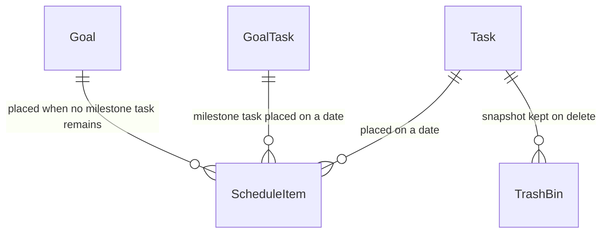

A task lives in the Tasks page until it is placed on a date, at which point a schedule item is created that points back at it; the two are then completed together. A single delete on the Tasks page leaves a snapshot in the trash before the task goes.

| **Record** | **What it holds, in plain words** | **Worth knowing** |
|---|---|---|
| Task | A to-do: title, notes, priority, optional due date and time, a label with colour, a recurrence pattern or an occurrence count, resource links, and an optional link to the Google task it came from. | Completing a recurring task creates its next occurrence; an occurrence task completes when its count is reached. A task with no due date is "in the library, unscheduled". |
| ScheduleItem | One time-boxed block on one date, tagged with its source (Google calendar, Calendar page event, task, custom block, goal or milestone task) and the record it came from. | Carries the three visibility flags — hidden from the grid, hidden from the to-do, removed from the app — so a dismissal never deletes anything (see [Daily To-Do](#daily-to-do)). Titles are copied at placement and not refreshed if the source is renamed. |
| TrashBin | A full copy of a task deleted singly from the Tasks page, with the moment it was deleted. | Only tasks are trashed today. Rows are shown for 24 hours after deletion and nothing purges older ones; the manual says 30 days (see [Where the story and the prototype differ](#where-the-story-and-the-prototype-differ)). Kept through both data wipes. |

#### Household

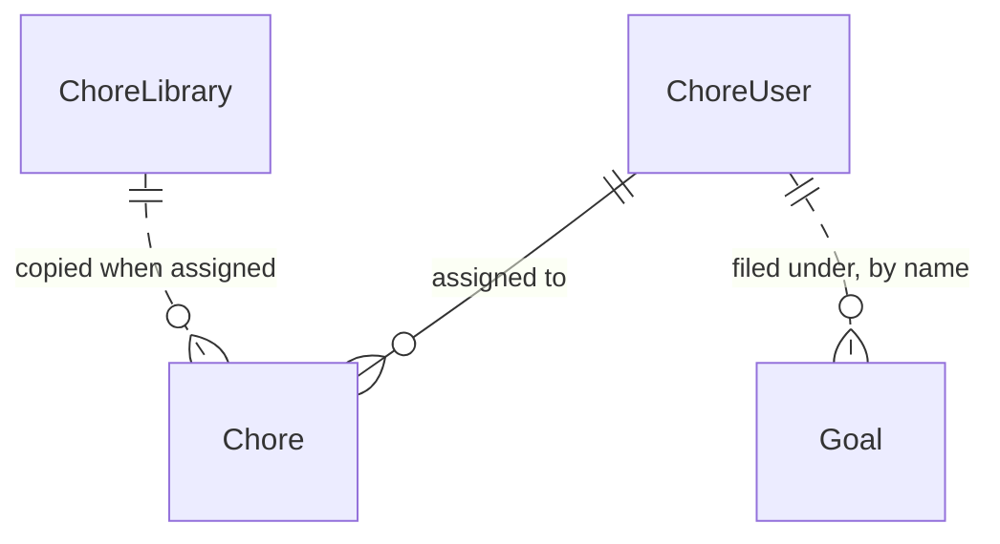

Household members are the assignees for chores and the member list for goals. Library entries are templates: assigning one copies it into a real chore for each chosen member.

| **Record** | **What it holds, in plain words** | **Worth knowing** |
|---|---|---|
| ChoreUser | A household member: name and colour. | Created from the Chores or Goals page. Deleting a member leaves their chores shown as "Unassigned" and their goals carrying the old name. Chores point at the member's id; goals point at the member's name. |
| Chore | One assigned chore: title, room, frequency, meal type, completion state and next due date. A meal is a chore whose type is Breakfast, Lunch, Dinner, Snack or Meal; for meals the room holds the meal slot. | One row per assignee. Completing a chore stamps the day and advances the due date by its frequency (daily, weekly, biweekly, monthly, quarterly, yearly; "as needed" has no next date). Every completed chore returns to pending at local midnight while the Chores page is open. |
| ChoreLibrary | A reusable, unassigned chore template (title, room, frequency, type). | Saved from the chore dialogs or the generator. Kept through both data wipes and through account deletion. |

#### Education records

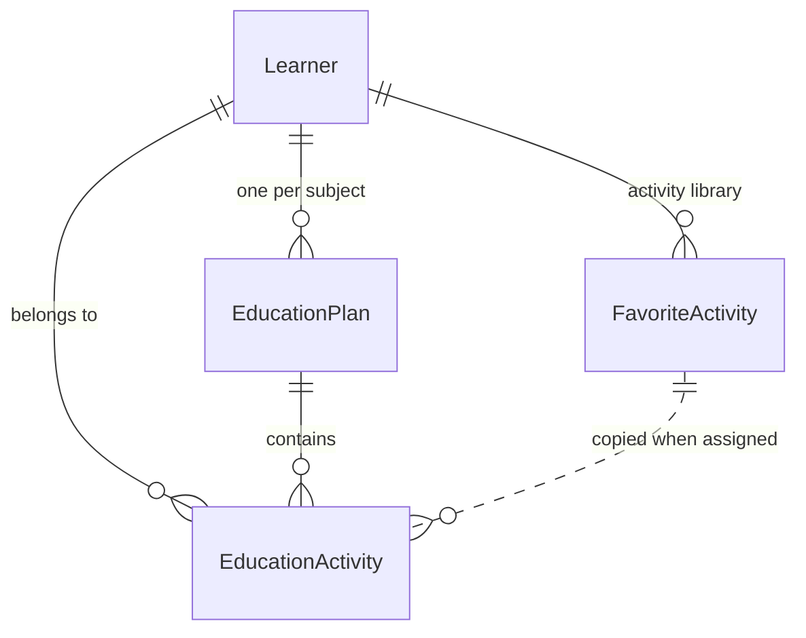

Each learner has one plan per subject, and activities live inside a plan. The activity library is a per-learner set of reusable activities that are copied into a plan when assigned.

| **Record** | **What it holds, in plain words** | **Worth knowing** |
|---|---|---|
| Learner | A person education is planned for: name, grade level, colour. | Deleting a learner deletes all of their plans and activities; their activity library is kept. Every learner receives the same colour today (the manual says a colour is chosen). |
| EducationPlan | One learner × one subject, with optional description, due date, materials and notes. | A plan status is declared but never set or shown. When no learners exist yet, a plan can be filed under the account owner's own name. |
| EducationActivity | An assignment or activity inside a plan: due date, frequency, days, notes, resource links and completion. | Repeating activities advance their due date on completion (monthly means +30 days here, +1 calendar month for chores). Also completable from the daily to-do. Can be turned into a goal (see [Goals](#goals)). |
| FavoriteActivity | The activity library: a reusable activity saved per learner, with duration and materials. | Kept when the learner is deleted and through both data wipes. |

#### Goal records

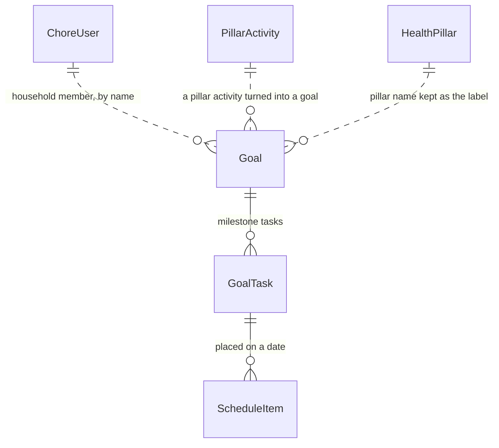

A goal's progress, status and archive flag are worked out from its milestone tasks. Goals can also be born elsewhere — from a pillar activity, from a daily evaluation, or from an education activity — and remember the pillar they came from as a label.

| **Record** | **What it holds, in plain words** | **Worth knowing** |
|---|---|---|
| Goal | An objective with a timeframe, a label with colour, a household member name, derived progress and status, and an archive flag. | Progress is the share of milestone tasks completed; reaching 100% archives the goal. Deleting a goal leaves its milestone tasks in place. The default member name differs by where the goal was created (the owner's name, "Self", "User" or the learner). |
| GoalTask | A milestone task under a goal, optionally repeated N times with a running count. | The oldest unscheduled, incomplete milestone task per goal is offered in the item library. Every change recomputes the parent goal. |

#### Wellness

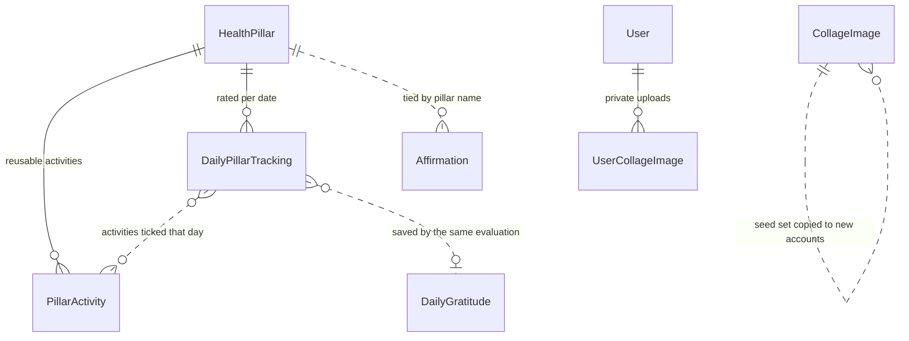

Thirteen pillars are seeded on first visit, each with five activities. A daily evaluation writes one rating row per pillar for that date plus one gratitude entry; affirmations, focal areas, the slideshow and the weekly review all read those rows.

| **Record** | **What it holds, in plain words** | **Worth knowing** |
|---|---|---|
| HealthPillar | One of the thirteen wellness pillars: name, the owner's own description, icon, colour, order and a hidden flag. | Exactly thirteen per account, seeded on the first Vision Board visit; no user-facing delete. A hidden pillar is skipped by the daily evaluation. Renaming a pillar does not update the name copied onto older rating rows. |
| PillarActivity | A reusable activity attached to a pillar, ticked during an evaluation or turned into a goal. | Five per pillar are seeded whenever a pillar has none. Also created from the AI suggestion picker. |
| DailyPillarTracking | The 1–5 rating of one pillar on one date, with notes and the activities ticked that day. | One row per pillar per date by convention; only rated pillars are written. "Delete this evaluation" removes every row for the date. |
| DailyGratitude | The gratitude entry for one date, written as the last step of the daily evaluation. | One per date by convention. Blank text on save leaves an existing entry untouched. |
| Affirmation | A short first- or second-person statement, optionally tied to a pillar, with a favourite flag. | One row per line typed in the compose box; numbering is stripped. Favourites sort first. |
| CollageImage | A shared image addressed by a public URL, with a hide-from-slideshow flag and a seed marker. | Images marked as seed are copied into any account that has none — on shell mount, on terms acceptance and daily. Removing a background from the Theme Editor library also deletes matching seed images. Deleted image ids are also remembered on the device. |
| UserCollageImage | A privately uploaded image with its file, a time-limited signed link that is refreshed as needed, and a slideshow opt-in. | Never seeded, never copied, and kept through both data wipes and account deletion. |

#### Routine and quotes

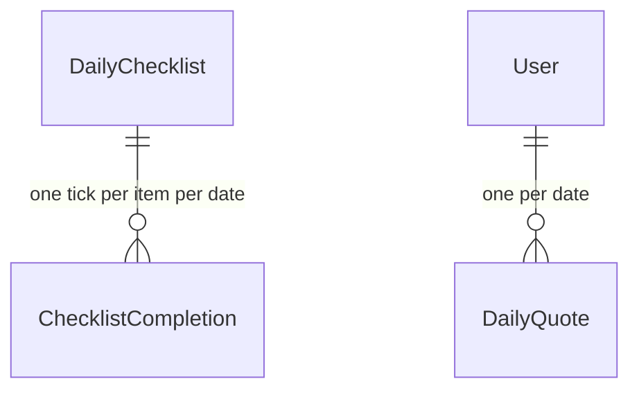

A checklist item is a routine that repeats every day; its ticks are kept per date so the week's n/7 counts can be drawn. A daily quote is one row per date, holding the quote and whatever the account owner wrote back.

| **Record** | **What it holds, in plain words** | **Worth knowing** |
|---|---|---|
| DailyChecklist | A repeating routine item in a time-of-day bucket (morning, afternoon, evening, anytime), with optional clock time, label, colour and manual order. | Deleting an item keeps its past ticks. Order is rewritten for a whole bucket after a drag. |
| ChecklistCompletion | The tick for one checklist item on one date. | One per item per date by convention; "resets each day" is simply a new date, not a purge. Never deleted by the account owner. |
| DailyQuote | The quote for one date with its author, the owner's reflection and a favourite flag. | One per date by convention; a morning job pre-creates it and the page fetches it on demand otherwise. The no-repeat window is the 200 newest quotes. Past quotes can be deleted one at a time or all at once, optionally keeping favourites. |

#### Links and preferences

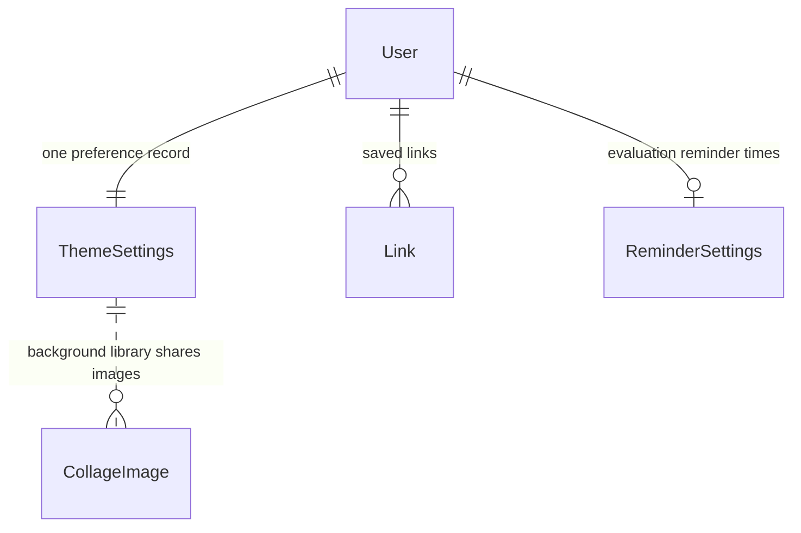

The preference record is the bag that carries theme, toggles, layout and sync choices across devices. Link categories, by contrast, are kept only on the device, so a link stores just the category's name.

| **Record** | **What it holds, in plain words** | **Worth knowing** |
|---|---|---|
| Link | A saved web address with a title, a category name and a thumbnail that is either an image link or a chosen icon. | Categories themselves (name, icon, colour) live on the device; a category deleted on the device clears that name from its links. Bookmark import creates one link per address. |
| ThemeSettings | The account preference record: colours, fonts, dark mode, opacity, radius, background and background library, randomise-on-load, greeting name, the three feature toggles, dashboard widget order, sync times and sources, calendars to auto-sync, the label for imported tasks, and the map of dismissed walkthroughs. | One per account by convention (the most recently updated row is read). Created lazily by whichever screen saves first. The imported-task label has no control that sets it 🟡. |
| ReminderSettings | The evaluation reminder switch and times. | Read by the Dashboard to decide whether to highlight an incomplete evaluation; nothing in the prototype writes it 🟡 (see [Reminders](#reminders)). |
| User | The platform sign-in record: email, name, role, and the two acceptance flags for terms and privacy. | Every other record is filed under this email. Role is "admin" or "user" and no screen branches on it; admin only gates seed and backfill jobs. |

#### Sync

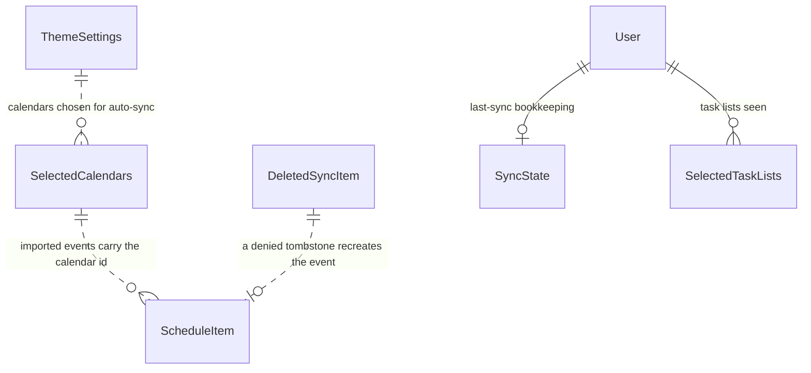

Google sync state is four small records plus two identifiers kept on the synced rows themselves (the Google event id on a schedule item, the Google task id on a task). See [Google sync](#google-sync).

| **Record** | **What it holds, in plain words** | **Worth knowing** |
|---|---|---|
| SelectedCalendars | One row per Google calendar the account has seen, with the import opt-in and the last import time. | Created when calendars are fetched; only the primary calendar starts selected. A calendar that Google no longer returns is switched off automatically. |
| SelectedTaskLists | One row per Google task list seen, with an opt-in flag. | The choice is saved; both imports currently read every list regardless (see [Where the story and the prototype differ](#where-the-story-and-the-prototype-differ)). |
| SyncState | When the last sync ran, which source, and which Google account. | One per account by convention. Removed by the synced-data wipe. |
| DeletedSyncItem | A tombstone for something that disappeared from Google, waiting for the account owner to allow or deny it. | The review screen reads and updates these; nothing in the prototype creates them 🟡 (see [Calendar](#calendar)). |

**What stays on the device.** These groups never follow the account to another browser:

- Lists the account owner typed: custom chore rooms and the rooms they deleted, custom education subjects, link categories with their icons and colours, the shared history of recent labels and colours.
- Daily Schedule conveniences: the recent custom-block and quick-task titles, pinned item library entries, and the active hours of the grid.
- Slideshow preferences: favourite and default ambient audio, the chosen spoken voice.
- Collage housekeeping: the ids of shared images the owner deleted, so they stay gone on reload.
- Print: the last note printed under the chore sheet.
- View state: last visited page, hide-completed switches for the checklist and the to-do, per-member collapse state in the Menu & Chores widget, the "task groups start collapsed" switch, the weather cache, and the first-generation walkthrough dismissals (Calendar, Chores, Daily Schedule, Education, Link Library, Vision Board).
- Fast-path copies of account values (last background, background library, randomise flag) so the first paint matches before the account loads.

None of these device-only lists is included in a print or email, and none survives a move to a new browser; the manual's promise that preferences follow the owner everywhere holds for theme and layout, not for these lists (see [Where the story and the prototype differ](#where-the-story-and-the-prototype-differ)).

## Where the story and the prototype differ

The landing page makes eight promises. Six are built as promised; two are partly built. The table below is the creator's checklist for the marketing copy.

| **Promise** | **What the prototype does** | |
|---|---|---|
| Smart Scheduling | Google Calendar import, a Calendar with month and week grids, an hour grid for one day, and an item library that drops tasks and milestone tasks onto it — all reading one table of schedule items. | ✅ |
| Task Management | Tasks with priority, due date and time, label, recurrence pattern or occurrence count; the next occurrence is created on completion; deleted tasks go to the trash. | ✅ |
| Chore Manager | One chore per assigned household member, eight frequencies, next due date from completion, a chore library, and an AI generator by room, age group, type and quantity. "Overdue chores are highlighted" on the Chores page is described only. | ✅ |
| AI Meal Planning | The chore generator offers Breakfast, Lunch, Dinner and Snack chips and age groups; meals land on the Menu tab by weekday and on the Menu & Chores widget. | ✅ |
| Vision Board | Thirteen seeded pillars, the daily evaluation wizard, the weekly review, affirmations, a collage with private uploads, and Auto and Custom slideshows. Reminders have a record and a Dashboard reader but no editor. | ✅ (reminders 🟡) |
| Google Integration | Calendar import and push are built. Google Tasks is import plus a due-date push and delete, not a full two-way mirror. Google Drive is named on the landing page and has no owner, reader or writer anywhere in the prototype. | 🟡 |
| Daily Reflection | One quote per date with a written reflection, favourites and history; affirmations composed or drafted; a slideshow with an affirmation overlay. "AI-generated quote" describes the fallback: an external quote source is tried first. | ✅ |
| Private & Secure | Every record is isolated per account owner; private collage uploads are served by time-limited links; Google tokens never reach the browser. "Encrypted storage" has no counterpart in the prototype. | 🟡 |

Beneath the headlines, the manual, the walkthroughs and the screens disagree with each other in places that the account owner would notice. The specs record both sides without choosing; these are the ones that are about product intent rather than internals.

| **Topic** | **What one part says** | **What the other part says** | |
|---|---|---|---|
| Google Drive | Landing page: sync Google Calendar, Google Tasks and Google Drive. | No Drive behaviour exists; the only trace is a connector revoked on account deletion. | D-1000 |
| Encrypted storage | Landing page: "encrypted storage". | Nothing in the prototype configures or claims encryption; the legal text promises "appropriate measures". | D-1001 |
| Google Tasks direction | Manual: tasks sync bidirectionally. | Built: import, a due-date push from the edit dialog, and delete. Completion, creation, title and label changes are not pushed. | D-215 |
| Auto-sync schedule and scope | Settings lets the owner choose sync times per day, calendars to auto-sync and task lists to auto-sync. | The scheduled run happens once a day at noon UTC over the calendars marked selected, and both imports read every task list. | D-204 |
| Import window | Manual and walkthrough: events "for the past 30 days and forward". | Manual import reads 90 days back and 60 forward; the scheduled run reads 30 days back with no forward limit. | D-201 |
| Chores and education on the schedule | Manual: the Daily Schedule "automatically pulls in" chores and education activities due that day. | Nothing creates a chore- or education-sourced schedule item; the grid shows counts and quick links instead. | D-206 |
| Trash retention | Manual: trashed tasks can be restored "within 30 days". | Settings shows and says 24 hours; nothing removes older rows. | D-486 |
| What counts as a focal area | Manual, affirmations, slideshow: a pillar rated 3 or below. | Dashboard widget: the three lowest of the latest evaluation with no threshold; Weekly Review: the three lowest averages. | D-703 |
| Evaluation reminders | Manual: set daily reminders "using the bell icon"; the record describes push notifications. | No bell, no editor and no sending; the only reader gates the Dashboard highlight. | D-704 |
| Feature toggles and the Dashboard | Manual: turning a feature off hides its Dashboard widget. | The Dashboard renders every widget regardless; toggles hide sidebar entries and the schedule's quick links. | D-120 |
| Task status | Manual: a status circle cycles Pending → In Progress → Completed. | Tasks toggle between pending and completed; "in progress" is declared but never set. | D-453 |
| Goal progress | Manual: a 0–100% slider to update progress by hand. | Progress is derived from milestone tasks; there is no slider. | D-609 |
| Milestone task frequency | Manual: milestone tasks have their own frequency and reset on their day. | Every milestone task is written as "once" and nothing resets it. | D-611 |
| Deleting a Google event | Manual: deleting an event that came from Google "will also be deleted there". | The dialog offers "Delete here only" and "Delete from Google too" as separate choices. | D-501 |
| Editing a Google event | Manual: Google events "cannot be fully edited — edit them in Google Calendar directly". | The Calendar edits title, date, times and notes on any event and pushes the change when the event is linked. | D-502 |
| The daily quote | Landing page and manual: the quote is AI-generated. | An external quote source is tried first (up to eight attempts avoiding the 200 most recent); the model is the fallback. | D-304 |
| Custom slideshow contents | Affirmations card and manual: pick which affirmations go into the Custom slideshow. | Launching Custom plays every saved affirmation; from the Dashboard there is no picker at all. | D-750 |
| Account deletion scope | Deletion dialog: removes "all your data". | Sixteen record types are deleted; pillars, ratings, gratitude, affirmations, collage images, libraries and the trash are left. | D-333 |
| "Delete Synced Data" | Settings copy: removes synced Google events and tasks; Google data unchanged. | Every schedule item is deleted, including events and custom blocks made in the app; only Google-linked tasks go. | D-853 |
| Preferences across devices | Manual: layout and preferences are saved across all devices. | Theme, toggles and layout follow the account; chore rooms, subjects, link categories and label history stay on the device, and the Dashboard walkthrough is checked per device. | D-801 |
| Saving the theme | Manual: theme changes are saved automatically and applied instantly. | Changes apply live on screen but reach the account only on "Save Theme". | D-921 |
| Which day is "today" | Most screens use the device's local date. | The Chores and Education pages and next-due calculations use the UTC date, so late evenings can differ. | D-100 |
| Completing a chore from the to-do | Chores page: completion stamps the date and advances the next due date. | The daily to-do marks the chore completed and nothing else. | D-003 |
| The "+" on the Daily Schedule | Manual: adds a custom time block with title, times, colour and notes. | Opens a Quick Task popover that creates a task from a title alone; custom blocks come from the item library's Recent tab. | D-401 |
| The product's name | Landing page and terms gate: "The Daily Dash". | Sidebar and manual: "Dash it, Dash it ALL!"; the browser tab and platform config use two more names. | D-952 |

## Decisions we need from you

These questions shape the product as a whole; the single-feature ones live in each feature's "To confirm" block. Each is drawn from the open-questions register; the id is the place to look for the evidence.

**Household and people**

- Are household members and learners meant to stay as names inside one account, or is a shared household with separate sign-ins a direction you want? Today every record is single-account and goals point at a member by name; that choice decides the whole account model. (Q-1001)
- When a chore is ticked from the daily to-do, is it meant to advance to its next due date the way the Chores page does? Today only the Chores page advances it. (Q-402)

**Time and today**

- Do you want one definition of "today" — the device's local date — everywhere? Chores, Education and next-due calculations use the UTC date today, so a late-evening tick can land on tomorrow. (D-100)
- Is the trash window 24 hours or 30 days, and are older entries meant to be removed rather than merely hidden? (Q-462)
- Is "midnight" for the new daily quote meant to be the account owner's local midnight, or a fixed morning hour? (D-116)

**The schedule**

- Which flow is meant to put chores and education activities onto the Daily Schedule — the manual's "auto-population"? Nothing creates those items today, though the to-do already knows how to complete them. (Q-203)
- When a goal has no milestone tasks left, the goal itself can be placed on the grid, but its to-do row has no checkbox. Is scheduling the goal itself intended? (Q-404)
- Is a task meant to be steppable through "in progress", as the manual describes, or is pending/completed the model? (Q-453)

**Google**

- Google Drive is named on the landing page. Is Drive part of the product, and if so for what? (D-1000)
- Are the per-account sync times and the "calendars to auto-sync" choice meant to drive the scheduled import? Today it runs once a day at noon UTC over the calendars marked selected. (Q-202)
- Is the daily sync meant to run for every account, or as one owner-scoped run? The scheduled job syncs the identity it runs as. (Q-205)
- Which sync run is meant to write tombstones for review, and for which sources? The review screen exists; nothing feeds it. (Q-201)
- Is the tasks-to-calendar push (every open task becomes a calendar event) a live feature awaiting a button, or superseded? (Q-207)

**Wellness**

- Where is the account owner meant to set evaluation reminders, and what is a reminder meant to do beyond highlighting the Dashboard widget — a notification, an email, nothing more? (Q-702)
- Which reading of "focal area" is the product's: rated 3 or below, the three lowest, or the lowest weekly averages? Five surfaces answer differently today. (D-703)
- Custom slideshow: does the owner pick affirmations and images, as the manual says, or does Custom play everything saved? (D-750)
- Whose images form the seed set that every new account starts with? The prototype copies every image marked as seed from any account. (Q-004)

**Goals**

- Is goal progress meant to be derived from milestone tasks only, or also adjustable by hand as the manual's slider suggests? (D-609)
- Are milestone tasks meant to carry their own frequency and reset on their day? (D-611)
- Which Goals export is the product's: the per-timeframe card, the unbound whole-page builder, or both? (Q-311)

**Paper and email**

- Is print and email meant to be on every Dashboard widget, or only on the surfaces that carry it today? The generic card has the handlers and no buttons. (Q-310)
- Is emailing ever meant to reach someone other than the signed-in owner? The Quotes walkthrough says "to yourself or others"; every email goes to the owner. (Q-901)

**AI**

- Is "AI-generated quote" meant to describe the product, or is the external quote source the intended first choice with the model as fallback? (Q-300)

**Privacy and the account**

- What does "encrypted storage" refer to — platform-level storage encryption, transport encryption, or a commitment still to be backed? (D-1001, Q-1000)
- Is account deletion meant to cover every record the account owns? Today it covers sixteen record types and leaves pillars, ratings, gratitude, affirmations, collage images, libraries and the trash. (Q-333, Q-211)
- Is a visible sign-out intended? A sign-out function exists and no control calls it. (Q-331)
- Which contact address goes on the legal pages? They carry a placeholder while the manual publishes a personal address. (Q-970)

**Identity and first run**

- Which of the five names is the product's — for the browser tab, the installed app and the sidebar? (Q-952)
- Is the Dashboard walkthrough meant to follow the account, like Tasks, or the device, like Calendar? (Q-960)
- Do chore rooms, custom subjects, link categories and label history belong to the account, so they follow the owner to a second device, or is device-only their intended home? (D-801)

## Deeper reading

Every part of this document rests on the spec corpus in `docs/specs`. This map says where to go next.

| **Part of this document** | **Where the detail lives** |
|---|---|
| Start here | [specs/README.md](specs/README.md) — reading order, evidence tags, id conventions |
| The vision | [specs/00-overview/product-vision.md](specs/00-overview/product-vision.md), [specs/00-overview/constitution.md](specs/00-overview/constitution.md), [specs/00-overview/user-journeys.md](specs/00-overview/user-journeys.md), [specs/00-overview/legal-copy.md](specs/00-overview/legal-copy.md) |
| A day with The Daily Dash | [specs/00-overview/user-journeys.md](specs/00-overview/user-journeys.md) |
| The system at a glance | [specs/00-overview/feature-map.md](specs/00-overview/feature-map.md), [specs/10-architecture/system-overview.md](specs/10-architecture/system-overview.md), [specs/10-architecture/cross-feature-matrix.md](specs/10-architecture/cross-feature-matrix.md) |
| The schedule hub | [specs/10-architecture/schedule-hub.md](specs/10-architecture/schedule-hub.md) |
| Google in both directions | [specs/10-architecture/google-sync.md](specs/10-architecture/google-sync.md), [specs/10-architecture/external-services.md](specs/10-architecture/external-services.md) |
| What happens on its own | [specs/10-architecture/automations.md](specs/10-architecture/automations.md), [specs/10-architecture/time-and-date-semantics.md](specs/10-architecture/time-and-date-semantics.md) |
| Dashboard | [specs/20-features/dashboard/spec.md](specs/20-features/dashboard/spec.md) |
| Daily Schedule and Daily To-Do | [specs/20-features/daily-schedule/spec.md](specs/20-features/daily-schedule/spec.md), plus `daily-todo.md`, `time-grid.md`, `item-library.md` beside it |
| Calendar | [specs/20-features/calendar/spec.md](specs/20-features/calendar/spec.md), plus `deleted-item-review.md` |
| Tasks | [specs/20-features/tasks/spec.md](specs/20-features/tasks/spec.md), plus `recurrence.md`, `google-tasks.md` |
| Daily Checklist | [specs/20-features/daily-checklist/spec.md](specs/20-features/daily-checklist/spec.md) |
| Weather | [specs/20-features/weather/spec.md](specs/20-features/weather/spec.md) |
| Chores and Meal planning | [specs/20-features/chores/spec.md](specs/20-features/chores/spec.md), plus `meal-planning.md`, `chore-library.md`, `ai-generator.md` |
| Education | [specs/20-features/education/spec.md](specs/20-features/education/spec.md), plus `ai-activities.md`, `activity-library.md` |
| Goals | [specs/20-features/goals/spec.md](specs/20-features/goals/spec.md), plus `milestone-tasks.md` |
| Vision Board, Health pillars, Daily evaluation, Weekly review, Affirmations, Collage, Slideshow, Reminders | [specs/20-features/vision-board/spec.md](specs/20-features/vision-board/spec.md), plus `health-pillars.md`, `daily-evaluation.md`, `weekly-review.md`, `affirmations.md`, `collage.md`, `slideshow.md` |
| Daily Quotes | [specs/20-features/quotes/spec.md](specs/20-features/quotes/spec.md) |
| Theme Editor | [specs/20-features/theme-editor/spec.md](specs/20-features/theme-editor/spec.md) |
| Link Library | [specs/20-features/links/spec.md](specs/20-features/links/spec.md) |
| Settings | [specs/20-features/settings/spec.md](specs/20-features/settings/spec.md), plus `sync-configuration.md`, `trash-bin.md`, `data-management.md` |
| Onboarding | [specs/20-features/onboarding/spec.md](specs/20-features/onboarding/spec.md) |
| User Manual | [specs/20-features/user-manual/spec.md](specs/20-features/user-manual/spec.md) |
| App shell | [specs/20-features/app-shell/spec.md](specs/20-features/app-shell/spec.md), [specs/10-architecture/shared-interactions.md](specs/10-architecture/shared-interactions.md) |
| Accounts and privacy | [specs/10-architecture/auth-and-account.md](specs/10-architecture/auth-and-account.md), [specs/00-overview/legal-copy.md](specs/00-overview/legal-copy.md) |
| Smart assistance | [specs/10-architecture/ai-services.md](specs/10-architecture/ai-services.md) |
| Print and email | [specs/10-architecture/export-print-email.md](specs/10-architecture/export-print-email.md) |
| Housekeeping | [specs/10-architecture/admin-operations.md](specs/10-architecture/admin-operations.md) |
| What the app remembers | [specs/10-architecture/domain-model.md](specs/10-architecture/domain-model.md), [specs/10-architecture/data-model/README.md](specs/10-architecture/data-model/README.md) and the entity sheets beside it, [specs/10-architecture/preferences.md](specs/10-architecture/preferences.md) |
| Where the story and the prototype differ | [specs/90-traceability/discrepancy-log.md](specs/90-traceability/discrepancy-log.md), [specs/90-traceability/claims-audit.md](specs/90-traceability/claims-audit.md) |
| Decisions we need from you | [specs/90-traceability/open-questions.md](specs/90-traceability/open-questions.md), [specs/90-traceability/reimplementer-questions.md](specs/90-traceability/reimplementer-questions.md) |
| Which spec owns which part of the prototype | [specs/90-traceability/coverage-matrix.md](specs/90-traceability/coverage-matrix.md) |
| Glossary | [specs/00-overview/glossary.md](specs/00-overview/glossary.md) |

The specs describe the prototype as it is, and every statement in them carries an evidence tag and a citation into the prototype. Every statement in this document traces back to them.

## Glossary

The canonical vocabulary, drawn from the spec glossary. Where a screen uses a different word, the entry says so.

- **account map** — The record, inside the account preference record, of which walkthroughs have been dismissed on the newer pages.
- **account owner** — The single signed-in person who owns all the data in an account. One account, one owner.
- **account preference** — A setting that follows the account to any device: theme, toggles, widget order, greeting name, sync choices.
- **active hours** — The first and last hour shown on the Daily Schedule grid, kept on the device.
- **activity** — An education item inside a plan, either an assignment or an activity, with a frequency and completion.
- **activity library** — Reusable education activities saved per learner, copied into a plan when assigned.
- **admin** — A sign-in whose role is "admin"; may run seed, backfill and clean-up jobs. Not a persona of the product.
- **affirmation** — A short first- or second-person motivational statement, optionally tied to a pillar, with a favourite flag.
- **affirmation queue** — The shuffled order the slideshow draws affirmations from; nothing repeats until the whole set has played.
- **allowlist** — The platform-level list of registered sign-ins; a visitor not on it sees "Access Restricted".
- **archive** — A goal marked archived, and the Goals tab that lists archived and completed goals.
- **background library** — The account owner's saved background images, shown as "My Backgrounds" in the Theme Editor, mirrored on the device.
- **batch mode** — A list mode with per-row checkboxes and an action bar, entered with "Select" on Tasks and Checklist; the Chores page calls it "bulk mode".
- **carry-over item** — A view-only block drawn at the top of a day for a previous-day schedule item that ran past midnight.
- **chore library** — Reusable, unassigned chore templates saved from the chore dialogs or the generator.
- **collage** — The set of vision-board images: shared images plus private images. "Gallery" is the Collage card's image grid.
- **connector** — A stored Google connection; Calendar and Tasks are connected separately.
- **custom block** — A schedule item typed straight into the item library's Recent tab with a start time and duration; it has a backing task labelled "Custom".
- **daily evaluation** — The wizard that rates every visible pillar 1–5, ticks activities, and records gratitude for a date.
- **daily quote** — The one quote per account per date, with an optional reflection and a favourite flag.
- **daily to-do** — The list on the Daily Schedule page made of the selected date's schedule items plus tasks due that date.
- **Dash it, Dash it ALL!** — The product's in-app name, shown in the sidebar and the manual.
- **day-sheet** — A printed or emailed planning view built for the fridge: the chore sheet per member, the meal sheet by weekday, the education sheet, the day's schedule and to-do.
- **default backgrounds** — The built-in background images offered on the Theme Editor page.
- **derivation** — Working out a goal's progress, status and archive flag from its milestone tasks after every change.
- **device-local preference** — A setting or list kept only in the browser it was made in; it does not follow the account.
- **dismiss** — Hide a schedule item from one view without deleting it: from the grid, from the to-do, or (for Google events) from the app. Together these are the three visibility flags.
- **dismissal key** — The name under which a walkthrough's dismissal is remembered on the device and, for newer pages, in the account map.
- **due-task row** — A view-only row in the daily to-do for a task due that date that has no task-sourced schedule item that day.
- **evaluation date** — The date a daily evaluation targets; today unless chosen with the calendar button.
- **event** — A schedule item that came from Google Calendar or was created on the Calendar page.
- **export** — Print or email a formatted view. Email always goes to the signed-in owner.
- **feature toggle** — The three Settings switches that hide Chores, Education or the Vision Board from the sidebar.
- **focal area** — A pillar needing attention. The manual, the affirmations card and the slideshow use "rated 3 or below"; the Dashboard widget shows the three lowest ratings; the Weekly Review shows the three lowest averages. Some screens label it "focus area".
- **frequency** — How a chore, education activity or milestone task repeats.
- **goal** — An objective with a timeframe, a label, a household member, and progress derived from its milestone tasks.
- **gratitude** — The one free-text entry per date written at the end of the daily evaluation.
- **household member** — A named person with a colour that chores are assigned to and goals are filed under. A record, not a sign-in. The Goals screen calls them "family members".
- **import** — Sync from Google into the app.
- **item library** — The Daily Schedule side panel offering unscheduled tasks, the next milestone task per goal, recent custom entries, and the Chores and Edu quick links.
- **label** — A free-text, colour-coded tag on a task, checklist item or goal, with a shared recent-labels history. Some screens call it "category".
- **learner** — A named person with a grade level and colour that education is planned for. A record, not a sign-in.
- **link category** — A device-local grouping for links with an icon and colour.
- **meal** — A chore whose type is Breakfast, Lunch, Dinner, Snack or Meal; shown on the Menu, hidden from the chore list.
- **meal slot** — The meal time (Breakfast, Lunch, Dinner, Snack) a meal is planned for; anything else shows as "Other".
- **merged row** — One Chores-tab row standing for several identical chores assigned to different members, listing every assignee.
- **milestone task** — A step under a goal, optionally with an occurrence count. Some screens say "goal task".
- **next occurrence** — The new pending task created when a recurring task is completed.
- **now line** — The red current-time marker on today's Daily Schedule grid.
- **occurrence** — How many times a task or milestone task must be completed before it counts as done.
- **occurrence task** — A task or milestone task that completes only after N ticks.
- **orphan** — A schedule item whose source record no longer exists; removed by the Daily Schedule's clean-up pass.
- **past quotes** — The newest fifty daily quotes listed on the Quotes page; the manual calls it "Quote History".
- **pillar** — One of the thirteen wellness areas the account owner rates in a daily evaluation.
- **pillar activity** — A reusable activity attached to a pillar, ticked during an evaluation or turned into a goal.
- **plan** — An education plan: one learner and one subject, holding that subject's activities.
- **preset** — A named ambient audio track in the slideshow.
- **private image** — A collage image uploaded privately and shown through a time-limited link.
- **push** — Sync from the app out to Google.
- **queued goal** — A goal added "to plan" during a daily evaluation and written when the evaluation completes.
- **quick task** — A task created from the item library's "+" with the label "Quick Task".
- **recent history** — The device-local list of recent custom-block titles and durations on the item library's Recent tab.
- **recurrence pattern** — How a task repeats: daily, weekly, biweekly, monthly, specific days of the week, or a number of occurrences.
- **reflection** — The account owner's written response to a daily quote.
- **remove from app** — Mark a Google-sourced schedule item as gone locally while the Google event survives.
- **review week** — The Sunday–Saturday week the Weekly Review covers.
- **room** — Where a chore belongs. For meals the same slot holds the meal slot.
- **schedule item** — Any time-boxed block on a date, with a source type. "Block" is the drawn shape on the grid.
- **seed row** — A record created automatically on first visit or by a scheduled job: the thirteen pillars, five activities per pillar, the default collage images.
- **seed set** — The shared images marked as defaults that are copied into an empty account's collage.
- **selected date** — The single day the Daily Schedule shows, or whose events the Calendar's side panel lists.
- **shared image** — A collage image addressed by a public web address; the manual says "public image".
- **slideshow** — The full-screen image and affirmation player, in Auto-Generated or Custom mode.
- **source type** — Where a schedule item came from: Google calendar, Calendar page event, task, education, chore, goal, or custom.
- **subject card** — The Education card for one learner and one subject.
- **Suggested Goals panel** — The per-pillar list in a daily evaluation step that offers each pillar activity as a goal.
- **sync sources** — The account-wide choice of Calendar and/or Tasks made in the "What would you like to sync?" dialog.
- **sync window** — The date range an import reads: 90 days back and 60 forward by hand; 30 days back onward on the schedule.
- **synthetic row** — A view-only row composed on screen and never stored: due-task rows and carry-over items.
- **The Daily Dash** — The product's name on the landing page and the terms gate.
- **timeframe** — A goal's horizon: daily, weekly, monthly, annual, 3-year, 5-year, or occurrences.
- **time-of-day bucket** — The checklist grouping morning, afternoon, evening, anytime.
- **today** — The local calendar date on the account owner's device, unless a spec says otherwise.
- **tombstone** — A record of something that disappeared from Google, waiting for the account owner to allow or deny it.
- **trash** — Where deleted tasks wait for restore.
- **walkthrough** — A first-visit dialog that introduces a page; reopened with the "Guide" button. This document calls it the guided introduction.
- **weekly count** — For a checklist item, the number of days in the current week with a tick, shown as n/7.
- **weekly review** — The Vision Board tab that reads the week's ratings and checklist ticks: lowest averages, a seven-day chart, and a daily breakdown.
- **widget** — A Dashboard card that can be reordered.
- **write-through** — Completing a schedule item also completes the task, chore or activity it came from, and the other way round.
