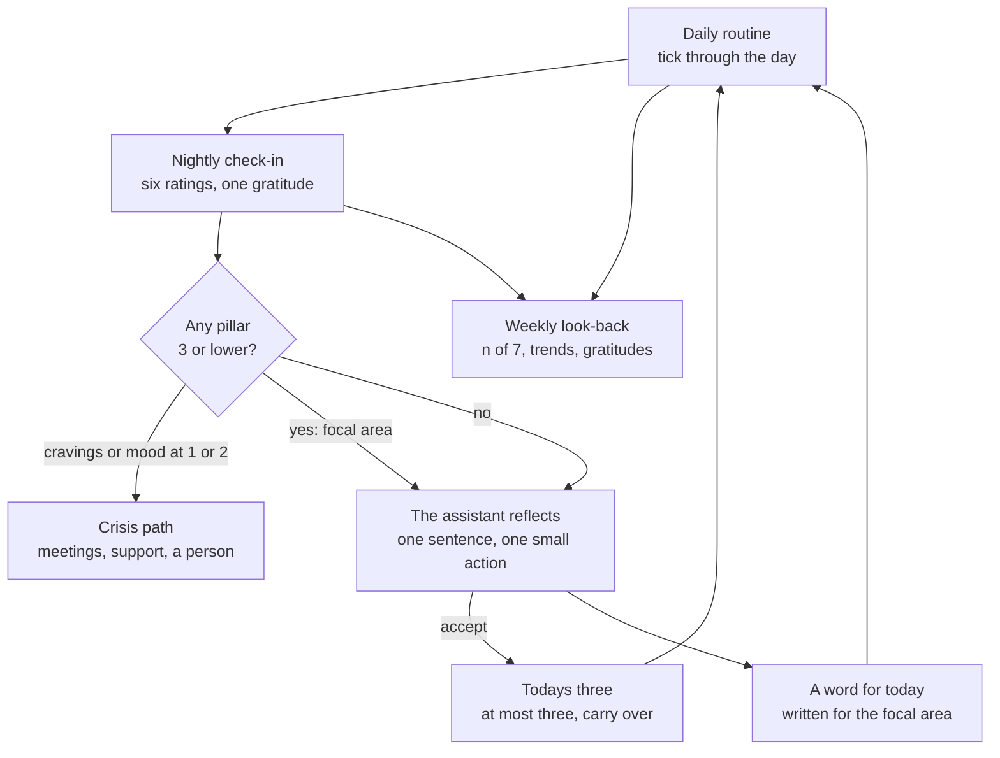
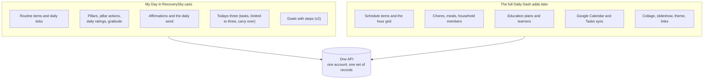

# My Day — bringing The Daily Dash to RecoverySky

*A vision document for the first implementation of The Daily Dash: a small, simple, AI-assisted "organise your day" feature inside the RecoverySky app, built on the new shared API that will later carry the full Daily Dash.*

Prepared 21 September 2026 · Working feature name: **My Day** · Companion documents: the [Creator Vision](creator-vision-doc.md) and [Creator Vision Reference](creator-vision-ref.md) for The Daily Dash, and the [specification corpus](specs/README.md).

**Contents**

- [Where this comes from](#where-this-comes-from)
- [The person we are building for](#the-person-we-are-building-for)
- [The idea](#the-idea)
- [Design principles](#design-principles)
- [The five pieces of My Day](#the-five-pieces-of-my-day)
- [The recovery pillars](#the-recovery-pillars)
- [How the assistant helps](#how-the-assistant-helps)
- [A day with My Day](#a-day-with-my-day)
- [The loop](#the-loop)
- [What we leave out and why](#what-we-leave-out-and-why)
- [Phasing](#phasing)
- [One API for both apps](#one-api-for-both-apps)
- [What success looks like](#what-success-looks-like)
- [Open questions](#open-questions)
- [Glossary](#glossary)

---

## Where this comes from

The Daily Dash is a large idea: a personal and household command centre with a daily schedule, tasks, chores, meal plans, homeschool plans, goals, a thirteen-pillar wellness practice, and Google sync. It is documented in full in the companion documents. This document is about a much smaller first step, prompted by this brief from the creator:

> This idea is very large, but I also think very good — especially for addicts seeking recovery, as our existing app product exists for in recoverysky.app. Addicts new to recovery absolutely need something to help them start organizing their lives, right? That's a HUGE feature in my book. But DailyDash is way too big for an addict, I think. They need simple — elegant — AI very helpful. What core aspects of DailyDash do you propose we add to RecoverySky App as a new feature?
>
> Now, just so you know, we will develop the full backend functionality and serve it from a new API. We will also eventually build a full-blown implementation of DailyDash that will use the same API. We are just starting small with RecoverySky app.

The short answer: yes, and it is more than a feature. For someone in their first weeks of recovery, a structured day is not a productivity nicety; it is one of the oldest relapse-prevention tools there is. Treatment programmes hand people a printed daily schedule on the way out the door for exactly this reason. The question is not whether The Daily Dash belongs in RecoverySky but which twenty percent of it carries eighty percent of that value without overwhelming someone whose ability to plan is, for the moment, badly worn down.

This document proposes that twenty percent, expands it into a coherent feature, and shows how it stays a strict subset of the full Daily Dash so that nothing built for RecoverySky is thrown away later.

## The person we are building for

**Someone in early recovery** — the first days, weeks and months after stopping. Some are fresh out of detox or residential treatment; some are in sober living or an intensive outpatient programme; some are doing it at home with meetings and a sponsor. What they have in common matters more than what separates them:

- **Executive function is depleted.** Planning, sequencing and starting tasks are precisely the capacities that early recovery makes hardest. A blank to-do list is not a tool for this person; it is a wall.
- **Unstructured time is dangerous.** Boredom, isolation and the empty afternoon are where cravings live. "What do I do at 3pm?" is a safety question.
- **The basics slip.** Sleep, meals, movement, medication, showing up. Recovery programmes teach the HALT check — hungry, angry, lonely, tired — because those four states are where relapse starts, and all four are prevented by routine.
- **Shame is already at maximum.** Anything that scores, streaks, or scolds does harm. A missed day must be a number, never a failure.
- **Phone access is often limited.** Treatment centres, sober living houses, court programmes and re-entry all restrict or remove phones. Paper still matters.
- **They are told to do a nightly inventory.** The tenth step, the evening review, the gratitude list — most programmes ask for a short honest look at the day, every day. Almost nobody has a good tool for it.

RecoverySky already meets this person for meetings, community and support. My Day meets them at 7am and 10pm, on the ordinary days between.

## The idea

**In one sentence.** My Day gives a person in early recovery a simple routine to fall back on, a two-minute honest look at each day, one or two things to do tomorrow instead of forty, and something kind to hear when a day is hard — with an assistant that drafts all of it and never saves a word without their say-so.

**In thirty seconds.** You open My Day and see today's routine: morning, afternoon, evening, a few small things you tick as you go. The assistant built it with you in a three-question conversation on day one; you can change anything. At the top is one line written for you, for the thing you rated lowest last night. Tonight, you rate six parts of your day from one to five, write one thing you are grateful for, and the assistant reflects one sentence back and offers one small thing for tomorrow. On Sunday you see the week: how many days you did each routine, which parts of life are climbing and which are slipping, ready to show your sponsor or counsellor. Nothing counts streaks. Nothing scolds. Everything can be printed.

**What makes it different from a habit app.** It is built for a specific person in a specific season, inside the app they already use for meetings and support, with a crisis path one tap away. The assistant is a helper that drafts and reflects, never a coach that judges. And it grows: the same account, the same records and the same API become the full Daily Dash when the person is ready for more of life.

## Design principles

Most of these come directly from the constitution The Daily Dash already embodies; they happen to be exactly right for a vulnerable user. Two are new.

| # | Principle | What it means in My Day |
|---|---|---|
| 1 | **The assistant suggests; the person approves** | Nothing the model writes — a routine, an affirmation, a suggested action — is saved until the person taps to accept it. There is no autopilot. |
| 2 | **Today is the unit of work** | There is no backlog screen and no "all tasks" view. One day at a time is the architecture, not a slogan. |
| 3 | **Counts, not streaks** | Progress is shown as "5 of 7 this week", never "47-day streak — broken". A missed day is a number. |
| 4 | **Dismissal is not deletion** | Skipping a routine item hides it for today and it returns tomorrow. Nothing is lost by having a bad day. |
| 5 | **Paper is first-class** | Today's routine and the weekly look-back print and email cleanly, for the person without a phone and for the counsellor's desk. |
| 6 | **Two minutes, one thumb** | Every daily interaction is designed to finish in under two minutes, one-handed, without typing unless the person wants to. |
| 7 | **Kind by default** | Copy never uses "failed", "missed", "behind" or "overdue". The assistant's tone is warm, brief and specific. |
| 8 | **A crisis path is always one tap away** *(new)* | Rating cravings or mood at the low end, or typing anything that reads as danger, surfaces RecoverySky's meetings and support immediately. The assistant never plays counsellor. |
| 9 | **Everything grows into The Daily Dash** *(new)* | Every record My Day creates is a Daily Dash record. Nothing is a dead end. |

## The five pieces of My Day

Each piece is lifted from a part of The Daily Dash that already works, simplified for this person, and given exactly one moment where the assistant helps.

### Daily routine

*Something to fall back on when the day goes sideways.*

**Lifted from:** the Daily Checklist — items in four time-of-day buckets (morning, afternoon, evening, anytime), ticked per date, with a "days this week" count.

**What it is.** The routine is a short list of the things that hold a day together: make the bed, take medication, eat breakfast, go to the noon meeting, call your sponsor, lights out by ten. Each item lives in a time-of-day bucket and can carry an optional clock time. Ticking is a single tap; the tick belongs to today and the list is fresh tomorrow. Each item quietly shows how many days this week it was done.

**What you can do.** Start from a template ("Just out of treatment", "Working days", "Weekend", "Sober living house") or from the assistant's draft; add, rename, move and remove items; give an item a time; tick and untick; skip an item for today without deleting it; reorder by dragging; print or email today's routine as a one-page day-sheet.

**Rules worth knowing.** A routine item is never "overdue"; it is either ticked today or not. The weekly count is "n of 7" for the current week and resets every Sunday. Five to ten items is the sweet spot; the app gently suggests trimming past twelve.

**The assistant's moment — the routine builder.** On first use, and any time the person asks, the assistant runs a three-question conversation: *When do you usually wake and sleep? What is fixed in your week — meetings, work, appointments, medication times? What are you trying to take care of right now?* From the answers it drafts a routine in the four buckets. The person edits and approves; nothing is saved before that.

### Nightly check-in

*Two minutes of honesty, then rest.*

**Lifted from:** the daily evaluation — rate each pillar from one to five, add a note, end with one gratitude.

**What it is.** Each evening the person rates six recovery pillars (see [The recovery pillars](#the-recovery-pillars)) with a single tap each, optionally adds a sentence, and writes one thing they are grateful for. That is the whole check-in. A pillar rated three or lower becomes a **focal area** — the thing the next morning's word and tomorrow's suggested action are about.

**What you can do.** Rate, note, and add gratitude; edit tonight's check-in until midnight; look back at any past day; see the focal areas from last night on the home screen; skip a night without consequence.

**Rules worth knowing.** One check-in per date. The focal-area threshold is a rating of three or lower — the same rule The Daily Dash uses everywhere. A low rating on cravings or mood surfaces the crisis path before anything else.

**The assistant's moment — the reflection.** After the ratings, the assistant reflects one sentence back ("Sleep and food were low today, but you made the meeting — that is the thing that carries.") and offers **one** small action for tomorrow, drawn from the lowest pillar. The person can accept it into Today's three, change it, or dismiss it.

### Todays three

*One or two things, not forty.*

**Lifted from:** Tasks — radically limited. No priorities, no labels, no recurrence, no backlog.

**What it is.** A list of at most three things for today, beyond the routine. "Call the pharmacy." "Ask about the Thursday meeting." "Buy groceries." If a thing is not done by the end of the day it carries over to tomorrow; it does not accumulate into a list of shame.

**What you can do.** Add up to three; tick; carry over; drop. Accept the assistant's suggestion from last night's reflection with one tap. Print with the routine.

**Rules worth knowing.** Three is a hard limit; a fourth cannot be added until one is done or dropped. Carried-over items keep their place. Ticking a thing that came from a suggested action marks the suggestion as taken, so the assistant learns what actually lands.

**The assistant's moment.** Each morning it proposes up to three, built from last night's reflection and any routine item that has gone untouched for several days. The person approves or ignores.

### A word for today

*Something kind to hear, written for where you are.*

**Lifted from:** daily quotes and affirmations steered by low pillars.

**What it is.** One line at the top of the home screen every morning: an affirmation written for the pillar the person rated lowest last night, or a general one on days with no check-in. It is short, first-person, and specific ("I can eat breakfast before I decide anything else today.").

**What you can do.** Read it; keep it (saved affirmations build a personal list); ask for another; write your own; turn the feature off.

**Rules worth knowing.** One word per day, generated once and cached, so it does not change on refresh. Kept affirmations reappear on later days for the same pillar. No quotes are pulled from copyrighted recovery literature; everything is generated or written by the person.

**The assistant's moment.** Writes the line for the focal area, in the person's own preferred tone (gentle, plain, or spiritual — chosen once in settings).

### Weekly look-back

*The thing you show your sponsor on Sunday.*

**Lifted from:** the weekly review — pillar trends across the week, routine counts, the week's gratitudes.

**What it is.** One screen, one page when printed: each routine item's "n of 7", each pillar's seven ratings as a small trend, the seven gratitudes, and the actions taken. No score, no grade.

**What you can do.** Read it; scroll back to earlier weeks; print or email it; later, share it with a support person (see [Open questions](#open-questions)).

**Rules worth knowing.** Weeks run Sunday to Saturday, as in The Daily Dash. Days with no check-in show as blank, not as zero.

**The assistant's moment.** None needed. The numbers speak for themselves and a counsellor is the right person to reflect on a week.

## The recovery pillars

The Daily Dash rates thirteen pillars ordered by Maslow's hierarchy. For early recovery we propose six, chosen so that the HALT check is built in and so that the two things a programme lives on are named. These are seeded data, not code — a later user, or the full Daily Dash, can have a different set on the same records.

| Pillar | What a five looks like | What a one looks like | HALT |
|---|---|---|---|
| **Sleep** | Slept enough, at roughly the planned time | Barely slept, or slept the day away | Tired |
| **Food** | Three real meals | Skipped most of the day | Hungry |
| **Body** | Moved, showered, took medication | Did not leave the bed or the couch | — |
| **Connection** | Talked honestly with at least one person | Alone all day, avoided calls | Lonely |
| **Program** | Meeting, sponsor contact, or step work | Nothing today | — |
| **Cravings and mood** | Calm, no strong urges | Strong urges, anger, or despair | Angry |

A rating of three or lower marks the pillar as a **focal area** for the next day. Cravings and mood rated one or two also opens the crisis path. Each pillar carries three or four suggested small actions (seeded, editable, and expandable by the assistant), which is where tomorrow's suggested action comes from — the same pattern as pillar activities in The Daily Dash.

## How the assistant helps

Five touchpoints, each with one job. Every one follows the first principle: it drafts, the person decides.

| Where | What the person gives it | What it gives back | What happens next |
|---|---|---|---|
| **Routine builder** | Answers to three questions | A draft routine in four buckets | Person edits and approves; only then saved |
| **Nightly reflection** | Tonight's six ratings, note, gratitude | One reflective sentence and one small action for tomorrow | Action can be accepted into Today's three |
| **Morning three** | Last night's check-in, untouched routine items | Up to three proposed things for today | Person approves or ignores |
| **A word for today** | The focal area and the chosen tone | One affirmation | Cached for the day; can be kept or replaced |
| **Pillar actions** | A pillar the person wants ideas for | Three to five small, concrete actions | Person adds the ones they want to the pillar's list |

**Guardrails.**

- **No clinical role.** The assistant does not diagnose, does not discuss medication doses, does not give treatment advice, and says so plainly if asked. It points to a person.
- **Crisis first.** Any input that reads as danger to self or others, or a cravings rating at the bottom, surfaces RecoverySky's meetings, support contacts and a crisis line before any generated text.
- **Short and specific.** One sentence where one will do. It names what the person actually did today rather than generic encouragement.
- **Tone is the person's choice.** Gentle, plain, or spiritual, set once and changeable; the assistant never preaches a programme the person did not choose.
- **Nothing silent.** The assistant never writes to the person's records on its own. Every save is a tap.
- **Degrades gracefully.** If the assistant is unavailable, templates and the person's saved affirmations fill in; the feature works without it.

## A day with My Day

**Morning.** She opens RecoverySky and My Day is the first card. At the top: "I can eat breakfast before I decide anything else today." — because Food was a two last night. Below it, the morning bucket: meds, breakfast, shower, text her sponsor. She ticks meds and breakfast and leaves the rest. The assistant proposes two things for today — call the pharmacy, ask about the Thursday women's meeting — and she keeps both.

**Afternoon.** The noon meeting is in the afternoon bucket with a time; it shows on the same screen as RecoverySky's meeting finder. At three, the empty hour arrives; the routine says "walk, twenty minutes" and she does it because it is written down, not because she wanted to.

**Evening.** Lights out at ten is the last item. Before that, the check-in: six taps, "grateful for the woman who sat next to me", done. Sleep three, Food four, Body four, Connection five, Program five, Cravings and mood three. The assistant: "Two meetings' worth of connection today, and food came back up. Tomorrow, one thing: put the walk before lunch, since the afternoons are the hard part." She accepts it into tomorrow's three.

**Sunday.** The look-back: meds 7 of 7, meeting 5 of 7, walk 3 of 7. Sleep trending up, cravings flat around three. She emails it to herself and brings the printout to her counsellor, who has something concrete to talk about for the first time.

## The loop

The loop is deliberately small. The routine carries the day; the check-in closes it; the assistant turns the lowest rating into one kind line and one small action; both feed the next morning. The look-back is read-only and weekly. The crisis path sits outside the loop and interrupts it whenever it needs to.

## What we leave out and why

The full Daily Dash is documented in the companion documents. For RecoverySky, most of it stays out on purpose.

| Feature of The Daily Dash | Decision | Why |
|---|---|---|
| Hour-by-hour schedule grid, item library, carry-over blocks | **Defer** (v3, as a simple appointments list) | Court dates, IOP and doctors are real, but a list with reminders serves this person; the grid is for a full life. |
| Goals with milestone tasks | **Defer** (v2, tiny: a goal with up to three steps) | Valuable once focal areas are stable; too much on day one. |
| Print and email day-sheets | **Defer** (v2, possibly MVP — see questions) | High value for limited-phone users; cheap to add once the routine exists. |
| Collage and slideshow | **Defer** (later) | "A picture of a sober life" is genuinely powerful, and heavy. |
| Tasks with priorities, labels, recurrence, batch mode, trash | **Drop** | Todays three replaces all of it for this person. |
| Chores and meal planning | **Drop** | Household features. "Eat three meals" belongs in the routine instead. |
| Education plans and learners | **Drop** | Not this person's season. |
| Google Calendar and Google Tasks sync | **Drop** | Complexity with no early-recovery payoff; the appointments list can gain it later. |
| Theme editor, link library, dashboard widget order | **Drop** | RecoverySky's own look and navigation apply. |
| Household members | **Drop** | One account is one person here. The full Daily Dash adds household later on the same API. |
| Thirteen Maslow pillars | **Replace** with six recovery pillars | Same records, different seed. |

## Phasing

**MVP — "a routine and an honest night."** Daily routine with templates and the routine builder; nightly check-in with the six pillars, focal areas and the reflection; a word for today; the crisis path. Done means: a new user can build a routine in under three minutes, complete a check-in in under two, and see tomorrow's word and suggested action the next morning.

**v2 — "tomorrow and the week."** Todays three with carry-over and the morning proposal; the weekly look-back; print and email of the day-sheet and the look-back; tiny goals created from a focal area; kept affirmations. Done means: a person can hand a counsellor one printed page that describes their week.

**v3 — "the rest of life, gently."** Appointments list with reminders; sharing the look-back with a support person; pillar action ideas from the assistant; optional extra pillars; the first taste of the collage. Done means: the person has outgrown My Day and the full Daily Dash is waiting on the same account.

## One API for both apps

My Day is not a fork of The Daily Dash; it is a strict subset of its records, served by the new API that the full app will use later.

**How the mapping works.**

| My Day piece | Daily Dash records it uses | Notes |
|---|---|---|
| Daily routine | Daily checklist items, checklist completions | Same four buckets, same per-date ticks, same weekly count |
| Nightly check-in | Health pillars, pillar activities, daily pillar tracking, daily gratitude | Six pillars seeded instead of thirteen; the three-or-lower rule is identical |
| A word for today | Affirmations, daily quote | The daily word is a generated affirmation cached per date |
| Todays three | Tasks | A client-side limit of three and a carry-over rule; the record is an ordinary task |
| Weekly look-back | Reads the above | No records of its own |
| Tiny goals (v2) | Goals, milestone tasks | Up to three steps |

**Three design commitments that keep this true.**

1. **Pillars are data, not code.** The Daily Dash already seeds thirteen pillars per account with default activities. RecoverySky seeds six recovery pillars through the same mechanism. A person who moves to the full app keeps their six and can add the rest.
2. **One account is one person here, one household later.** The API's ownership model is per account from day one; household members are records added later, not a change of tenancy.
3. **The assistant's touchpoints are named services on the API**, not client-side prompts, so the same routine builder and reflection serve both apps with the same guardrails.

## What success looks like

Measured without shame, and without anything a person would be embarrassed to see.

- **Check-ins completed per week** (median), and the share of users who complete four or more.
- **Routine items ticked per day**, as a proportion of the routine's size, not an absolute.
- **Suggested actions accepted and later ticked** — whether the assistant's small actions actually land.
- **Thirty-day retention of My Day users versus RecoverySky users without it.**
- **Self-report**: a one-question monthly prompt, "Did your days feel more structured this month?"
- **Crisis path reached from a check-in**, counted as a success of the design, never as a failure of the user.

## Open questions

Only the creator and the RecoverySky team can answer these; each changes the design.

1. **Does RecoverySky already have a daily check-in, mood, or sobriety-date screen?** If so, the nightly check-in should merge into it, not sit beside it. Two check-ins is the fastest way to get zero.
2. **Is there an existing assistant persona or surface in RecoverySky** that the routine builder and reflection should speak through, or is this the first?
3. **Who is the first user — someone just out of treatment with limited phone access, or someone months in and stabilising?** This moves the printable day-sheet from v2 to MVP.
4. **Is sharing with a sponsor or support person in scope at all?** It changes the data model early (a share grant on the look-back) even if the screen comes in v3.
5. **Pillar set.** Are the six proposed pillars right, and is "Program" the right word across the programmes RecoverySky serves (twelve-step and otherwise)?
6. **Tone options.** Gentle, plain, spiritual — is that the right set, and is "spiritual" acceptable as a default-off option?
7. **Crisis path.** What does RecoverySky already offer (crisis line, support contacts, nearest meeting), and what should the one-tap path surface first?
8. **Templates.** Which starter routines should ship, and who writes them — clinicians, peers, or both?

## Glossary

- **Affirmation** — A short first-person line written for a pillar; the daily word is one of these.
- **Bucket** — One of the four parts of the day a routine item lives in: morning, afternoon, evening, anytime.
- **Carry over** — An unfinished item from Todays three moving to tomorrow instead of accumulating.
- **Check-in** — The nightly rating of the six pillars, an optional note and one gratitude.
- **Crisis path** — The one-tap route to RecoverySky's meetings, support contacts and a crisis line.
- **Day-sheet** — A printable or emailable one-page version of today's routine and three, or of the weekly look-back.
- **Focal area** — A pillar rated three or lower in the latest check-in; steers the word and the suggested action.
- **HALT** — Hungry, angry, lonely, tired: the four states recovery programmes teach people to check for.
- **Look-back** — The weekly, read-only view of routine counts, pillar trends and gratitudes.
- **n of 7** — The way progress is shown: days this week an item was done, never a streak.
- **Pillar** — One of the six areas of life rated in the check-in.
- **Pillar action** — A small, concrete thing that helps a pillar; the source of suggested actions.
- **Routine** — The short list of items that hold a day together, ticked per date.
- **Routine builder** — The assistant's three-question conversation that drafts a routine for approval.
- **Suggested action** — The one small thing for tomorrow the assistant offers after a check-in.
- **Todays three** — At most three things for today beyond the routine.
- **The Daily Dash** — The full product this feature is the first slice of; in-app name "Dash it, Dash it ALL!".
