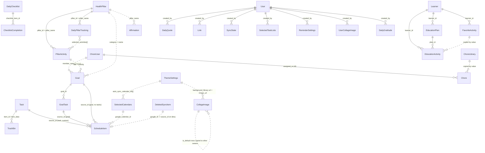

# Data Model — Relationships

**Area:** `DATA` · **Level:** 2 · **Status:** draft · Conventions: `README.md`

No entity file declares a constraint between entities (`AR-DATA-05`). Every relationship below is a string
field whose meaning is fixed by the code that writes and reads it.

## 1. Hard id references

| From | Field | To | Written by | Resolved by | Tag |
|---|---|---|---|---|---|
| GoalTask | `goal_id` | Goal.id | `src/pages/Goals.jsx:115,270`, `src/components/visionboard/PillarManager.jsx:232`, `src/components/visionboard/DailyEvaluation.jsx:174` | `src/pages/Goals.jsx:104-106,168`, `src/pages/DailySchedule.jsx:1051` | `[Implemented]` |
| ChecklistCompletion | `checklist_item_id` | DailyChecklist.id | `src/pages/DailyChecklist.jsx:155` and two other togglers | `src/pages/DailyChecklist.jsx:147,151`, `src/lib/useWeeklyChecklistCounts.js:27` | `[Implemented]` |
| EducationPlan | `learner_id` | Learner.id (or the owner's `full_name` when no learners exist) | `src/pages/Education.jsx:162-165` | `src/pages/Education.jsx:197,215` | `[Implemented]` |
| EducationActivity | `plan_id` | EducationPlan.id (may be `null`) | `src/pages/Education.jsx:236,243`, `src/components/ActivityGenerator.jsx:62,150`, `src/components/ActivityLibrary.jsx:106` | `src/components/ActivityGenerator.jsx:143` | `[Implemented]` |
| EducationActivity | `learner_id` | Learner.id | same creators (copied from the plan) | `src/pages/Education.jsx:198,216` | `[Implemented]` |
| FavoriteActivity | `learner_id` | Learner.id | `src/components/ActivityLibrary.jsx:61`, `src/components/education/SubjectCard.jsx:138` | library filtering | `[Implemented]` |
| PillarActivity | `pillar_id` | HealthPillar.id | `src/components/visionboard/PillarManager.jsx:62,81,114`, `src/components/visionboard/PillarGoalGenerator.jsx:89` | `src/components/visionboard/PillarManager.jsx:50-52`, `src/components/visionboard/DailyEvaluation.jsx:87-89` | `[Implemented]` |
| DailyPillarTracking | `pillar_id` | HealthPillar.id | `src/components/visionboard/DailyEvaluation.jsx:134` | `src/components/dashboard/DashboardFocalAreas.jsx:43-48`, `src/components/dashboard/DashboardSlideshow.jsx:76-77` | `[Implemented]` |
| DailyPillarTracking | `selected_activities[]` | PillarActivity.id | `src/components/visionboard/DailyEvaluation.jsx:130,139` | `src/components/visionboard/DailyEvaluation.jsx:71` | `[Implemented]` |
| Chore | `assigned_to` | ChoreUser.id (`""` = unassigned) | `src/pages/Chores.jsx:240,410,421,511,522`, `src/components/ChoreGenerator.jsx:164`, `src/components/ChoreLibraryDialog.jsx:158` | `src/pages/Chores.jsx:533-535,597`, `src/components/dashboard/DashboardMenuChores.jsx:79`, `src/components/ChoreLibraryDialog.jsx:63` | `[Implemented]` (see D-001) |
| TrashBin | `item_id` | Task.id (deleted) | `src/pages/Tasks.jsx:355` | not resolved; restore uses `item_data` | `[Implemented]` |
| ThemeSettings | `auto_sync_calendar_ids` (JSON) | SelectedCalendars.id | `src/pages/Settings.jsx:513-518` | `src/pages/Settings.jsx:289` (display) | `[Implemented]` |

## 2. Name-based soft references

| From | Field | To | Written by | Resolved by | Tag |
|---|---|---|---|---|---|
| Goal | `member_name` | ChoreUser.name, or the owner's `full_name`, or literals `Self` / `User` / `Unknown` | `src/pages/Goals.jsx:264-266,596`, `src/components/visionboard/PillarManager.jsx:226`, `src/components/visionboard/DailyEvaluation.jsx:167`, `src/pages/VisionBoard.jsx:165`, `src/components/ActivityGenerator.jsx:167`, `src/pages/Education.jsx:255` | exact match against member tabs `src/pages/Goals.jsx:368` | `[Implemented]` (see D-013) |
| Chore | `assigned_to` (legacy) | ChoreUser.name | none currently | `src/pages/Chores.jsx:535` accepts a name match | `[Implemented]` |
| PillarActivity | `pillar_name` | HealthPillar.name | copied at write | `src/components/visionboard/PillarManager.jsx:222,227` (into goals) | `[Implemented]` |
| DailyPillarTracking | `pillar_name` | HealthPillar.name | copied at write | `src/components/visionboard/LowScorePillars.jsx:17` | `[Implemented]` |
| Affirmation | `pillar_name` | HealthPillar.name | `src/components/visionboard/AffirmationManager.jsx:68` | display only | `[Implemented]` |
| Goal | `category` | HealthPillar.name (when generated from a pillar) | `src/components/visionboard/PillarManager.jsx:227`, `src/components/visionboard/DailyEvaluation.jsx:168` | grouping only | `[Implemented]` |
| Goal | `title` | PillarActivity.activity (lower-cased equality) | `src/components/visionboard/PillarManager.jsx:221` | `src/components/visionboard/DailyEvaluation.jsx:48-52` ("remaining" badge) | `[Implemented]` |
| Link | `category` | device-local category name (`link_categories_v2`) | `src/pages/Links.jsx:177-179,205` | `src/pages/Links.jsx:150-156` | `[Implemented]` |
| EducationActivity | `subject` | EducationPlan.subject | copied at write | `src/pages/Education.jsx:198` | `[Implemented]` |
| Chore | `title` | ChoreLibrary.title (lower-cased) | copy on assign | `src/components/ChoreLibraryDialog.jsx:59-64` (existing-assignment map) | `[Implemented]` |

## 3. Polymorphic references

### ScheduleItem.source_type + source_id
| `source_type` | `source_id` points at | Writer | Readers that follow it |
|---|---|---|---|
| `task` | Task.id | `src/pages/DailySchedule.jsx:417,434-435` (library type `task`) | `src/components/DailyToDo.jsx:46-48,117-122,158-164,189,294`, `src/pages/DailySchedule.jsx:330,974`, `src/components/TaskEditDialog.jsx:102`, `src/pages/Tasks.jsx:253,360`, `base44/functions/deleteToDoItem/entry.ts:52-53,80` |
| `custom` | Task.id (a Task is created first, `category: "Custom"`) | `src/pages/DailySchedule.jsx:419-427,434-435` | `src/components/DailyToDo.jsx:46,171`, `src/pages/DailySchedule.jsx:330`; workflows push `custom` rows to Google |
| `goal` | GoalTask.id, or Goal.id when the goal has no incomplete tasks | `src/pages/DailySchedule.jsx:1097-1099,434-435` | `src/components/DailyToDo.jsx:108,192`, `src/pages/DailySchedule.jsx:1044`, `base44/functions/deleteToDoItem/entry.ts:83` (GoalTask only) |
| `calendar` | Google event id | `base44/functions/autoSync/entry.ts:86`, `base44/functions/syncGoogleCalendarToApp/entry.ts:117`, `src/components/DeletedItemReview.jsx:40-41` | dedup maps `base44/functions/syncGoogleCalendarToApp/entry.ts:37-49`, `base44/functions/autoSync/entry.ts:70-71` |
| `event` | none (`source_id` unset) | `src/pages/CalendarPage.jsx:149` | `src/pages/CalendarPage.jsx:79`, `src/pages/DailySchedule.jsx:207,324`, `src/components/dashboard/DashboardSchedule.jsx:49` |
| `education` | EducationActivity.id (declared; no writer) | none | `src/components/DailyToDo.jsx:125-126,191`, `base44/functions/deleteToDoItem/entry.ts:82` |
| `chore` | Chore.id (declared; no writer) | none | `src/components/DailyToDo.jsx:123-124,190`, `base44/functions/deleteToDoItem/entry.ts:81` |

`[Implemented]` for each cited row; the `education` and `chore` rows are `[Partial]`. See D-006.

### TrashBin.item_type + item_id + item_data
Only `item_type: 'task'` is declared or written; `item_data` is the JSON snapshot used for restore. `[Implemented]`
`base44/entities/TrashBin.jsonc:5-11`, `src/pages/Tasks.jsx:353-358`, `src/pages/Settings.jsx:200-205`

### DeletedSyncItem.source_type + google_id
`calendar` → Google event id, recreated as `ScheduleItem.source_id` on deny; `task` → Google task id, no
recreate path. No writer creates rows. `[Partial]` `base44/entities/DeletedSyncItem.jsonc:5-16`,
`src/components/DeletedItemReview.jsx:34-44`

### External identifiers
| Field | External object | Writers | Notes |
|---|---|---|---|
| `Task.google_task_id` | Google Tasks task (`@default` list) **or** Google Calendar event | `base44/functions/autoSync/entry.ts:135`, `base44/functions/syncGoogleTasks/entry.ts:62`; `base44/functions/syncTasksToCalendar/entry.ts:82` | the calendar push overwrites the field with an event id `[Implemented]` |
| `ScheduleItem.google_event_id` | Google Calendar event | `base44/functions/syncGoogleCalendarToApp/entry.ts:118`, `base44/functions/syncAppEventToGoogle/entry.ts:59` | absent on rows from the scheduled import `[Implemented]` |
| `ScheduleItem.google_calendar_id` | Google calendar (`primary` or id) | `base44/functions/syncGoogleCalendarToApp/entry.ts:119`, `base44/functions/syncAppEventToGoogle/entry.ts:60` | matches `SelectedCalendars.calendar_id` `[Implemented]` |
| `SelectedCalendars.calendar_id`, `SelectedTaskLists.list_id`, `DeletedSyncItem.google_id` | Google ids | see `sync.md` | `[Implemented]` |
| `UserCollageImage.file_uri` | private file in the upload store | `src/components/visionboard/PrivateImageUploader.jsx:97-104` | `[Implemented]` |

## 4. Denormalised caches and refresh rules

| Cache | Source of truth | Refresh rule | Tag |
|---|---|---|---|
| `ScheduleItem.title` (task/custom/goal rows) | Task / GoalTask / Goal title | never refreshed after creation `src/pages/DailySchedule.jsx:430`; task edits push `date`/`start_time` only `src/components/TaskEditDialog.jsx:100-111` | `[Implemented]` |
| `ScheduleItem.title/date/start_time/end_time/notes` (calendar rows) | Google event | rewritten on every import run; manual import skips unchanged rows `base44/functions/syncGoogleCalendarToApp/entry.ts:124-134`, `base44/functions/autoSync/entry.ts:86-93` | `[Implemented]` |
| `PillarActivity.pillar_name`, `DailyPillarTracking.pillar_name` | HealthPillar.name | never refreshed; pillar rename writes only the pillar `src/components/visionboard/PillarManager.jsx:165-173` | `[Implemented]` |
| `Goal.category` / `category_color` (from pillar) | HealthPillar.name / color | never refreshed | `[Implemented]` |
| `EducationActivity.subject`, `learner_id` | EducationPlan | never refreshed | `[Implemented]` |
| `Task.priority` mirrored onto schedule rows | Task.priority | recomputed in memory on every load; not stored `src/components/DailyToDo.jsx:44-50`, `src/pages/DailySchedule.jsx:329-334` | `[Implemented]` |
| `UserCollageImage.signed_url` + `signed_url_expires` | minted signed URL (3600 s) | re-minted and written back when missing or expiring within 60 s `src/components/visionboard/PrivateImageUploader.jsx:6-20,54-88`, `src/pages/VisionBoard.jsx:116-132`, `src/components/dashboard/DashboardSlideshow.jsx:29-46` | `[Implemented]` |
| `ThemeSettings.background_library` ↔ device `theme_bg_history` | both | set-union on Theme Editor load, written both ways on change `src/pages/ThemeEditor.jsx:88-92,128-155,172-174` | `[Implemented]` |
| `TrashBin.item_data` | Task row at deletion | snapshot; never refreshed `src/pages/Tasks.jsx:356` | `[Implemented]` |
| `SelectedCalendars.calendar_name`, `SelectedTaskLists.list_name` | Google summary/title | written once at row creation `base44/functions/getGoogleCalendars/entry.ts:37`, `base44/functions/getGoogleTaskLists/entry.ts:37` | `[Implemented]` |
| Chore room names → device `chore_custom_rooms` | Chore/ChoreLibrary.room | mirrored on every Chores load, minus `chore_deleted_rooms` `src/pages/Chores.jsx:197-204` | `[Implemented]` |
| Goal progress/status | GoalTask completion | recomputed on every milestone change from the Goals page `src/pages/Goals.jsx:167-178` | `[Implemented]` |

## 5. Cascades implemented in code

| Trigger | Effect | Where | Tag |
|---|---|---|---|
| Task completed / un-completed (Tasks page) | every `ScheduleItem` with `source_id` = task gets `completed` | `src/pages/Tasks.jsx:252-256` | `[Implemented]` |
| Recurring task completed (Tasks page) | next-occurrence `Task` created unless a pending one with same title + pattern exists | `src/pages/Tasks.jsx:258-318` | `[Implemented]` |
| Task `due_date`/`due_time` edited | linked `ScheduleItem.date` / `start_time` updated | `src/components/TaskEditDialog.jsx:100-111` | `[Implemented]` |
| Task placed on the schedule | `Task.due_date`, `schedule_time` set | `src/pages/DailySchedule.jsx:439-441` | `[Implemented]` |
| To-do item completed | source Task/Chore/EducationActivity updated, then the `ScheduleItem` gets `completed` + `hidden_from_grid`; `goal` items return early | `src/components/DailyToDo.jsx:107-144` | `[Implemented]` |
| To-do "library" | Task dates cleared; `ScheduleItem` deleted | `src/components/DailyToDo.jsx:156-169`, `base44/functions/deleteToDoItem/entry.ts:49-67` | `[Implemented]` |
| To-do "delete_app" | `ScheduleItem` deleted, then the source row (Task/Chore/EducationActivity/GoalTask) deleted | `src/components/DailyToDo.jsx:184-193`, `base44/functions/deleteToDoItem/entry.ts:71-98` | `[Implemented]` |
| To-do "delete_google" | `ScheduleItem` deleted; Google task deleted then Task deleted, or Google event deleted | `src/components/DailyToDo.jsx:194-207`, `base44/functions/deleteToDoItem/entry.ts:101-122` | `[Implemented]` |
| Task deleted (single, Tasks page) | `TrashBin` snapshot written first; linked schedule items are read for the message only | `src/pages/Tasks.jsx:347-367` | `[Implemented]` (see D-005) |
| Chore / Goal / EducationPlan / EducationActivity / GoalTask delete event received on the Daily Schedule | `ScheduleItem` rows whose `source_id` equals the first pending deleted id are deleted | `src/pages/DailySchedule.jsx:168-191` | `[Implemented]` (see Q-007) |
| Learner deleted | all `EducationPlan` and `EducationActivity` with that `learner_id` deleted; favourites kept | `src/pages/Education.jsx:213-223` | `[Implemented]` |
| Subject deleted from the edit dialog | that learner's plans and activities for the subject deleted | `src/pages/Education.jsx:194-205` | `[Implemented]` |
| Subject deleted from the subject card | that learner's plans for the subject deleted; activities kept | `src/pages/Education.jsx:207-211` | `[Implemented]` |
| GoalTask added / toggled / edited / deleted | parent `Goal.progress`, `status`, `archived`, `started_at`, `completed_at` recomputed | `src/pages/Goals.jsx:111-178` | `[Implemented]` |
| Goal deleted | milestone tasks are not deleted | `src/pages/Goals.jsx:281-284` | `[Implemented]` |
| DailyChecklist item deleted | completions kept | `src/pages/DailyChecklist.jsx:126-144` | `[Implemented]` |
| ChoreUser deleted | chores keep the stale id (rendered "Unassigned"); goals keep the name | `src/pages/Chores.jsx:295-298,597`, `src/pages/Goals.jsx:246-249` | `[Implemented]` |
| Evaluation deleted | all `DailyPillarTracking` and `DailyGratitude` rows for the date deleted | `src/components/visionboard/DailyEvaluation.jsx:192-208` | `[Implemented]` |
| Link category deleted (device) | every `Link.category` equal to it set to `""` | `src/pages/Links.jsx:142-148` | `[Implemented]` |
| Theme background removed from library | `CollageImage` rows with that `image_url` and `is_default: true` deleted | `src/pages/ThemeEditor.jsx:141-155` | `[Implemented]` |
| Google calendar returns 404 during import | `SelectedCalendars.is_selected` set `false` | `base44/functions/autoSync/entry.ts:47-50`, `base44/functions/syncGoogleCalendarToApp/entry.ts:72-79` | `[Implemented]` |
| Google event absent from a fetched calendar (manual import) | local `calendar` row with both Google ids and date within −90/+60 days deleted | `base44/functions/syncGoogleCalendarToApp/entry.ts:160-182` | `[Implemented]` |
| Push create succeeds | `ScheduleItem.google_event_id` / `google_calendar_id` written back | `base44/functions/syncAppEventToGoogle/entry.ts:55-61` | `[Implemented]` |
| Custom block created / updated / deleted | platform workflow invokes the push function | `base44/workflows/Sync App Events to Google Calendar (Create).jsonc:5-31` and siblings | `[Implemented]` |
| Tombstone denied | `ScheduleItem` recreated for today 09:00–10:00 | `src/components/DeletedItemReview.jsx:30-48` | `[Implemented]` |
| Synced-data wipe | all `ScheduleItem`, `SelectedCalendars`, `SyncState`; `Task` rows where `google_task_id` exists | `base44/functions/deleteSyncedData/entry.ts:68-83` | `[Implemented]` |
| Full wipe | 25 entities emptied in a fixed order (everything except `User`, `TrashBin`, `ChoreLibrary`, `FavoriteActivity`, `UserCollageImage`) | `base44/functions/deleteSyncedData/entry.ts:49-66` | `[Implemented]` |
| Account deletion | six connectors disconnected, then Task, ScheduleItem, DailyChecklist, ChecklistCompletion, Goal, GoalTask, Chore, ChoreUser, EducationPlan, EducationActivity, Learner, DailyQuote, Link, ThemeSettings, SelectedCalendars, SyncState deleted, then the user | `base44/functions/deleteUserAccount/entry.ts:12-83` | `[Implemented]` |

## 6. ER diagram

## 7. Discrepancies & open questions (this sheet)

- **D-001**, **D-005**, **D-006**, **D-013** as listed in the entity sheets.
- **Q-007** Blocks: §5 orphan clean-up row. The subscription event shape (`event.type`, `event.id`) is
  assumed by `src/pages/DailySchedule.jsx:169`; its actual shape is not visible in the repository.
