# Domain Model

**Area:** `DATA` · **Level:** 1 · **Status:** draft

**Sources owned:** `base44/entities/*.jsonc` (30 files). Field-level detail, lifecycles, and citations
for every call site live in `data-model/` (conventions in `data-model/README.md`).

## 1. Entity catalogue

Thirty entities, grouped by domain. Each line: entity, one-line purpose, and the enforcing rule for its
cardinality where one exists in code.

### Tasks
- **Task** (`E-Task`) — a to-do item with optional due date/time, label, recurrence pattern or occurrence
  count, and optional link to a Google task. `[Implemented]` `base44/entities/Task.jsonc:1-110`
- **TrashBin** (`E-TrashBin`) — a snapshot of a deleted task kept for restore. `[Implemented]`
  `base44/entities/TrashBin.jsonc:1-45`

### Schedule
- **ScheduleItem** (`E-ScheduleItem`) — one time-boxed block on one date; the single table where Google
  events, Calendar-page events, scheduled tasks, custom blocks, and scheduled milestone tasks converge.
  `[Implemented]` `base44/entities/ScheduleItem.jsonc:1-88`

### Chores
- **Chore** (`E-Chore`) — an assigned household chore or a meal (`chore_type` in the meal set), with
  frequency, room, and completion state. `[Implemented]` `base44/entities/Chore.jsonc:1-90`
- **ChoreLibrary** (`E-ChoreLibrary`) — an unassigned, reusable chore template. `[Implemented]`
  `base44/entities/ChoreLibrary.jsonc:1-57`
- **ChoreUser** (`E-ChoreUser`) — a household member (name + colour) that chores are assigned to and
  goals are filed under. `[Implemented]` `base44/entities/ChoreUser.jsonc:1-32`

### Goals
- **Goal** (`E-Goal`) — a user objective with a timeframe, derived progress, archive flag, and a
  household member name. `[Implemented]` `base44/entities/Goal.jsonc:1-92`
- **GoalTask** (`E-GoalTask`) — a milestone task under a goal, optionally with an occurrence count.
  `[Implemented]` `base44/entities/GoalTask.jsonc:1-55`

### Checklist & gratitude
- **DailyChecklist** (`E-DailyChecklist`) — a repeating routine item in a time-of-day bucket.
  `[Implemented]` `base44/entities/DailyChecklist.jsonc:1-56`
- **ChecklistCompletion** (`E-ChecklistCompletion`) — the tick for one checklist item on one date; one
  row per item per date by convention. `[Implemented]` `base44/entities/ChecklistCompletion.jsonc:1-38`,
  `src/pages/DailyChecklist.jsx:151-156`
- **DailyGratitude** (`E-DailyGratitude`) — one gratitude entry per date, written from the daily
  evaluation. `[Implemented]` `base44/entities/DailyGratitude.jsonc:1-69`,
  `src/components/visionboard/DailyEvaluation.jsx:146-153`

### Education
- **Learner** (`E-Learner`) — a person education is planned for. `[Implemented]`
  `base44/entities/Learner.jsonc:1-35`
- **EducationPlan** (`E-EducationPlan`) — one learner × one subject. `[Implemented]`
  `base44/entities/EducationPlan.jsonc:1-66`
- **EducationActivity** (`E-EducationActivity`) — an assignment or activity inside a plan, with
  frequency and completion. `[Implemented]` `base44/entities/EducationActivity.jsonc:1-91`
- **FavoriteActivity** (`E-FavoriteActivity`) — the activity library: a reusable activity saved per
  learner. `[Implemented]` `base44/entities/FavoriteActivity.jsonc:1-46`

### Vision board
- **HealthPillar** (`E-HealthPillar`) — one of 13 seeded wellness pillars the user rates. `[Implemented]`
  `base44/entities/HealthPillar.jsonc:1-64`, `src/pages/VisionBoard.jsx:28-47,78-87`
- **PillarActivity** (`E-PillarActivity`) — a reusable pillar activity (seeded 5 per pillar). `[Implemented]`
  `base44/entities/PillarActivity.jsonc:1-78`, `src/components/visionboard/PillarManager.jsx:10-24,55-69`
- **DailyPillarTracking** (`E-DailyPillarTracking`) — the 1–5 rating of one pillar on one date, with
  notes and the activities selected; one row per pillar per date by convention. `[Implemented]`
  `base44/entities/DailyPillarTracking.jsonc:1-57`, `src/components/visionboard/DailyEvaluation.jsx:123-142`
- **Affirmation** (`E-Affirmation`) — a saved affirmation, optionally tied to a pillar by name.
  `[Implemented]` `base44/entities/Affirmation.jsonc:1-36`
- **CollageImage** (`E-CollageImage`) — a public-URL collage image; rows flagged `is_default` act as the
  seed set copied to new accounts. `[Implemented]` `base44/entities/CollageImage.jsonc:1-46`,
  `base44/functions/initializeDefaultCollageImages/entry.ts:20-38`
- **UserCollageImage** (`E-UserCollageImage`) — a privately uploaded collage image with a cached signed
  URL. `[Implemented]` `base44/entities/UserCollageImage.jsonc:1-48`

### Quotes & links
- **DailyQuote** (`E-DailyQuote`) — the quote for one date with the user's reflection and favourite
  flag; one per date by convention. `[Implemented]` `base44/entities/DailyQuote.jsonc:1-41`,
  `base44/functions/fetchDailyQuote/entry.ts:20-28`
- **Link** (`E-Link`) — a saved URL with title, device-local category name, and thumbnail or icon.
  `[Implemented]` `base44/entities/Link.jsonc:1-36`

### Google sync
- **SelectedCalendars** (`E-SelectedCalendars`) — one row per Google calendar seen, with the import
  opt-in and last import time. `[Implemented]` `base44/entities/SelectedCalendars.jsonc:1-38`
- **SelectedTaskLists** (`E-SelectedTaskLists`) — one row per Google task list seen, with an opt-in flag.
  `[Implemented]` `base44/entities/SelectedTaskLists.jsonc:1-38`
- **SyncState** (`E-SyncState`) — last-sync bookkeeping; singleton by convention. `[Implemented]`
  `base44/entities/SyncState.jsonc:1-34`
- **DeletedSyncItem** (`E-DeletedSyncItem`) — a tombstone for something that disappeared from Google,
  awaiting review. Read and updated by the review UI; no code path creates rows. `[Partial]`
  `base44/entities/DeletedSyncItem.jsonc:1-61`, `src/components/DeletedItemReview.jsx:18-47`

### Settings & user
- **ThemeSettings** (`E-ThemeSettings`) — the account preference row: theme, feature toggles, dashboard
  header and widget order, sync preferences, onboarding status; singleton by convention. `[Implemented]`
  `base44/entities/ThemeSettings.jsonc:1-111`
- **ReminderSettings** (`E-ReminderSettings`) — evaluation reminder times; read by the dashboard, never
  written by code. `[Partial]` `base44/entities/ReminderSettings.jsonc:1-34`,
  `src/components/dashboard/DashboardFocalAreas.jsx:32,65-69`
- **User** (`E-User`) — the platform user extended with `role`; code also reads `email`, `full_name`,
  `terms_accepted`, `privacy_accepted`. `[Implemented]` `base44/entities/User.jsonc:1-17`,
  `src/pages/AcceptTerms.jsx:17,50`

## 2. Ownership and tenancy

- Every entity except `User` is scoped to the account owner by a row rule on `created_by` for create,
  read, update, and delete (verbatim in `data-model/README.md` §2). `[Implemented]`
  `base44/entities/Task.jsonc:96-109`
- `DailyGratitude` and `PillarActivity` additionally permit any user whose role is `admin` for all four
  operations. `[Implemented]` `base44/entities/DailyGratitude.jsonc:19-68`,
  `base44/entities/PillarActivity.jsonc:28-77`
- Household members and learners are rows inside the owner's data; goals name a member by string. Nothing
  in the model represents a second login sharing data. `[Implemented]` `base44/entities/ChoreUser.jsonc:5-13`,
  `base44/entities/Goal.jsonc:48-50`
- Nine backend functions act as service role for some or all of their entity access; the matrix, with
  each function's own guard, is in `data-model/README.md` §3. Two of them write rows for other owners
  (`generateDailyQuotes`, `backfillDefaultImagesToAllUsers`) and one reads seed rows across owners
  (`initializeDefaultCollageImages`). `[Implemented]` `base44/functions/generateDailyQuotes/entry.ts:81-87`,
  `base44/functions/backfillDefaultImagesToAllUsers/entry.ts:44-46`,
  `base44/functions/initializeDefaultCollageImages/entry.ts:20`
- Admin-only functions check `user.role !== 'admin'` themselves. `[Implemented]`
  `base44/functions/makeImagesDefaults/entry.ts:12-14`, `base44/functions/clearChoreLibraryAssignments/entry.ts:12-14`,
  `base44/functions/backfillDefaultImagesToAllUsers/entry.ts:8-10`, `base44/functions/generateDailyQuotes/entry.ts:16-18`

## 3. ER diagram

Solid lines are id references; dotted lines are name-based or external-id references. Cardinalities
reflect what code writes, not a declared constraint (see `data-model/relationships.md`).

```mermaid
erDiagram
    User ||--o{ ThemeSettings : "created_by (singleton by convention)"
    User ||--o{ ReminderSettings : "created_by"
    User ||--o{ SyncState : "created_by (singleton by convention)"
    User ||--o{ Task : "created_by"
    User ||--o{ ScheduleItem : "created_by"
    User ||--o{ TrashBin : "created_by"
    User ||--o{ Chore : "created_by"
    User ||--o{ ChoreLibrary : "created_by"
    User ||--o{ ChoreUser : "created_by"
    User ||--o{ Goal : "created_by"
    User ||--o{ DailyChecklist : "created_by"
    User ||--o{ DailyGratitude : "created_by (one per date)"
    User ||--o{ Learner : "created_by"
    User ||--o{ HealthPillar : "created_by (13 seeded)"
    User ||--o{ Affirmation : "created_by"
    User ||--o{ CollageImage : "created_by"
    User ||--o{ UserCollageImage : "created_by"
    User ||--o{ DailyQuote : "created_by (one per date)"
    User ||--o{ Link : "created_by"
    User ||--o{ SelectedCalendars : "created_by"
    User ||--o{ SelectedTaskLists : "created_by"
    User ||--o{ DeletedSyncItem : "created_by"

    Task ||--o{ TrashBin : "item_id + item_data snapshot"
    Task ||--o{ ScheduleItem : "source_id when source_type = task or custom"
    GoalTask ||--o{ ScheduleItem : "source_id when source_type = goal"
    Goal ||--o{ ScheduleItem : "source_id when source_type = goal (no milestone tasks)"
    SelectedCalendars ||..o{ ScheduleItem : "google_calendar_id = calendar_id"
    ThemeSettings ||..o{ SelectedCalendars : "auto_sync_calendar_ids[] holds ids"

    ChoreUser ||--o{ Chore : "assigned_to = ChoreUser.id"
    ChoreUser ||..o{ Goal : "member_name = ChoreUser.name"
    ChoreLibrary ||..o{ Chore : "copied on assign (title match)"

    Goal ||--o{ GoalTask : "goal_id"

    DailyChecklist ||--o{ ChecklistCompletion : "checklist_item_id + date"

    Learner ||--o{ EducationPlan : "learner_id"
    Learner ||--o{ EducationActivity : "learner_id"
    Learner ||--o{ FavoriteActivity : "learner_id"
    EducationPlan ||--o{ EducationActivity : "plan_id"
    FavoriteActivity ||..o{ EducationActivity : "copied on assign"

    HealthPillar ||--o{ PillarActivity : "pillar_id (+ pillar_name cache)"
    HealthPillar ||--o{ DailyPillarTracking : "pillar_id + date (+ pillar_name cache)"
    HealthPillar ||..o{ Affirmation : "pillar_name"
    DailyPillarTracking }o..o{ PillarActivity : "selected_activities[] holds ids"
    PillarActivity ||..o{ Goal : "title = activity, category = pillar_name"

    DeletedSyncItem ||..o| ScheduleItem : "google_id recreated as source_id on deny"
```

## 4. How the domains connect

- **ScheduleItem is the hub.** Google import writes calendar rows; the Calendar page writes `event` rows;
  the Daily Schedule writes `task`, `custom`, and `goal` rows whose `source_id` points at a Task, a
  freshly created Task, or a GoalTask/Goal. The daily to-do reads schedule items plus virtual rows built
  from tasks due that date. `[Implemented]` `base44/functions/syncGoogleCalendarToApp/entry.ts:111-122`,
  `src/pages/CalendarPage.jsx:144-151`, `src/pages/DailySchedule.jsx:410-443,1097-1099`,
  `src/components/DailyToDo.jsx:36-67`
- **Completion flows across the hub.** Completing a task from the Tasks page marks its linked schedule
  items complete; completing an item on the to-do marks the source Task, Chore, or EducationActivity and
  the schedule item together. `[Implemented]` `src/pages/Tasks.jsx:247-256`, `src/components/DailyToDo.jsx:117-136`
- **Goals are fed from three domains.** Education activities, pillar activities, and the daily evaluation
  can each create a Goal (and milestone tasks); the vision-board paths copy the pillar name into
  `Goal.category` and the pillar colour into `category_color`. `[Implemented]`
  `src/components/ActivityGenerator.jsx:162-168`, `src/pages/Education.jsx:250-256`,
  `src/components/visionboard/PillarManager.jsx:220-237`, `src/components/visionboard/DailyEvaluation.jsx:161-180`,
  `src/pages/VisionBoard.jsx:160-166`
- **Household members serve two features.** `ChoreUser` rows are the assignees for chores (by id) and
  the member list for goals (by name). `[Implemented]` `src/pages/Chores.jsx:240`, `src/pages/Goals.jsx:235-247,264-266`
- **Labels are shared free text.** `Task.category`, `DailyChecklist.label`, and `Goal.category` are
  user-typed strings with a colour; recently used labels are remembered on the device, and grouping is
  case-insensitive. `[Implemented]` `src/utils/labelHistory.js:1-21`, `src/lib/categoryUtils.js:1-32`
- **ThemeSettings carries account state for many features:** theme, feature toggles, dashboard widget
  order and header, sync sources/times/calendar opt-ins, task-import label, and the dismissed onboarding
  keys. `[Implemented]` `base44/entities/ThemeSettings.jsonc:5-94`
- **Google sync state lives in four small tables** (calendars, task lists, last-sync row, tombstones) and
  in two fields on the synced rows themselves (`ScheduleItem.google_event_id` / `google_calendar_id`,
  `Task.google_task_id`). `[Implemented]` `base44/entities/ScheduleItem.jsonc:62-67`,
  `base44/entities/Task.jsonc:78-80`
- **Seeded data:** 13 pillars and 5 activities per pillar are created client-side on first visit; collage
  images flagged `is_default` are copied to a new account on first layout mount or terms acceptance and
  daily by workflow. `[Implemented]` `src/pages/VisionBoard.jsx:78-87`,
  `src/components/visionboard/PillarManager.jsx:55-69`, `src/components/Layout.jsx:48`,
  `src/pages/AcceptTerms.jsx:54`, `base44/workflows/Initialize Collage Images for All Users.jsonc:10-33`

## 5. Discrepancies & open questions

Consolidated in `data-model/flags-and-lifecycle.md` §7 and repeated in each entity sheet.
