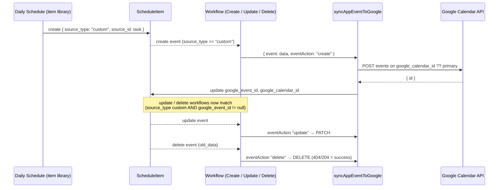

# Google Sync — Architecture Spec

**Architecture area:** `SYNC` · **Level:** 1 · **Status:** draft

**Tag summary:** Implemented 78 · Described 8 · Partial 6

**Sources owned:** `base44/functions/autoSync/entry.ts`, `base44/functions/syncGoogleCalendarToApp/entry.ts`, `base44/functions/syncGoogleTasks/entry.ts`, `base44/functions/syncAppEventToGoogle/entry.ts`, `base44/functions/syncTasksToCalendar/entry.ts`, `base44/functions/updateGoogleTask/entry.ts`, `base44/functions/getGoogleCalendars/entry.ts`, `base44/functions/getGoogleTaskLists/entry.ts`, `base44/functions/checkConnectorStatus/entry.ts`, `base44/functions/deleteToDoItem/entry.ts` (catalogue entry; behaviour in `schedule-hub.md` §8), `base44/workflows/Sync App Events to Google Calendar (Create|Update|Delete).jsonc` (conditions; trigger detail in `automations.md`)
**Sources referenced (owned elsewhere):** `src/pages/Settings.jsx` (sync UI) → `20-features/settings`; `src/pages/CalendarPage.jsx`, `src/components/SwipeableEventItem.jsx`, `src/components/EventEditDialog.jsx`, `src/components/DeletedItemReview.jsx` → `20-features/calendar`; `src/pages/Auth.jsx`, `src/pages/AcceptTerms.jsx` → `20-features/app-shell` / `10-architecture/auth`; `src/pages/Tasks.jsx`, `src/components/TaskEditDialog.jsx` → `20-features/tasks`; `src/components/DailyToDo.jsx` → `20-features/daily-schedule`; entities `SelectedCalendars`, `SelectedTaskLists`, `SyncState`, `DeletedSyncItem`, `ThemeSettings` → `10-architecture/data-model/`

**Permissions:** per-user data; every function requires an authenticated caller (401 "Unauthorized" otherwise) and uses the caller's own Google token; admin-only operations: none

## 1. Purpose

The product's promise: "all with optional Google Calendar and Google Tasks sync." `[Described]` `src/pages/UserManual.jsx:14`; "Seamlessly sync Google Calendar, Google Tasks, and Google Drive for unified productivity." `[Described]` `src/pages/LandingPage.jsx:12`. This spec records the connectors, what the user selects, the four sync directions, dedup and deletion guards, tombstones, and bookkeeping. Vocabulary: **import** = Google → app; **push** = app → Google.

## 2. Connectors

- **AR-SYNC-01** Google Calendar and Google Tasks are two separate connectors; a user may hold either without the other, and every function asks for exactly the connector it needs. `[Implemented]` `src/pages/Settings.jsx:23-26`, `base44/functions/autoSync/entry.ts:25,115`
- **AR-SYNC-02** Tokens are fetched server-side per call via the connector store with the service role; the browser never receives a token. `[Implemented]` e.g. `base44/functions/syncGoogleCalendarToApp/entry.ts:13-14`, `base44/functions/checkConnectorStatus/entry.ts:18`

### 2a. Connector ids referenced

| Purpose | Id | Where |
|---|---|---|
| Google Calendar (functions, Settings, to-do delete) | `69e73980123bb49cf43baf96` | `src/pages/Settings.jsx:24,28`; `base44/functions/{autoSync:25, syncGoogleCalendarToApp:13, syncAppEventToGoogle:21, syncTasksToCalendar:12, getGoogleCalendars:12, deleteToDoItem:4, deleteUserAccount:14}` |
| Google Tasks (functions, Settings) | `69e7399b50555bb55752878a` | `src/pages/Settings.jsx:25,458,864`; `base44/functions/{autoSync:115, syncGoogleTasks:15, updateGoogleTask:19, getGoogleTaskLists:12, deleteToDoItem:3, deleteUserAccount:15}` |
| Google Calendar (sign-up flow) | `69dd6fdb02883eefc6106a2a` | `src/pages/Auth.jsx:17` |
| Google Tasks (sign-up flow) | `69dd7015f461b3b0db0317b2` | `src/pages/Auth.jsx:18` |
| Google Calendar (terms acceptance disconnect) | `69dd40c425113bd8c8dada08` | `src/pages/AcceptTerms.jsx:34` |
| Google Tasks (terms acceptance disconnect) | `69dd389dc7cfad127e38e98d` | `src/pages/AcceptTerms.jsx:35` |

Three distinct id pairs are in use (see D-200). Four further connector ids (Dropbox, Google Docs, Gmail, Google Drive) appear only in account deletion; they are listed in `admin-operations.md` §3.

### 2b. Connection state probing

- **AR-SYNC-03** `checkConnectorStatus` takes `{ connectorId }` and returns `{ connected: true }` only when a token is obtainable; every other outcome (no user, no id, connector throw) returns `{ connected: false }` with status 200. `[Implemented]` `base44/functions/checkConnectorStatus/entry.ts:5-22`
- **AR-SYNC-04** Settings probes both connectors on mount, shows "Checking connection status..." meanwhile, and renders "Connected" (green) or "Connect" per connector. `[Implemented]` `src/pages/Settings.jsx:153-176,810-860`
- **AR-SYNC-05** Connect opens the connector's OAuth URL in a 500×700 popup; if the popup is blocked the page redirects in place. After the popup closes the status is re-probed up to 10 times at 1.5 s intervals; on success a notice appears: "Google Calendar connected!" / "Before syncing, scroll down to "Select Calendars to Sync" and choose which calendars to include." or "Google Tasks connected!" / "Before syncing, scroll down to "Auto-Sync Schedule" and choose which task lists to include under "Task lists to auto-sync"." `[Implemented]` `src/pages/Settings.jsx:370-414,789-806`
- **AR-SYNC-06** A manual sync whose response or thrown message contains "No active connection", "not found" or "connection" flips the connector badge to disconnected and shows "✗ Google Calendar is disconnected. Please reconnect it above." (or the Tasks equivalent). `[Implemented]` `src/pages/Settings.jsx:430-450,463-482`
- **AR-SYNC-07** The Calendar and Tasks import functions return HTTP 200 with `{ error: "No active connection found for Google Calendar. Please reconnect in Settings." }` (or "…Google Tasks…") when no connector is held, rather than a failure status. `[Implemented]` `base44/functions/syncGoogleCalendarToApp/entry.ts:11-17`, `base44/functions/syncGoogleTasks/entry.ts:13-19`

### 2c. Disconnect semantics

- **AR-SYNC-08** Disconnecting requires confirmation: "Disconnect <name>?" — "This will remove the connection. You can reconnect anytime. Your Google data will not be affected." Buttons "Cancel" / "Disconnect". Disconnect revokes the connector only; no schedule items, tasks, selections or sync state are touched. `[Implemented]` `src/pages/Settings.jsx:416-423,847-850,1156-1174`
- **AR-SYNC-09** "Delete Synced Data" and "Delete All App Data" disconnect every connector that is currently connected after the deletion completes, "so data doesn't re-sync automatically", then re-probe status. `[Implemented]` `src/pages/Settings.jsx:573-596`
- **AR-SYNC-10** Terms acceptance disconnects the two sign-up-era connector ids (ignoring failures) before marking terms accepted. `[Implemented]` `src/pages/AcceptTerms.jsx:32-47` (see D-200)
- **AR-SYNC-11** Account deletion revokes six connectors before deleting data. `[Implemented]` `base44/functions/deleteUserAccount/entry.ts:12-28` (detail in `admin-operations.md`)

### 2d. Sign-up-time choice

- **AR-SYNC-12** After entering name, email and password the sign-up shows "How would you like to get started?" — "You can connect your Google account now, or set it up later in Settings." with two options: "Connect Google Account — Sync Google Calendar events and Google Tasks automatically on app load." and "Use Independently — Manage tasks, schedules, and goals without connecting a Google account." Footer: "You can always connect Google later in Settings → Integrations." `[Implemented]` `src/pages/Auth.jsx:290-340`
- **AR-SYNC-13** Choosing Connect: after email verification and login, the Calendar OAuth popup opens; when it closes, the Tasks OAuth popup opens; then the app navigates to `/accept-terms`. `[Implemented]` `src/pages/Auth.jsx:112-131`
- **AR-SYNC-14** No sync runs on app load; the app shell invokes only `initializeDefaultCollageImages` on mount. `[Implemented]` `src/components/Layout.jsx:40-49` (see D-217)

## 3. Scope selection

| Selection | Stored in | Set by | Enforced by | Tag / citation |
|---|---|---|---|---|
| Which calendars | `SelectedCalendars.is_selected` (one row per Google calendar) | `getGoogleCalendars` creates rows (default selected only for the primary calendar); Settings "Select Calendars to Sync" checkboxes toggle | `syncGoogleCalendarToApp` and `autoSync` iterate `filter({ is_selected: true })`; 404 auto-deselects | `[Implemented]` `base44/functions/getGoogleCalendars/entry.ts:25-42`, `src/pages/Settings.jsx:541-547,866-900`, `base44/functions/syncGoogleCalendarToApp/entry.ts:22,74-76`, `base44/functions/autoSync/entry.ts:26,48-50` |
| Which task lists | `SelectedTaskLists.is_selected` (default true) | `getGoogleTaskLists` creates missing rows; Settings "Task lists to auto-sync" checkboxes toggle | no import reads it; `syncGoogleTasks` and `autoSync` iterate every Google list | `[Partial]` `base44/functions/getGoogleTaskLists/entry.ts:28-42`, `src/pages/Settings.jsx:549-556,930-954`, `base44/functions/syncGoogleTasks/entry.ts:39`, `base44/functions/autoSync/entry.ts:125` (D-204) |
| Which sources | `ThemeSettings.sync_sources` JSON array of `"calendar"`, `"tasks"` (default both) | Settings "What would you like to sync?" dialog checkboxes "📅 Google Calendar Events" / "✓ Google Tasks" | `autoSync` branches on it; Calendar page sync button branches on it ("No sync sources selected. Check Settings." when empty); Settings "Sync Selected" runs each chosen sync | `[Implemented]` `src/pages/Settings.jsx:230-256,1126-1150`, `base44/functions/autoSync/entry.ts:15-18,23,113`, `src/pages/CalendarPage.jsx:191-204` |
| Calendars to auto-sync | `ThemeSettings.auto_sync_calendar_ids` JSON array of `SelectedCalendars.id` | Settings "📅 Calendars to auto-sync" checkboxes ("Load Calendars" / "Refresh") | no function reads it | `[Partial]` `src/pages/Settings.jsx:513-526,905-928` (D-204) |
| Sync times | `ThemeSettings.sync_times` JSON array of `"HH:MM"` | Settings "Scheduled sync times" ("Add Time" / trash), copy "Syncs run automatically at these times each day." | no function or workflow reads it; the scheduled workflow runs once at a fixed cron | `[Partial]` `src/pages/Settings.jsx:258-270,956-981`, `base44/workflows/Daily Auto-Sync.jsonc:10` (D-204) |
| Imported-task label | `ThemeSettings.task_sync_category` (default `"Google Tasks"`), `task_sync_color` | no UI writes these fields | `syncGoogleTasks` applies them to every imported task | `[Partial]` `base44/entities/ThemeSettings.jsonc:79-83`, `base44/functions/syncGoogleTasks/entry.ts:21-24,64-65` (D-203, D-222) |

- **AR-SYNC-15** `getGoogleCalendars` never clobbers a saved selection: rows are created only for calendars not yet stored, and the returned list merges Google's calendar list with the stored `is_selected` and `last_synced`. `[Implemented]` `base44/functions/getGoogleCalendars/entry.ts:32-56`
- **AR-SYNC-16** Settings lists saved calendars and task lists from the entities on mount, so selections are visible before any fetch. `[Implemented]` `src/pages/Settings.jsx:296-331`
- **AR-SYNC-17** User Manual: "Once connected, click Manage Calendars to toggle which calendars to sync." and "Set Auto-Sync times to have the app sync automatically at specific times each day." `[Described]` `src/pages/UserManual.jsx:420,422`; "Set a default sync category in Settings to apply automatically to newly synced Google Tasks." `[Described]` `src/pages/UserManual.jsx:129`

## 4. Direction 1 — Calendar import (Google → app)

Two entry points exist with different windows and field sets (see D-201, D-202).

### 4a. Manual import (`syncGoogleCalendarToApp`)

Invoked from Settings ("Sync" → dialog → "Sync Selected", or the Calendar-selection card's button) and from the Calendar page sync button. `[Implemented]` `src/pages/Settings.jsx:425-455,1144-1147`, `src/pages/CalendarPage.jsx:187-215`

1. Authenticate; obtain the Calendar token or return the "reconnect" message (AR-SYNC-07). `[Implemented]` `:8-17`
2. Window: `timeMin` = now − 90 days, `timeMax` = now + 60 days. `[Implemented]` `:19-20`
3. Load selected calendars; none → `{ success: true, message: "No calendars selected to sync" }`. `[Implemented]` `:22-25`
4. Load existing rows: `source_type = calendar` (3000, `-created_date`) and all rows (3000); build two maps, by `source_id` and by `google_event_id`, giving precedence to `calendar`-typed rows and back-filling from the untyped query. `[Implemented]` `:27-49`
5. Per selected calendar, one request: `maxResults 250`, `singleEvents true`, `orderBy startTime`, the window; no page-token loop. Non-OK: log, 404 → `is_selected: false`, and the calendar is **not** marked successfully fetched. `[Implemented]` `:60-79`
6. Filter out `status == "cancelled"`; record the calendar as successfully fetched; add every event id to the active set. `[Implemented]` `:81-90`
7. Field mapping per event (skipped if no `start` or no `summary`): `title = summary`; timed events → `date = dateTime[0:10]`, `start_time = dateTime[11:16]`, `end_time = end.dateTime[11:16]` (start if absent); all-day → `date = start.date`, `00:00`–`23:59`; `source_type calendar`; `source_id = google_event_id = event.id`; `google_calendar_id`; `notes` = description with tags removed and `&nbsp; &amp; &lt; &gt; &quot;` decoded; `color #3b82f6`. `[Implemented]` `:95-122`
8. Dedup / update no-op rule: if a row is found by either key, and its `title`, `date`, `start_time`, `end_time` all equal the mapped values, nothing is written; otherwise it is queued for update. If not found by either key, it is queued for create and both maps are marked immediately so a second occurrence in the same run cannot create a duplicate. `[Implemented]` `:124-140`
9. Batching: creates via `bulkCreate` in slices of 20 with 200 ms between slices; updates limited to the first 20 per calendar. `[Implemented]` `:143-154`
10. Stamp `SelectedCalendars.last_synced` per calendar; 200 ms pause. `[Implemented]` `:156-157`
11. Deletion propagation (see §8). `[Implemented]` `:160-182`
12. Upsert `SyncState` (§10) and return `Synced: N created, N updated, N deleted across N calendar(s)`. `[Implemented]` `:184-196`

### 4b. Scheduled import (`autoSync`, calendar branch)

Invoked by the "Daily Auto-Sync" workflow (see `automations.md`). `[Implemented]` `base44/workflows/Daily Auto-Sync.jsonc:30-38`

1. Read `sync_sources` from the newest `ThemeSettings` row (default both). Skip the branch when `"calendar"` is absent. `[Implemented]` `base44/functions/autoSync/entry.ts:14-23`
2. Window: `timeMin` = now − 30 days; no `timeMax`. `[Implemented]` `:31,44`
3. Per selected calendar, paginate with `pageToken` until exhausted (`maxResults 250`, `singleEvents`, `orderBy startTime`); 300 ms between calendars. Non-OK: 404 → deselect; stop paging that calendar. `[Implemented]` `:36-60`
4. Stamp `last_synced` on every calendar that returned OK (200 ms apart). `[Implemented]` `:62-65`
5. Existing map by `source_id` from `source_type = calendar` rows (1000). `[Implemented]` `:67-71`
6. Mapping as in 4a step 7 but without `google_event_id`, `google_calendar_id`, and with raw `description` (no HTML stripping). Every matched row is updated unconditionally (no no-op check); unmatched rows are created; 200 ms per event. `[Implemented]` `:74-95`
7. No deletion pass. Upsert `SyncState`; message `Calendar: N new, N updated from N calendar(s)`. `[Implemented]` `:97-105`
8. Failure isolation: the whole branch is wrapped so a throw becomes `Calendar: skipped (<message>)` and the Tasks branch still runs. `[Implemented]` `:24,107-109`

- **AR-SYNC-18** User Manual: "Events sync for the past 30 days and forward." and "Click Sync Now to pull events (past 30 days and forward). Invalid calendars are auto-deselected." `[Described]` `src/pages/UserManual.jsx:149,421` (D-201)
- **AR-SYNC-19** Recurrence is expanded by Google (`singleEvents=true`); the app stores flattened instances and has no recurrence model for calendar rows. `[Implemented]` `base44/functions/syncGoogleCalendarToApp/entry.ts:63`, `base44/functions/autoSync/entry.ts:43`

## 5. Direction 2 — Tasks import (Google → app)

### 5a. Manual (`syncGoogleTasks`)

Invoked from Settings and the Calendar page sync button (with `sync_sources` containing `"tasks"`), and from the Tasks page delete flow with `{ deleteTaskId }` (see D-210). `[Implemented]` `src/pages/Settings.jsx:457-487`, `src/pages/CalendarPage.jsx:199`, `src/pages/Tasks.jsx:347-350`

1. Authenticate; obtain the Tasks token or return the "reconnect" message. `[Implemented]` `base44/functions/syncGoogleTasks/entry.ts:5-19`
2. Read `task_sync_category` (default `"Google Tasks"`) and `task_sync_color` (default `""`) from the newest `ThemeSettings`. `[Implemented]` `:21-24`
3. List all Google task lists; non-OK throws (500). For each list, list tasks; a non-OK list is skipped. `[Implemented]` `:27-44`
4. Skip tasks with `hidden: true`. `[Implemented]` `:49-50`
5. Upsert keyed on `(google_task_id, created_by = caller)` using the service role: `title` (`"Untitled"` fallback), `description = notes`, `status` = `completed` if Google says completed else `pending`, `google_task_id`, `due_date = due[0:10]`, `category`, `category_color`. `[Implemented]` `:52-74`
6. Return `Synced N new tasks and updated N existing tasks` plus counts. `[Implemented]` `:78-82`
7. The request body is never read; `deleteTaskId` has no effect. `[Implemented]` `base44/functions/syncGoogleTasks/entry.ts:3-86` (D-210)

### 5b. Scheduled (`autoSync`, tasks branch)

Same list/task walk and `hidden` skip; upsert keyed on `google_task_id` under the caller's own scope; `category` fixed to `"Google Tasks"` and no colour; no sleeps; failure isolated as `Tasks: skipped (<message>)`. `[Implemented]` `base44/functions/autoSync/entry.ts:113-150` (D-203)

- **AR-SYNC-20** User Manual: "Google Tasks sync: Connect Google Tasks in Settings, then use the "Sync" button to pull tasks in bidirectionally. Matched tasks update automatically." and "Existing tasks matched by Google Task ID are updated; new ones are created." `[Described]` `src/pages/UserManual.jsx:128,430` (D-215)

## 6. Direction 3 — Calendar push (app → Google): `syncAppEventToGoogle`

Input `{ event, eventAction }` where `event` is a schedule item and `eventAction` ∈ `create | update | delete`; the body may be wrapped in `args` (workflow) or bare (UI). Missing either → 400 "Missing event or eventAction"; unknown action → 400 "Invalid eventAction". `[Implemented]` `base44/functions/syncAppEventToGoogle/entry.ts:5-17,124`

1. Target calendar = `event.google_calendar_id ?? "primary"`. `[Implemented]` `:24`
2. **create**: POST `{ summary: title, description: notes ?? "", start/end dateTime }` where start = `date`T`start_time` and end = `date`T(`end_time` ?? `23:59`), both converted with the server's `Date` and sent as ISO; on success write `google_event_id` and `google_calendar_id` back onto the schedule item and return `{ googleEventId }`. Non-OK → 500 `Failed to create event: <google message>`. `[Implemented]` `:26-63`
3. **update**: requires `google_event_id` (400 "Event does not have a google_event_id"); PATCH the same body. `[Implemented]` `:64-97`
4. **delete**: requires `google_event_id`; DELETE; 404 and 204 count as success (idempotent). `[Implemented]` `:98-121`

### 6a. Who invokes the push

| Trigger | Condition | Action | Citation |
|---|---|---|---|
| Workflow on `ScheduleItem` create | `data.source_type == "custom"` | create with `{{data}}` | `base44/workflows/Sync App Events to Google Calendar (Create).jsonc:5-12,27-30` |
| Workflow on `ScheduleItem` update | `source_type == "custom"` and `google_event_id != null` | update | `…(Update).jsonc:5-12,27-30` |
| Workflow on `ScheduleItem` delete | `old_data.source_type == "custom"` and `old_data.google_event_id != null` | delete with `{{old_data}}` | `…(Delete).jsonc:5-12,27-30` |
| Calendar page "Add Calendar Event" with "Sync to Google Calendar" checked (default on) | row is `source_type event` | create | `src/pages/CalendarPage.jsx:39,142-164,445-448` |
| Calendar page delete with "Delete from Google too" | `google_event_id` present | delete, then local removal | `src/pages/CalendarPage.jsx:170-178` |
| Calendar page event editor "Save" | `google_event_id` present | update, always | `src/components/SwipeableEventItem.jsx:83-93` |
| Generic event edit dialog "Save" | `google_event_id` present and "Apply permanent changes to Google Calendar" checked (default on when linked) | update | `src/components/EventEditDialog.jsx:20,39-45,97-102` |

- **AR-SYNC-21** **Anti-loop rule.** The workflows fire only for `source_type == "custom"`; rows that arrived from Google (`calendar`) are never echoed back, so an import cannot trigger a push. `[Implemented]` `base44/workflows/Sync App Events to Google Calendar (Create).jsonc:5`, `(Update).jsonc:5`, `(Delete).jsonc:5`
- **AR-SYNC-22** The `google_event_id != null` guard on update/delete means those workflows arm only after the create round-trip has written the id back. `[Implemented]` `base44/functions/syncAppEventToGoogle/entry.ts:58-61`, `(Update).jsonc:5`
- **AR-SYNC-23** The Calendar page creates `event` rows, which no workflow matches; their push is entirely UI-driven. Custom blocks from the Daily Schedule library are `custom` rows and are pushed by the workflows with no UI involvement. `[Implemented]` `src/pages/CalendarPage.jsx:149`, `src/pages/DailySchedule.jsx:429-436` (D-218)
- **AR-SYNC-24** A pushed row, once stamped with `google_event_id`, is recognised by the next import's `google_event_id` map and therefore updated rather than duplicated. `[Implemented]` `base44/functions/syncGoogleCalendarToApp/entry.ts:39-49,124`
- **AR-SYNC-25** Calendar onboarding: "Edit or delete them anytime—the choice to sync back to Google is yours." `[Described]` `src/pages/CalendarPage.jsx:24`

## 7. Direction 4 — Tasks push (app → Google)

Three narrow paths; there is no general task mirror.

- **AR-SYNC-26** **Due-date change** (`updateGoogleTask`): input `{ taskId (Google task id), dueDate, dueTime }`; `taskId` missing → 400; `due` = `YYYY-MM-DDTHH:MM:00` when a time is given, else `YYYY-MM-DD`, else `null`; PATCH `lists/@default/tasks/{taskId}`; non-OK → 500 `Failed to update Google Task: <message>`. Invoked from the task edit dialog when the task has a `google_task_id` and "sync to Google" is enabled (default on when linked). `[Implemented]` `base44/functions/updateGoogleTask/entry.ts:12-49`, `src/components/TaskEditDialog.jsx:30,113-120`
- **AR-SYNC-27** **Delete from Google** (`deleteToDoItem`, `delete_google`, `sourceType task`): DELETE `lists/@default/tasks/{google_task_id}` then delete the local `Task`; only when the task has a `google_task_id`. `[Implemented]` `base44/functions/deleteToDoItem/entry.ts:101-111`
- **AR-SYNC-28** **Tasks → Google Calendar** (`syncTasksToCalendar`): reads up to 100 tasks with `status != completed` (`-created_date`); skips tasks without `due_date`; POSTs each to the **primary calendar** as an all-day event (`start.date = end.date = due_date`) or, when `due_time` exists, a one-hour timed event; stamps `extendedProperties.private = { taskId, priority (default medium), category }` so the Google event can be traced back; on success writes `google_task_id = <Google event id>`, `synced_to_schedule: true`, `schedule_time: now` onto the task; per-task failures are logged and skipped. Also fetches the Google profile email and upserts `SyncState { source: "tasks", synced_account_email: <Google email> }`. Returns `Synced N tasks to Google Calendar`. `[Implemented]` `base44/functions/syncTasksToCalendar/entry.ts:12-111`
- **AR-SYNC-29** No UI invokes `syncTasksToCalendar`. `[Partial]` absence of `functions.invoke('syncTasksToCalendar'` in `src/`
- **AR-SYNC-30** The Tasks page "delete from Google" choice calls `syncGoogleTasks` with `{ deleteTaskId }` before trashing the task. `[Implemented]` `src/pages/Tasks.jsx:339-350` (D-210)

## 8. Deletion propagation guards (Google → app)

Only the manual calendar import propagates Google deletions.

- **AR-SYNC-31** A local row is deleted only when **all** hold: it has `google_event_id` **and** `google_calendar_id`; its calendar returned OK in this run; its `google_event_id` is absent from the events returned this run; its `date` lies within [now − 90 d, now + 60 d]. `[Implemented]` `base44/functions/syncGoogleCalendarToApp/entry.ts:160-178`
- **AR-SYNC-32** A calendar that fails to fetch is never treated as emptied; only calendars in the successfully-fetched set can lose rows. `[Implemented]` `:72-79,85,167`
- **AR-SYNC-33** Rows outside the window are never deleted even if absent from the response. `[Implemented]` `:171-176`
- **AR-SYNC-34** Rows created by the scheduled import lack the two Google ids and are therefore never deleted by this pass. `[Implemented]` `base44/functions/autoSync/entry.ts:86`, `base44/functions/syncGoogleCalendarToApp/entry.ts:165-166` (D-202)
- **AR-SYNC-35** A 404 on a calendar flips `is_selected: false` so a removed or unshared calendar stops being polled. `[Implemented]` `base44/functions/syncGoogleCalendarToApp/entry.ts:74-76`, `base44/functions/autoSync/entry.ts:48-50`
- **AR-SYNC-36** Google Tasks deletions are never propagated; imports only create or update. `[Implemented]` `base44/functions/syncGoogleTasks/entry.ts:49-75`, `base44/functions/autoSync/entry.ts:132-143`

## 9. Tombstones: `DeletedSyncItem`

### 9a. Product principle: external deletions are proposals, not commands

- **AR-SYNC-37** A tombstone records `source_type` (`calendar|task`), `google_id`, `title`, `sync_source`, `last_detected`, and `status` (`pending_review` default, `denied`, `allowed`; described as "User's decision on whether to allow re-sync"). `[Implemented]` `base44/entities/DeletedSyncItem.jsonc:4-40`
- **AR-SYNC-38** The Calendar page shows pending tombstones (100, `-last_detected`) in a panel titled "Items Deleted from Google Calendar": "These items were permanently deleted from your Google Calendar. Confirm whether you want to keep them deleted or restore them." Each row shows `title` and `sync_source` with two buttons. `[Implemented]` `src/components/DeletedItemReview.jsx:16-21,62-99`, `src/pages/CalendarPage.jsx:219`
- **AR-SYNC-39** **Allow** (tooltip "Keep deleted (don't restore)") sets `status: allowed`; the row leaves the panel. `[Implemented]` `src/components/DeletedItemReview.jsx:23-28,76-85`
- **AR-SYNC-40** **Deny** (tooltip "Restore to calendar") recreates a `calendar` schedule item `{ title, date: today (UTC), 09:00–10:00, source_id: google_id, color #3b82f6 }` when `source_type == calendar`, then sets `status: denied`. `[Implemented]` `src/components/DeletedItemReview.jsx:30-48,86-94`
- **AR-SYNC-41** No backend function creates a tombstone; the review queue is populated by nothing in the current code. `[Partial]` absence of `DeletedSyncItem.create` in `base44/functions/` and `src/` (D-211)
- **AR-SYNC-42** User Manual: "You can also review and manage deleted sync items to prevent unwanted re-imports." `[Described]` `src/pages/UserManual.jsx:436`
- **AR-SYNC-43** Tombstones are wiped by "Delete All App Data" but not by "Delete Synced Data" nor by account deletion. `[Implemented]` `base44/functions/deleteSyncedData/entry.ts:52,68-76`, `base44/functions/deleteUserAccount/entry.ts:31-78`

## 10. `SyncState` bookkeeping

- **AR-SYNC-44** One row is upserted (newest by `updated_date`, or created) with `last_sync` (ISO now), `source` (`"googlecalendar"` for both calendar imports, `"tasks"` for tasks→calendar push), and `synced_account_email` (the app user's email for calendar imports; the Google profile email for the tasks→calendar push). `sync_token` is declared and never written. `[Implemented]` `base44/functions/syncGoogleCalendarToApp/entry.ts:184-191`, `base44/functions/autoSync/entry.ts:97-103`, `base44/functions/syncTasksToCalendar/entry.ts:14-26,92-106`, `base44/entities/SyncState.jsonc:5-17` (D-216)
- **AR-SYNC-45** Settings shows, under the Google Calendar connector when connected, "Account: <synced_account_email>" and "Last sync: <local date-time>". `[Implemented]` `src/pages/Settings.jsx:359-368,828-837`
- **AR-SYNC-46** Per-calendar `last_synced` is shown as "Last synced: <MMM d, yy, hh:mm>" under each calendar. `[Implemented]` `src/pages/Settings.jsx:888-892`
- **AR-SYNC-47** Tasks imports do not write `SyncState`. `[Implemented]` `base44/functions/syncGoogleTasks/entry.ts:3-86`, `base44/functions/autoSync/entry.ts:113-150`

## 11. "Delete here" versus "delete from Google" in the UI

| Surface | Choice offered | Local effect | Google effect | Citation |
|---|---|---|---|---|
| Calendar page event | "Delete here only" / "Delete from Google too" (linked) or "Delete" (unlinked) | `calendar` → `deleted_from_app: true`; other types → hard delete | push delete when chosen | `src/components/SwipeableEventItem.jsx:150-179`, `src/pages/CalendarPage.jsx:170-185` |
| Daily to-do item | "Delete from App" / "Delete from Google" (see `schedule-hub.md` §8) | schedule item and source entity per action | task: DELETE in `@default`; event: DELETE on its calendar | `src/components/SwipeableToDoItem.jsx:143-171`, `base44/functions/deleteToDoItem/entry.ts:101-122` |
| Tasks page task with `google_task_id` | confirm dialog before delete | trash snapshot then delete | `syncGoogleTasks({ deleteTaskId })` (no Google write, D-210) | `src/pages/Tasks.jsx:339-367` |
| Settings | "Delete Synced Data" / "Delete All App Data" | bulk local delete then disconnect | none ("Your Google data remains unchanged.") | `src/pages/Settings.jsx:1054-1081,1176-1207` |

## 12. Sequence diagrams

### 12a. Manual calendar import

```mermaid
sequenceDiagram
  actor U as Account owner
  participant S as Settings / Calendar page
  participant F as syncGoogleCalendarToApp
  participant C as Connector store
  participant G as Google Calendar API
  participant DB as ScheduleItem / SelectedCalendars / SyncState
  U->>S: Sync (sources include "calendar")
  S->>F: invoke {}
  F->>C: token for Calendar connector
  alt no connection
    C-->>F: throw
    F-->>S: 200 { error: "No active connection… reconnect in Settings." }
  else
    F->>DB: SelectedCalendars.filter is_selected
    F->>DB: ScheduleItem (calendar, 3000) + all (3000) → dedup maps
    loop each selected calendar
      F->>G: events.list −90d..+60d singleEvents
      alt 404
        F->>DB: SelectedCalendars.update is_selected=false
      else 200
        F->>F: drop cancelled; mark calendar fetched; collect ids
        F->>F: map fields; no-op if title/date/start/end equal
        F->>DB: bulkCreate ×20 / update ≤20
        F->>DB: SelectedCalendars.last_synced
      end
    end
    F->>DB: delete rows with both Google ids, fetched calendar, id absent, date in window
    F->>DB: SyncState upsert (googlecalendar, user email)
    F-->>S: "Synced: c created, u updated, d deleted across n calendar(s)"
  end
```

### 12b. Push of a custom block



## 13. Discrepancies & open questions

- **D-200** Three connector-id pairs for the same two Google services: functions and Settings (`base44/functions/autoSync/entry.ts:25,115`, `src/pages/Settings.jsx:24-25`), sign-up (`src/pages/Auth.jsx:17-18`), terms acceptance (`src/pages/AcceptTerms.jsx:34-35`).
- **D-201** Calendar import window: manual −90/+60 days, first page only (`base44/functions/syncGoogleCalendarToApp/entry.ts:19-20,60-66`); scheduled −30 days unbounded, paginated (`base44/functions/autoSync/entry.ts:31,37-57`); User Manual "past 30 days and forward" (`src/pages/UserManual.jsx:149,421`).
- **D-202** Scheduled import omits `google_event_id`/`google_calendar_id` and HTML stripping (`base44/functions/autoSync/entry.ts:86`); manual import sets both and strips HTML (`base44/functions/syncGoogleCalendarToApp/entry.ts:109-122`).
- **D-203** Scheduled task import labels tasks `"Google Tasks"` with no colour (`base44/functions/autoSync/entry.ts:135`); manual import applies `task_sync_category`/`task_sync_color` (`base44/functions/syncGoogleTasks/entry.ts:21-24,64-65`).
- **D-204** Settings stores `sync_times` and `auto_sync_calendar_ids` and toggles `SelectedTaskLists.is_selected` (`src/pages/Settings.jsx:258-270,513-526,549-556`); the scheduled workflow runs once at `0 12 * * *` UTC (`base44/workflows/Daily Auto-Sync.jsonc:10`), `autoSync` reads `SelectedCalendars.is_selected` not `auto_sync_calendar_ids` (`base44/functions/autoSync/entry.ts:26`), and no import reads `SelectedTaskLists` (`base44/functions/syncGoogleTasks/entry.ts:39`, `base44/functions/autoSync/entry.ts:125`).
- **D-210** The Tasks page passes `{ deleteTaskId }` to `syncGoogleTasks` as its "delete from Google" step (`src/pages/Tasks.jsx:348-350`); the function reads no request body and performs an import (`base44/functions/syncGoogleTasks/entry.ts:3-86`).
- **D-211** `DeletedSyncItem` is read and updated by the review panel (`src/components/DeletedItemReview.jsx:18,25,45`) and the User Manual describes reviewing "deleted sync items" (`src/pages/UserManual.jsx:436`); no function or component creates one.
- **D-215** User Manual "pull tasks in bidirectionally" (`src/pages/UserManual.jsx:128`); implemented task paths are import plus due-date PATCH and delete (`base44/functions/syncGoogleTasks/entry.ts`, `base44/functions/updateGoogleTask/entry.ts:35-42`, `base44/functions/deleteToDoItem/entry.ts:104-110`).
- **D-216** `SyncState.synced_account_email` is the app account email after calendar imports (`base44/functions/syncGoogleCalendarToApp/entry.ts:185`, `base44/functions/autoSync/entry.ts:98`) and the Google profile email after the tasks→calendar push (`base44/functions/syncTasksToCalendar/entry.ts:17-22,98`); Settings labels it "Account:" under Google Calendar (`src/pages/Settings.jsx:830-832`).
- **D-217** Sign-up copy "Sync Google Calendar events and Google Tasks automatically on app load." (`src/pages/Auth.jsx:314`); app-shell mount invokes only collage initialisation (`src/components/Layout.jsx:40-49`).
- **D-218** Push workflows match `source_type == "custom"` (`base44/workflows/…(Create).jsonc:5`); the Calendar page's "Sync to Google Calendar" rows are `source_type event` and are pushed by direct invocation (`src/pages/CalendarPage.jsx:149,156-163`); Daily Schedule `custom` rows carry a `source_id` to a `Task` (`src/pages/DailySchedule.jsx:419-436`).
- **D-222** User Manual "Set a default sync category in Settings" (`src/pages/UserManual.jsx:129,431`); `task_sync_category`/`task_sync_color` exist on `ThemeSettings` (`base44/entities/ThemeSettings.jsonc:79-83`) and are read by import (`base44/functions/syncGoogleTasks/entry.ts:22-24`), but no component writes them.
- **Q-200** Blocks §2a. Which connector-id pair is live in the deployed app, and are the sign-up and terms-acceptance ids stale aliases or separate connectors?
- **Q-201** Blocks §9. Which sync run is intended to write `pending_review` tombstones, and for which source types (the entity allows `task`, the review panel restores only `calendar`)?
- **Q-202** Blocks §3. Are per-user `sync_times` and `auto_sync_calendar_ids` intended to drive scheduling and calendar scope for the scheduled import?
- **Q-207** Blocks §7. Is `syncTasksToCalendar` a live feature awaiting a UI entry point, or superseded?

## A. Function catalogue — sync functions

Each backend function is specified exactly once across the corpus. The ten below live here; the remaining eleven are in `admin-operations.md` §A.

| Function | Caller(s) | Inputs | Outputs | Entities read / written | External calls | Embedded rules |
|---|---|---|---|---|---|---|
| `autoSync` | workflow "Daily Auto-Sync" | none | `{ success, message: "Calendar: … \| Tasks: …" }` or `"Nothing to sync"`; 500 on outer throw | R `ThemeSettings` (newest), `SelectedCalendars`, `ScheduleItem` (calendar, 1000), `Task` by `google_task_id`; W `SelectedCalendars` (`is_selected`, `last_synced`), `ScheduleItem`, `Task`, `SyncState` | Calendar events list (paginated), Tasks lists + tasks | §4b, §5b; per-source failure isolation `base44/functions/autoSync/entry.ts:5-157` |
| `syncGoogleCalendarToApp` | Settings, Calendar page | none | `{ success, message }`; 200 `{ error }` when unconnected; 500 on throw | R `SelectedCalendars`, `ScheduleItem` ×2 (3000); W `ScheduleItem` (bulkCreate/update/delete), `SelectedCalendars`, `SyncState` | Calendar events list (one page per calendar) | §4a, §8 `base44/functions/syncGoogleCalendarToApp/entry.ts:5-201` |
| `syncGoogleTasks` | Settings, Calendar page, Tasks page delete | none read (body ignored) | `{ success, message, created, updated }`; 200 `{ error }` when unconnected; 500 on throw | R `ThemeSettings`; R/W `Task` via service role scoped to caller | Tasks lists + tasks | §5a `base44/functions/syncGoogleTasks/entry.ts:3-87` |
| `syncAppEventToGoogle` | 3 workflows, Calendar page, event editors | `{ event, eventAction }` (bare or under `args`) | `{ success, message[, googleEventId] }`; 400 / 500 as §6 | W `ScheduleItem` (ids after create) | Calendar events POST / PATCH / DELETE | §6 `base44/functions/syncAppEventToGoogle/entry.ts:3-128` |
| `syncTasksToCalendar` | none in UI | none | `{ success, message }`; 500 on throw | R `Task` (≠ completed, 100); W `Task` (`google_task_id`, `synced_to_schedule`, `schedule_time`), `SyncState` (service role) | `oauth2/v2/userinfo`, Calendar events POST on `primary` | §7 AR-SYNC-28 `base44/functions/syncTasksToCalendar/entry.ts:3-116` |
| `updateGoogleTask` | task edit dialog | `{ taskId, dueDate, dueTime }` | `{ success, message }`; 400 missing id; 500 on non-OK | none | Tasks PATCH `lists/@default/tasks/{id}` | §7 AR-SYNC-26 `base44/functions/updateGoogleTask/entry.ts:3-54` |
| `getGoogleCalendars` | Settings (two cards) | none | `{ success, calendars: [{ id, calendar_id, calendar_name, is_selected, last_synced }] }`; 500 on throw | R/W `SelectedCalendars` (create only for new) | Calendar `users/me/calendarList` | AR-SYNC-15; default `is_selected = cal.primary` `base44/functions/getGoogleCalendars/entry.ts:3-61` |
| `getGoogleTaskLists` | Settings | none | `{ taskLists: [{ id, list_name, is_selected }] }`; 500 on throw | R/W `SelectedTaskLists` (create missing with `is_selected: true`, creation failures ignored) | Tasks `users/@me/lists` | `is_selected` defaults true when no row `base44/functions/getGoogleTaskLists/entry.ts:3-61` |
| `checkConnectorStatus` | Settings | `{ connectorId }` (bare or under `args`) | `{ connected: boolean }`, always 200 | none | connector token lookup | never throws `base44/functions/checkConnectorStatus/entry.ts:3-23` |
| `deleteToDoItem` | daily to-do (`delete_google` only) | `{ scheduleItemId, action, sourceType, sourceId, googleEventId, googleCalendarId }` | `{ success: true }`; 401; 403 "Forbidden"; 500 on throw | R/W `ScheduleItem`, `Task`, `Chore`, `EducationActivity`, `GoalTask` via service role with per-row ownership check | Tasks DELETE `@default`; Calendar events DELETE | `schedule-hub.md` §8 `base44/functions/deleteToDoItem/entry.ts:1-129` |
