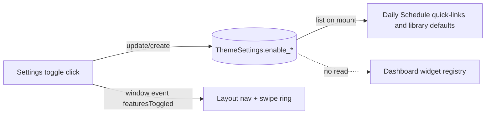

# Preferences — account vs device

**Area:** `PREF` · **Level:** 1 · **Status:** draft

**Tag summary:** Implemented 23 · Described 3 · Partial 3

**Sources owned:** `src/lib/app-params.js` (storage keys only), the localStorage usages listed in Part D
**Sources referenced (owned elsewhere):** `base44/entities/ThemeSettings.jsonc` → data-model; `src/pages/Settings.jsx` →
`20-features/settings`; `src/pages/ThemeEditor.jsx` → `20-features/theme-editor`; `src/components/Layout.jsx`,
`src/App.jsx`, `index.html` → `20-features/app-shell`; onboarding dialogs → `20-features/onboarding`

**Permissions:** per-user data; every `ThemeSettings` row is readable and writable only by its creator
(`base44/entities/ThemeSettings.jsonc:97-110`). No admin-only operations.

---

## Product rule: what follows the account and what stays on the device

- **AR-PREF-01** The product keeps two kinds of preference. An *account preference* is stored in `ThemeSettings` (or another entity) and is available on any device the account owner signs in from. A *device-local preference* is stored in the browser's localStorage and is visible only in that browser profile. `[Implemented]` `base44/entities/ThemeSettings.jsonc:4-95`, `src/lib/choreRooms.js:1-2`
- **AR-PREF-02** The following are account preferences: theme colours, fonts, font size, dark mode, widget opacity and radius, background image and background library, randomise-on-load, dashboard greeting name, feature toggles, dashboard widget order, sync times, sync sources, auto-sync calendar ids, Google Tasks default label and colour, and the second-generation onboarding dismissal map. `[Implemented]` `base44/entities/ThemeSettings.jsonc:4-95`
- **AR-PREF-03** The following user-entered data stays on the device and does not follow the account: custom and deleted chore rooms, custom education subjects, link categories (names, icons, colours), the shared label history with colours, Daily Schedule recent-item history and pinned library items, the last chore print note, deleted collage image ids, slideshow audio favourites and default, and the saved TTS voice. `[Implemented]` see Part D
- **AR-PREF-04** The following view state stays on the device: last visited page, Daily Schedule active hours, hide-completed toggles for the checklist and the to-do list, per-member collapse state in the Menu & Chores widget, the "default task list collapsed" switch, the weather cache, the pre-React background cache, and the first-generation onboarding flags. `[Implemented]` see Part D
- **AR-PREF-05** The landing/constitution intent that personalisation follows the account is met for theme and layout and not for the data lists in AR-PREF-03. `[Partial]` `src/pages/LandingPage.jsx:6-15`, Part D
- **AR-PREF-06** Where an account preference is also cached on the device (background library, onboarding dismissal, last background), the account value is written to the device on read, and the device value is used as a fast path before the account is consulted. `[Implemented]` `src/pages/ThemeEditor.jsx:91-96`, `src/pages/Tasks.jsx:62-68`, `src/App.jsx:111-125`
- **AR-PREF-07** `[Described]` The Link Library onboarding tells the user categories are local: "custom categories stored locally". `src/components/onboarding/LinkLibraryOnboarding.jsx` (per briefing)

---

## Part A — ThemeSettings as the account preference bag

### A.1 Singleton convention

- **AR-PREF-10** `ThemeSettings` has no unique key. Every reader takes the most recently updated row: `ThemeSettings.list("-updated_date", 1)`. `[Implemented]` `src/App.jsx:87`, `src/pages/ThemeEditor.jsx:83`, `src/pages/Settings.jsx:274`, `src/pages/Dashboard.jsx:119`, `src/pages/DailySchedule.jsx:144`, `src/components/GenericOnboardingDialog.jsx:10`, `base44/functions/autoSync/entry.ts:15`, `base44/functions/syncGoogleTasks/entry.ts:22`
- **AR-PREF-11** Writers update that row if one exists and otherwise create one containing only the fields they own. Creation paths: Theme Editor "Save Theme" (`src/pages/ThemeEditor.jsx:165-170`), Settings Dashboard card save (`:661-666`), Settings feature toggle (`:730-735`), Settings display-name save (`:337-341`), Settings sync times (`:236-242`), Settings auto-sync calendars (`:518-524`), Generic onboarding dismiss with `{ onboarding_status: "{}" }` (`src/components/GenericOnboardingDialog.jsx:12-18`), Tasks and Goals onboarding dismiss (`src/components/onboarding/TasksOnboarding.jsx:35-38`, `GoalsOnboarding.jsx:40-43`). `[Implemented]`
- **AR-PREF-12** Theme Editor merges its defaults under the stored row, dropping `null`/`undefined` values, so a row created by Settings or onboarding still renders with editor defaults. `[Implemented]` `src/pages/ThemeEditor.jsx:85-88`

### A.2 Field register

Every field of `base44/entities/ThemeSettings.jsonc`, who writes it, and who reads it. All rows `[Implemented]` unless
tagged.

| Field | Type / default (entity) | Written by | Read by | Notes |
|---|---|---|---|---|
| `primary_color` | string | Theme Editor save `src/pages/ThemeEditor.jsx:157-170` | App boot `src/App.jsx:93`; Theme Editor live apply `:102` | hex → HSL into CSS `--primary` |
| `accent_color` | string | Theme Editor | App boot `src/App.jsx:94`; Theme Editor `:103` | CSS `--accent` |
| `background_image` | string | Theme Editor | App boot `src/App.jsx:108` (only when not randomising); Theme Editor `:112` | applied to `document.body` |
| `background_library` | string[] · `[]` | Theme Editor add/remove/save `src/pages/ThemeEditor.jsx:135,147,163` | App boot `src/App.jsx:101`; Theme Editor merge `:92-96` | mirrored to device key `theme_bg_history`; cap 20 |
| `widget_bg_opacity` | number · 70 | Theme Editor | App boot `src/App.jsx:98`; Theme Editor `:110`; `WidgetCard` via CSS `--widget-opacity` | editor default 90 (`D-121`) |
| `font_size` | enum small/medium/large · medium | Theme Editor | Theme Editor only `:106-109` | not applied at app boot |
| `heading_font` | string | Theme Editor | App boot `src/App.jsx:97`; Theme Editor `:108` | CSS `--font-display` |
| `body_font` | string | Theme Editor | App boot `src/App.jsx:96`; Theme Editor `:107` | CSS `--font-sans` |
| `dark_mode` | boolean · true | Theme Editor | App boot `src/App.jsx:95` (removes `dark` only when `false`); Theme Editor `:104-105` | `index.html:13` adds `dark` before the app loads |
| `widget_border_radius` | number · 12 | Theme Editor | App boot `src/App.jsx:99`; Theme Editor `:111` | CSS `--widget-radius` |
| `randomize_background` | boolean · true | Theme Editor | App boot `src/App.jsx:102-117`; Theme Editor `:113-116` | boot writes device key `theme_randomize` |
| `dashboard_header` | string | Settings display-name save `src/pages/Settings.jsx:337-341,655` | Dashboard greeting `src/pages/Dashboard.jsx:154` | UI label "Custom Display Name" |
| `enable_vision_board` | boolean · true | Settings feature toggle `src/pages/Settings.jsx:656,726` | Settings load `:281`; Layout via event (Part B) | |
| `enable_education` | boolean · true | Settings `:657,727` | Settings `:282`; Layout via event; Daily Schedule `src/pages/DailySchedule.jsx:918,938,955` | |
| `enable_chores` | boolean · true | Settings `:658,728` | Settings `:283`; Layout via event; Daily Schedule `:902,937,954` | |
| `sync_times` | string (JSON array of `HH:MM`) | Settings scheduled sync times `src/pages/Settings.jsx:230-248` | Settings load `:287` | no backend reader (`D-112`) |
| `sync_sources` | string (JSON array, e.g. `["calendar","tasks"]`) | Settings `:235`; sync dialog toggles `:250` | Settings `:288`; `autoSync` `base44/functions/autoSync/entry.ts:15-18`; Calendar page sync button (per briefing) | default `["calendar","tasks"]` |
| `auto_sync_calendar_ids` | string (JSON array of `SelectedCalendars` ids) | Settings "Calendars to auto-sync" `:518-524` | Settings load `:289` | no backend reader (`D-112`) |
| `task_sync_category` | string | none in repo (`[Partial]`) | `syncGoogleTasks` `base44/functions/syncGoogleTasks/entry.ts:23` | `[Described]` "Set a default sync category in Settings" `src/pages/UserManual.jsx:129` |
| `task_sync_color` | string | none in repo (`[Partial]`) | `syncGoogleTasks` `:24` | |
| `widget_order` | string (JSON array of widget ids) | Dashboard drag end and "Save Default" `src/pages/Dashboard.jsx:147,168` | Dashboard load `:123-129` | merged with default order |
| `onboarding_status` | string (JSON object `{ key: true }`) | Generic onboarding dismiss, Tasks/Goals onboarding dismiss, Daily Checklist guide reset (deletes its key) `src/pages/DailyChecklist.jsx:51-63` | Tasks, Goals, Quotes, Daily Checklist triggers (Part C) | |

- `Q-102` No UI writes `task_sync_category` / `task_sync_color`; the manual describes a Settings control. Blocks A.2 rows.

---

## Part B — Feature toggles and how they propagate

- **AR-PREF-20** Three feature toggles exist: Vision Board, Education, Chores. Each is a boolean on `ThemeSettings` that defaults to on. `[Implemented]` `base44/entities/ThemeSettings.jsonc:55-66`, `src/pages/Settings.jsx:711-715`
- **AR-PREF-21** Flipping a toggle in Settings saves immediately (update or create) and, in the same click, dispatches a window event `featuresToggled` carrying `{ vision_board, education, chores }`. The Dashboard card's Save button dispatches the same event with the current values. `[Implemented]` `src/pages/Settings.jsx:719-742,668`
- **AR-PREF-22** The app shell listens for `featuresToggled` and replaces its in-memory feature map; it does not read `ThemeSettings` itself, so its initial state on a fresh load is all-on until Settings dispatches. `[Implemented]` `src/components/Layout.jsx:33,51-58`
- **AR-PREF-23** A toggled-off feature is removed from the sidebar (`/visionboard`, `/education`, `/chores`) and from the swipe-navigation ring, which cycles only visible items. `[Implemented]` `src/components/Layout.jsx:127-131,190-192`
- **AR-PREF-24** The Daily Schedule reads `enable_chores` and `enable_education` from `ThemeSettings` on mount (default on) and hides the Chores/Edu quick-link buttons and the synthetic "Chores"/"Edu" library items when off. `[Implemented]` `src/pages/DailySchedule.jsx:121,144-147,902,918,937-938,954-955`
- **AR-PREF-25** The Dashboard widget registry does not consult the toggles; the Menu & Chores and Focal Areas widgets render regardless of `enable_chores` / `enable_vision_board`. `[Implemented]` `src/pages/Dashboard.jsx:22-42,117-132`
- **AR-PREF-26** `[Described]` "Toggle features on/off (Education, Chores, Vision Board) in Settings to show/hide their dashboard widgets." `src/pages/UserManual.jsx:34`
- `D-120` Manual states toggles hide dashboard widgets (`src/pages/UserManual.jsx:34`); the Dashboard registry renders every widget irrespective of toggles (`src/pages/Dashboard.jsx:22-42`).
- `D-132` Layout's feature map starts all-on and is only updated by the `featuresToggled` event (`src/components/Layout.jsx:33,51-58`), whereas Daily Schedule reads the stored toggles on mount (`src/pages/DailySchedule.jsx:144-147`).

---

## Part C — Onboarding persistence, two generations

- **AR-PREF-30** Every page walkthrough can be dismissed permanently. Dismissal is recorded on the device for all pages, and additionally on the account for the second-generation pages. `[Implemented]` see table
- **AR-PREF-31 (first generation, device only)** Calendar, Chores, Daily Schedule, Education, Link Library, and Vision Board write `<key> = "1"` to localStorage on "Don't remind me" and show the dialog when the key is absent, checked synchronously during state initialisation. `[Implemented]` `src/pages/CalendarPage.jsx:46-48,525`, `src/pages/Chores.jsx:33-35,1254`, `src/pages/DailySchedule.jsx:107-109,1139`, `src/pages/Education.jsx:28-30,674`, `src/pages/Links.jsx:110-112,329`, `src/pages/VisionBoard.jsx:79,88-97,433-445`
- **AR-PREF-32 (second generation, account + mirror)** Tasks, Goals, Daily Quotes, and Daily Checklist dismiss by reading the singleton `ThemeSettings` (creating `{ onboarding_status: "{}" }` if none), setting `status[<key>] = true`, saving the JSON, and writing `<key> = "true"` to localStorage. `[Implemented]` `src/components/GenericOnboardingDialog.jsx:6-29`, `src/components/onboarding/TasksOnboarding.jsx:33-42`, `src/components/onboarding/GoalsOnboarding.jsx:38-47`
- **AR-PREF-33** Second-generation trigger order: if localStorage holds `"true"`, do not show; otherwise read `ThemeSettings`; with no row, show; with a row whose `onboarding_status` lacks the key, show; with the key present, write the localStorage mirror and do not show; on a read failure, show. `[Implemented]` `src/pages/Tasks.jsx:61-69`, `src/pages/Goals.jsx:65-73`, `src/pages/Quotes.jsx:42-50`, `src/pages/DailyChecklist.jsx:312-331`
- **AR-PREF-34** The Dashboard uses the second-generation dialog for dismissal (account + mirror) but the first-generation trigger (device key present or absent, any value). `[Implemented]` `src/pages/Dashboard.jsx:64-66,332-335`
- **AR-PREF-35** The Vision Board's "Got it — Let's Start with Pillars" close button and its "Don't remind me again" button both write the device flag. Its Guide button reopens the dialog without touching the flag `[Implemented]` `src/pages/VisionBoard.jsx:52,433-445`; a helper that removes the flag first is bound to no control `[Partial]` `src/pages/VisionBoard.jsx:216-219`
- **AR-PREF-36** The Daily Checklist Guide button deletes its key from the account map before reopening; other Guide buttons reopen without touching persistence. `[Implemented]` `src/pages/DailyChecklist.jsx:51-65`, `src/pages/Tasks.jsx:43`

| Page | Key | Dismiss writes | Trigger reads | Generation |
|---|---|---|---|---|
| Dashboard | `dashboard_onboarded` | account map + device `"true"` | device key present? | mixed (`AR-PREF-34`) |
| Daily Checklist | `dailychecklist_onboarded` | account map + device `"true"` | device `"true"` → account map | 2 |
| Tasks | `tasks_onboarded` | account map + device `"true"` | device `"true"` → account map | 2 |
| Goals | `goals_onboarding_done` | account map + device `"true"` | device `"true"` → account map | 2 |
| Daily Quotes | `quotes_onboarded` | account map + device `"true"` | device `"true"` → account map | 2 |
| Calendar | `calendar_onboarded` | device `"1"` | device key present? | 1 |
| Chores | `chores_onboarded` | device `"1"` | device key present? | 1 |
| Daily Schedule | `schedule_onboarded` | device `"1"` | device key present? | 1 |
| Education | `education_onboarded` | device `"1"` | device key present? | 1 |
| Link Library | `links_onboarded` | device `"1"` | device key present? | 1 |
| Vision Board | `visionboard_onboarded` | device `"1"` (both buttons) | device key present? | 1 |

- `D-111` (see seed-data) values `"1"` vs `"true"`.

---

## Part D — Device-local preference register

One row per localStorage key found in `src/` and `index.html`. "Kind" is **data** when the key holds something the user
typed or chose that has no account copy, **pref** when it is a user setting with no account copy, **UI** when it is
transient view state, and **cache** when it mirrors account or remote data. All rows `[Implemented]`.

| Key | Owning feature | Meaning | Value shape | Default when absent | Set by | Cleared by | Kind |
|---|---|---|---|---|---|---|---|
| `lastLocation` | App shell | Last visited non-public path, restored on page refresh | string path | none → fresh open goes to `/dashboard` | `src/App.jsx:137,165` | never | UI |
| `theme_last_bg` | App shell / Theme | Last applied background URL, re-applied before the account loads | string URL | none | `src/App.jsx:125` | never | cache |
| `theme_bg_library` | App shell / Theme | Copy of `background_library` (or the 5 boot defaults) for the pre-React random pick | JSON string[] | `[]` → bootstrap uses its own default | `src/App.jsx:112` | never | cache |
| `theme_randomize` | App shell / Theme | `"1"` when randomise-on-load is on; bootstrap randomises unless value is `"0"` | `"1"` or absent | absent (bootstrap treats absent as randomise) | `src/App.jsx:114` | `removeItem` when randomise is off `src/App.jsx:116` | cache |
| `theme_bg_history` | Theme Editor | "My Backgrounds" library on this device; merged with the account library on load | JSON string[] (max 20, newest first) | `[]` | `src/pages/ThemeEditor.jsx:96,132,144,174` | per-URL remove `:141-155` | data (mirrored to account) |
| `theme_active_bg` | Theme Editor | Background URL that overrides `background_image` while randomising | string URL | absent | no writer in repo | never | UI (`Q-104`) |
| `default_theme` | Theme Editor | Snapshot written by "Set as Default" | JSON object of the theme fields | absent | `src/pages/ThemeEditor.jsx:181` | never; no reader in repo | pref |
| `tasks_default_collapsed` | Tasks / Settings | Whether task groups start collapsed | `"1"` or `"0"` | collapsed (any value other than `"0"`) | Settings switch `src/pages/Settings.jsx:770` | never | pref |
| `app_label_history` | Labels (shared) | Recent labels with colours | JSON `[{ label, color }]`, max 30, newest first | `[]` | `src/utils/labelHistory.js:11,20` | `clearLabelHistory()` `:15` (removeItem); per-label delete `:18-21` | data |
| `todo_showCompleted` | Daily To-Do | Show completed rows in the to-do list | `"true"` / `"false"` | false | `src/components/DailyToDo.jsx:257` | never | UI |
| `schedule_custom_history` | Daily Schedule item library | Recent custom / quick-task titles with durations | JSON `[{ title, duration }]`, max 10, newest first | `[]` | `src/pages/DailySchedule.jsx:405,863,881,946,963`, `src/components/DailyToDo.jsx:178` | per-item remove (per briefing) | data |
| `pinned_library_items` | Daily Schedule item library | Pinned library item ids (includes `default-chores`, `default-edu`) | JSON string[] | `[]` | `src/pages/DailySchedule.jsx:531` | unpin rewrites | pref |
| `scheduleStart` | Daily Schedule | First visible hour | string integer 0–23 | 5 | `src/pages/DailySchedule.jsx:199` | never | UI |
| `scheduleEnd` | Daily Schedule | Last visible hour | string integer 0–23 | 22 | `src/pages/DailySchedule.jsx:200` | never | UI |
| `checklist_hide_completed` | Daily Schedule condensed checklist | Hide completed checklist items on the schedule page | JSON boolean | false | `src/components/CondensedChecklist.jsx:86`, `src/pages/DailySchedule.jsx:817` | never | UI |
| `checklist_hideCompleted` | Daily Checklist page | Hide completed items on the checklist page | `"true"` / `"false"` | false | `src/pages/DailyChecklist.jsx:338` | never | UI |
| `weather_cache_v3` | Weather | Last weather result and fetch time | JSON `{ data, timestamp }` | null → fetch | `src/components/WeatherWidget.jsx:104` | ignored after 30 min; never deleted | cache |
| `dashboard_menuchores_collapsed` | Dashboard Menu & Chores | Per-member collapsed state | JSON `{ [memberId]: boolean }` | `{}` | `src/components/dashboard/DashboardMenuChores.jsx:46` | never | UI |
| `slideshowDefaultAudio` | Slideshow | Preset label to start with | string label | absent → random favourite → random preset | `src/components/visionboard/Slideshow.jsx:264` | never | pref |
| `slideshowAudioFavorites` | Slideshow | Starred preset labels | JSON string[] | `[]` | `src/components/visionboard/Slideshow.jsx:258` | toggle rewrites | pref |
| `slideshowSelectedVoice` | Slideshow TTS | Browser voice name to use | string | absent → first available voice | `src/components/visionboard/Slideshow.jsx:734` | never | pref |
| `deleted_collage_images` | Vision Board collage | Ids of collage images the user deleted, suppressed on reload | JSON string[] | `[]` | `src/components/visionboard/ImageGallery.jsx:40` | never | data |
| `chore_custom_rooms` | Chores | Rooms the user added (also auto-filled from rooms seen in data) | JSON string[] (deduped case-insensitively on read) | `[]` | `src/lib/choreRooms.js:77` (via `saveCustomRoom`; `src/pages/Chores.jsx:197`) | `deleteCustomRoom` `:87` | data |
| `chore_deleted_rooms` | Chores | Rooms the user deleted; suppressed even if present in data or defaults | JSON string[] (lower-cased) | `[]` | `src/lib/choreRooms.js:20` | `removeFromDeleted` `:27` | data |
| `last_chore_print_note` | Chores print | Note printed under the chore sheet heading | string | `""` | `src/pages/Chores.jsx:605` | never (empty string written when cleared) | data |
| `edu_custom_subjects` | Education | User-added subjects appended to the default ten | JSON string[] | `[]` | `src/pages/Education.jsx:230` | never | data |
| `link_categories_v2` | Link Library | Categories with icon and colour | JSON `[{ name, icon, color }]` | `[]` (or migrated from v1) | `src/pages/Links.jsx:89` | category delete rewrites | data |
| `link_categories` | Link Library (legacy) | v1 plain-name categories, read once to migrate | JSON string[] | `[]` | never written | never | data (legacy) |
| `dashboard_onboarded` … `visionboard_onboarded` (11 keys) | Onboarding | Walkthrough dismissed | `"1"` or `"true"` (Part C) | absent → show | Part C | Vision Board Guide removes `visionboard_onboarded` `src/pages/VisionBoard.jsx:217` | UI |
| `base44_app_id`, `base44_access_token`, `base44_from_url`, `base44_functions_version`, `base44_app_base_url`, `token` | Platform client bootstrap | SDK parameters captured from the URL or build env | strings | build defaults | `src/lib/app-params.js:9-35` | `base44_access_token` and `token` removed when `?clear_access_token=true` `:38-41` | cache (platform) |

### Keys that exist in two spellings

- `D-110` The checklist hide-completed preference is held under two keys with different encodings: `checklist_hide_completed` (JSON boolean, `src/components/CondensedChecklist.jsx:12,86`, `src/pages/DailySchedule.jsx:123,817`) and `checklist_hideCompleted` (string `"true"`, `src/pages/DailyChecklist.jsx:77,338`). Toggling on one page does not affect the other.
- `D-133` Link categories exist as `link_categories` (v1, string array) and `link_categories_v2` (objects); v1 is read only when v2 is absent and is never rewritten (`src/pages/Links.jsx:74-86`).
- `D-122` The randomised background is read from `theme_active_bg` by the Theme Editor (`src/pages/ThemeEditor.jsx:114`) while the app boot writes the chosen URL to `theme_last_bg` (`src/App.jsx:125`); no code writes `theme_active_bg`.

---

## Discrepancies opened here

| ID | Summary |
|---|---|
| D-110 | `checklist_hide_completed` vs `checklist_hideCompleted` (see above). |
| D-120 | Feature toggles: manual says dashboard widgets are hidden (`src/pages/UserManual.jsx:34`); Dashboard registry ignores toggles (`src/pages/Dashboard.jsx:22-42`). |
| D-122 | `theme_active_bg` read (`src/pages/ThemeEditor.jsx:114`) vs `theme_last_bg` written (`src/App.jsx:125`). |
| D-132 | Layout feature map from event only (`src/components/Layout.jsx:33,51-58`) vs Daily Schedule reading stored toggles (`src/pages/DailySchedule.jsx:144-147`). |
| D-133 | `link_categories` v1 vs `link_categories_v2` (`src/pages/Links.jsx:74-86`). |

## Open questions

| ID | Question | Blocks |
|---|---|---|
| Q-102 | Where does the user set `task_sync_category` / `task_sync_color`? The manual describes a Settings control; no writer exists in `src/`. | Part A.2 |
| Q-104 | Is `theme_active_bg` written by any code outside the repo (for example the hosting shell)? Nothing in `src/` or `index.html` sets it. | Part D row `theme_active_bg` |
| Q-105 | `ReminderSettings` (`enabled`, `times`) is read by the Focal Areas widget (`src/components/dashboard/DashboardFocalAreas.jsx:32,65-69`) and described in the manual ("Set daily reminders … using the bell icon", `src/pages/UserManual.jsx:376`), but no writer exists in `src/`. Is the reminder editor missing from the export? | Part A (account preferences outside ThemeSettings) |
