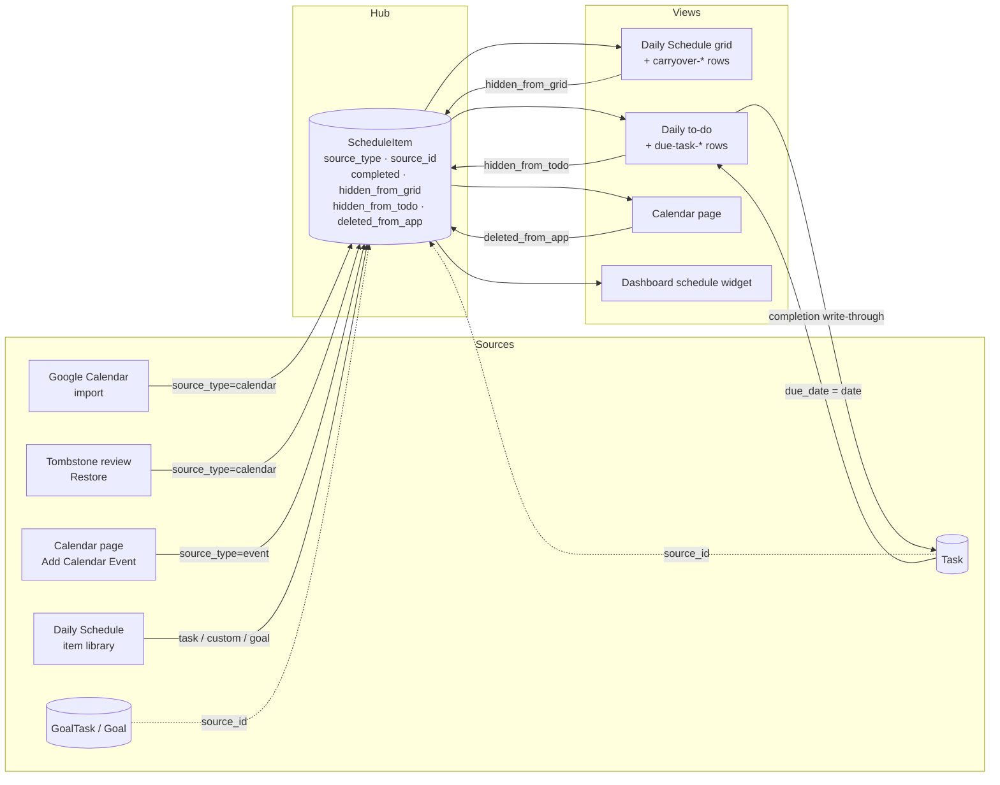

# Schedule Hub — Architecture Spec

**Architecture area:** `HUB` · **Level:** 1 · **Status:** draft

**Tag summary:** Implemented 57 · Described 4 · Partial 2

**Sources owned:** `base44/entities/ScheduleItem.jsonc`, `base44/functions/deleteToDoItem/entry.ts` (behaviour; catalogue entry in `google-sync.md` §A)
**Sources referenced (owned elsewhere):** `src/components/DailyToDo.jsx`, `src/components/SwipeableToDoItem.jsx` → `20-features/daily-schedule` (daily-todo.md); `src/pages/DailySchedule.jsx` → `20-features/daily-schedule`; `src/pages/CalendarPage.jsx`, `src/components/SwipeableEventItem.jsx`, `src/components/DeletedItemReview.jsx` → `20-features/calendar`; `src/components/EventEditDialog.jsx` → `20-features/calendar`; `src/components/dashboard/DashboardSchedule.jsx` → `20-features/daily-schedule`; `src/pages/Tasks.jsx`, `src/components/TaskEditDialog.jsx` → `20-features/tasks`; `base44/functions/syncGoogleCalendarToApp/entry.ts`, `base44/functions/autoSync/entry.ts` → `10-architecture/google-sync.md`

**Permissions:** per-user data (`created_by` row scoping on every operation); admin-only operations: none

## 1. Purpose

`ScheduleItem` is the single table every time-boxed thing converges on. Google Calendar events, Calendar-page events, tasks, milestone tasks, and hand-made blocks all become rows of one shape, and four views (Daily Schedule grid, daily to-do, Calendar page, Dashboard schedule widget) read that one table with different filters. This spec records the aggregation model, the dismissal flags, the synthetic rows the views add on the fly, how completion flows between a schedule item and its source entity, the five dismissal/delete actions, orphan clean-up, and the dedup keys.

- The User Manual states the intent: "The schedule automatically pulls in calendar events, tasks with a scheduled time, education activities, and chores due that day — filtered by date for speed." `[Described]` `src/pages/UserManual.jsx:166`
- "Mark complete: Click the checkbox on any grid block to mark it done. Completion syncs back to Tasks automatically." `[Described]` `src/pages/UserManual.jsx:170`
- "Hide/show: Toggle the eye icon to hide completed items. Hide individual items from the grid without deleting them — restore from the hidden panel at any time." `[Described]` `src/pages/UserManual.jsx:172`

## 2. Concepts & vocabulary

Glossary terms used: **schedule item**, **event**, **custom block**, **source type**, **item library**, **daily to-do**, **dismiss**, **remove from app**, **import**, **push**, **today**. Terms proposed in the return block: **synthetic row**, **write-through**, **orphan**.

## 3. Aggregation model

### 3a. The row shape

- **AR-HUB-01** A schedule item has `title`, `date`, `start_time` (all required), `end_time`, `source_type`, `source_id`, `color`, `notes`, `completed` (default false), `priority` (`low|medium|high|urgent`), three dismissal flags `deleted_from_app`, `hidden_from_grid`, `hidden_from_todo` (all default false), and `google_event_id`, `google_calendar_id`. `[Implemented]` `base44/entities/ScheduleItem.jsonc:4-73`
- **AR-HUB-02** The schema enumerates `source_type` as `calendar | task | education | chore | custom`. `[Implemented]` `base44/entities/ScheduleItem.jsonc:18-27`
- **AR-HUB-03** Rows are scoped to the account owner on create, read, update and delete. `[Implemented]` `base44/entities/ScheduleItem.jsonc:74-87`

### 3b. Source types, creators and the meaning of `source_id`

| `source_type` | Created by | `source_id` points to | Other fields stamped | Tag / citation |
|---|---|---|---|---|
| `calendar` | Manual calendar import | Google event id | `google_event_id` = event id, `google_calendar_id`, `notes` (HTML stripped), `color #3b82f6`, all-day → `00:00`–`23:59` | `[Implemented]` `base44/functions/syncGoogleCalendarToApp/entry.ts:111-122` |
| `calendar` | Scheduled auto-sync import | Google event id | `notes`, `color #3b82f6`; **no** `google_event_id` / `google_calendar_id` | `[Implemented]` `base44/functions/autoSync/entry.ts:86-92` (see D-202) |
| `calendar` | Tombstone "Restore to calendar" | `google_id` from the tombstone | `date` = today (UTC), `09:00`–`10:00`, `color #3b82f6` | `[Implemented]` `src/components/DeletedItemReview.jsx:34-44` |
| `event` | Calendar page "Add Calendar Event" | none | `notes`; `google_event_id`/`google_calendar_id` written back after an optional push | `[Implemented]` `src/pages/CalendarPage.jsx:144-151`, `base44/functions/syncAppEventToGoogle/entry.ts:58-61` (see D-205) |
| `custom` | Daily Schedule item library, "Recent" tab (history items, "Chores", "Edu" defaults) | a `Task` created on the spot with `category: "Custom"` and the chosen priority | — | `[Implemented]` `src/pages/DailySchedule.jsx:417-436`, `937-968` |
| `task` | Daily Schedule item library, "Tasks" tab | `Task.id`; the task also receives `due_date` = selected date and `schedule_time` = chosen time | — | `[Implemented]` `src/pages/DailySchedule.jsx:429-441`, `1017-1027` |
| `goal` | Daily Schedule item library, "Goals" tab | `GoalTask.id` (first unscheduled incomplete milestone task), or `Goal.id` when the goal has no incomplete milestone tasks | — | `[Implemented]` `src/pages/DailySchedule.jsx:1050-1056`, `1096-1100` (see D-205) |
| `chore` | none observed | — | — | `[Partial]` enum value only, `base44/entities/ScheduleItem.jsonc:24`; consumers at `src/components/DailyToDo.jsx:123-124`, `base44/functions/deleteToDoItem/entry.ts:81` (see D-206) |
| `education` | none observed | — | — | `[Partial]` enum value only, `base44/entities/ScheduleItem.jsonc:23`; consumers at `src/components/DailyToDo.jsx:125-126`, `base44/functions/deleteToDoItem/entry.ts:82` (see D-206) |

- **AR-HUB-04** Adding from the library computes `end_time` as start + duration, wrapping past 24:00 with modulo 24 on the hour. `[Implemented]` `src/pages/DailySchedule.jsx:411-415`
- **AR-HUB-05** Editing a task's due date or due time in the task edit dialog rewrites `date` and/or `start_time` on every schedule item whose `source_id` is that task. `[Implemented]` `src/components/TaskEditDialog.jsx:100-111` (owner: `20-features/tasks`)
- **AR-HUB-06** Editing a schedule item in place (title, date, start, end, notes) is done directly on the row from the Calendar page event editor, and from the generic event edit dialog (date, start, end only). `[Implemented]` `src/components/SwipeableEventItem.jsx:74-82`, `src/components/EventEditDialog.jsx:30-37`
- **AR-HUB-07** "Move to now" rewrites `start_time` to the current minute and keeps the original duration (default 60 min), clamped to 23:59. `[Implemented]` `src/pages/DailySchedule.jsx:367-382`

### 3c. Colour carries meaning

| Signal | Mapping | Citation |
|---|---|---|
| Source type (grid, calendar dots, dashboard widget) | calendar/event blue · task emerald (grid) or primary (calendar dots) · education purple · chore amber · custom muted | `src/pages/DailySchedule.jsx:38-45`, `src/pages/CalendarPage.jsx:133-140`, `src/components/dashboard/DashboardSchedule.jsx:14-21` |
| Priority overrides source colour for `task` and `custom` rows | urgent red · high orange · medium yellow (grid) / cyan (to-do, dashboard) · low green | `src/pages/DailySchedule.jsx:56-77`, `src/components/SwipeableToDoItem.jsx:14-19,78`, `src/components/dashboard/DashboardSchedule.jsx:28-40` |
| Carry-over row | yellow top border and "↑" prefix | `src/pages/DailySchedule.jsx:731,755` |
| Completed block | 50 % opacity, greyscale, strike-through | `src/pages/DailySchedule.jsx:738-739,747,754` |

- **AR-HUB-08** The priority used for colouring a `task` or `custom` row is read live from the linked `Task`, not from the schedule item's own `priority` field. `[Implemented]` `src/pages/DailySchedule.jsx:330-333`, `src/components/DailyToDo.jsx:45-50`

## 4. Sources → hub → views

### 4a. What each view reads

| View | Query | Honours `hidden_from_grid` | Honours `hidden_from_todo` | Honours `deleted_from_app` | Extra filter | Citation |
|---|---|---|---|---|---|---|
| Daily Schedule grid | `date = selected` (200, `-updated_date`) plus previous day (100) | yes (excluded; listed in hidden panel) | no | only for `calendar`/`event` rows | `calendar`/`event` need a `start_time`; all rows need `start_time` to be positioned | `src/pages/DailySchedule.jsx:238-242,319-336,360,465` |
| Daily to-do | `date = selected` (no limit) | no | yes (excluded; listed under "Hidden from To Do") | yes (excluded) | none | `src/components/DailyToDo.jsx:36,69,76` |
| Calendar page | `source_type = calendar` (1000) ∪ `source_type = event` (500), `deleted_from_app = false`, `-date` | no | no (shows "Re-add to To Do" instead) | yes (query filter) | none | `src/pages/CalendarPage.jsx:77-82,494-495` |
| Dashboard schedule widget | `date = today` | no | no | yes | `calendar`/`event` only; print range also needs `start_time` | `src/components/dashboard/DashboardSchedule.jsx:48-50,64-69` |
| Item library (exclusion sets) | the grid's unfiltered day query | no | no | no | tasks / milestone tasks already scheduled on the day are removed from the library | `src/pages/DailySchedule.jsx:974-979,1044-1053` |

- **AR-HUB-09** The Daily Schedule grid and the daily to-do sort by `start_time` string order; the to-do treats a missing time as `"99:99"` (sorted last), the dashboard widget treats it as `"00:00"` (sorted first). `[Implemented]` `src/pages/DailySchedule.jsx:336`, `src/components/DailyToDo.jsx:71-75`, `src/components/dashboard/DashboardSchedule.jsx:54-58`
- **AR-HUB-10** Both the grid and the to-do have a "show completed" toggle; the to-do's is a device-local preference, the grid's is in-memory. `[Implemented]` `src/components/DailyToDo.jsx:17,257,281`, `src/pages/DailySchedule.jsx:106,465,579-585`
- **AR-HUB-11** Live refresh: the to-do subscribes to `ScheduleItem`, `Task`, `GoalTask` (300 ms debounce, 800 ms reload throttle, suppressed while a local update is in flight); the grid subscribes to `ScheduleItem` and `Task` immediately and to `Chore`, `Goal`, `EducationPlan`, `EducationActivity`, `GoalTask` with a 500 ms debounce; the Calendar page subscribes to `ScheduleItem`. `[Implemented]` `src/components/DailyToDo.jsx:31-34,87-105`, `src/pages/DailySchedule.jsx:159-196`, `src/pages/CalendarPage.jsx:67-72`

## 5. The three-flag dismissal model

- **AR-HUB-12** `hidden_from_grid` removes a row from the Daily Schedule grid only. Set by: checking the item off in the to-do (see AR-HUB-24); "Hide from Schedule Grid" in the to-do remove dialog; "Hide from Schedule" in the event edit dialog; hiding via the task edit dialog (finds the day's schedule item for the task); `removeFromSchedule` on the grid. Cleared by "Restore to grid" in the grid's hidden panel. `[Implemented]` `src/components/DailyToDo.jsx:134,287-291,328-331,338-346`, `src/components/EventEditDialog.jsx:105-109`, `src/pages/DailySchedule.jsx:362-365,390-393,620-647`
- **AR-HUB-13** `hidden_from_todo` removes a row from the daily to-do only. Set by "Keep in Calendar" (client and backend paths). Cleared by "Unhide" in the to-do's "Hidden from To Do" panel and by "Re-add to To Do" on the Calendar page. `[Implemented]` `src/components/DailyToDo.jsx:180-183,215-218,305-320`, `base44/functions/deleteToDoItem/entry.ts:40-47`, `src/pages/CalendarPage.jsx:91-94`, `src/components/SwipeableEventItem.jsx:128-136`
- **AR-HUB-14** `deleted_from_app` marks a `calendar`-sourced row as removed from the app while the Google event survives. Set only by the Calendar page delete flow when the row's `source_type` is `calendar`; every other source type is hard-deleted by that same flow. Never cleared by any UI. `[Implemented]` `src/pages/CalendarPage.jsx:179-183`
- **AR-HUB-15** Rows flagged `deleted_from_app` remain in the table and are still matched by the import's dedup maps, so a re-import recognises rather than recreates them. `[Implemented]` `base44/functions/syncGoogleCalendarToApp/entry.ts:28-49,124-140`
- **AR-HUB-16** The Calendar page's delete dialog reads: title "Delete Event?"; body "This event is synced with Google Calendar. Would you also like to delete it from Google?" when the row has a `google_event_id`, otherwise "This action cannot be undone."; buttons "Cancel", "Delete here only", and either "Delete from Google too" (linked) or "Delete" (unlinked). `[Implemented]` `src/components/SwipeableEventItem.jsx:150-179`
- **AR-HUB-17** The daily to-do additionally keeps an in-memory set of ids it has just dismissed (schedule item id and `source_id`) and filters them out of every reload for the life of the component, so a subscription refresh cannot bring a dismissed row back. `[Implemented]` `src/components/DailyToDo.jsx:28,69-70,147-150`

### 5a. Product principle: dismissal is not deletion

- **AR-HUB-18** Hiding from the grid, hiding from the to-do, and removing from the app are three independent booleans on the same row; none of them deletes the row, and none of them touches Google. The remove dialog labels make the distinction explicit: "Keep in Calendar — Remove from To Do, keep visible on Calendar page"; "Send to Item Library — Keep it available to reschedule later"; "Hide from Schedule Grid — Keep in To Do list, but remove from the time grid"; versus "Delete from App — Permanently remove from this app" and "Delete from Google — Permanently remove from Google Tasks / Calendar". `[Implemented]` `base44/entities/ScheduleItem.jsonc:50-61`, `src/components/SwipeableToDoItem.jsx:124-125,137-138,152-153,167-168,197-198`
- **AR-HUB-19** The Settings copy for "Delete Synced Data" carries the same principle at bulk scale: "Remove all synced Google Calendar events and tasks. Your Google data remains unchanged." `[Implemented]` `src/pages/Settings.jsx:1057-1058`
- **AR-HUB-20** The User Manual describes the grid side of the principle: "Hide individual items from the grid without deleting them — restore from the hidden panel at any time." `[Described]` `src/pages/UserManual.jsx:172`

## 6. Synthetic rows

Two kinds of row exist only in a view's memory and never in the table.

- **AR-HUB-21** **`due-task-<taskId>`** — the daily to-do reads up to 200 tasks (`-created_date`) and, for every task whose `due_date` equals the viewed date and which has no `task`/`custom` schedule item on that date pointing at it, adds a row `{ id: "due-task-"+task.id, source_type: "task", source_id: task.id, start_time: due_time ?? null, end_time: null, priority, completed: status === "completed", notes: description }`. Purpose: a task due today appears on the to-do without having been placed on the grid. `[Implemented]` `src/components/DailyToDo.jsx:37-67`
  - Synthetic to-do rows are never written to `ScheduleItem`: completion updates the task only; hide is refused; "keep in calendar", "library", "delete_app", "delete_google" skip the schedule-item step; the backend recognises the prefix and skips schedule-item look-ups. `[Implemented]` `src/components/DailyToDo.jsx:131,154,167,181,185,196,288`, `src/components/SwipeableToDoItem.jsx:188`, `base44/functions/deleteToDoItem/entry.ts:38,41,57,73`
- **AR-HUB-22** **`carryover-<scheduleItemId>`** — the grid reads the previous day's schedule items and, for each one that is not hidden from the grid, not removed from the app, has both times, and whose `end_time` ≤ `start_time` (spans midnight), adds a copy with `id: "carryover-"+id`, `date` = viewed date, `start_time "00:00"`, original `end_time`, `_isCarryOver: true`, `_carryOverFrom: <previous date>`. Purpose: an overnight block is visible on both days. Shown with a yellow top border, "↑" prefix, "ends HH:MM" label, and the detail popup "↑ Continued from previous day — ends HH:MM". `[Implemented]` `src/pages/DailySchedule.jsx:229-232,242,294-317,731,755,759-760,772`
  - On the originating day a block that spans midnight is clipped to 24:00 and labelled "→ next day". `[Implemented]` `src/pages/DailySchedule.jsx:452-455,761,776`

## 7. Completion write-through

### 7a. Daily to-do → source entity → schedule item

- **AR-HUB-23** Checking a to-do item toggles `completed` and writes through to the source: `task` → `Task.status` (`completed`/`pending`) and `last_completed_date` (the selected date when completing, null when un-completing); `chore` → `Chore.status`; `education` → `EducationActivity.completed`. A `goal` row returns immediately with no write and shows no checkbox. `[Implemented]` `src/components/DailyToDo.jsx:107-129`, `src/components/SwipeableToDoItem.jsx:88-90`
- **AR-HUB-24** **Checking off removes from grid.** For a real (non-synthetic) row the same action writes `completed: newCompleted` and `hidden_from_grid: newCompleted` on the schedule item, so checking hides the block from the grid and unchecking restores it. `[Implemented]` `src/components/DailyToDo.jsx:130-136`
- **AR-HUB-25** The to-do updates its list optimistically and reverts the row's `completed` if any write throws. `[Implemented]` `src/components/DailyToDo.jsx:111-112,137-140`
- **AR-HUB-26** The Calendar page's `event`/`calendar` rows have no completion control; completion for them is reachable only through the to-do or the grid's "✓ Completed" display. `[Implemented]` `src/components/SwipeableEventItem.jsx:114-147`, `src/pages/DailySchedule.jsx:781`

### 7b. Tasks page → schedule items

- **AR-HUB-27** Toggling a non-occurrence task on the Tasks page updates `Task.status`/`last_completed_date` and then sets `completed` on every schedule item whose `source_id` is the task. It does not set `hidden_from_grid`. `[Implemented]` `src/pages/Tasks.jsx:246-256` (see D-219)
- **AR-HUB-28** Toggling an occurrence-pattern task updates only `completed_count`, `status`, `last_completed_date` and returns before the schedule-item cascade. `[Implemented]` `src/pages/Tasks.jsx:231-244`
- **AR-HUB-29** A synthetic `due-task-*` row derives `completed` from `Task.status` on every load, so completion from the Tasks page is reflected on the to-do without a schedule item. `[Implemented]` `src/components/DailyToDo.jsx:65`

## 8. The daily to-do dismissal and delete actions

The remove dialog (title `Remove "<title>"`, body "What would you like to do with this item?") is reachable from the "X" that appears on hover or after a left swipe, and only while the item is not completed. `[Implemented]` `src/components/SwipeableToDoItem.jsx:99-105,110-112`

### 8a. Which buttons appear

| Button (label — sublabel) | Shown when | Action key | Citation |
|---|---|---|---|
| Keep in Calendar — Remove from To Do, keep visible on Calendar page | `source_type` ∈ {`calendar`, `event`} | `keep_in_calendar` | `src/components/SwipeableToDoItem.jsx:64,115-127` |
| Send to Item Library — Keep it available to reschedule later | any other `source_type` | `library` | `src/components/SwipeableToDoItem.jsx:128-141` |
| Delete from App — Permanently remove from this app | `source_type` ∈ {`task`,`chore`,`education`,`goal`} and `source_id` present | `delete_app` | `src/components/SwipeableToDoItem.jsx:68,143-156` |
| Delete from Google — Permanently remove from Google Tasks / Calendar | (`task` with `source_id`) or (`calendar`/`event` with `google_event_id`) | `delete_google` | `src/components/SwipeableToDoItem.jsx:65-67,158-171` |
| Delete Permanently — Remove this item entirely | neither of the two above applies | `delete_app` | `src/components/SwipeableToDoItem.jsx:173-186` |
| Hide from Schedule Grid — Keep in To Do list, but remove from the time grid | an `onHide` handler exists and the row is not `due-task-*` | hide | `src/components/SwipeableToDoItem.jsx:188-201` |
| Cancel | always | — | `src/components/SwipeableToDoItem.jsx:202-204` |

- **AR-HUB-30** A `task` row is offered "Delete from Google" whenever it has a `source_id`, whether or not the task carries a `google_task_id`; the backend then does nothing beyond the schedule-item step when `google_task_id` is absent. `[Implemented]` `src/components/SwipeableToDoItem.jsx:65`, `base44/functions/deleteToDoItem/entry.ts:102-111`

### 8b. What each action does, per source type

Two implementations exist: the client performs `library`, `keep_in_calendar` and `delete_app` directly against entities, and calls the backend only for `delete_google`; the backend function implements all four. Both are recorded (see D-207).

| Action | Client path (`src/components/DailyToDo.jsx`) | Backend path (`base44/functions/deleteToDoItem/entry.ts`) |
|---|---|---|
| `library` | `task` with `source_id`: `Task.update { due_date: null, due_time: null, schedule_time: null, synced_to_schedule: false }`. Real row: delete the schedule item. `custom` row: prepend `{title, duration}` to device-local `schedule_custom_history` (max 10, deduped by title; duration = end − start minutes, default 60). `[Implemented]` `:156-179` | Verify ownership of the task (if `task`) and of the schedule item; then the same task update and schedule-item delete. `[Implemented]` `:49-68` |
| `keep_in_calendar` | Real row: `ScheduleItem.update { hidden_from_todo: true }`. `[Implemented]` `:180-183` | Same, after ownership check. `[Implemented]` `:40-47` |
| `delete_app` | Real row: delete the schedule item. Then delete the source: `task` → `Task`, `chore` → `Chore`, `education` → `EducationActivity`, `goal` → `GoalTask`. `[Implemented]` `:184-193` | Verify ownership of the schedule item and the mapped source entity before any mutation; delete the schedule item, then the source. `[Implemented]` `:71-99` |
| `delete_google` | Real row: delete the schedule item locally, then invoke the backend with `{ scheduleItemId, action, sourceType, sourceId, googleEventId, googleCalendarId }`. `[Implemented]` `:194-206` | Verify ownership; delete the schedule item if still present. `task` with `google_task_id`: DELETE the Google task in list `@default` with the caller's Google Tasks token, then delete the `Task`. `calendar`/`event` with `googleEventId`: DELETE the Google event on `googleCalendarId ?? "primary"` with the caller's Google Calendar token; the local `Task`/row is otherwise untouched. `[Implemented]` `:71-95,101-122` |
| hide | Real row: `ScheduleItem.update { hidden_from_grid: true }`. `[Implemented]` `:287-291` | not implemented server-side |

- **AR-HUB-31** Ownership guard: the backend runs with the service role, fetches every referenced row by id, and returns 403 "Forbidden" if any row's `created_by` differs from the caller's email; an unparseable id is treated as not found and skipped. All ownership checks complete before the first mutation. `[Implemented]` `base44/functions/deleteToDoItem/entry.ts:9-24,50-60,70-91`
- **AR-HUB-32** The `library` action is the only dismissal that touches the task's scheduling fields; clearing `due_date` returns the task to the item library's "no due date" population, and `synced_to_schedule` is cleared alongside it. The tasks→calendar push reads only `due_date` as its eligibility gate (a task with no due date is skipped) and writes `synced_to_schedule: true` after a successful push; it does not read that flag. `[Implemented]` `src/components/DailyToDo.jsx:158-165`, `src/pages/DailySchedule.jsx:975-979`, `base44/functions/syncTasksToCalendar/entry.ts:37-39,81-85`
- **AR-HUB-33** The backend returns `{ success: true }` for an unknown action and for a synthetic row with no side effects. `[Implemented]` `base44/functions/deleteToDoItem/entry.ts:46,67,125`

### 8c. Delete flows that start elsewhere

- **AR-HUB-34** Calendar page: optional push-delete to Google first (only if the user chose "Delete from Google too" and the row has a `google_event_id`), then `deleted_from_app: true` for `calendar` rows or a hard delete for others. `[Implemented]` `src/pages/CalendarPage.jsx:166-185`
- **AR-HUB-35** Tasks page: deleting a task snapshots it into `TrashBin`, reads the linked schedule items, deletes the task, and shows "Task deleted. It was also removed from the Daily Schedule." when links existed; the linked schedule items themselves are not deleted by this flow. `[Implemented]` `src/pages/Tasks.jsx:347-367` (see D-212)

## 9. Orphan garbage collection

- **AR-HUB-36** The Daily Schedule page listens for entity events on `Chore`, `Goal`, `EducationPlan`, `EducationActivity` and `GoalTask`; on a `delete` event it queues the deleted id and, after a 500 ms debounce, deletes every schedule item whose `source_id` equals the **first** queued id, then reloads. `Task` and `ScheduleItem` events trigger an immediate reload with no orphan pass. `[Implemented]` `src/pages/DailySchedule.jsx:159-196`
- **AR-HUB-37** Orphan collection runs only while the Daily Schedule page is mounted; no backend function removes schedule items when their source entity is deleted. `[Implemented]` `src/pages/DailySchedule.jsx:159-196`; absence in `base44/functions/*/entry.ts`
- **AR-HUB-38** Deleting a task from the to-do (`delete_app`) removes the schedule item and the task in one flow, so no orphan is produced for that path. `[Implemented]` `src/components/DailyToDo.jsx:184-193`

## 10. Dedup keys

| Where | Key | Effect | Citation |
|---|---|---|---|
| Daily to-do synthetic rows | `Task.id` ∈ { `source_id` of `task`/`custom` rows on the date } | task already on the grid is not duplicated as a `due-task-*` row | `src/components/DailyToDo.jsx:45-55` |
| Item library, Tasks tab | `Task.id` ∈ { `source_id` of `task` rows on the date } | scheduled tasks leave the library for that day | `src/pages/DailySchedule.jsx:974-979` |
| Item library, Goals tab | `GoalTask.id` ∈ { `source_id` of `goal` rows on the date } | scheduled milestone tasks leave the library; one unscheduled milestone task per goal is offered | `src/pages/DailySchedule.jsx:1044-1056` |
| Calendar import | `source_id` **or** `google_event_id` equals the Google event id | recognised rows are updated or skipped, never recreated | `base44/functions/syncGoogleCalendarToApp/entry.ts:33-49,124-140` (detail in `google-sync.md`) |
| Repair tool | `gid:<google_event_id>` or `manual:<title>|<date>|<start_time>` | keeps the newest, deletes the rest | `base44/functions/deduplicateCalendarEvents/entry.ts:16-30` (detail in `admin-operations.md`) |

## 11. Data

- **AR-HUB-39** Read limits and orders: grid day query 200 `-updated_date`; previous-day query 100; to-do day query unbounded; to-do task query 200 `-created_date`; grid task query 100 `-updated_date`; Calendar page 1000 + 500 `-date`; dashboard print range 1000 `-date`. `[Implemented]` `src/pages/DailySchedule.jsx:235-242`, `src/components/DailyToDo.jsx:36-37`, `src/pages/CalendarPage.jsx:78-79`, `src/components/dashboard/DashboardSchedule.jsx:64`
- Entity detail: `10-architecture/data-model/` (E-ScheduleItem).

## 12. Device-local preferences touched by the hub

| Key | Meaning | Default | Set by | Cleared by |
|---|---|---|---|---|
| `todo_showCompleted` | to-do shows completed rows | `false` | to-do header toggle | never | `src/components/DailyToDo.jsx:17,257` |
| `schedule_custom_history` | last 10 `{title, duration}` custom blocks offered in the library's Recent tab | `[]` | "Send to Item Library" on a `custom` row; adding custom/quick tasks on the grid | "Remove from recent" per item | `src/components/DailyToDo.jsx:170-179`, `src/pages/DailySchedule.jsx:113-115,402-405,943-947` |

Other keys on the Daily Schedule page (`scheduleStart`, `scheduleEnd`, `pinned_library_items`, `schedule_onboarded`, `checklist_hide_completed`) belong to `20-features/daily-schedule`.

## 13. Discrepancies & open questions

- **D-202** Scheduled import stamps neither `google_event_id` nor `google_calendar_id` on the rows it creates (`base44/functions/autoSync/entry.ts:86`), while manual import stamps both (`base44/functions/syncGoogleCalendarToApp/entry.ts:118-119`) and its deletion pass requires both (`:165-166`).
- **D-205** The schema enumerates `source_type` as `calendar|task|education|chore|custom` (`base44/entities/ScheduleItem.jsonc:18-27`); the Calendar page writes `event` (`src/pages/CalendarPage.jsx:149`) and the item library writes `goal` (`src/pages/DailySchedule.jsx:1097-1099,434`), and consumers branch on both (`src/components/DailyToDo.jsx:127`, `base44/functions/deleteToDoItem/entry.ts:83,112`).
- **D-206** `chore` and `education` are enumerated (`base44/entities/ScheduleItem.jsonc:23-24`) and consumed (`src/components/DailyToDo.jsx:123-126`), but no code path creates a schedule item with either value; the User Manual says the schedule "automatically pulls in … education activities, and chores due that day" (`src/pages/UserManual.jsx:166`).
- **D-207** The to-do performs `library`, `keep_in_calendar` and `delete_app` client-side (`src/components/DailyToDo.jsx:156-193`) and calls the backend only for `delete_google` (`:194-206`); the backend implements all four actions with ownership checks (`base44/functions/deleteToDoItem/entry.ts:40-123`).
- **D-208** For a `calendar` row, "Delete here only" on the Calendar page sets `deleted_from_app: true` (`src/pages/CalendarPage.jsx:179-180`), whereas "Delete from Google" on the to-do hard-deletes the row (`src/components/DailyToDo.jsx:196-198`).
- **D-209** The User Manual says of Calendar deletion "If the event came from Google Calendar, it will also be deleted there." (`src/pages/UserManual.jsx:148`); the dialog offers "Delete here only" and "Delete from Google too" as separate choices (`src/components/SwipeableEventItem.jsx:164-171`).
- **D-212** After a Tasks-page delete the message "It was also removed from the Daily Schedule." is shown when linked schedule items exist (`src/pages/Tasks.jsx:359-364`); that flow deletes only the task, and the grid's orphan pass does not run for `Task` events (`src/pages/DailySchedule.jsx:164-166,184-185`).
- **D-219** Checking off in the to-do sets `hidden_from_grid` together with `completed` (`src/components/DailyToDo.jsx:130-136`); toggling on the Tasks page sets `completed` only on linked rows (`src/pages/Tasks.jsx:252-256`).
- **D-221** The User Manual says Google events "cannot be fully edited — edit them in Google Calendar directly." (`src/pages/UserManual.jsx:150`); the Calendar page editor edits title, date, times and notes on any row and pushes to Google when linked (`src/components/SwipeableEventItem.jsx:74-97`).
- **Q-203** Blocks §3b. Which flow is intended to create `chore` and `education` schedule items (the User Manual's "auto-population")?
- **Q-206** Blocks §8b. Is the backend `deleteToDoItem` intended to be the single path for all four actions, or is the client-side path for three of them the intended design?
