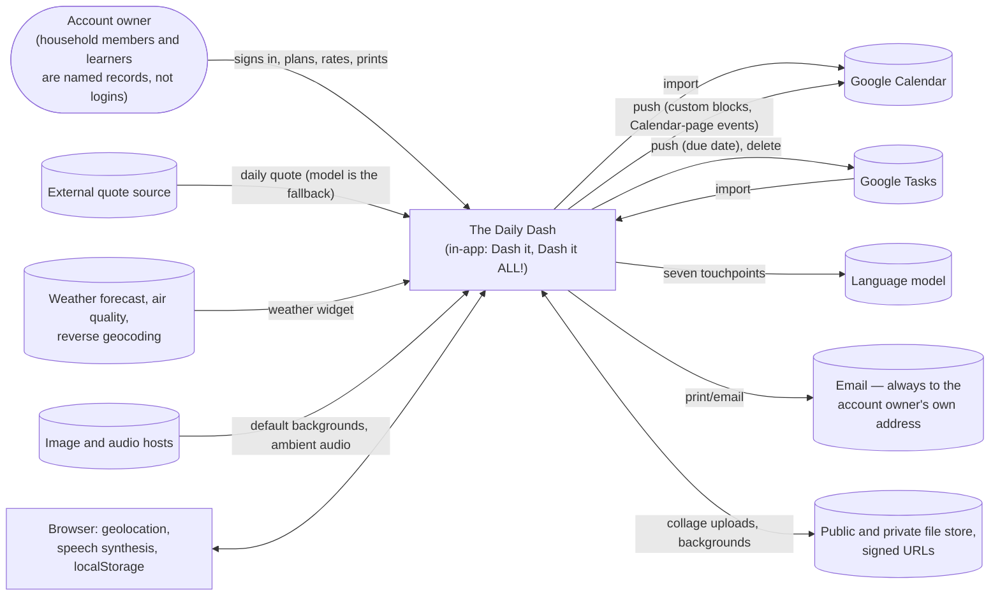

# System Overview — how the subsystems fit together

**Area:** architecture (synthesis) · **Level:** 1 · **Status:** draft

**Tag summary:** Implemented 91 · Described 6 · Partial 10

**Sources owned:** none (synthesis). Every statement points into the architecture or feature spec that owns the cited source; nothing here overrides an owning spec. Companion documents: `cross-feature-matrix.md` (every interaction, one row each) and `00-overview/feature-map.md` (one line per feature).

This document describes the **product** architecture: which subsystems exist, what each one holds, and how work and data move between them. It is not a description of code modules. Vocabulary follows `00-overview/glossary.md`.

## 1. The subsystems

Ten subsystems, grouped by the role they play in the account owner's day. Each row names the specs that own it, the entities it keeps, and the rule that defines its place in the system.

| # | Subsystem | What it holds for the account owner | Owning specs | Entities | Defining rule |
|---|---|---|---|---|---|
| 1 | **Account & preferences** | One login, one tenant; the terms gate; the account preference row that carries theme, feature toggles, widget order, sync sources and the dismissal map; a tail of device-local preferences | `auth-and-account.md`, `preferences.md`, `20-features/app-shell`, `20-features/settings`, `20-features/theme-editor`, `20-features/onboarding` | `User`, `ThemeSettings` (singleton by convention) | Every entity except `User` is scoped to the signed-in account `[Implemented]` `auth-and-account.md` AR-AUTH-07; account preferences follow the account, a named set of lists and view state stays on the device `[Implemented]` `preferences.md` AR-PREF-02..04 |
| 2 | **The schedule hub** | The single table every time-boxed thing converges on, read by four views with different filters | `schedule-hub.md`, `20-features/daily-schedule`, `20-features/calendar` | `ScheduleItem` | Google events, Calendar-page events, tasks, milestone tasks and custom blocks become rows of one shape; three dismissal flags hide without deleting `[Implemented]` `schedule-hub.md` AR-HUB-01, AR-HUB-12..14 |
| 3 | **Planning features that feed the hub** | The account owner's work: tasks with recurrence patterns; chores and meals per household member; plans and activities per learner; goals with milestone tasks | `20-features/tasks`, `20-features/chores` (+ `meal-planning.md`), `20-features/education`, `20-features/goals` (+ `milestone-tasks.md`) | `Task`, `TrashBin`, `Chore`, `ChoreUser`, `Learner`, `EducationPlan`, `EducationActivity`, `Goal`, `GoalTask` | Tasks and milestone tasks reach the hub through the item library; chores and activities are counted beside it and completed from the daily to-do, but no path creates a `chore` or `education` schedule item `[Implemented]` `20-features/daily-schedule/item-library.md` BR-SCHED-78; `[Partial]` `schedule-hub.md` §3b (D-206) |
| 4 | **The daily routine layer** | What each morning starts with: the checklist ticks for the date, the quote for the date, the weather for the place | `20-features/daily-checklist`, `20-features/quotes`, `20-features/weather` | `DailyChecklist`, `ChecklistCompletion`, `DailyQuote` (weather keeps no entity) | Routines are recorded per date, so a new day starts clean without a reset action `[Implemented]` `20-features/daily-checklist/spec.md` BR-CHK-09, `20-features/quotes/spec.md` BR-QUOTE-01 (`00-overview/constitution.md` PR-11) |
| 5 | **The wellness layer** | Thirteen seeded pillars with reusable activities; a daily evaluation that rates them and records gratitude; a weekly review; affirmations; the collage; the slideshow | `20-features/vision-board` and its six Level 2 files | `HealthPillar`, `PillarActivity`, `DailyPillarTracking`, `DailyGratitude`, `Affirmation`, `CollageImage`, `UserCollageImage`, `ReminderSettings` | The account owner's own ratings steer what the product suggests: goals, affirmations, focal areas and the slideshow all follow the low ratings `[Implemented]` `ai-services.md` AR-AI-10 (`00-overview/constitution.md` PR-06) |
| 6 | **The library layer** | Reusable templates the account owner assigns later: chore templates, activities saved per learner, saved links with device-local categories | `20-features/chores/chore-library.md`, `20-features/education/activity-library.md`, `20-features/links` | `ChoreLibrary`, `FavoriteActivity`, `Link` | Library rows survive both data wipes and account deletion `[Implemented]` `20-features/settings/data-management.md` BR-SET-54, `admin-operations.md` AR-ADMIN-35 |
| 7 | **Integrations** | Two Google connectors (Calendar, Tasks) with import and push; seven language-model touchpoints; email to the owner's own address; public and private file uploads; the weather and quote services | `google-sync.md`, `ai-services.md`, `export-print-email.md`, `external-services.md` | `SelectedCalendars`, `SelectedTaskLists`, `SyncState`, `DeletedSyncItem` | Tokens never reach the browser; AI suggests and the account owner approves; email is a print channel addressed only to the signed-in user `[Implemented]` `google-sync.md` AR-SYNC-02, `ai-services.md` AR-AI-01, `export-print-email.md` AR-EXPORT-01 |
| 8 | **Automations** | Three clock-driven workflows (quote, collage seed, Google import) and three entity-triggered workflows that mirror custom blocks to Google Calendar | `automations.md` | writes `DailyQuote`, `CollageImage`, `ScheduleItem`, `Task`, `SelectedCalendars`, `SyncState` | Each workflow is one step that invokes one backend function; UTC crons carry a stated local intent only for the quote job `[Implemented]` `automations.md` §1, §2 |
| 9 | **Admin & maintenance** | Seed marking and backfill of collage images, library clean-up, calendar de-duplication, the two data wipes and account deletion | `admin-operations.md` | writes across 4, 16 or 25 entities per function | Admin is a role that gates four functions and no UI; "admin" is not a product persona `[Implemented]` `admin-operations.md` AR-ADMIN-01, AR-ADMIN-02 |
| 10 | **The Dashboard** (aggregation surface) | Eight widgets, each owned by its source feature, in an order that follows the account | `20-features/dashboard` | reads `ThemeSettings`; widgets read their own entities (§5) | The page contributes the greeting, the widget registry, reorder mode, the slideshow launcher and two count badges; every widget's content belongs to its source feature `[Implemented]` `20-features/dashboard/spec.md` §1, §4.2 |

## 2. Diagrams

### 2a. Context — who and what the product talks to

Household members and learners are records inside the account, not logins; they appear on the account owner's node as labels `[Implemented]` `auth-and-account.md` AR-AUTH-07, `domain-model.md` §2.

Citations: connectors and directions `google-sync.md` §2, §4–§7 `[Implemented]`; touchpoints `ai-services.md` §1 `[Implemented]`; email recipient `export-print-email.md` AR-EXPORT-01 `[Implemented]`; quote source order `ai-services.md` AR-AI-06 `[Implemented]`; weather, files, hosts, browser engines `external-services.md` §1, §4–§7 `[Implemented]`. The landing page also names Google Drive as a sync target; no Drive read or write exists `[Described]` `00-overview/product-vision.md` §4.1 L6 (D-1000, `admin-operations.md` AR-ADMIN-38).

### 2b. Subsystems and the flows between them

```mermaid
flowchart TB
  subgraph ACC["1 · Account & preferences"]
    TS[("ThemeSettings<br/>toggles · widget order · sync sources · dismissal map")]
    DEV["device-local preferences"]
  end

  subgraph PLAN["3 · Planning"]
    TASK[("Task")]
    CHORE[("Chore / ChoreUser")]
    EDU[("Learner / Plan / Activity")]
    GOAL[("Goal / GoalTask")]
  end

  subgraph HUB["2 · Schedule hub"]
    SI[("ScheduleItem<br/>source_type · source_id<br/>completed · hidden_from_grid<br/>hidden_from_todo · deleted_from_app")]
  end

  subgraph ROUTINE["4 · Daily routine"]
    CHK[("DailyChecklist /<br/>ChecklistCompletion")]
    QUOTE[("DailyQuote")]
    WXW["Weather widget"]
  end

  subgraph WELL["5 · Wellness"]
    PIL[("HealthPillar / PillarActivity")]
    TRK[("DailyPillarTracking /<br/>DailyGratitude")]
    AFF[("Affirmation")]
    COL[("CollageImage /<br/>UserCollageImage")]
    SHOW["Slideshow"]
  end

  subgraph LIB["6 · Libraries"]
    CL[("ChoreLibrary")]
    AL[("FavoriteActivity")]
    LINK[("Link")]
  end

  subgraph INT["7 · Integrations"]
    G[("Google Calendar · Google Tasks")]
    LLM[("Language model")]
    MAIL[("Email to self")]
  end

  subgraph AUTO["8 · Automations"]
    WF["3 scheduled + 3 entity-triggered workflows"]
  end

  subgraph ADMIN["9 · Admin"]
    ADM["seed · backfill · clean-up · wipes · delete account"]
  end

  DASH["10 · Dashboard — eight widgets"]

  %% hub feeds
  TASK -- "item library: task rows" --> SI
  GOAL -- "item library: goal rows (milestone task or goal)" --> SI
  G -- "import (calendar rows)" --> SI
  SI -- "push: custom blocks via workflows,<br/>Calendar-page events via UI" --> G
  G -- "import" --> TASK
  TASK -- "push: due date" --> G

  %% write-through
  SI -- "completion write-through" --> TASK
  SI -- "completion write-through" --> CHORE
  SI -- "completion write-through" --> EDU
  TASK -- "completion write-through" --> SI

  %% goal creation
  PIL -- "goal creation (pillar activities)" --> GOAL
  TRK -- "goal creation (queued in evaluation)" --> GOAL
  EDU -- "goal creation (library +, generator)" --> GOAL
  AL -- "goal creation (+)" --> GOAL

  %% rating flows
  TRK -- "rating ≤ 3" --> AFF
  TRK -- "rating ≤ 3" --> SHOW
  TRK -- "rating ≤ 3 / three lowest" --> DASH
  CHK -- "weekly n/7" --> WELL

  %% libraries
  CL -- "assign" --> CHORE
  AL -- "add to plan" --> EDU
  CHORE -- "household members shared" --> GOAL

  %% AI
  LLM -- "suggestions after review" --> CHORE
  LLM -- "suggestions after review" --> EDU
  LLM -- "suggestions after review" --> PIL
  LLM -- "draft" --> AFF
  LLM -- "ephemeral affirmations, translation" --> SHOW
  LLM -- "fallback quote" --> QUOTE

  %% export
  PLAN -- "print/email" --> MAIL
  HUB -- "print/email" --> MAIL
  QUOTE -- "print/email" --> MAIL
  WELL -- "print/email (weekly review)" --> MAIL

  %% preferences
  TS -- "featuresToggled event" --> DASH
  TS -- "theme applied at boot" --> DEV
  ADM -- "seed set" --> COL
  WF -- "quote, seed, import" --> ROUTINE

  %% dashboard reads
  ROUTINE --> DASH
  HUB --> DASH
  PLAN --> DASH
  WELL --> DASH
```

Flow citations: item library rows `20-features/daily-schedule/item-library.md` BR-SCHED-78 `[Implemented]`; import and push `google-sync.md` §4, §6, §7 `[Implemented]`; completion write-through `schedule-hub.md` AR-HUB-23, AR-HUB-27 `[Implemented]`; goal creation `20-features/vision-board/spec.md` BR-VB-05, `20-features/education/spec.md` BR-EDU-27, BR-EDU-28 `[Implemented]`; rating ≤ 3 `20-features/vision-board/spec.md` §7 "Where rating ≤ 3 is consumed" `[Implemented]`; weekly checklist summary `20-features/vision-board/weekly-review.md` BR-VB-WK-08 `[Implemented]`; library assign paths `20-features/chores/chore-library.md` §6, `20-features/education/activity-library.md` §6 `[Implemented]`; shared household members `20-features/chores/spec.md` BR-CHORE-23 `[Implemented]`; AI result destinations `ai-services.md` §1 `[Implemented]`; export surfaces `export-print-email.md` §3 `[Implemented]`; the toggle event `preferences.md` AR-PREF-21 `[Implemented]` (the Dashboard widget registry does not consult it, AR-PREF-25); seed set `admin-operations.md` §2.5 `[Implemented]`; workflows `automations.md` §2 `[Implemented]`.

## 3. One day through the system

The account owner's weekday, as `00-overview/user-journeys.md` Journey B tells it, traced through the subsystems above. Step numbers refer to that journey.

1. **Before the owner wakes (automations → routine layer).** At 07:00 UTC the quote workflow writes one `DailyQuote` per user for the server's date; at 10:00 UTC the collage seeding function runs for the calling identity; at 12:00 UTC the auto-sync imports the calling identity's selected calendars and every Google task list into `ScheduleItem` and `Task` `[Implemented]` `automations.md` §2, AR-AUTO-05, AR-AUTO-09, AR-AUTO-13 (D-213, D-223, D-224). Journey B.1 step 4, B.4 step 29.
2. **Opening the app (account & preferences → shell).** The first paint is dark with a cached background; after sign-in the newest `ThemeSettings` row is applied; the shell re-reads the terms flags and calls the collage seeding function once more; a fresh open lands on `/dashboard` `[Implemented]` `20-features/app-shell/spec.md` BR-SHELL-03, BR-SHELL-05, BR-SHELL-06, BR-SHELL-12. Journey A steps 9–10.
3. **The Dashboard (aggregation).** Eight widgets read, between them, thirteen entities (§5). The greeting comes from `ThemeSettings.dashboard_header` or the first word of the full name; the Chores and Education badges count due and overdue items by their own rules and deep-link to `/chores?filter=due` and `/education?filter=due`; the Focal Areas button is blue until a `DailyPillarTracking` row dated today exists and opens `/visionboard?tab=evaluation` `[Implemented]` `20-features/dashboard/spec.md` BR-DASH-02, BR-DASH-05..08. Journey B.1 steps 1–8.
4. **Time-blocking (planning → hub).** On the Daily Schedule the item library offers unscheduled tasks and the oldest unscheduled milestone task per goal; dropping a task writes a `task` schedule item and stamps the task's due date and schedule time; a custom entry first creates a `Task` labelled "Custom" and then a `custom` schedule item, which the create workflow pushes to the primary Google calendar and stamps with its Google ids `[Implemented]` `20-features/daily-schedule/item-library.md` BR-SCHED-77..79, `google-sync.md` AR-SYNC-21..23, `automations.md` AR-AUTO-17. Journey B.2 steps 10–13.
5. **The daily to-do (hub, synthetic rows).** The TO DO card lists the date's schedule items plus a synthetic `due-task-<id>` row for every task due that day with no placed block; ticking a row writes through to `Task`, `Chore` or `EducationActivity`, then marks the schedule item complete and hidden from the grid `[Implemented]` `schedule-hub.md` AR-HUB-21, AR-HUB-23, AR-HUB-24. Journey B.2 steps 14–15.
6. **Working the lists (planning features).** On the Tasks page a tick cascades `completed` to linked schedule items and creates the next occurrence of a recurring task; on the Chores page a tick stamps today and advances the next due date, and completed chores return to pending at local midnight while the page is open; on the Education page a repeating activity moves its due date forward `[Implemented]` `20-features/tasks/spec.md` BR-TASK-14, `20-features/tasks/recurrence.md` §3, `20-features/chores/spec.md` BR-CHORE-13, BR-CHORE-15, `20-features/education/spec.md` BR-EDU-09. Journey B.3 steps 19–22.
7. **Evening self-assessment (wellness → goals).** The evaluation wizard rates every visible pillar; a rating of 3 or below opens the Suggested Goals panel; "Add to Plan" queues a goal in memory; Complete writes one tracking row per rated pillar, one gratitude row, and one `Goal` with its milestone tasks per queued activity `[Implemented]` `20-features/vision-board/daily-evaluation.md` BR-VB-EVAL-07, BR-VB-EVAL-09. Journey B.4 steps 24–26.
8. **Reflection and slideshow (routine and wellness → integrations).** The reflection is saved on the day's `DailyQuote` row; the Auto-Generated slideshow asks the model for three affirmations per pillar rated 3 or below in the most recent evaluation and shows them without storing them `[Implemented]` `20-features/quotes/spec.md` BR-QUOTE-06, `20-features/vision-board/slideshow.md` BR-VB-SLIDE-01, `ai-services.md` AR-AI-01. Journey B.4 steps 27–28.
9. **Midnight (client timers).** Nothing is reset: the checklist page reloads the new date's completions, chores flip to pending while the Chores page is open, the Quotes page reloads when the local date changes, and the weekly `n/7` counts reload at Sunday 00:00 `[Implemented]` `time-and-date-semantics.md` AR-TIME-40..43. Journey B.4 step 29.

The paper version of the same day, and the Google user's connect–import–push–delete cycle, are Journeys C and E in `00-overview/user-journeys.md`.

## 4. Key architectural rules

The rules that shape more than one feature, with the identifiers that define them. Each row records the rule as the code implements it; the "Tensions" column names the discrepancy or open question that qualifies it.

| Rule | What it means for the account owner | Defined by | Tensions |
|---|---|---|---|
| **Hub dismissal model** | Hiding from the grid, hiding from the to-do, and removing from the app are three independent flags on a schedule item; none deletes the row and none touches Google. Hidden rows are listed for restore | `schedule-hub.md` AR-HUB-12, AR-HUB-13, AR-HUB-14, AR-HUB-18 `[Implemented]`; `00-overview/constitution.md` PR-03 | "Delete here only" on the Calendar page keeps a `calendar` row while "Delete from Google" on the to-do hard-deletes it (D-208) |
| **Anti-loop push rule** | Only `custom` rows fire the Google Calendar workflows; rows that arrived from Google (`calendar`) and Calendar-page rows (`event`) never do, so an import cannot trigger a push. Update and delete arm only after the create round-trip writes the Google id back | `google-sync.md` AR-SYNC-21, AR-SYNC-22, AR-SYNC-23 `[Implemented]`; `automations.md` AR-AUTO-20 | Any update of a pushed custom block, including a dismissal flag, sends a PATCH (AR-AUTO-21, Q-208); Calendar-page rows are pushed by the UI, not by a workflow (D-218) |
| **Deletion guards** | A local row disappears after a Google deletion only when it carries both Google ids, its calendar fetched cleanly this run, its id is absent from the response and its date lies inside the manual window; a calendar that fails to fetch never loses rows; Google Tasks deletions are never propagated | `google-sync.md` AR-SYNC-31..36 `[Implemented]`; `00-overview/constitution.md` PR-04 | Rows written by the scheduled import lack the two ids and are never deleted by this pass (D-202); no function writes a tombstone for review (AR-SYNC-41, D-211, Q-201) |
| **AI review step** | No touchpoint writes a suggestion to an entity without a selection step; failure shows a plain message and writes nothing; slideshow affirmations and translations are never stored | `ai-services.md` AR-AI-01, AR-AI-04 `[Implemented]`; `00-overview/constitution.md` PR-05 | The daily quote is stored without review as the fallback after the external source (AR-AI-05, AR-AI-06, D-304) |
| **Account vs device preferences** | Theme, toggles, widget order, sync sources and the second-generation dismissal map follow the account; typed lists (rooms, subjects, link categories, label history, recent items) and view state stay on the device; where both exist the account value is written to the device on read | `preferences.md` AR-PREF-01..06 `[Implemented]` (AR-PREF-05 `[Partial]`) | The shell learns stored toggles only from the `featuresToggled` event (D-132); the Dashboard walkthrough dismisses to the account but triggers from the device (D-961) |
| **Per-user isolation** | Every entity except `User` restricts create, read, update and delete to rows whose creator is the signed-in account; household members and learners are rows inside that tenant | `auth-and-account.md` AR-AUTH-07 `[Implemented]`; `data-model/README.md` AR-DATA-02 | Two entities also admit admins (AR-DATA-03); two scheduled functions write rows for other owners under the service role (`domain-model.md` §2); whether shared logins are planned is open (Q-1001) |
| **Singletons by convention** | `ThemeSettings`, `SyncState` and `ReminderSettings` are meant to have one row per account; readers take the most recently updated row and writers update it or create one holding only their own fields | `data-model/README.md` AR-DATA-06 `[Implemented]`; `preferences.md` AR-PREF-10, AR-PREF-11 | One reader of `SyncState` takes the first row of an unsorted list (D-010); Save Theme rewrites every loaded field of the row, including fields other pages own (Q-921) |
| **Polymorphic source references** | A schedule item names its origin with `source_type` and `source_id`: task and custom rows point at a `Task`, goal rows at a `GoalTask` or a `Goal`, calendar rows at a Google event id, event rows at nothing; the linked task's priority colours the block live | `data-model/relationships.md` §3 `[Implemented]`; `schedule-hub.md` §3b, AR-HUB-08 | `event` and `goal` are written but not in the schema enum; `chore` and `education` are in the enum and consumed but never written (D-205, D-206, Q-203) |
| **One-per-date conventions** | One quote, one gratitude, one tracking row per pillar and one completion per checklist item per date, kept by read-then-update-or-create logic rather than by the schema | `data-model/README.md` AR-DATA-11 `[Implemented]`; `00-overview/constitution.md` PR-11 | "Today" is derived four ways across surfaces (`time-and-date-semantics.md` AR-TIME-01, D-100) |
| **Export addressed to self** | Every print and email surface renders one document for both channels; the email recipient is always the signed-in user and no address is asked | `export-print-email.md` AR-EXPORT-01, AR-EXPORT-02 `[Implemented]`; `00-overview/constitution.md` PR-07 | Chores print and email build different documents (D-312); the generic card handlers are bound to no control (D-310) |
| **Live lists** | Screens subscribe to entity change events and reload themselves, so a sync job or another tab's write appears without a manual refresh; the Daily Schedule additionally removes orphaned schedule items when a source entity is deleted | `shared-interactions.md` AR-UI-14 `[Implemented]`; `schedule-hub.md` AR-HUB-11, AR-HUB-36 | Orphan collection runs only while the Daily Schedule page is mounted and not for `Task` deletes (AR-HUB-37, D-212); the Dashboard page itself loads once (BR-DASH-10) |

## 5. Aggregation points

Surfaces that read several features' entities at once. The owning feature of each widget's content is named in `20-features/dashboard/spec.md` §4.2; export tiers are in `export-print-email.md` §2.

| Surface | Reads | Composition rule | Owner · citation |
|---|---|---|---|
| **Dashboard page** | `ThemeSettings` (greeting name, widget order), `User` (full name), `DailyPillarTracking` (evaluation-done flag), `Chore` (badge, pending, newest 300), `EducationActivity` (badge, not completed, first 200) | Eight widgets in the saved order followed by any default id not yet saved; page-level reads happen once per mount | `20-features/dashboard/spec.md` §6, BR-DASH-03, BR-DASH-10 `[Implemented]` |
| — Weather widget | no entity; browser position, three external services, device cache | cached result younger than 30 minutes is shown without a prompt | `20-features/weather/spec.md` §6, BR-WX-01 `[Implemented]` |
| — Focal Areas widget | `HealthPillar`, `DailyPillarTracking` (200 newest), `ReminderSettings`, `DailyGratitude` (today) | three lowest ratings of the most recent evaluation; today's gratitude line; highlight until today's evaluation exists | `20-features/vision-board/spec.md` §7 "Dashboard Focal Areas widget", BR-VB-REM-01, BR-VB-REM-02 `[Implemented]` |
| — Daily Checklist widget | `DailyChecklist` (active), `ChecklistCompletion` (today; seven days for `n/7`) | pending items only, grouped by time-of-day bucket | `20-features/daily-checklist/spec.md` §4.10, BR-CHK-16 `[Implemented]` |
| — Today's Schedule widget | `ScheduleItem` (today) | `calendar` and `event` rows only, not removed from app, sorted by start time (missing time first) | `20-features/daily-schedule/spec.md` BR-SCHED-17, `schedule-hub.md` §4a `[Implemented]` |
| — TODAY'S TASKS widget | `Task` (pending, newest 200) | overdue first, then due today by the show-today rule, bucketed by time of day when any has a due time | `20-features/tasks/spec.md` §4.9, `20-features/tasks/recurrence.md` §6 `[Implemented]` |
| — Menu & Chores widget | `Chore` (newest 500), `ChoreUser` | the rest of the week's meals from today to Sunday, then today's chores by household member and room | `20-features/chores/meal-planning.md` §4 "Dashboard", BR-MEAL-06 `[Implemented]` |
| — Goals Overview widget | `Goal` (not archived, newest 100) + subscription | goals with a target date on or before today, or no target date and a timeframe other than 3_year/5_year, bucketed by timeframe | `20-features/goals/spec.md` BR-GOAL-14 `[Implemented]` |
| — Daily Quote widget | `DailyQuote` (today) | the stored row, else `fetchDailyQuote` | `20-features/quotes/spec.md` §6, `automations.md` AR-AUTO-06 `[Implemented]` |
| **Daily Schedule grid** | `ScheduleItem` (selected date 200, previous day 100), `Task` (100), `Chore` (100), `Goal` (100), `GoalTask` (500), `EducationActivity` (by due date; 500), `Learner` (50, loaded not rendered), `ThemeSettings` | rows for the date not hidden from grid, plus carry-over rows from the previous day; badges count chores and activities beside the grid; the item library excludes items already scheduled that day | `20-features/daily-schedule/spec.md` §6, `schedule-hub.md` §4a, AR-HUB-22 `[Implemented]`; `Learner` load `[Partial]` |
| **Daily to-do** | `ScheduleItem` (selected date), `Task` (newest 200), `GoalTask` (subscription) | the date's schedule items not hidden from the to-do and not removed from the app, plus a synthetic due-task row per task due that day without a placed block, minus ids dismissed during this visit | `20-features/daily-schedule/daily-todo.md` BR-TODO-01, BR-TODO-13 `[Implemented]` |
| **Condensed checklist** (Daily Schedule) | `DailyChecklist` (active), `ChecklistCompletion` (selected date) | bucket order, then time, then order; toggles the selected date's completion | `20-features/daily-schedule/daily-todo.md` BR-TODO-16 `[Implemented]` |
| **Calendar page** | `ScheduleItem` (`calendar` 1000 ∪ `event` 500, not removed from app), `ThemeSettings.sync_sources`, `DeletedSyncItem` (pending, 100) | month or week grid with source-coloured dots; the selected date's list; the tombstone review banner | `20-features/calendar/spec.md` §6, `schedule-hub.md` §4a `[Implemented]`; tombstones `[Partial]` (D-211) |
| **Weekly Review** | `DailyPillarTracking` (all rows), `HealthPillar` (all, hidden included), `DailyChecklist` (active), `ChecklistCompletion` (seven days) | Sunday–Saturday week: lowest averages over a horizon, a seven-day chart, average buckets, the checklist `n/7` summary, a daily breakdown | `20-features/vision-board/weekly-review.md` §12, BR-VB-WK-07, BR-VB-WK-08 `[Implemented]` |
| **Print formats** | | | |
| — Calendar / Dashboard schedule | `ScheduleItem` in a date range | grouped by date, rows by start time, source badge | `export-print-email.md` §5a `[Implemented]` |
| — Tasks page / Dashboard tasks | `Task` (active filter; pending in range) | grouped by priority or label; grouped by due date | `export-print-email.md` §5b, §5c `[Implemented]` |
| — Daily Schedule / to-do | the grid list and the to-do list as composed | hourly section and to-do section, modes schedule / todo / both | `export-print-email.md` §5d `[Implemented]` |
| — Chores / Menu | `Chore`, `ChoreUser` (filtered list) | per household member then frequency (print); per weekday, daily and weekly only (email); meals per weekday | `export-print-email.md` §3a `[Implemented]` (D-312, D-313) |
| — Education | `EducationPlan`, `EducationActivity` (visible learners, subject and status view) | Learning Plans, Daily, Weekly by weekday, One-Time, Other, each with a checkbox | `export-print-email.md` §3b `[Implemented]` |
| — Goals (per timeframe card), Weekly Review, Quotes | the card body as rendered; quote + reflection | rendered HTML copied into the document | `export-print-email.md` §2 Tier A, §3c `[Implemented]` |

## 6. Automation timeline

Everything that runs without an explicit user action, in the order it happens through a day. UTC crons carry a stated local intent only for the quote job `[Implemented]` `automations.md` §2, §5.

| When | Trigger | Function | Identity it acts for | What the account owner gets | Citation |
|---|---|---|---|---|---|
| 07:00 UTC daily ("midnight Pacific" per the workflow description) | scheduled | `generateDailyQuotes` | every `User`, under an admin caller | today's quote already stored when the Dashboard opens, for users whose local date matches the UTC date at generation time | `automations.md` AR-AUTO-03..06 `[Implemented]` (D-213) |
| 10:00 UTC daily | scheduled | `initializeDefaultCollageImages` | the calling identity only | a non-empty collage for that identity when it has none | `automations.md` AR-AUTO-08, AR-AUTO-09 `[Implemented]` (D-223) |
| 12:00 UTC daily | scheduled | `autoSync` | the calling identity's connectors, sync sources and selected calendars | Google Calendar (30 days back, no upper bound) and every Google task list refreshed once a day; stored `sync_times` and auto-sync calendar ids are not read | `automations.md` AR-AUTO-12..14 `[Implemented]` (D-204, D-224; Q-205) |
| on `ScheduleItem` create | entity event, `source_type == "custom"` | `syncAppEventToGoogle` create | the row's owner | a custom block placed on the Daily Schedule appears on the primary Google calendar and the row learns its Google ids | `automations.md` AR-AUTO-17 `[Implemented]` |
| on `ScheduleItem` update | entity event, `custom` and `google_event_id` set | `syncAppEventToGoogle` update | the row's owner | edits, moves, and dismissal-flag changes on a pushed block reach Google as a PATCH | `automations.md` AR-AUTO-18, AR-AUTO-21 `[Implemented]` (Q-208) |
| on `ScheduleItem` delete | entity event, `custom` and `google_event_id` set (pre-delete snapshot) | `syncAppEventToGoogle` delete | the row's owner | removing a pushed block, including "Send to Item Library", removes the Google event | `automations.md` AR-AUTO-19, AR-AUTO-22 `[Implemented]` |
| every authenticated shell mount | client | `initializeDefaultCollageImages` | the signed-in account | the seed set copied into an empty collage; failures ignored | `automations.md` §4, `20-features/app-shell/spec.md` BR-SHELL-06 `[Implemented]` |
| terms acceptance "Continue" | client | `initializeDefaultCollageImages` | the signed-in account | the same seeding at first run | `auth-and-account.md` AR-AUTH-04 `[Implemented]` |
| Dashboard quote widget mount with no row for today; Quotes page load | client | `fetchDailyQuote` | the signed-in account | a quote for the device's date; the page races the call against 15 seconds | `automations.md` §4, `20-features/quotes/spec.md` BR-QUOTE-04 `[Implemented]` (D-903) |
| next local midnight, Chores page open | client timer | none | — | completed chores return to pending; timer re-arms | `time-and-date-semantics.md` AR-TIME-40 `[Implemented]` |
| next local midnight, Daily Checklist page open | client timer | none | — | `today` advances and the list reloads unticked for the new date | `time-and-date-semantics.md` AR-TIME-41 `[Implemented]` |
| next Sunday 00:00 local | client timer | none | — | weekly `n/7` counts reload | `time-and-date-semantics.md` AR-TIME-42 `[Implemented]` |
| every 60 s on the Quotes page | client interval | none | — | the page reloads when the local date string changes | `time-and-date-semantics.md` AR-TIME-43 `[Implemented]` (D-116, Q-106) |
| every 60 s on the Daily Schedule | client interval | none | — | the now line moves and past hours dim | `time-and-date-semantics.md` AR-TIME-45 `[Implemented]` |
| every 1 s in the shell | client interval | none | — | the header clock advances | `time-and-date-semantics.md` AR-TIME-46 `[Implemented]` |
| within 60 s of a signed URL's expiry | client, on display | signed-URL refresh | the signed-in account | private collage images keep rendering | `time-and-date-semantics.md` AR-TIME-48 `[Implemented]` |
| never | — | `syncTasksToCalendar`, `makeImagesDefaults`, `backfillDefaultImagesToAllUsers`, `clearChoreLibraryAssignments`, `deduplicateCalendarEvents` | — | these functions have no workflow and no UI call site | `google-sync.md` AR-SYNC-29, `admin-operations.md` AR-ADMIN-01 `[Partial]` (Q-207, Q-210) |

No client timer re-runs a Google import `[Implemented]` `automations.md` §4; nothing syncs on app load, although the sign-up copy says so `[Described]` `google-sync.md` AR-SYNC-14 (D-217). The manual's "Set Auto-Sync times to have the app sync automatically at specific times each day." describes the stored list `[Described]` `automations.md` AR-AUTO-16 (D-204). The manual's "Each day, an AI-generated motivational quote is displayed automatically." describes the fallback path `[Described]` `automations.md` AR-AUTO-07 (D-304).

## 7. What the system does not do (cross-cutting)

Recorded here because each item spans subsystems; the owning specs hold the detail.

- No path creates `chore` or `education` schedule items, although the enum, the to-do, the backend delete and the manual all expect them `[Partial]` `schedule-hub.md` §3b (D-206, Q-203, Q-653).
- No function writes a tombstone; the review panel is populated by nothing `[Partial]` `google-sync.md` AR-SYNC-41 (D-211, Q-500).
- No code writes `ReminderSettings` and nothing sends a reminder; the only reader gates the Dashboard highlight `[Partial]` `20-features/vision-board/spec.md` §7a (D-704, Q-702).
- The feature toggles remove sidebar entries and Daily Schedule quick links but hide no Dashboard widget `[Implemented]` `preferences.md` AR-PREF-23..25; the manual says they do `[Described]` AR-PREF-26 (D-120).
- Google Tasks sync is import plus a due-date push and a delete, not a mirror `[Implemented]` `google-sync.md` §7; the manual says "bidirectionally" `[Described]` AR-SYNC-20 (D-215, D-484).
- No Google Drive read or write exists `[Partial]` `admin-operations.md` AR-ADMIN-38 (D-1000).
- No control signs the account out; account deletion and token expiry are the only exits `[Partial]` `auth-and-account.md` AR-AUTH-08 (D-340, Q-331).
- No image generation exists; collage imagery is uploaded or seeded `[Implemented]` `ai-services.md` AR-AI-02.

## 8. Discrepancies & open questions

No new ids are opened here. Cited: D-010, D-100, D-116, D-120, D-132, D-202, D-204, D-205, D-206, D-208, D-211, D-212, D-213, D-215, D-217, D-218, D-223, D-224, D-304, D-310, D-312, D-313, D-340, D-484, D-704, D-903, D-961, D-1000; Q-106, Q-201, Q-203, Q-205, Q-207, Q-208, Q-210, Q-331, Q-500, Q-653, Q-702, Q-921, Q-1001.
